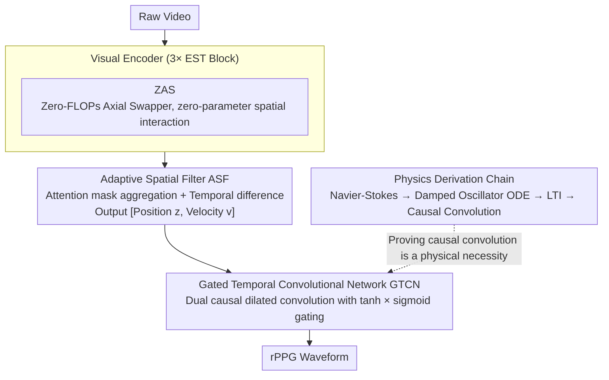

# PHASE-Net: Physics-Grounded Harmonic Attention System for Efficient Remote Photoplethysmography Measurement

**Conference**: CVPR 2026  
**arXiv**: [2509.24850](https://arxiv.org/abs/2509.24850)  
**Code**: [GitHub](https://github.com/Alex036225/PhaseNet)  
**Area**: Human Understanding  
**Keywords**: rPPG, physics-informed networks, temporal convolutional networks, hemodynamics, Navier-Stokes, lightweight models

## TL;DR

Starting from the Navier-Stokes equations, this work reveals through rigorous mathematical derivation that the rPPG pulse signal follows a second-order damped harmonic oscillator model. Its discrete solution is equivalent to a causal convolution operator, providing a first-principles justification for the choice of TCN architectures. The resulting PHASE-Net, with only 0.29M parameters, achieves SOTA performance across multiple datasets.

## Background & Motivation

**Background**: Remote Photoplethysmography (rPPG) extracts physiological signals like heart rate by capturing micro-changes in skin blood volume via standard cameras. It is a key technology for non-contact physiological monitoring. Deep learning methods (PhysNet, PhysFormer, RhythmMamba, etc.) have become the mainstream paradigm.

**Limitations of Prior Work**:

1. Most existing deep learning models are heuristically designed—treating rPPG as a general spatiotemporal signal processing task where architecture choice relies on empirical trial and error.
2. The lack of a physical theoretical foundation may cause models to overfit to dataset-specific noise patterns, leading to poor cross-domain generalization.
3. Artifacts from head motion and illumination changes are much stronger than the true pulse signal; "black-box" models struggle to provide reliability guarantees.

**Key Challenge**: High-performance deep learning models vs. lack of physical interpretability and theoretical guarantees.

**Goal**: Can an rPPG model be designed from physical first principles such that the architecture itself is a direct manifestation of the signals' physical laws?

**Key Insight**: Derive hemodynamics from the Navier-Stokes equations to strictly prove that TCN is a physically correct architectural choice.

**Core Idea**: The physical dynamics of rPPG signals are equivalent to causal convolution; thus, TCN is not a heuristic choice but a physical necessity.

## Method

### Overall Architecture

PHASE-Net aims to answer a neglected question: What architecture should an rPPG network use? Can it be derived from the physical laws of blood flow rather than empirical trial and error? The pipeline is concise: raw video first passes through a Visual Encoder (3 EST Blocks, each embedding a ZAS module) to extract spatiotemporal features; then, an Adaptive Spatial Filter (ASF) generates an attention mask for each frame to aggregate high-SNR skin regions into 1D features while calculating the temporal difference of the pulse; finally, a Gated Temporal Convolutional Network (GTCN) models long-range temporal dynamics to output the rPPG waveform. The entire network has only 0.29M parameters. This efficiency is possible because the architecture itself directly embodies the physical laws of the signal.

### Key Designs

**1. Physics Derivation Chain: From Navier-Stokes to TCN**

The core contribution addresses the "heuristic architecture" problem. The authors establish a mathematical chain: Beer-Lambert Law links pixel intensity $\Delta I(t)$ to blood volume change $\Delta V(t)$; vessel compliance links $\Delta V(t)$ to local blood pressure pulsation $z(t)$. By linearizing the Navier-Stokes equations and combining the 1D momentum and continuity equations, a damped wave equation $\frac{\partial^2 p'}{\partial t^2} + \alpha \frac{\partial p'}{\partial t} = c^2 \frac{\partial^2 p'}{\partial x^2}$ is obtained. Fixing the observation at a specific skin point $x_0$ reduces this to a second-order ODE, the classic damped harmonic oscillator:

$$\ddot{z} + \alpha \dot{z} + \omega^2 z = u(t)$$

Discrete approximation using semi-implicit Euler integration results in a Linear Time-Invariant (LTI) state-space model. **Proposition 1** proves its solution is exactly a causal convolution $z_t = \sum_{m=0}^{\infty} g[m] \cdot a_{t-m}$, and **Proposition 2** proves that a finite impulse response (FIR) filter can approximate this infinite response with arbitrary precision $\epsilon$. Together, they demonstrate that **TCN (Causal Dilated Convolution) is not just an empirical choice but a precise computational implementation of the underlying physical process.**

**2. Zero-FLOPs Axial Swapper (ZAS): Interaction with Zero Parameters and Operations**

The visual encoder requires spatial interaction across facial regions. ZAS provides a "free" solution: it rearranges elements in only $k=\lfloor pC \rfloor$ channels by partitioning $H\times W$ into $b\times b$ blocks and performing matrix transposition within blocks. This is a pure element reordering without multiplications or additions, resulting in zero FLOPs and parameters. Its stability is backed by two mathematical properties: self-inversion ($ZAS(ZAS(X))=X$) ensuring no information loss, and energy conservation ($\|ZAS(X)\|_2=\|X\|_2$, i.e., 1-Lipschitz) ensuring it does not amplify noise.

**3. Adaptive Spatial Filter (ASF): Attention-based Aggregation and Pulse "Velocity"**

Instead of Global Average Pooling (GAP), which treats high-SNR (forehead, cheeks) and low-SNR regions equally, ASF uses adaptive weighting. Each frame generates a spatial logit map via lightweight convolution, normalized by spatial softmax into a mask $M_t$. This mask aggregates the spatial dimensions into a purified 1D feature $z_t$. Additionally, it calculates the first-order temporal difference $\mathbf{v}_t = \mathbf{z}_t - \mathbf{z}_{t-1}$ to encode pulse "velocity." Outputting $[z_t, v_t]$ provides the downstream physical model with the complete state information required for a second-order oscillator.

**4. Gated Temporal Convolutional Network (GTCN): Implementing Causal Convolution**

GTCN utilizes dual-path causal dilated TCNs: one path uses tanh activation for candidate signals, while the other uses sigmoid as a gate. This gated structure allows the network to selectively pass or suppress components across different time scales, serving as the concrete implementation of the causal convolution operator derived in Propositions 1 and 2.

### Loss & Training

The Negative Pearson Correlation Loss is used: $\mathcal{L}_{\text{pred}} = -\frac{\sum_t (\hat{y}_t - \bar{\hat{y}})(y_t - \bar{y})}{\sqrt{\sum_t (\hat{y}_t - \bar{\hat{y}})^2 \sum_t (y_t - \bar{y})^2}}$, directly optimizing the morphological similarity between the predicted waveform and the ground truth.

## Key Experimental Results

### Main Results (Intra-dataset Evaluation)

| Method | UBFC MAE↓ | UBFC RMSE↓ | PURE MAE↓ | PURE RMSE↓ | BUAA MAE↓ | MMPD MAE↓ | Params |
|------|-----------|------------|-----------|------------|-----------|-----------|--------|
| PhysNet | 2.95 | 3.67 | 2.10 | 2.60 | 10.89 | 4.80 | Large |
| PhysFormer | 0.92 | 2.46 | 1.10 | 1.75 | 8.45 | 11.99 | Large |
| RhythmFormer | 0.50 | 0.78 | 0.27 | 0.47 | 9.19 | 4.69 | Mid |
| Contrast-Phys+ | 0.21 | 0.80 | 0.48 | 0.98 | - | - | Mid |
| Style-rPPG | 0.17 | 0.41 | 0.39 | 0.62 | - | - | Mid |
| LST-rPPG | 0.16 | 0.57 | 0.32 | 0.62 | - | - | Mid |
| **PHASE-Net** | **0.15** | **0.53** | **0.14** | **0.35** | **5.89** | **4.78** | **0.29M** |

### Ablation Study (Cross-domain Generalization, Leave-One-Out)

| Method | Others→U MAE↓ | Others→P MAE↓ | Others→B MAE↓ | Others→M MAE↓ |
|------|---------------|---------------|---------------|---------------|
| PhysFormer | 10.29 | 19.75 | 22.09 | 13.90 |
| RhythmFormer | 14.71 | 21.11 | 6.04 | 16.14 |
| EfficientPhys | 12.87 | 7.15 | 32.30 | 12.87 |
| **PHASE-Net** | **10.04** | **2.86** | - | - |

### Key Findings

- MAE of 0.14 bpm on PURE, halved compared to RhythmFormer (0.27)—the inductive bias from physical priors significantly improves accuracy.
- Achieves SOTA with only 0.29M parameters—demonstrating the unification of theoretical rigor and extreme lightweighting.
- Cross-domain generalization (Others→PURE) MAE of 2.86 bpm, significantly better than PhysFormer (19.75) and RhythmFormer (21.11).
- On challenging datasets (BUAA/MMPD) where others may show negative correlation ($R<0$), PHASE-Net maintains positive correlation.

## Highlights & Insights

- **First-principles derivation of rPPG architecture**: The full mathematical chain from Navier-Stokes → ODE → SSM → Causal Convolution → TCN elevates architecture choice from empirical to physically necessary.
- **ZAS Zero-FLOPs module**: Enhances cross-region feature interaction through pure permutation. The mathematical proofs for self-inversion and energy conservation ensure training stability.
- **ASF Temporal Difference design**: Unifies spatial aggregation and temporal differentiation in one module, providing "position + velocity" state info for the physical model.
- **Rigor + Simplicity paradigm**: 0.29M parameters prove that strong inductive bias can drastically reduce model complexity.

## Limitations & Future Work

- Derivations rely on simplifying assumptions (laminar flow, linearization, single-point observation) that may fail under extreme motion or atypical vascular conditions.
- ZAS block size $b$ and channel ratio $p$ require manual tuning; lacks an adaptive mechanism.
- Not yet validated on large-scale "in-the-wild" datasets like VIPL-HR.
- Some cross-domain data points (Others→B, Others→M) are missing in the current evaluation.

## Related Work & Insights

- **vs. PhysFormer/RhythmMamba**: While those use general sequence models (Transformer/SSM), PHASE-Net proves that causal convolution (TCN) is the physically correct computational primitive for rPPG.
- **vs. Classical PINN**: Standard PINNs embed equations into the loss; PHASE-Net constrains the architecture itself—"physics determining structure" rather than just "physics constraining training."
- **Insight**: This "PDE-to-Architecture" methodology can be extended to other signal processing tasks with clear physical models (e.g., seismic waves, acoustics).

## Rating

- Novelty: ⭐⭐⭐⭐⭐ 
- Experimental Thoroughness: ⭐⭐⭐⭐ 
- Writing Quality: ⭐⭐⭐⭐⭐ 
- Value: ⭐⭐⭐⭐⭐ 

<!-- RELATED:START -->

## Related Papers

- [\[CVPR 2026\] FLOW: Optimal Transport-Driven Feature Warping for Generalized Remote Physiological Measurement](flow_optimal_transport-driven_feature_warping_for_generalized_remote_physiologic.md)
- [\[CVPR 2026\] AssistMimic: Physics-Grounded Humanoid Assistance via Multi-Agent RL](assistmimic_physics_grounded_humanoid_assistance.md)
- [\[CVPR 2025\] Remote Photoplethysmography in Real-World and Extreme Lighting Scenarios](../../CVPR2025/human_understanding/remote_photoplethysmography_in_real-world_and_extreme_lighting_scenarios.md)
- [\[CVPR 2026\] SceMoS: Scene-Aware 3D Human Motion Synthesis by Planning with Geometry-Grounded Tokens](scemos_scene-aware_3d_human_motion_synthesis_by_planning_with_geometry-grounded_.md)
- [\[CVPR 2026\] InterAgent: Physics-based Multi-agent Command Execution via Diffusion on Interaction Graphs](interagent_physics-based_multi-agent_command_execution_via_diffusion_on_interaction_graphs.md)

<!-- RELATED:END -->
