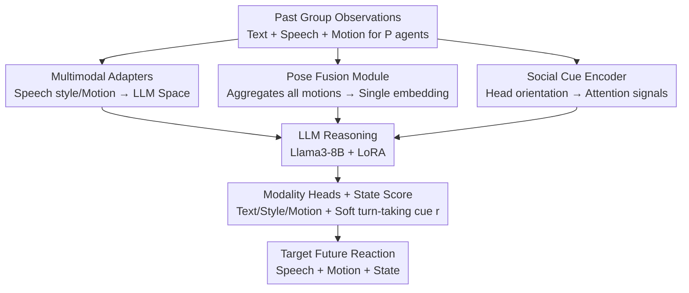

# PolySLGen: Online Multimodal Speaking-Listening Reaction Generation in Polyadic Interaction

**Conference**: CVPR 2026  
**Paper**: [CVF Open Access](https://openaccess.thecvf.com/content/CVPR2026/html/Lin_PolySLGen_Online_Multimodal_Speaking-Listening_Reaction_Generation_in_Polyadic_Interaction_CVPR_2026_paper.html)  
**Code**: https://github.com/zylinzy/PolySLGen  
**Area**: Human Understanding / Multimodal Reaction Generation  
**Keywords**: Multi-party interaction, reaction generation, speaking-listening, turn-taking modeling, Multimodal LLM

## TL;DR
PolySLGen feeds past speech and motion of a multi-person group into a LoRA-fine-tuned LLM to online generate the target participant's future speech, body motion, and a "speaking state score." By unifying multi-person non-verbal signals with a Pose Fusion module and a Social Cue Encoder, it models both speaking and listening behaviors. It significantly outperforms baselines that naively extend dyadic methods to polyadic settings in terms of motion quality, speech-motion alignment, and speaking state prediction.

## Background & Motivation

**Background**: Enabling embodied AI to interact naturally in groups requires coordinating speech and body motion while switching between "speaking" and "listening" (i.e., turn-taking) at appropriate times to convey attention and intent. Recent multimodal LLMs have shown strong capabilities in motion understanding/generation, social cue interpretation, and multimodal Q&A, making it possible to coordinate speech and motion using a unified model.

**Limitations of Prior Work**: Existing reaction generation methods have significant drawbacks. Photorealistic methods output pixel-perfect results but lack 3D physical grounding, making them unsuitable for embodied agents/robots requiring skeleton retargeting. Many methods are unimodal (motion-to-motion, text-to-motion, audio-to-motion). Many depend on **future context**, failing to perform causal online generation from past observations. Methods without speech generation only model group dynamics through body motion and cannot truly participate in dialogue. While SOLAMI, the closest work, uses a multimodal LLM for both motion and speech, it focus only on "speaking" behaviors and is limited to **dyadic** scenarios—returning to default poses when not speaking, which appears abrupt and discontinuous.

**Key Challenge**: Directly extending dyadic architectures to multi-party settings is computationally inefficient and fails to capture high-order dependencies. As the number of participants increases, the interdependent reactions shaped by speech, gestures, and orientation become more complex. Unified generation of "speaking" and "listening" (especially turn-taking) is largely unexplored in multi-party contexts.

**Goal**: Formalize online multimodal reaction generation—given the past speech and motion of all participants, generate the future speech, body/hand motion, and a speaking state score for a **single target participant**.

**Key Insight**: In reality, embodied AI "reacts to others" rather than predicting the full dynamics of the entire group; thus, focusing on the target participant's reaction is more aligned with deployment needs. Furthermore, borrowing from the relationship between turn-taking and visual physical cues (e.g., head orientation), head orientation is used as a proxy for "attention" to assist in determining when to speak.

**Core Idea**: Use a pre-trained LLM as a backbone for dialogue reasoning, paired with a **Pose Fusion module** to compress all motions into compact embeddings and a **Social Cue Encoder** to capture attention from others toward the target. A **soft** speaking state score is added to guide turn-taking, enabling unified "speak + listen" multimodal reaction generation in multi-party scenarios.

## Method

### Overall Architecture
The input to PolySLGen consists of past text $X^t$, speech style $X^s$, and body/hand motion $X^m$ for $P$ participants (where only $P'$ people spoke in the past). The output consists of future text $y^t$, speech style $y^s$, motion $y^m$, and a speaking state score $r$ for the target participant. The framework is formulated as $(y^t,y^s,y^m,r)=\text{PolySLGen}(X^t_{P'},X^s_{P'},X^m_{P})$. The backbone is Llama3-8B-Instruct (fine-tuned with LoRA on Q/K/V projections), responsible for cross-modal interaction reasoning. The front-end uses lightweight adapters to map speech style, motion, and social cues into the LLM's token embedding space, while the back-end uses modality-specific heads to map LLM outputs back to each modality. Crucially, two modules are designed specifically for group dynamics: the Pose Fusion module jointly considers motions of all participants, and the Social Cue Encoder extracts attention signals from others' head orientations. The entire pipeline is online and causal—observing only the past.

### Key Designs

**1. Multimodal Adapters: Enabling LLMs to ingest speech and motion without pre-trained encoders**

To address the difficulty of feeding speech and motion into LLMs and the lack of aligned multimodal data, this work uses end-to-end adapter learning instead of separate pre-trained encoders. On the speech side, pyannote-audio performs utterance segmentation, stable-ts (Whisper backbone) transcribes text, and StyleTTS 2 extracts speech style features $x^s\in\mathbb{R}^{d_s}$ (encoding prosody and emotion such as speed and pitch). A style adapter $\phi_{style}$ projects this into LLM-compatible embeddings $e^s=\phi_{style}(x^s)\in\mathbb{R}^{d_{llm}}$. On the output side, a learnable projection head $f^{style}$ maps LLM output features $h^s$ back to the style space $y^s$, which is used with generated text $y^t$ by the StyleTTS 2 decoder to synthesize speech. This "adapter-in, head-out" design avoids training massive encoders for each modality and preserves LLM context capacity.

**2. Pose Fusion Module: Compressing multi-person motion into a single embedding**

Feeding motion sequences for every participant into the LLM would cause the causal setting to ignore inter-participant coordination, and multi-person motion would consume excessive context, leaving less room for language. The Pose Fusion module $\phi_{motion}:\mathbb{R}^{P\times d_m}\to\mathbb{R}^{d_{llm}}$ learns a **single** joint pose embedding $e^m$ for all participants, preventing input length from scaling with the number of agents. It uses a hierarchical Transformer block: first, self-attention $x'^m_P=\text{SelfAtt}(x^m_P)$ encodes intra-participant dynamics, then cross-attention aggregates target motion $x'^m_P$ with others' motions $x^m_{others}$, followed by an MLP. This captures cross-participant interactions while providing a compact representation for the LLM.

**3. Social Cue Encoder: Head orientation as an attention proxy**

Beyond low-level motion, the model seeks high-level social signals. The Social Cue Encoder $\phi_{social}$ learns embeddings $e^c$ from non-target participants' **head orientations**. For participant $i$ at frame $k$, a social cue score $s_i^k=\cos(u_i^k, v_{i\to P}^k)\in[0,1]$ is calculated using head orientation $u_i^k$ and the relative position vector $v_{i\to P}^k$ pointing to the target. Higher values indicate more attention toward the target. These frame-wise signals are aggregated into a temporal social signal $S\in\mathbb{R}^{H_m\times(P-1)}$ and projected via a multi-stage MLP. This explicitly injects "who the group is attending to" as a strong indicator for turn-taking.

**4. Speaking State Score: A soft turn-taking cue**

PolySLGen predicts an additional speaking state score $r\in\mathbb{R}$, representing the confidence that "the target should speak now," calculated from the first LLM output embedding as $r=f^{state}(h_0)$. Critically, the generation of text $y^t$ and speech style $y^s$ is **independent** of $r$; $r$ serves only as a **soft** cue for turn-taking. This avoids the abrupt "hard-switching" seen in SOLAMI, where the model reverts to default poses when not speaking. Baselines consistently yield random-level performance (AP≈0.50) on this metric, highlighting the task's difficulty.

### Loss & Training
The total loss is $L_{total}=\lambda_{text}L_{text}+\lambda_{style}L_{style}+\lambda_{state}L_{state}+L_{motion}$. $L_{text}$ uses cross-entropy for token prediction; $L_{style}$ uses MSE for style features; $L_{state}$ uses binary cross-entropy; $L_{motion}$ includes representation-level loss, local 3D keypoint loss, and root position loss, along with regularization terms for temporal smoothness and floor contact. Training uses Llama3-8B-Instruct + LoRA (rank=16, $\alpha=32$, dropout=0.1, Q/K/V only). Training was performed on a single A100 for 20 epochs with AdamW. Dimensions: $d_s/d_m/d_{rot}/d_{llm}=256/327/6/3072$. DnD dataset group size $P=5$, speech history $H=512$ frames, motion history $H_m=64$ frames.

## Key Experimental Results

The DnD Group Gesture dataset was used (five-person tabletop RPG, synchronized 3D motion/audio/video). The Dungeon Master was designated as the target participant.
**BeatAlign Diff.** measures the synchrony difference between generated speech and motion beats; **State AP** is the area under the PR curve for $r$; **MAE_head** is the mean angular error for head orientation.

### Main Results

| Method | Root↓(mm) | MPJPE↓(mm) | FID↓ | BERTScore↑ | WER↓ | State AP↑ |
|------|-----------|-----------|------|------------|------|--------------|
| Random | 140.4 | 200.4 | 17.82 | 0.458 | 1.699 | 0.50† |
| NN cond. | 134.7 | 187.7 | 16.36 | 0.451 | 2.075 | 0.52† |
| SOLAMI (Dyadic-to-Poly) | 188.6 | 180.9 | 14.86 | 0.428 | 1.854 | 0.50† |
| Motion Forecast (Motion-only) | 127.0 | 153.8 | 13.93 | — | — | — |
| **PolySLGen (Ours)** | **108.7** | **144.9** | **12.18** | **0.508** | **1.436** | **0.67** |

†: Speaking state inferred from generated text (no explicit prediction). Many SOTA baselines perform worse than Random/NN in motion error when extended to multi-party settings, whereas PolySLGen leads across motion, speech, and state metrics.

### Ablation Study

| Pose Fusion | Social Cue | MPJPE↓ | FID↓ | State AP↑ |
|-------------|-----------|--------|------|--------------|
| ✗ | ✗ | 153.3 | 14.01 | 0.60 |
| ✓ | ✗ | 148.2 | 12.97 | 0.66 |
| ✗ | ✓ | 152.5 | 13.53 | 0.59 |
| ✓ | ✓ | **144.9** | **12.18** | **0.67** |

The incremental motion observation experiment showed that using only speech results in MPJPE of 202.5. Adding speaker motion reduces it to 175.5, and adding all participants' motion further reduces it to 153.3—proving that both speaker and non-speaker motions provide valuable interpersonal context.

### Key Findings
- **Pose Fusion is the core driver**: Adding Pose Fusion alone improves motion, speech similarity, and State AP. The Social Cue Encoder is effective only when combined with Pose Fusion, as high-level signals require grounding in motion dynamics.
- **Robustness to missing participants**: Randomly removing 1–3 non-target participants only slightly degrades performance. PolySLGen with incomplete input still outperforms SOLAMI with full observations.
- **Human Study**: PolySLGen significantly outperformed SOLAMI in motion coherence (3.6 vs 2.7), continuity (3.8 vs 2.4), and speech semantics (3.6 vs 2.3).

## Highlights & Insights
- **Listening as a first-class citizen**: Using a soft speaking state score allows for natural turn-taking behavior, avoiding the robotic feel of hard-switched states.
- **Single embedding for group motion**: The Pose Fusion module decouples participant count from context length, a strategy transferable to other LLM-based multi-agent tasks.
- **Head orientation as an attention proxy**: Quantizing "who looks at whom" via cosine similarity provides a physically interpretable group attention signal.
- **Lightweight multi-modal integration**: Adapters + heads allow speech and motion integration without massive modality-specific encoders.

## Limitations & Future Work
- **Data specificity**: Experiments were limited to the DnD Group Gesture dataset. Generalization to other scenarios (meetings, classrooms) remains to be verified.
- **Speech semantics**: Due to the improvisational nature of D&D, generated speech is difficult to align semantically with Ground Truth, making BERTScore/WER less absolute.
- **Social cue grounding**: The social cue encoder relies heavily on the presence of the pose fusion module, suggesting a need for stronger joint social-motion representations.
- **Turn-taking granularity**: Fine-grained behaviors like interruptions or overlapping speech are not yet explicitly modeled.

## Related Work & Insights
- **vs SOLAMI**: SOLAMI is limited to dyadic "speaking" reactions. PolySLGen unifies speaking and listening for groups, significantly outperforming it in motion quality and state prediction.
- **vs LLM + ConvoFusion**: ConvoFusion is a "text-first, then motion" pipeline, which results in poor timing (WER 13.318). PolySLGen's joint modeling ensures better alignment.
- **vs LM-L2L Adapted**: Extending dyadic text-to-face models to multi-party body motion results in high error, confirming that simple extensions fail to capture high-order group dependencies.

## Rating
- Novelty: ⭐⭐⭐⭐⭐ First online, multi-party, unified speak+listen multimodal reaction framework.
- Experimental Thoroughness: ⭐⭐⭐⭐ Extensive metrics and ablations; however, limited to a single dataset.
- Writing Quality: ⭐⭐⭐⭐ Clear motivation and module descriptions.
- Value: ⭐⭐⭐⭐ High value for embodied AI social interaction; transferable "fixed-length group representation" concept.

<!-- RELATED:START -->

<!-- RELATED:END -->

## Related Papers

- [\[CVPR 2026\] ARMFlow: AutoRegressive MeanFlow for Online 3D Human Reaction Generation](armflow_autoregressive_meanflow_for_online_3d_human_reaction_generation.md)
- [\[CVPR 2026\] UniLS: End-to-End Audio-Driven Avatars for Unified Listening and Speaking](unils_end-to-end_audio-driven_avatars_for_unified_listening_and_speaking.md)
- [\[CVPR 2026\] ReMoGen: Real-time Human Interaction-to-Reaction Generation via Modular Learning from Diverse Data](remogen_real-time_human_interaction-to-reaction_generation_via_modular_learning_.md)
- [\[CVPR 2026\] HandX: Scaling Bimanual Motion and Interaction Generation](handx_scaling_bimanual_motion_and_interaction_generation.md)
- [\[CVPR 2026\] Real-Time Multimodal Fingertip Contact Detection via Depth and Motion Fusion for Vision-Based Human-Computer Interaction](real-time_multimodal_fingertip_contact_detection_via_depth_and_motion_fusion_for.md)

<!-- RELATED:END -->
