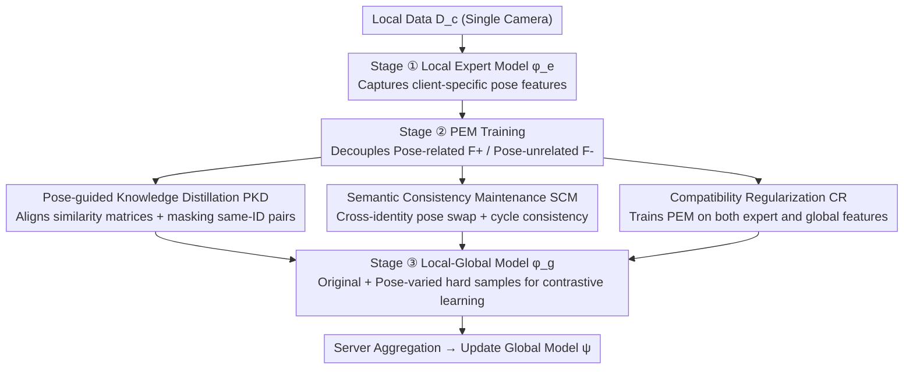

# Pose-guided Enriched Feature Learning for Federated-by-camera Person Re-identification

**Conference**: CVPR 2026  
**Paper**: [CVF Open Access](https://openaccess.thecvf.com/content/CVPR2026/html/Oh_Pose-guided_Enriched_Feature_Learning_for_Federated-by-camera_Person_Re-identification_CVPR_2026_paper.html)  
**Code**: TBD  
**Area**: Human Understanding / Person Re-identification / Federated Learning  
**Keywords**: Person Re-identification, Federated Learning, Pose Decoupling, Feature Enrichment, Contrastive Learning

## TL;DR
Addressing the "one client = one camera, limited pose visibility" scenario in federated-by-camera person Re-identification, this paper proposes a Pose Extraction Module (PEM) to decouple features into "pose-related" and "pose-unrelated" components. By swapping pose components across identities to synthesize "pose-changed" hard positive samples, and employing Pose-guided Knowledge Distillation (PKD), Semantic Consistency Maintenance (SCM), and Compatibility Regularization (CR) for decoupling quality and global compatibility, the method compensates for the lack of pose diversity in contrastive learning, achieving SOTA results on Market1501 and MSMT17 for FedReID.

## Background & Motivation
**Background**: Person Re-identification (ReID) aims to retrieve images of the same identity from a gallery, typically relying on contrastive learning (especially triplet loss) to learn fine-grained features. However, ReID data is sensitive (containing appearance and location information), making centralized training prone to privacy and storage pressures. Federated ReID (FedReID) has emerged, where a central server aggregates local models without accessing raw data. FedReID includes two settings: federated-by-dataset (each client is a multi-camera dataset) and federated-by-camera (each client has images from a single camera).

**Limitations of Prior Work**: The authors argue that federated-by-camera is more realistic but suffers severely from **insufficient sample diversity**—images of the same identity captured by a single camera are highly redundant in viewpoint and pose. This undermines contrastive learning: the effectiveness of triplet loss **fundamentally depends on hard samples** (those with significant intra-class or inter-class variance). In single-camera scenarios, retrieved "hard samples" often share similar poses with the anchors, offering little difficulty. Consequently, local models rapidly overfit to homogeneous local data, leading to typical **client drift** in federated learning and damaging global generalization.

**Key Challenge**: The authors verify the root cause through experiments: contrastive learning (triplet loss) provides significant gains in Centralized Learning (CL) (+14.6 mAP on Market1501) but minimal gains in Federated Learning (FL) (+1.5 mAP). The issue is not just inter-client heterogeneity (the focus of existing FL methods) but the **lack of intra-client pose diversity**, preventing the acquisition of true hard positive/negative pairs.

**Goal**: Without leaking raw data, synthesize hard samples with new poses while maintaining original identity for each training batch, directly injecting the missing pose diversity into contrastive learning.

**Key Insight**: Since pose diversity is the bottleneck, features can be split into "pose-related" and "pose-unrelated" blocks. **Swapping pose blocks across identities and recombining them** synthesizes new features with "Identity A and Pose B," effectively creating pose-varied hard samples "out of thin air."

**Core Idea**: Utilize a learnable Pose Extraction Module (PEM) to perform pose/identity decoupling and recombination in the feature space. PKD and SCM ensure correct decoupling, while CR ensures the synthesized features are useful for the global model, compensating for pose diversity with negligible communication overhead.

## Method

### Overall Architecture
The system is a FedReID framework with $C$ clients. Each client $c$ holds a private local dataset $D_c=\{(x_i,y_i)\}$ from one camera. The server collaboratively trains a global model $\psi$. In each round, local models are trained using cross-entropy $L_{ce}$ and triplet loss $L_{tri}$, and the server aggregates parameters via weighted averaging.

Ours consists of **three sequential stages**: (i) Train local expert models $\phi^e_c$ (trained only on $D_c$ to capture client-specific pose features); (ii) Train PEM $\pi_c$ (learning to decouple pose-related/unrelated features and synthesize pose-enriched features); (iii) Train local-global models $\phi^g_c$ (using original features + PEM-synthesized pose-enriched features for contrastive learning). After the three stages, the server aggregates parameters (including PEM) to update $\psi$. PEM training incorporates three critical constraints: Pose-guided Knowledge Distillation (PKD), Semantic Consistency Maintenance (SCM), and Compatibility Regularization (CR).

### Key Designs

**1. PEM: Decoupling and Recombining via Channel Attention**

This is the core design addressing intra-camera diversity. PEM $\pi_c$ consists of two convolutional layers that output a channel attention map $A_i=\pi_c(F_i)\in\mathbb{R}^{d\times1\times1}$ for the feature map $F_i\in\mathbb{R}^{d\times h\times w}$ extracted by $\phi^e_c$, constrained by sigmoid to $[0,1]$. Feature maps are split into:

$$F^+_i=A_i\odot F_i,\qquad F^-_i=(1-A_i)\odot F_i$$

After decoupling, **pose-related blocks are swapped across identities** within a mini-batch to synthesize new features: $F^{\delta(i)}_i=F^-_i+F^+_{\delta(i)}$ (maintains identity $i$ but uses pose from $\delta(i)$), where $\delta(i)$ is a random index such that $y_i\neq y_{\delta(i)}$. These synthesized features serve as the missing "pose-varied hard positive samples."

**2. PKD: Supervised Decoupling via Oracle Pose Similary and Identity Masking**

To ensure $F^+_i$ specifically contains pose information, an oracle pose vector $z_i=\varphi(x_i)$ is obtained from an off-the-shelf pose detector $\varphi$. Since $z_i$ and $F^+_i$ reside in different spaces, the **pairwise similarity structure** within a mini-batch is aligned: pose similarity matrices $S_z[i,j]=\frac{z_i\cdot z_j}{\|z_i\|\|z_j\|}$ and $S_{F^+}[i,j]=\frac{\hat F^+_i\cdot \hat F^+_j}{\|\hat F^+_i\|\|\hat F^+_j\|}$ are calculated. However, because identity and pose are highly correlated in $D_c$, PEM might degenerate into an identity mapping $F^+_i\approx F_i$. Thus, a binary mask $M$ excludes same-identity pairs ($y_i=y_j$):

$$L_{pose}=\frac{\sum_{i,j}M[i,j]\cdot(S_z[i,j]-S_{F^+}[i,j])^2}{\sum_{i,j}M[i,j]},\quad M[i,j]=0\text{ if }y_i=y_j\text{ else }1$$

This forces PEM to learn true pose relationships rather than exploiting identity correlation shortcuts.

**3. SCM: Cycle Consistency for Semantic Maintenance**

After synthesizing $F^{\delta(i)}_i$, cycle consistency ensures it retains identity $i$ while adopting pose $\delta(i)$. The enhanced feature is passed back through PEM to be decoupled, and then recombined into the reconstructed original feature $F^{rec}_i=F^{\delta(i)-}_i+F^{i+}_{\delta(i)}$. An L1 loss constrains it to the original $F_i$:

$$L_{cyc}=\frac{1}{2|B|}\sum_{i=1}^{|B|}\big\{\|F_i-F^{rec}_i\|_1+\|F_{\delta(i)}-F^{rec}_{\delta(i)}\|_1\big\}$$

This ensures the swap is semantically clean. The total PEM loss is $L_{PEM}=L_{pose}+L_{cyc}$.

**4. CR: Simultaneous Training on Expert and Global Models**

PEM relies on local experts $\phi^e_c$, risking overfitting to single-client distributions. If the PEM feature space deviates from the global model $\psi$, synthesized features may be useless or harmful. CR **trains the same PEM on two paths**: features from $\phi^e_c$ and features from $\phi^g_c$ (which receives parameters from $\psi$ every round). This symmetry forces PEM to generalize across specialized local spaces and universal global spaces.

### Loss & Training
Both local expert and local-global models use $L_{ce} + L_{tri}$ (margin $m$). PEM is trained with $L_{PEM}=L_{pose}+L_{cyc}$, with CR implemented via parallel training on both feature paths. The backbone is ResNet-50; clients share the backbone while holding private classifiers. SGD is used (momentum 0.9, lr 1e-3) for 300 epochs with batch size 32, following the MEDA pipeline.

## Key Experimental Results

### Main Results
Evaluation on Market1501 (6 cameras/clients) and MSMT17 (15 cameras/clients) in federated-by-camera settings.

| Category | Method | Market mAP | Market R-1 | MSMT mAP | MSMT R-1 |
|------|------|-----------|-----------|----------|----------|
| Upper Bound | Centralized | 77.3 | 90.0 | 42.3 | 69.5 |
| Augmentation | ISE (CVPR'22) | 34.8 | 56.6 | 10.0 | 22.5 |
| Fed Learning | MOON (CVPR'21) | 33.2 | 55.7 | 13.2 | 31.2 |
| Fed Learning | FedRCL (CVPR'24) | 29.6 | 53.4 | 7.3 | 17.9 |
| Fed ReID | DACS (AAAI'24) | 40.0 | 63.1 | 11.4 | 29.3 |
| Fed ReID | MEDA (ICASSP'24) | 41.4 | 66.1 | 9.7 | 24.8 |
| — | **Ours** | **45.9** | **66.4** | **14.5** | **32.7** |

Ours outperforms all baselines. Rank-1 Gain is sometimes smaller than mAP Gain because Ours suppresses overfitting to pose-specific features in favor of pose-invariant representations (benefiting mAP), whereas pose-biased models might perform well in Rank-1 for matching similar poses but lack generalization.

### Ablation Study
Ablation of PEM components (PKD / SCM / CR):

| Config | Market mAP | Market R-1 | MSMT mAP | MSMT R-1 |
|------|-----------|-----------|----------|----------|
| Baseline | 36.6 | 59.4 | 11.3 | 25.5 |
| PKD only | 28.0 | 53.1 | 9.7 | 24.8 |
| SCM only | 27.9 | 53.2 | 11.2 | 28.1 |
| PKD + SCM | 42.8 | 62.9 | 12.5 | 29.3 |
| PKD + SCM + CR (Full) | **45.9** | **66.4** | **14.5** | **32.7** |

Ablation of masking and sampling:

| Config | Market mAP | Market R-1 | MSMT mAP | MSMT R-1 |
|------|-----------|-----------|----------|----------|
| Without masking | 41.4 (Δ-4.5) | 62.1 (Δ-4.3) | 10.7 (Δ-3.8) | 26.3 (Δ-6.4) |
| Hard-pose sampling | 29.1 (Δ-16.8) | 53.9 (Δ-12.5) | 11.6 (Δ-2.9) | 29.0 (Δ-3.7) |
| **Ours** | **45.9** | **66.4** | **14.5** | **32.7** |

### Key Findings
- **PKD and SCM must be used together**: Individually, they perform worse than the baseline, but together they ensure semantic integrity of decoupled features.
- **Masking is critical**: Removing identity masking drops performance significantly, confirming it prevents PEM from taking the "identity-pose correlation" shortcut.
- **Random swap is superior to hard-pose sampling**: Extreme pose changes might destroy semantic consistency, producing meaningless features.
- **Communication overhead is negligible**: PEM adds only 0.53M parameters; total communication (48.1M) is comparable to baselines.

## Highlights & Insights
- **Rediagnosed the Federated-by-camera Bottleneck**: The primary issue is **lack of intra-client pose diversity**, not just inter-client heterogeneity.
- **Efficient Feature-space Hard Sample Synthesis**: Synthesizing pose-varied features without raw data exchange naturally fits privacy constraints with minimal cost.
- **Anti-shortcut Design via Masking**: Identifying the identity-pose correlation shortcut and neutralizing it with masking is a portable insight for decoupling tasks.

## Limitations & Future Work
- Decoupling quality depends on the external pose detector; errors in occlusion or low resolution may propagate.
- Only validated on Market1501 and MSMT17; scalability to larger, real-world non-IID surveillance networks remains to be tested.
- A significant gap still exists compared to the centralized upper bound.

## Related Work & Insights
- **vs. Standard FL (MOON / FedProx)**: These address inter-client heterogeneity but fail when local data lacks information. Ours solves intra-client diversity.
- **vs. DACS (Augmentation)**: Pixel-level style/color augmentation doesn't create semantically meaningful hard samples like pose swapping does.
- **vs. MEDA (Meta-knowledge)**: While both target data scarcity, Ours identifies "pose" specifically as the critical dimension.

## Rating
- Novelty: ⭐⭐⭐⭐ 
- Experimental Thoroughness: ⭐⭐⭐⭐ 
- Writing Quality: ⭐⭐⭐⭐ 
- Value: ⭐⭐⭐⭐ 

<!-- RELATED:START -->

## Related Papers

- [\[CVPR 2026\] Composite-Attribute Person Re-Identification via Pose-Guided Disentanglement](composite-attribute_person_re-identification_via_pose-guided_disentanglement.md)
- [\[CVPR 2026\] Spatial-Frequency Collaborative Learning for Occluded Visible-Infrared Person Re-Identification](spatial-frequency_collaborative_learning_for_occluded_visible-infrared_person_re.md)
- [\[CVPR 2026\] WHU-MARS: A Multispectral Aerial-Ground Benchmark Towards Any-Scenario Person Re-Identification](whu-mars_a_multispectral_aerial-ground_benchmark_towards_any-scenario_person_re-.md)
- [\[CVPR 2026\] SSM-Aware Token-Efficient VMamba via Adaptive Patch Pruning and Merging for Person Re-Identification](ssm-aware_token-efficient_vmamba_via_adaptive_patch_pruning_and_merging_for_pers.md)
- [\[CVPR 2026\] Dynamic Magic: Unleashing Restricted Knowledge for Lifelong Person Re-Identification](dynamic_magic_unleashing_restricted_knowledge_for_lifelong_person_re-identificat.md)

<!-- RELATED:END -->
