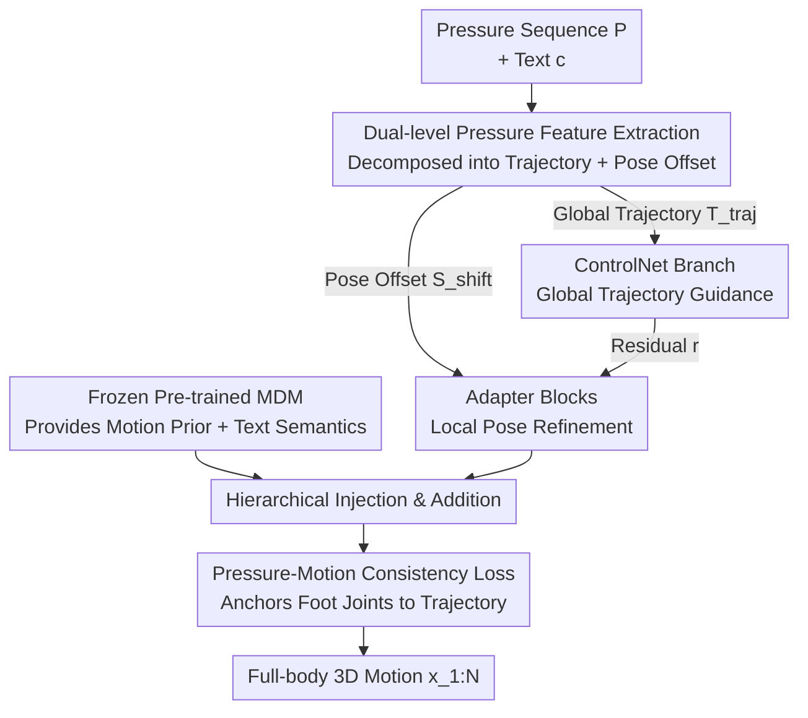

# Pressure2Motion: Hierarchical Human Motion Reconstruction from Ground Pressure with Text Guidance

**Conference**: CVPR 2026  
**Paper**: [CVF Open Access](https://openaccess.thecvf.com/content/CVPR2026/html/Li_Pressure2Motion_Hierarchical_Human_Motion_Reconstruction_from_Ground_Pressure_with_Text_CVPR_2026_paper.html)  
**Code**: None (claimed to be open-sourced after publication)  
**Area**: Human Understanding / Motion Capture / Diffusion Models  
**Keywords**: Ground Pressure, Motion Reconstruction, Text Guidance, Hierarchical Diffusion, ControlNet

## TL;DR
Reconstructs full-body 3D human motion from a sequence of ground pressure maps plus a single text prompt, without cameras or wearables. By injecting sparse and noisy pressure signals into a pre-trained motion diffusion model via "dual-level pressure features + hierarchical pressure-modulated diffusion," it achieves state-of-the-art (SOTA) performance on this novel task using a self-built MPL benchmark.

## Background & Motivation

**Background**: Traditional motion capture (MoCap) relies either on wearable devices like optical/inertial systems or on RGB cameras for visual reconstruction. These solutions are impractical in privacy-sensitive (medical, home care), low-light, or low-cost scenarios—being expensive, intrusive, or compromising privacy. Ground pressure mats are an attractive alternative: they are cost-effective, preserve privacy, and naturally carry physical information about foot-ground contact.

**Limitations of Prior Work**: Existing pressure-to-pose methods only succeed in "large contact area" scenarios, such as predicting the static pose of a person lying in bed (large contact area, high constraints). Once a person stands up and moves, the pressure signals become extremely sparse (only the soles of the feet are in contact). Reconstructing full-body poses from such signals is **highly underdetermined**—the same set of foot pressure inputs can correspond to countless upper-body poses. On the other hand, although text-to-motion is mature, pure text as a control signal is too unconstrained to provide precise MoCap. Meanwhile, controllable synthesis methods like OmniControl and MaskControl rely on **clean, manually specified inputs with direct geometric correspondence** (e.g., keypoint trajectories). Their architectures cannot process pressure, which is an indirect signal that is physically grounded but noisy and lacks a simple kinematic mapping to full-body poses.

**Key Challenge**: Pressure signals provide **physical constraints** (which foot is grounded, how much force is applied, where the center of mass is), but they lack a one-to-one correspondence with the full-body pose; text provides **semantic intent** but lacks physical precision. Either signal alone is insufficient; the key challenge lies in how to **hierarchically couple** "low-level physics" and "high-level semantics" within a generative framework to resolve ambiguity.

**Goal**: (1) Formalize and address the novel task of "ground pressure + text $\rightarrow$ full-body motion"; (2) design a network capable of extracting multi-level features from sparse pressure signals and hierarchically injecting them into a diffusion prior; (3) adapt a pre-trained text-to-motion model to this MoCap task; (4) establish the first paired (text, pressure, motion) benchmark, MPL.

**Key Insight**: The authors frame this underdetermined reconstruction problem as finding the "most physically plausible solution using a generative prior"—leveraging the Motion Diffusion Model (MDM) not for "creation" but for "reconstruction." By using it as a strong prior, the system selects the motion that satisfies both pressure and text constraints from the set of all possible motions.

**Core Idea**: Decode pressure into two levels of control signals: "global translation trajectory + fine-grained pose offset." These are injected into a frozen pre-trained MDM using a ControlNet (global) and an Adapter (local), respectively, augmented by a pressure-motion consistency loss to enforce foot alignment.

## Method

### Overall Architecture

The input consists of a sequence of $N$ ground pressure maps $P=\{p_i\}_{i=1}^N$ (where each frame $p_i\in\mathbb{R}^{H\times W}$) and a text description $c$. The output is a temporally coherent and physically plausible full-body motion sequence $x_{1:N}$ (using HumanML3D representation: root velocity, local joint positions/velocities/rotations, and binary foot contact). The pipeline consists of three steps: first, **dual-level pressure feature extraction** decomposes the pressure sequence into "global translation trajectory $T_{traj}$" and "pressure-induced pose offset $S_{shift}$"; second, a **hierarchical pressure-modulated motion synthesizer**—where a ControlNet takes the trajectory for global guidance and parallel Adapter blocks take the pose offset for local refinement—injects these two control paths into a pre-trained MDM; finally, a **pressure-motion consistency loss** anchors the foot joints of the reconstructed motion to the pressure-inferred trajectory.

### Key Designs

**1. Dual-level Pressure Feature Extraction: Decomposing Pressure Maps into "Where to Go" and "How to Move"**

Directly feeding raw pressure maps into the network forces the model to simultaneously learn global translation and local pose changes, which are entangled across different scales and difficult to optimize. The authors' insight is that pressure signals naturally contain two types of information: **global translation trajectory** (overall path and orientation) and **fine-grained pose offsets** (center of mass shift, balance transition, subtle pose adjustments). Thus, they employ two independent branches. The trajectory branch $F_{traj}$ follows the ResNet+GRU architecture of MotionPRO to process the pressure sequence, yielding a compact embedding $T_{traj}=F_{traj}(P)$ via fully connected layers. This module is pre-trained separately on diverse pressure-motion pairs and is **frozen** during synthesizer training to ensure stable trajectory estimation. The pose offset branch $F_{shift}$ takes the raw pressure map $P$, its temporal difference $\Delta P$, and grid positional encodings $e$ as inputs, yielding $S_{shift}=F_{shift}(P,\Delta P,e)$ through multi-scale convolutions and fully connected projections. The temporal difference specifically captures subtle frame-to-frame variations, and this module is **jointly trained end-to-end** with the synthesizer. This design—freezing one and dynamically training the other—stabilizes global guidance while adapting local details to downstream objectives.

**2. Hierarchical Pressure-Modulated Motion Synthesizer: ControlNet for Global, Adapter for Local, Hierarchically Injected into Frozen MDM**

Concatenating the two features into a single vector and injecting them through a single branch (the w/o Hi ablation in the paper) causes mutual interference between global and local signals, significantly degrading performance. The authors decompose this into a hierarchical structure where the upper level manages the global aspect and the lower level manages the local. ControlNet $F_{Ctrl}$ is a trainable replica of the pre-trained MDM, initialized with original backbone parameters and auxiliary zero-initialized linear layers $Z$. The trajectory embedding $T_{traj}$ is directly injected into the noisy motion $x_t$ via element-wise addition, and then passed through ControlNet to yield residual features $r$:

$$x'_t = x_t + T_{traj}, \quad r = F_{Ctrl}(x'_t, t, c)$$

Parallel Adapter blocks $F_{Adapt}$ receive $r$ and integrate the pose offset $S_{shift}$ and text embedding $c$ for local refinement. Each Adapter block consists of self-attention, cross-attention, and feed-forward networks. The frozen MDM backbone $F_\theta$ outputs the motion prior aligned with the text semantics, and the final clean motion is obtained by adding the prior and control residuals:

$$\hat{x}'_0 = F_\theta(x_t,t,c) + r', \quad r' = F_{Adapt}(Z(r), S_{shift}, c)$$

In this way, ControlNet first pulls the motion onto the correct overall path, and the Adapter adds subtle poses on top of it. Hierarchical modeling instead of flat concatenation is key to resolving ambiguity.

**3. Pressure-Motion Consistency Loss: Enforcing Foot Joint Alignment with Pressure-Inferred Contact Trajectories**

Relying solely on the diffusion loss might yield plausible full-body motion, but the feet often fail to align with the pressure contact (causing foot skating or floating). Since ground pressure primarily reflects foot-ground contact and overall trajectory, the authors impose a consistency constraint on only 5 key joints: the pelvis root, left/right ankles, and left/right feet. This pulls the global positions $R(\hat{x}'_0)$ of these joints in the reconstructed motion toward the pressure-inferred trajectory $E(T_{traj})$:

$$L_{cons}(T_{traj}, \hat{x}'_0) = \frac{\sum_n\sum_j \sigma_{nj}\odot\|E(T_{traj})-R(\hat{x}'_0)\|}{\sum_n\sum_j \sigma_{nj}}$$

where $\sigma_{nj}$ is a binary mask that equals 1 only if joint $j$ is one of the 5 key joints and 0 otherwise; $E(\cdot)$ extracts the control joint positions, and $R(\cdot)$ transforms the motion representation into global absolute joint positions. The total loss is a weighted sum of the diffusion loss and the consistency loss: $L_{total}=\lambda_{diff}L_{diff}+\lambda_{cons}L_{cons}$. Ablation studies show that removing this constraint (w/o CL) increases CoP Error from 0.426 to 0.532 and degrades foot skating, demonstrating that this constraint directly improves physical alignment.

### Loss & Training
- Diffusion loss $L_{diff}=\mathbb{E}_{x_0,t}[\|x_0-\hat{x}_0\|_2^2]$ (standard MDM/DDPM objective to predict clean motion $\hat{x}_0$).
- Consistency loss $L_{cons}$ (Eq. 7), weighted and summed with the diffusion loss.
- The trajectory extraction module $F_{traj}$ is pre-trained separately and frozen. The pose offset module $F_{shift}$ is jointly trained end-to-end with the synthesizer. The MDM backbone is kept frozen, while only the ControlNet replica and Adapter are trained.
- Data augmentation: Random spatial translation and rotation to improve generalization. MPL dataset is split into 80%/15%/5% for training/validation/testing.

## Key Experimental Results

Data is obtained from the self-built **MPL dataset** (extended from MotionPRO): 25 human subjects with diverse body shapes, 20,944 motion sequences, approximately 2.3 million frames, 400 motion categories, and text descriptions with 5 levels of decreasing detail for each sequence (104,720 annotations in total, labeled by Qwen2.5-VL), resampled to 20 FPS. Evaluation follows the OmniControl protocol and introduces two alignment metrics, MPJPE and Lower-body MPJPE (LMPJPE), along with a custom **CoP Error** (Center of Pressure Error) which measures the average L2 distance between the center of pressure calculated from the input pressure map and the one back-projected from the reconstructed lower-body joints. A lower value indicates better physical alignment with the input pressure.

### Main Results

| Method | FID ↓ | Foot Skating ↓ | CoP Error ↓ | LMPJPE ↓ | MPJPE ↓ | R-precision Top-3 ↑ |
|------|-------|----------------|-------------|----------|---------|---------------------|
| MDM | 4.819 | 0.1029 | 0.9238 | 0.2550 | 0.2996 | 0.458 |
| MotionDiffuse | 3.812 | 0.1138 | 0.8765 | 0.2305 | 0.2884 | 0.486 |
| OmniControl | 0.315 | 0.0629 | 0.5862 | 0.1362 | 0.1719 | 0.523 |
| MaskControl | 0.388 | 0.0617 | 0.5644 | 0.1335 | 0.1695 | 0.534 |
| Text-Only | 0.872 | 0.1560 | 1.0810 | 0.2320 | 0.2838 | 0.2866 |
| Regression | 40.015 | 0.7338 | 1.4832 | 0.4322 | 0.4896 | 0.127 |
| **Ours** | **0.262** | **0.0553** | **0.4260** | **0.1273** | **0.1622** | **0.545** |

Ours achieves comprehensive leadership in reconstruction accuracy (MPJPE/LMPJPE), realism (FID/Foot Skating), and semantic alignment (R-precision). The CoP Error is significantly reduced from the second-best of 0.564 to 0.426, demonstrating that the hierarchical model uniquely learns to align motion with physical inputs. The physical metrics for Text-Only (which disables the pressure branch) collapse (CoP Error 1.081, Foot Skating 0.156), proving that the pressure branch is indispensable. Regression (where diffusion degrades to a single step) fails almost completely (FID 40.015), validating the core hypothesis that "underdetermined problems require a generative prior."

### Ablation Study

| Configuration | FID ↓ | FS ↓ | CoP Err ↓ | LMPJPE ↓ | MPJPE ↓ | Description |
|------|-------|------|-----------|----------|---------|------|
| w/o MT | 0.543 | 0.0665 | 0.8840 | 0.1943 | 0.2357 | Without translation trajectory, CoP Error surges |
| w/o PS | 0.847 | 0.0629 | 0.5864 | 0.1555 | 0.2025 | Without pose offset, FID is the worst |
| w/o CL | 0.282 | 0.0721 | 0.5320 | 0.1550 | 0.1896 | Without consistency loss, foot skating and physical alignment degrade |
| w/o Hi | 0.345 | 0.0615 | 0.5610 | 0.1311 | 0.1692 | Concatenated as a single branch, overall performance significantly degrades |
| Full | **0.262** | **0.0553** | **0.4260** | **0.1273** | **0.1622** | Full model |

### Key Findings
- **Translation Trajectory (MT) contributes most to physical alignment**: Removing it causes the CoP Error to surge from 0.426 to 0.884 (nearly doubling), indicating that the global trajectory is the main driver in anchoring motion to pressure.
- **Pose Offset (PS) contributes most to realism**: Removing it increases the FID from 0.262 to 0.847 (the worst-performing tier), demonstrating that fine-grained local signals dictate how realistic the motion appears.
- **Hierarchical Injection vs. Flat Concatenation**: The w/o Hi configuration, which concatenates the two features into a single representation and feeds them into a single branch, consistently underperforms. This proves that separating "high-level trajectory + low-level pose" and injecting them hierarchically is critical to accurate reconstruction, rather than simply stacking features.
- **Text mainly affects the upper body**: Ablating the text input reveals that text significantly influences upper-body movements, whereas the lower body is strictly bound to pressure data. This suggests that the two modalities govern different parts, being complementary without conflicting.
- The model maintains high fidelity and physical realism even in uncontrolled, out-of-distribution (OOD) real-world environments like corridors, demonstrating the deployment potential of non-visual motion sensing in domestic, clinical, and public spaces.

## Highlights & Insights
- **Reframing "underdetermined reconstruction" as "finding the most plausible solution using generative priors"**: Using MDM as a reconstruction prior rather than a creative tool makes the ill-posed sparse pressure $\rightarrow$ full-body motion problem solvable. This perspective is strongly supported by the collapse of the Regression baseline (FID 40).
- **The "dual-level decomposition" of pressure is the core genius**: Decomposing the same set of pressure maps into "global trajectory (stable, frozen, ControlNet-injected)" and "pose offset (fine-grained, jointly trained, Adapter-injected)" perfectly aligns with the division of labor between ControlNet and Adapter. This design is highly transferable to any control task mapping "noisy, indirect signals $\rightarrow$ structured outputs."
- **The custom CoP Error metric is highly effective**: Existing motion metrics fail to evaluate whether the reconstructed motion aligns with the input pressure. By measuring the L2 distance of the center of pressure, the authors directly quantify physical consistency, bridging a critical gap in evaluating this new task.
- **Pressure as a privacy-preserving dense physical control signal**: Compared to kinematic abstractions like trajectories or keypoints, pressure directly measures real contact, force distribution, and center of pressure dynamics frame by frame, naturally guaranteeing physical plausibility—marking a valuable expansion of "control modalities" in controllable motion synthesis.

## Limitations & Future Work
- **Dependence on paired (pressure, motion, text) training data**: Although MPL is large, it builds on MotionPRO's sensor acquisition. Extending to new scenarios or motion categories still requires recollecting multi-modal data, which is costly.
- **Limitation on actions without foot-ground contact**: Aerial movements like jumping generate almost no pressure signals. The authors discuss these "complex cases" only in the supplementary materials without providing quantitative results in the main text, indicating a clear boundary of the current framework.
- **Weak text constraints on the lower body**: Experiments show that text primarily influences the upper body, with the lower body almost entirely determined by pressure. When the pressure itself is highly ambiguous (e.g., symmetric standing poses), upper-body details may rely more on "guessing" from the prior rather than authentic reconstruction.
- **Avenues for improvement**: Introducing finer plantar pressure resolution or lightweight multimodal supplements (e.g., a single IMU) to cover aerial/low-contact movements, or exploring self-/weakly-supervised adaptation without paired supervision to reduce deployment costs in new environments.

## Related Work & Insights
- **vs. Pressure-based Pose Estimation (PIMesh / BodyPressure / MotionPRO)**: Early methods were limited to static poses with large contact areas (e.g., on a bed). PIMesh extended to short pressure sequences but failed on dynamic movements like walking. Although MotionPRO is large-scale, it treats pressure as an auxiliary signal, underestimating its physical semantics. This work is the first to treat pressure as the **primary control signal** combined with text, focusing on dynamic standing actions.
- **vs. Controllable Motion Synthesis (OmniControl / MaskControl / Sketch2Anim)**: These methods are based on ControlNet using clean signals with **direct geometric correspondences** (such as keypoints or trajectories). This work addresses sparse, noisy, physical signals with no kinematic mapping, utilizing a "dual-level feature + hierarchical ControlNet/Adapter" architecture to specialize for them, significantly outperforming priors on physical metrics like CoP Error under the same protocol.
- **vs. Pure Text-to-Motion (MDM / MotionDiffuse)**: Pure text is too unconstrained to provide MoCap accuracy (MDM and MotionDiffuse exhibit poor FID and CoP Error metrics). This work layers a pressure branch over it, hierarchically coupling semantic intent and physical constraints.

## Rating
- **Novelty**: ⭐⭐⭐⭐⭐ First to formalize the "pressure+text $\rightarrow$ full-body motion" task. The dual-level pressure decomposition, hierarchical injection, and the new MPL benchmark open up a new paradigm for non-visual, privacy-preserving MoCap.
- **Experimental Thoroughness**: ⭐⭐⭐⭐ Meets high standards with 6 baselines in the main results, ablation covering 4 components, and validation of text influence and OOD performance. It is slightly regrettable that aerial/low-contact actions are only qualitatively discussed in the supplementary materials.
- **Writing Quality**: ⭐⭐⭐⭐⭐ Clear motivational derivation, well-illustrated pipeline-to-text correspondence, and precise definitions of metrics like CoP Error.
- **Value**: ⭐⭐⭐⭐⭐ High real-world deployment value in privacy-sensitive, low-light, and low-cost scenarios. The dual-level decomposition strategy can be transferred to other control-based generative tasks using noisy, indirect signals.

<!-- RELATED:START -->

## Related Papers

- [\[CVPR 2026\] Ground Reaction Inertial Poser: Physics-based Human Motion Capture from Sparse IMUs and Insole Pressure Sensors](ground_reaction_inertial_poser_physics-based_human_motion_capture_from_sparse_im.md)
- [\[CVPR 2026\] ParTY: Part-Guidance for Expressive Text-to-Motion Synthesis](party_part-guidance_for_expressive_text-to-motion_synthesis.md)
- [\[CVPR 2026\] Hierarchical Enhancement of Semantic Priors for Disentangled Text-Driven Motion Generation](hierarchical_enhancement_of_semantic_priors_for_disentangled_text-driven_motion_.md)
- [\[CVPR 2026\] MotionHiFlow: Text-to-Motion via Hierarchical Flow Matching](motionhiflow_text-to-motion_via_hierarchical_flow_matching.md)
- [\[CVPR 2026\] MoLingo: Motion-Language Alignment for Text-to-Human Motion Generation](molingo_motion-language_alignment_for_text-to-motion_generation.md)

<!-- RELATED:END -->
