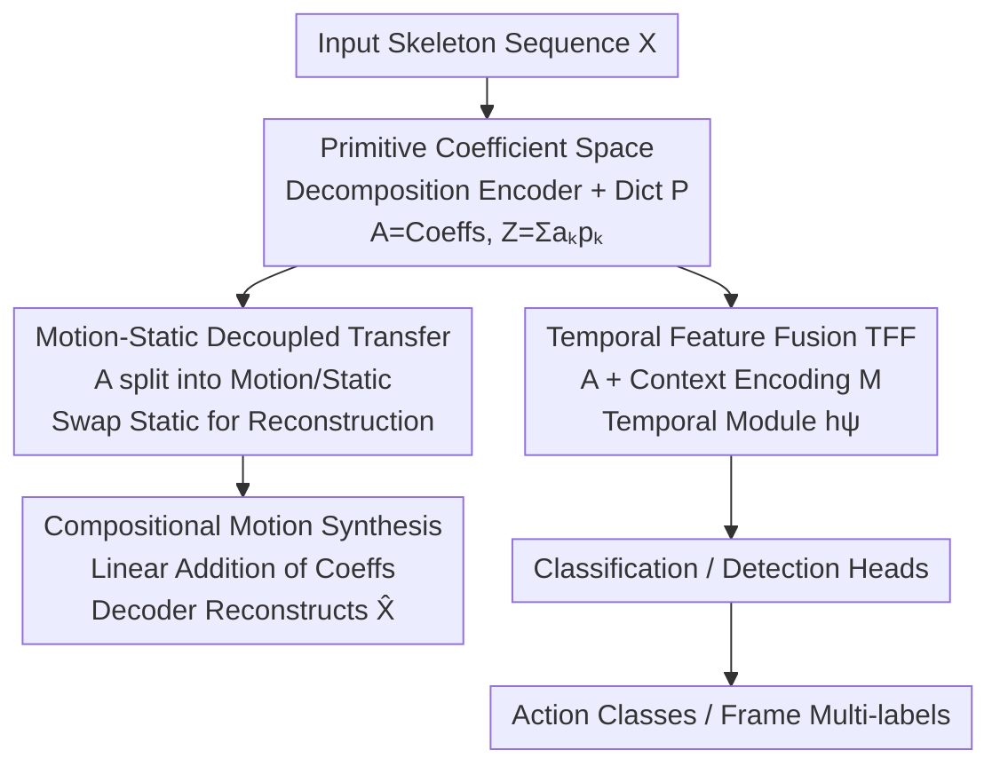

# PRISM: Learning a Shared Primitive Space for Transferable Skeleton Action Representation

**Conference**: CVPR 2026  
**Paper**: [CVF Open Access](https://openaccess.thecvf.com/content/CVPR2026/html/Yang_PRISM_Learning_a_Shared_Primitive_Space_for_Transferable_Skeleton_Action_CVPR_2026_paper.html)  
**Code**: [Project Page](https://walker1126.github.io/PRISM-project)  
**Area**: Human Understanding / Skeleton Action Recognition  
**Keywords**: Skeleton Actions, Motion Primitives, Transferable Representation, Motion-Static Decoupling, Long-tail Recognition

## TL;DR
PRISM represents skeleton actions as a "weighted combination of reusable atomic motion primitives" (primitive coefficient space). It first learns this physically interpretable, view-invariant structured representation using multi-view synthetic data through a generative objective, then sequentially transfers the same representation to classification and frame-wise detection via lightweight task heads. It consistently outperforms specialized models on long-tail, multi-label, and multi-view real-world datasets.

## Background & Motivation
**Background**: Skeleton action understanding has made significant progress in recent years due to its robustness to background, appearance, and lighting, as well as its benefits for privacy protection. However, generation, classification, and detection tasks are usually trained with separate models—generation relies on unconstrained latent spaces, classification learns global spatio-temporal embeddings, and detection stacks temporal modules on frame-level features, leading to fragmentation and lack of shared knowledge.

**Limitations of Prior Work**: Real-world scenarios involve long-tail category distributions, viewpoint variations, and compositional complex actions. Global embeddings learned by classification networks entangle action semantics with viewpoints and contexts. Latent spaces in generative models often lack physical interpretability and motion decomposition. These representations are difficult to transfer across tasks, leaving a gap between generation and perception.

**Key Challenge**: Existing models lack a **shared, structured, and transferable** motion representation. Even with limited joint training efforts (e.g., SymGCN sharing multi-branch backbones, UmURL using early fusion for multi-modality), their shared features still lack explicit motion decomposition or primitive structures, resulting in limited transferability.

**Goal**: To use a unified structured representation that supports both generation and perception while generalizing across long-tail, multi-view, and compositional actions.

**Key Insight**: The authors' key hypothesis is that complex actions can be expressed by combining a fixed set of atomic motion primitives. For example, "waving" and "throwing" share an arm-swinging primitive, while "sitting" and "tying shoelaces" share a leg-bending primitive. These primitives are shared across actions and viewpoints, naturally providing structure, compositionality, and physical interpretability. Rare actions can also be represented as meaningful combinations of common primitives, making the model less sensitive to data imbalance.

**Core Idea**: Encode actions as a trajectory in a "primitive coefficient space" (each frame is represented by a set of learned primitive coefficients). This space is first learned via a generative objective and then unidirectionally transferred to perception tasks, rather than forcing joint training.

## Method

### Overall Architecture
PRISM is built around a **shared structured primitive space**. The input skeleton sequence $\mathbf{X}\in\mathbb{R}^{T\times J\times C}$ ($C=2/3$ for 2D/3D) is projected by a decomposition encoder into primitive coefficients $\mathbf{A}\in\mathbb{R}^{T\times K}$. Combined with a primitive dictionary $\mathbf{P}\in\mathbb{R}^{K\times D}$, it yields an implicit motion representation $\mathbf{Z}_t=\sum_k a_{t,k}\mathbf{p}_k$. This space is shared by three types of heads: a generation head for reconstruction/synthesis, a classification head for action labels, and a detection head for frame-level multi-label prediction.

The process is trained in stages: In the **first stage**, the decomposition encoder and dictionary are trained on large-scale multi-view synthetic data using "motion reconstruction + physical regularization + cross-view consistency." In the **second stage**, the primitive encoder is frozen, and primitive coefficients are fused with contextual features to train classification/detection heads on real annotated data (perception modules can be jointly fine-tuned while keeping the primitive encoder fixed). This "generation-to-perception" unidirectional transfer allows tasks to share structure while retaining their respective supervisions.

### Key Designs

**1. Primitive Coefficient Space: Decomposing actions into weighted sums of reusable atomic motions**

To address the issue where global embeddings entangle semantics and viewpoints or fail on rare actions, PRISM does not model joint coordinates directly. Instead, it uses a decomposition encoder + MLP to project the sequence into a compact coefficient space $\mathbf{A}$, where the $k$-th dimension $a_{t,k}$ at frame $t$ represents the contribution of the $k$-th learned primitive. Primitives themselves are implicit basis vectors $\mathbf{p}_k\in\mathbb{R}^D$ in the feature space (rather than direct joint space), allowing the model to focus on high-level motion semantics. The per-frame representation is a weighted sum $\mathbf{Z}_t=\sum_{k=1}^K a_{t,k}\mathbf{p}_k$, from which the decoder $\hat{\mathbf{X}}=\text{Decoder}_\phi(\mathbf{Z})$ reconstructs the skeleton. Since many actions share primitive patterns (e.g., "sitting" and "falling" involve similar leg motions), this decomposition reduces redundancy and is more robust to the long-tail—rare actions can be expressed as combinations of common primitives.

**2. Motion-Static Decoupled Cross-view Transfer: Making motion coefficients invariant to viewpoint/identity**

To peel dynamic motion away from static attributes like body shape and viewpoint, the dictionary and coefficients are split into two segments: $\mathbf{A}_t=[\mathbf{A}^{\text{motion}}_t, \mathbf{A}^{\text{static}}_t]$, where $K=K_m+K_s$. The motion segment is used for downstream tasks, while the static segment absorbs viewpoint/identity information. The static segment is averaged over time and replicated to enforce temporal invariance. During training, **cross-view swap reconstruction** is used: given two sequences $\mathbf{X}^{(1)}, \mathbf{X}^{(2)}$ of the same action but different viewpoints/subjects, their static segments are swapped $\tilde{\mathbf{A}}^{(1)}=[\mathbf{A}^{(1)}_{\text{motion}};\mathbf{A}^{(2)}_{\text{static}}]$ for reconstruction. Minimizing $\mathcal{L}_{\text{swap}}=\|\mathbf{X}^{(1)}-\hat{\mathbf{X}}^{(1)}_{\text{swap}}\|_1+\|\mathbf{X}^{(2)}-\hat{\mathbf{X}}^{(2)}_{\text{swap}}\|_1$ forces the motion segment to encode only pure motion and the static segment to encode only viewpoint/identity, yielding viewpoint-invariant descriptors robust to scale and identity.

**3. Compositional Motion Synthesis: Linear additive primitives supporting multi-label scenarios**

Since each motion coefficient reflects the activation intensity of a primitive, linearly adding motion coefficients from different actions $\mathbf{A}_{\text{composite}}=\mathbf{A}^{(a)}_{\text{motion}}+\mathbf{A}^{(b)}_{\text{motion}}$ can synthesize hybrid/concurrent actions (corresponding to real-world multi-label scenarios) without retraining. This transforms "multi-label actions" from a complex modeling problem into a simple vector addition in the primitive space, explaining why PRISM is more stable on detection benchmarks with concurrent actions.

**4. Temporal Feature Fusion (TFF): Merging structured primitives with contextual details for perception**

While structured and viewpoint-invariant, primitive coefficients might lose short-term context critical for downstream tasks (joint interactions, fine-grained transitions). The authors introduce a general skeleton encoder $g_\phi$ to extract frame-level contextual features $\mathbf{M}=g_\phi(\mathbf{X})$. After spatial pooling to get $\tilde{\mathbf{M}}$, it is element-wise added to $\mathbf{A}$ (projected to the same dimension) as $\mathbf{F}=\mathbf{A}+\text{Pool}_{\text{spatial}}(\mathbf{M})$. Finally, a temporal module $\mathbf{H}=h_\psi(\mathbf{F})$ models long-range dependencies. Classification uses temporal average pooling on $\mathbf{H}$, while detection performs frame-wise multi-label prediction. Primitives provide structural priors while context supplements details, making them complementary for classification and detection.

### Loss & Training
The total objective for the decomposition phase is $\mathcal{L}_{\text{gen}}=\mathcal{L}_{\text{rec}}+\mathcal{L}_{\text{swap}}+\lambda_{\text{orth}}\mathcal{L}_{\text{orth}}+\lambda_{\text{sparse}}\mathcal{L}_{\text{sparse}}+\lambda_{\text{phys}}\mathcal{L}_{\text{phys}}$.  
$\mathcal{L}_{\text{rec}}=\|\mathbf{X}-\hat{\mathbf{X}}\|_1$ for reconstruction; $\mathcal{L}_{\text{phys}}=\mathcal{L}_{\text{bone}}+\mathcal{L}_{\text{joint}}+\mathcal{L}_{\text{acc}}$ penalizes physical violations like bone length inconsistency, joint limits, and excessive acceleration; $\mathcal{L}_{\text{orth}}=\|\mathbf{P}^\top\mathbf{P}-\mathbf{I}\|_F^2$ ensures dictionary diversity and decoupling; $\mathcal{L}_{\text{sparse}}=\lambda\|\mathbf{A}\|_1$ sparsifies coefficients. The perception phase uses cross-entropy for trimmed video classification and frame-wise binary cross-entropy for untrimmed multi-label detection.

## Key Experimental Results

### Main Results
Evaluated across Posetics, Toyota Smarthome Trimmed (TST), Toyota Smarthome Untrimmed (TSU), Charades, and NTU-RGB+D 120 datasets covering classification, detection, and generation (motion transfer).

| Task / Dataset | Metric | Prev. SOTA | Ours (PRISM) | Gain |
|--------------|------|-----------|-------|------|
| Posetics Class. | Top-1 (%) | 48.0 (ViA) | **52.3** | +4.3 |
| Posetics Class. | Top-5 (%) | 72.6 (ViA) | **76.5** | +3.9 |
| TST Class. | CS (%) | 67.0 (LLM-AR) | **70.7** | +3.7 |
| TST Class. | CV1 / CV2 (%) | 36.1 / 66.6 | **50.1 / 72.5** | +14.0 / +5.9 |
| TSU Detect. | CS / CV (%) | 36.8 / 23.1 (LAC) | **40.1 / 28.1** | +3.3 / +5.0 |
| Charades Detect. | mAP (%) | 25.6 (LAC) | **26.8** | +1.2 |

> CS/CV: Cross-subject / Cross-view protocols; CV1 and CV2 are two cross-view splits of TST. The most significant gains appear in the hardest cross-view settings (TST CV1 +14.0), confirming the viewpoint robustness brought by motion-static decoupling.

### Ablation Study
Evaluation of regularization terms on Mixamo cross-view motion transfer (Metric: MSE, lower is better).

| Configuration | Mixamo MSE | Description |
|------|-----------|------|
| PRISM Base | 1.35 | Reconstruction only, no regularization |
| + Orthogonal Loss $\mathcal{L}_{\text{orth}}$ | 0.83 | Significant improvement after decoupling (1.35 $\rightarrow$ 0.83) |
| + Sparse Loss $\mathcal{L}_{\text{sparse}}$ | 0.82 | Sparsified coefficients, slight improvement |
| + Physical Loss $\mathcal{L}_{\text{phys}}$ | 0.80 | Full model, outperforms LAC (0.82) and ViA (0.86) |

### Key Findings
- **Orthogonal loss is the most significant contributor**: Dropping from 1.35 to 0.83 indicates that decoupling the primitive dictionary and preventing collapse is key to decomposition quality.
- **Significant gains in rare classes**: In TST-CV2, gains for rare actions like "Usetablet" (+70.2) and "Cutbread" (+66.6) far exceed the average (+7.3); in TSU-CV, "Wipetable" increased by +26.6 (avg +5.0), verifying that primitives provide a more balanced representation for long-tail actions.
- **Compositional actions are more separable**: Actions involving combinations like "Walk + Telephone" are better separated because they can be expressed using sparse, reusable primitives.
- **3D Completeness**: Using only 3D skeletons with the classification head, PRISM outperforms previous two-stream methods on NTU-120 CS/CSet, proving the universality of primitive representations.

## Highlights & Insights
- **Learning Perception via Generative Objectives**: Instead of rely solely on labels, the model learns the primitive space through generation/reconstruction on multi-view synthetic data, then transfers it—avoiding supervision conflicts in joint training.
- **Motion-Static Swap Reconstruction as a Reusable Trick**: Swapping static segments of two sequences with the same action but different views forces viewpoint-invariant representations without needing explicit viewpoint labels.
- **Multi-label as Vector Addition**: Modeling concurrent actions as linear superpositions of primitive coefficients is both interpretable and computationally free.
- **Physical Regularization as Inductive Bias**: Injecting skeleton kinematics (bone length, joint limits, acceleration) directly into the loss makes reconstructed motions physically plausible and improves decomposition quality.

## Limitations & Future Work
- **Dependency on Synthetic Data and Backbones**: The first stage requires large-scale multi-view synthetic data (Mixamo), and the context encoder $g_\phi$ uses existing backbones; thus, the primitive space quality is bounded by synthetic data coverage.
- **Key Hyper-parameters $K$ and $K_m/K_s$**: The selection of primitive counts and split ratios are critical. While the paper refers to the appendix for sensitivity analysis, these may require tuning per dataset.
- **Binary Motion-Static Assumption**: Simplifying factors into temporal "motion" and "static" segments may be challenged by actions where style and motion are deeply coupled or where body shape deforms significantly.
- **Future Directions**: Extending the dictionary to an incremental open set or introducing text/semantic constraints to make primitives namable could further enhance zero-shot generalization for novel compositional actions.

## Related Work & Insights
- **vs LAC / MoDi / T2M-GPT (Motion Decomposition)**: These also perform motion decomposition (latent factorization, tokens). However, their factors aren't explicitly bound to physical structures or viewpoint invariance, making them primarily suitable for augmentation. PRISM's primitives are physically and view-decoupled, allowing direct use for perception (Mixamo MSE 0.80 vs LAC 0.82).
- **vs SymGCN / UmURL (Joint Training)**: These share backbones or use early fusion for multi-tasking, but the shared features lack explicit primitive structures. PRISM provides a single structured coefficient space that remains structural across tasks.
- **vs ViA / Self-supervised Cross-view**: ViA and others enhance robustness via contrastive learning. PRISM achieves viewpoint invariance through the lens of generation (swap reconstruction) and gains compositional capabilities as a result.

## Rating
- Novelty: ⭐⭐⭐⭐⭐ The combination of primitive coefficient space, perception-via-generation, and swap-reconstruction is a rare unified perspective in the skeleton domain.
- Experimental Thoroughness: ⭐⭐⭐⭐ Five real-world datasets and three types of tasks, though some hyper-parameter sensitivity is relegated to the appendix.
- Writing Quality: ⭐⭐⭐⭐ Clear motivation and methodology, though some formulae show minor noise, the logic is sound.
- Value: ⭐⭐⭐⭐ The unified representation for long-tail, multi-view, and composite actions has strong practical utility for real-world action understanding.

## Related Papers

- [\[CVPR 2026\] Beyond Binary Contrast: Modeling Continuous Skeleton Action Spaces with Transitional Anchors](beyond_binary_contrast_modeling_continuous_skeleton_action_spaces_with_transitio.md)
- [\[CVPR 2026\] RegFormer: Transferable Relational Grounding for Efficient Weakly-Supervised HOI Detection](regformer_transferable_relational_grounding_for_weakly-supervised_hoi_detection.md)
- [\[CVPR 2026\] ActAvatar: Temporally-Aware Precise Action Control for Talking Avatars](actavatar_temporally-aware_precise_action_control_for_talking_avatars.md)
- [\[CVPR 2026\] Superman: Unifying Skeleton and Vision for Human Motion Perception and Generation](superman_unifying_skeleton_and_vision_for_human_motion_perception_and_generation.md)
- [\[CVPR 2026\] RegFormer: Transferable Relational Grounding for Efficient Weakly-Supervised Human-Object Interaction Detection](regformer_transferable_relational_grounding_for_efficient_weakly-supervised_huma.md)

<!-- RELATED:END -->

<!-- RELATED:START -->

## Related Papers

- [\[CVPR 2026\] Beyond Binary Contrast: Modeling Continuous Skeleton Action Spaces with Transitional Anchors](beyond_binary_contrast_modeling_continuous_skeleton_action_spaces_with_transitio.md)
- [\[CVPR 2026\] ActAvatar: Temporally-Aware Precise Action Control for Talking Avatars](actavatar_temporally-aware_precise_action_control_for_talking_avatars.md)
- [\[CVPR 2026\] RegFormer: Transferable Relational Grounding for Efficient Weakly-Supervised HOI Detection](regformer_transferable_relational_grounding_for_weakly-supervised_hoi_detection.md)
- [\[CVPR 2026\] RegFormer: Transferable Relational Grounding for Efficient Weakly-Supervised Human-Object Interaction Detection](regformer_transferable_relational_grounding_for_efficient_weakly-supervised_huma.md)
- [\[CVPR 2026\] OMG-Bench: A New Challenging Benchmark for Skeleton-based Online Micro Hand Gesture Recognition](omg-bench_a_new_challenging_benchmark_for_skeleton-based_online_micro_hand_gestu.md)

<!-- RELATED:END -->
