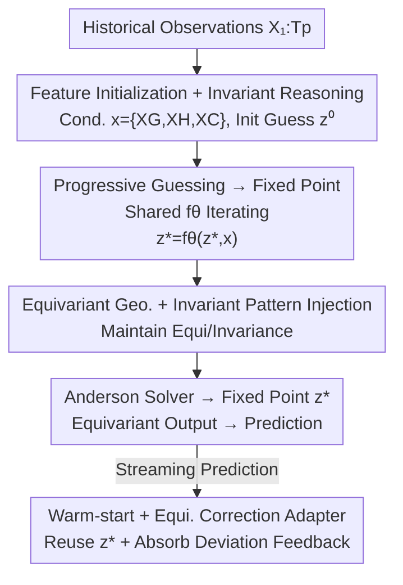

# Progressive Guessing to Fixed Point: Rethinking Human Motion Prediction with Deep Equilibrium Models

**Conference**: CVPR 2026  
**Paper**: [CVF Open Access](https://openaccess.thecvf.com/content/CVPR2026/html/Wei_Progressive_Guessing_to_Fixed_Point_Rethinking_Human_Motion_Prediction_with_CVPR_2026_paper.html)  
**Code**: None  
**Area**: Human Understanding / Human Motion Prediction  
**Keywords**: Motion prediction, Deep Equilibrium Models, Fixed point, Equivariant modeling, Streaming prediction

## TL;DR
MotionDEQ reformulates the cascaded framework of "multi-stage progressive guessing" in human motion prediction into a **fixed-point solving problem** within an implicit layer. This is equivalent to infinite refinement stages but requires only $O(1)$ training memory. By injecting Euclidean equivariance into this equilibrium process and utilizing the temporal coherence of adjacent predictions to reuse the previous fixed point as a "warm-start," it achieves SOTA accuracy (400ms@55.3mm on Human3.6M) with fewer than 300K parameters, saving more than 2x training memory compared to multi-stage competitors.

## Background & Motivation
**Background**: Human motion prediction (predicting future poses from past ones) commonly uses "coarse-to-fine" multi-stage refinement frameworks (e.g., PGBIG). A common preprocessing step is to replicate the last observed frame across the prediction horizon as an "initial guess," where the model only needs to make small adjustments to approach the target. Multi-stage frameworks stack multiple stages with non-shared parameters to produce better guesses progressively, using recursively smoothed GT for intermediate supervision.

**Limitations of Prior Work**: This cascaded design has three major issues: ① **Parameter inefficiency**: Each refinement stage has its own parameters, leading to memory redundancy and high overfitting risk, with computation/memory increasing linearly with depth. ② **Lack of stopping criteria**: The refinement depth $L$ is set empirically; too small leads to coarse predictions, while too large wastes computation. ③ **Inter-stage inconsistency**: Manually set intermediate targets favor smooth early stages and detailed later stages, and the final guess is **path-dependent** on intermediate trajectories.

**Key Challenge**: The essence of multi-stage refinement is "finite steps, independent parameters, path-dependency," whereas the ideal is "sufficiently deep, shared parameters, path-independency, with a convergence stopping criterion."

**Goal**: Without altering the equivariant/invariant feature learning design of EqMotion, transform the **refinement process itself** to make it both deep and memory-efficient.

**Key Insight**: The authors draw inspiration from Deep Equilibrium Models (DEQ) in implicit deep learning—viewing multi-stage refinement as an iterative application of a shared transformation $f_\theta$ until convergence. The output is defined as a fixed point $\mathbf{z}^*=f_\theta(\mathbf{z}^*,\mathbf{x})$, achieving "infinite layers of guessing" with constant training memory.

**Core Idea**: Replace finite refinement using independent parameters with a fixed-point solution of a single shared transformation. Integrate equivariance, sparse supervision, and streaming warm-start to make DEQ suitable for motion prediction.

## Method

### Overall Architecture
Given observations $\mathbf{X}_{1:T_p}$ for $T_p$ past frames (3D coordinates of $J$ joints), the goal is to predict $T_f$ future frames. MotionDEQ uses EqMotion as a backbone: first, it constructs "observation conditions" $\mathbf{x}=\{\mathbf{X}_G,\mathbf{X}_H,\mathbf{X}_C\}$ (geometric features, pattern features, joint interaction graph) through **Feature Initialization + Invariant Reasoning Modules**, with the last frame replicated as the initial guess $\mathbf{z}^{(0)}$. Then, it replaces the $L$ independent stages of EqMotion with **a single shared transformation iterating in an implicit layer**, solving for the fixed point $\mathbf{z}^*=(\mathbf{G}^*,\mathbf{H}^*)$ using a black-box solver (Anderson mixing). Finally, an equivariant output layer decodes $\mathbf{z}^*$ into predicted motion.

Directly applying DEQ would fail: DEQ is path-independent, making $\mathbf{z}^*$ insensitive to the initial guess, which risks diluting observation information; meanwhile, injecting observations might break equivariance. Thus, the authors add equivariant/invariant injection, sparse fixed-point supervision, and a warm-start + equivariant correction adapter for streaming.

### Key Designs

**1. Reformulating Progressive Guessing as a Fixed-Point Problem: $O(1)$ Memory via Infinite Layers**

To address parameter redundancy, lack of stopping criteria, and path-dependency, the geometric feature learning $\mathcal{F}^{(\ell)}_{\text{EGFL}}$ and pattern feature learning $\mathcal{F}^{(\ell)}_{\text{IPFL}}$ from EqMotion are changed from "stage-independent parameters" to "fully shared $\theta$." The refinement becomes an equilibrium process where the output is the fixed point $\mathbf{z}^*=f(\mathbf{z}^*,\mathbf{x}\mid\theta)$, solved as root finding $g(\mathbf{z},\mathbf{x}\mid\theta)=f-\mathbf{z}=0$. Forward passes solve for the fixed point, while backward passes use the Implicit Function Theorem: $\frac{\partial\mathcal{L}}{\partial\theta}=\frac{\partial\mathcal{L}}{\partial\mathbf{z}^*}\big(\mathbf{I}-\frac{\partial f}{\partial\mathbf{z}^*}\big)^{-1}\frac{\partial f}{\partial\theta}$. This **depends only on the final fixed point $\mathbf{z}^*$ and does not store intermediate states**, reducing training memory from $O(L)$ to $O(1)$, with depth automatically determined by a convergence residual $\epsilon$.

**2. Equivariant Geometry & Invariant Pattern Injection: Observation Input without Breaking Equivariance**

Injecting observations directly as conditions could destroy EqMotion's structural properties. The authors use $\mathcal{F}_{\text{DL}}$ to decompose the initial guess into equivariant geometric features $\mathbf{G}^{(0)}$ and invariant pattern features $\mathbf{H}^{(0)}$, then design structure-preserving injection layers. Equivariant Geometry Injection ($\mathcal{F}_{\text{EGI}}$) centers the mean before adding: $\mathbf{P}=\phi_{g_2}(\mathbf{g}+\mathbf{X}_G-\bar{\mathbf{g}}-\bar{\mathbf{X}}_G)+\bar{\mathbf{X}}_G$ (linear layer without bias), maintaining equivariance under translation/rotation $R,t$. Invariant Pattern Injection ($\mathcal{F}_{\text{IPI}}$) preserves invariance using an MLP with SiLU. Theorem 1 proves that initialization, DEQ updates, correction adapters, and fixed-point reuse all maintain equivariance/invariance.

**3. Sparse Fixed-Point Supervision + Truncated Phase Gradient: Stabilizing DEQ Training**

Unlike PGBIG’s intermediate supervision via smoothed GT, MotionDEQ uses **sparse fixed-point supervision**: it samples intermediate states from the solver trajectory $(\mathbf{z}^{(0)}, \dots, \mathbf{z}^*)$ to align with the GT. The loss is $\mathcal{L}_{total}=\|\mathcal{F}_{\text{EOL}}(\mathbf{z}^*)-\mathbf{Y}\|_2^2+\gamma\|\mathcal{F}_{\text{EOL}}(\mathbf{z}^{(\ell)})-\mathbf{Y}\|_2^2$ (no manual smoothing required, fitting the path-independent nature of DEQ). For the backward pass, since the inverse Jacobian is expensive, the authors use a 2-step Neumann series truncated phase gradient $\frac{\partial\mathcal{L}}{\partial\theta}\approx\frac{\partial\mathcal{L}}{\partial\mathbf{z}^*}\big(\mathbf{I}+\frac{\partial f}{\partial\mathbf{z}^*}\big)\frac{\partial f}{\partial\theta}$, balancing efficiency and accuracy.

**4. Streaming Warm-start + Equivariant Correction Adapter: Leveraging Temporal Coherence**

Real-world motion arrives as a stream. Fixed points of adjacent prediction rounds are observed to be highly coherent. MotionDEQ uses the previous round's fixed point as a **warm-start** for the next: $\mathbf{z}^{(0)}_{r+1}=\mathbf{z}^*_r$, significantly reducing iterations. Additionally, an **Equivariant Correction Adapter** ($\mathcal{F}_{\text{ECA}}$) is introduced: the deviation between the previous prediction and the new observation $\hat{\mathbf{Y}}_r-\mathbf{X}_{r+1}$ is decomposed via $\mathcal{F}_{\text{DL}}$ and injected, e.g., $\mathbf{H}=\mathbf{H}^*_{r+1}+\text{MLP}(\mathbf{H}')$, absorbing prediction error feedback without breaking equivariance.

### Loss & Training
Geometric dimension $C=72$ (96 for long-term), pattern dimension $D=64$. DEQ solver uses $T_{\text{train}}=20$ and $T_{\text{infer}}=30$ iterations, with early stopping at $\epsilon=1\text{e-}3$. Sparse regularization weight $\gamma=0.8$. Adam optimizer with initial lr $5\text{e-}4$ (decay 0.98 every 2 epochs), batch size 100, 100 epochs on a single RTX-3090.

## Key Experimental Results

### Main Results
Evaluated on Human3.6M, CMU-MoCap, and 3DPW using MPJPE (mm, lower is better).

| Dataset | Metric | PGBIG | EqMotion | MotionDEQ |
| :--- | :--- | :--- | :--- | :--- |
| Human3.6M | Avg MPJPE @80ms | 10.3 | 9.2 | **8.9** |
| Human3.6M | Avg MPJPE @400ms | 58.5 | 55.9 | **55.3** |
| CMU-MoCap | Avg MPJPE | 33.54 | 32.61 | **32.42** |
| 3DPW | Avg MPJPE | 70.40 | 67.07 | **65.95** |
| 3DPW | @200ms / @400ms | — | 32.05 / 63.41 | **30.63 / 61.38** |

> Compared to multi-stage competitors, MotionDEQ improves by 1.0%-3.4% over EqMotion and 5.8%-15.7% over PGBIG on Human3.6M. On the difficult 3DPW, it improves by 4.6% and 3.3% at 200/400ms respectively.

### Ablation Study
Ablation on network structure (Human3.6M, Avg MPJPE) validates the fixed-point reconstruction and equivariant injection.

| Configuration | Avg MPJPE | Note |
| :--- | :--- | :--- |
| DEQ with Eq.(2) | 71.4 | Direct observation injection fails equilibrium learning |
| w/o $\mathcal{F}_{\text{EGI}}$ | 38.1 | Significant drops without equivariant injection |
| w/o $\mathcal{F}_{\text{IPI}}$ | 35.3 | Significant drops without invariant injection |
| Ours (Full) | **32.1** | Both injections are essential |

### Key Findings
- **Fixed-point convergence ≈ Prediction accuracy**: More iterations lead to lower error until performance plateaus after ~10 iterations. Warm-starts accelerate convergence.
- **Memory efficiency**: For Human3.6M (batch 100), Training memory is 2.3× lower than EqMotion and 4.1× lower than a shared 8-stage baseline (ESL-8).
- **Parameter-accuracy trade-off**: Achieves 55.3mm @400ms with only 298K parameters, whereas EqMotion requires 635K.
- **ECA benefits large motion**: The Correction Adapter is more effective for high-displacement actions like "Walking" vs "Photo."
- **Smoothed GT is detrimental**: Replacing sparse supervision with PGBIG-style smoothed GT stabilizes training slightly but degrades final accuracy.

## Highlights & Insights
- **"Multi-stage refinement = Fixed-point" is a clean reformulation**: Unifying heuristic cascaded frameworks into implicit equilibrium layers solves parameter redundancy, depth selection, and path-dependency.
- **First combination of Equivariance × DEQ**: This work demonstrates that implicit networks are compatible with strong geometric priors.
- **Temporal coherence as computational leverage**: Warm-starting from the previous fixed point mitigates the "slow solving" reputation of DEQ.
- **Plug-and-play with existing equivariant architectures**: Since feature learning stays the same, this can theoretically be grafted onto other multi-stage equivariant predictors.

## Limitations & Future Work
- **Solver overhead**: Although warm-start helps, DEQ still requires iterative solving, which can be slower than pure feedforward in non-streaming settings.
- **Backbone dependency**: The injection design is currently coupled with EqMotion's invariant/equivariant structure.
- **Short-term focus**: Most results are within $\leq 400ms$. The stability of fixed points and warm-starts in ultra-long sequences requires more validation.
- **Future work**: Adaptive iteration counts based on movement difficulty or learning a better fixed-point initialization network.

## Related Work & Insights
- **vs PGBIG**: PGBIG uses unshared finite stages and recursive GT smoothing. MotionDEQ uses a shared transformation for infinite stages and sparse supervision, achieving lower MPJPE with significantly less memory.
- **vs EqMotion**: MotionDEQ reduces parameters from 635K to 298K while improving 3DPW performance, proving "infinite-layer shared refinement" is superior to "finite-layer independent refinement."
- **vs RNN variants**: Standard shared-parameter RNNs often suffer from instability or optimization difficulties as depth increases; DEQ's implicit approach reaches better accuracy at a similar scale.

## Rating
- Novelty: ⭐⭐⭐⭐⭐ 
- Experimental Thoroughness: ⭐⭐⭐⭐ 
- Writing Quality: ⭐⭐⭐⭐ 
- Value: ⭐⭐⭐⭐ 

<!-- RELATED:START -->

## Related Papers

- [\[CVPR 2026\] Gaussian-Mixture Latent Flow for Stochastic 3D Human Motion Prediction](gaussian-mixture_latent_flow_for_stochastic_3d_human_motion_prediction.md)
- [\[CVPR 2026\] Towards Decompositional Human Motion Generation with Energy-Based Diffusion Models](towards_decompositional_human_motion_generation_with_energy-based_diffusion_mode.md)
- [\[CVPR 2026\] Causal Motion Diffusion Models for Autoregressive Motion Generation](causal_motion_diffusion_models_for_autoregressive_motion_generation.md)
- [\[AAAI 2026\] mmPred: Radar-based Human Motion Prediction in the Dark](../../AAAI2026/human_understanding/mmpred_radar-based_human_motion_prediction_in_the_dark.md)
- [\[ICLR 2026\] Sparkle: A Robust and Versatile Representation for Point Cloud-based Human Motion Capture](../../ICLR2026/human_understanding/sparkle_a_robust_and_versatile_representation_for_point_cloud-based_human_motion.md)

<!-- RELATED:END -->

## Related Papers

- [\[CVPR 2026\] Towards Decompositional Human Motion Generation with Energy-Based Diffusion Models](towards_decompositional_human_motion_generation_with_energy-based_diffusion_mode.md)
- [\[CVPR 2026\] Gaussian-Mixture Latent Flow for Stochastic 3D Human Motion Prediction](gaussian-mixture_latent_flow_for_stochastic_3d_human_motion_prediction.md)
- [\[AAAI 2026\] mmPred: Radar-based Human Motion Prediction in the Dark](../../AAAI2026/human_understanding/mmpred_radar-based_human_motion_prediction_in_the_dark.md)
- [\[CVPR 2026\] Next-Scale Autoregressive Models for Text-to-Motion Generation](next-scale_autoregressive_models_for_text-to-motion_generation.md)
- [\[CVPR 2026\] Anatomical Domain Shifts: Test-time Heterogeneous Adaptation for 3D Human Pose Prediction](anatomical_domain_shifts_test-time_heterogeneous_adaptation_for_3d_human_pose_pr.md)

<!-- RELATED:END -->
