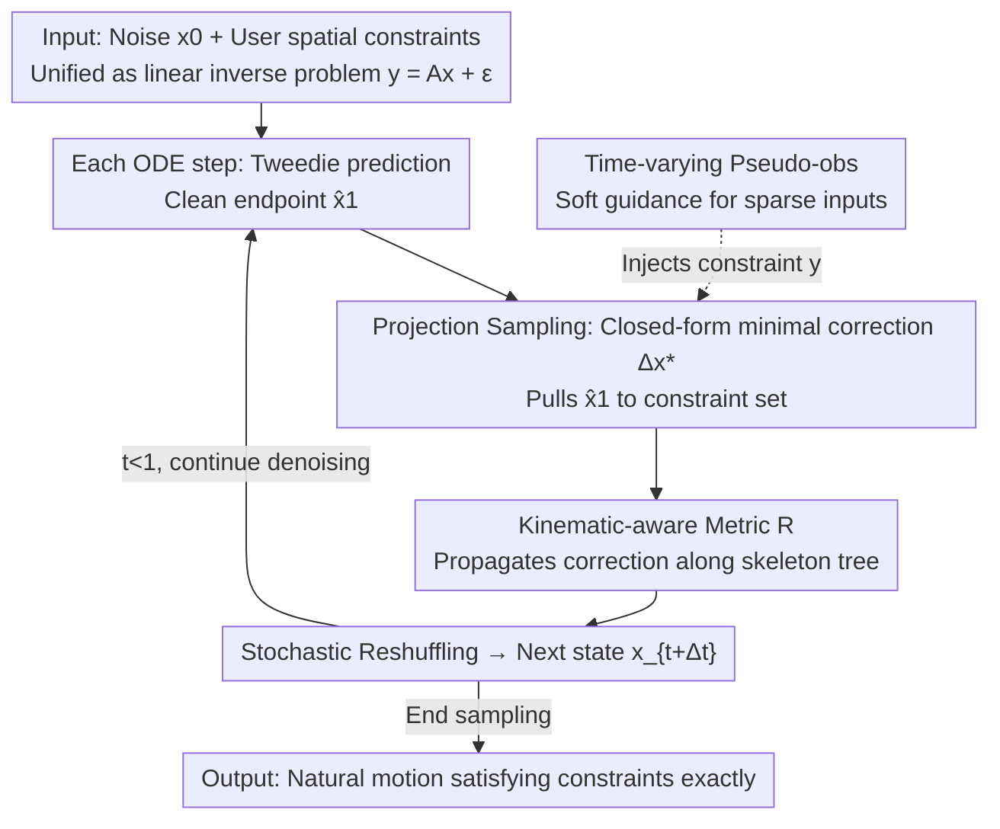

# ProjFlow: Projection Sampling with Flow Matching for Zero-Shot Exact Spatial Motion Control

**Conference**: CVPR 2026  
**Paper**: [CVF Open Access](https://openaccess.thecvf.com/content/CVPR2026/html/Watanabe_ProjFlow_Projection_Sampling_with_Flow_Matching_for_Zero_Shot_Exact_Spatial_CVPR_20_26_paper.html)  
**Code**: Not provided (No public link in the paper) ⚠️ Subject to original text  
**Area**: Human Motion Generation / 3D Vision / Diffusion & Flow Matching  
**Keywords**: Flow Matching, Spatial Motion Control, Linear Inverse Problems, Projection Sampling, Kinematic Metric

## TL;DR
The authors unify a broad category of human motion control tasks (trajectory following, 2D→3D lifting, motion completion, cyclic actions, etc.) into linear inverse problems. They propose ProjFlow—a training-free flow matching sampler that utilizes closed-form projections at each denoising step to pull "clean motion estimates" onto the constraint set. By incorporating a "kinematic-aware metric" that encodes skeleton topology, corrections are propagated coordinately along the bones, achieving **exact** satisfaction of hard constraints under zero-shot conditions without inner-loop optimization while maintaining motion naturalness.

## Background & Motivation
**Background**: Spatial motion control requires generated full-body motions to strictly adhere to user-provided spatial cues (e.g., specific joint trajectories, target poses, or start/end frames). Current mainstream methods drive pre-trained diffusion or flow matching motion priors to satisfy these constraints.

**Limitations of Prior Work**: Existing methods generally follow two paths, both with significant drawbacks: either training specialized conditional branches for each task (ControlNet-style), or running slow inner-loop optimizations during inference. The former requires task-specific retraining and has poor transferability, while the latter lacks interactivity and is prone to local minima. Most fundamentally, both treat constraints as **soft targets** (differentiable penalties/guidance terms), which cannot guarantee exact satisfaction, leaving residual violations.

**Key Challenge**: Users often constrain only a small part of the body (e.g., the trajectory of a single hand or foot), making the problem under-determined—many different motions could satisfy sparse constraints. The goal is to simultaneously achieve "exact satisfaction of hard constraints" and "maintenance of naturalness under the motion prior," which the soft-constraint paradigm fails to do.

**Goal**: To develop a sampler that concurrently achieves (i) exact enforcement of equality constraints, (ii) zero-shot performance without task-specific retraining, and (iii) no inner-loop optimization during inference, all while preserving the pre-trained motion prior.

**Key Insight**: The authors observe that tasks like trajectory following, keyframe control, camera/root path control, and partial body editing can be formulated as **linear inverse problems** $y = Ax + \epsilon$. Linear inverse problems already have mature zero-shot projection solutions in image generation (e.g., null-space projection in DDNM). This logic can be ported to flow matching for human motion.

**Core Idea**: At each denoising step, the predicted clean motion is **projected** onto the set satisfying the constraints. The "minimal correction" for this projection is measured under a newly designed **kinematic-aware metric** reflecting skeleton topology. Subsequently, a stochastic reshuffling step in flow matching incorporates the corrected endpoint back into the sampled trajectory, ensuring exact constraint satisfaction without destroying the motion prior.

## Method

### Overall Architecture
ProjFlow does not modify training or add branches; it only modifies the sampling process. All user constraints are unified into a linear observation model $y=Ax+\epsilon$ (where hard constraints correspond to the limit of observation noise covariance $\Sigma\to 0$). Sampling is based on Rectified Flow. At each ODE step $t$, three actions are performed: ① The Tweedie formula estimates the clean endpoint $\hat{x}_1$ from the current state $x_t$ and predicted velocity $v_\theta$; ② A **minimal correction** $\Delta x^\star_1$ is computed to project $\hat{x}_1$ onto the constraint set under the kinematic-aware metric $R$ (via a closed-form solution); ③ FlowDPS-style stochastic reshuffling combines the corrected endpoint $\hat{x}^\star_1$ with the initial value mixed with small noise to form the next state $x_{t+\Delta t}$. This loops until $t=1$. For sparse inputs (e.g., long gaps between keyframes), "time-varying pseudo-observations" that decay during sampling are introduced to provide auxiliary guidance.

### Key Designs

**1. Unified Linear Inverse Problem Modeling: Converging Heterogeneous Spatial Controls**

Existing methods require unique conditional mechanisms for each constraint type. ProjFlow unifies trajectory following, keyframes, root paths, and partial body editing into $y = Ax + \epsilon, \epsilon\sim\mathcal{N}(0,\Sigma)$, where $x\in\mathbb{R}^d$ ($d=3JN$, with $J$ joints, $N$ frames, and absolute world coordinates) is the motion to be generated, $A$ is a known linear operator, and $y$ is the user observation. Hard constraints are recovered as the limit where the variance of corresponding rows in $\Sigma$ approaches zero. This reduces "satisfying constraints" to a standard linear inverse problem, enabling the use of closed-form projections without task-specific branches.

**2. Projection Sampling + Flow Reshuffling: Step-wise Closed-form Correction**

To solve the issue of soft constraints failing to guarantee exactness, ProjFlow solves a convex quadratic problem at each denoising step for the minimal correction:

$$\min_{\Delta x_1}\ \tfrac{1}{2}\lVert\Delta x_1\rVert_R^2 + \tfrac{1}{2}\lVert y - A(\hat{x}_1+\Delta x_1)\rVert_{\Sigma^{-1}}^2$$

This yields a unique closed-form solution $\Delta x^\star_1 = R^{-1}A^\top(AR^{-1}A^\top+\Sigma)^{-1}(y-A\hat{x}_1)$. Adding this to the Tweedie estimate $\hat{x}_1 = x_t+(1-t)v_\theta(x_t,t)$ gives the corrected endpoint $\hat{x}^\star_1$. As $\Sigma\to 0$, the projection forces the residual to zero, **satisfying hard constraints to numerical precision**. Subsequent FlowDPS-style stochastic reshuffling $\tilde{x}_0=\sqrt{1-\eta_t}\,x_0+\sqrt{\eta_t}\,\epsilon$ and $x_{t+\Delta t}=\alpha_{t+\Delta t}\hat{x}^\star_1+\sigma_{t+\Delta t}\tilde{x}_0$ integrates the results back into the sampling path—mixing in noise $\eta_t$ keeps the state on the learned motion manifold (ablations show FID jumps from 0.097 to 3.429 if removed). This process requires no iterative inner-loop optimization.

**3. Kinematic-aware Metric: Coordinated Diffusion of Corrections**

The "size" of the correction is determined by the metric $R$. If an Euclidean metric ($R=I$) is used, all coordinates are weighted equally; small changes in a few joints might be "small" in $\ell_2$ but could break kinematic coherence, causing isolated jitters (FID worsens from 0.097 to 1.152). ProjFlow redefines "small" as "coherent along the skeleton tree":

$$R = w_{\text{kin}}(I_3\otimes I_N\otimes L_{\text{kin}}) + \lambda I_d$$

where $L_{\text{kin}}=D_{\text{kin}}-A_{\text{kin}}$ is the Graph Laplacian of the skeleton topology ($A_{\text{kin}}$ is the joint adjacency matrix). Intuitively, inconsistencies between adjacent joints are heavily penalized by $w_{\text{kin}}L_{\text{kin}}$, while non-connected joints are decoupled, allowing corrections to propagate coordinately along the kinematic chain. The $\lambda I$ term adds a baseline $\ell_2$ regularization for directions like frame-wise global translation and ensures $R$ is strictly positive definite.

**4. Time-varying Pseudo-observations: "Dense Guidance then Gradual Fading"**

Hard observations are extremely sparse in motion completion tasks. ProjFlow generates "soft" pseudo-observations $y_{\text{src}}$ via joint-wise linear interpolation. Reliability is managed by two mechanisms: **Dynamic Masking**—pseudo-observations are active only within a temporal neighborhood of hard constraints, with the radius $\ell(t)=(1-t)\ell_{\max}+t\ell_{\min}$ shrinking linearly such that only hard constraints remain as $t\to 1$; **Adaptive Variance**—non-zero variances $\sigma_i^2(t)$ are assigned based on a global decay term $\tau(t)$ and local curvature penalty $s_n(\hat{x}_1)=\lVert(\hat{x}_1)_{n+1}-2(\hat{x}_1)_n+(\hat{x}_1)_{n-1}\rVert_R$ (trust decreases at later steps or higher curvature). Hard observations always maintain zero variance (exact equality).

### Loss & Training
ProjFlow **introduces no training**. It reuses a pre-trained Rectified Flow motion model (ACMDM-S-PS22 is used as the base in experiments). The base model is trained with the standard conditional flow matching loss $\mathcal{L}_{\text{FM}}=\mathbb{E}\lVert v_\theta(x_t,t)-(x_1-x_0)\rVert_2^2$ (where $x_t=(1-t)x_0+t x_1$). All spatial control capabilities stem from the projection, metric, and pseudo-observations in the sampling phase.

## Key Experimental Results

### Main Results
Using HumanML3D (14,646 text-annotated motions) and ACMDM-S-PS22 as the base model, compared against OmniControl/MaskControl/CtrlNet (supervised) and DNO (zero-shot optimization). Control precision is measured by Traj./Loc./Avg. error; naturalness by FID; physical plausibility by Foot Skating Ratio.

| Setting | Method | Zero-shot | FID↓ | Avg. err.↓ | Foot Skating↓ |
|------|------|--------|------|-----------|---------------|
| Pelvis Control | OmniControl (Supervised) | ✗ | 0.081 | 0.0338 | 0.0547 |
| Pelvis Control | MaskControl (Supervised) | ✗ | **0.066** | 0.0093 | 0.0543 |
| Pelvis Control | DNO (Zero-shot opt.) | ✓ | 0.151 | 0.0089 | 0.0610 |
| Pelvis Control | **Ours** | ✓ | 0.107 | **0.0000** | 0.0629 |
| All-joint Mean | MaskControl (Supervised) | ✗ | **0.095** | 0.0065 | 0.0545 |
| All-joint Mean | DNO (Zero-shot opt.) | ✓ | 0.147 | 0.0121 | 0.0600 |
| All-joint Mean | **Ours** | ✓ | 0.097 | **0.0000** | 0.0603 |

ProjFlow is the only zero-shot method to reduce all trajectory/keyframe/average errors to **0.0000** (exact satisfaction). Its FID outperforms the zero-shot DNO (0.097 vs 0.147) and stays within the same naturalness range as supervised ControlNet variants (0.067–0.095) without requiring training. In 2D→3D lifting, ProjFlow achieves FID 0.349 (Average protocol), better than Sketch2Anim (0.525), with zero re-projection error (MPJPE-2D=0.000).

### Ablation Study
Removing components in a motion completion task (all variants still satisfy constraints exactly; differences lie in naturalness):

| Variant | FID↓ | Diversity→ | Description |
|------|------|-----------|------|
| **Ours (Full)** | **0.097** | 10.651 | Complete model |
| Euclidean Metric $R=I$ | 1.152 | 10.107 | Corrections don't propagate along skeleton; naturalness collapses |
| No Reshuffling $\eta_t=0$ | 3.429 | 9.307 | State leaves motion manifold; quality/diversity drops |
| Plain Masking (No pseudo-obs) | 0.880 | 10.187 | Insufficient guidance for sparse completion |

### Key Findings
- All three components are critical for "maintaining naturalness" rather than "satisfying constraints"—exact satisfaction is guaranteed by the projection mechanism (0.0000 error across all variants).
- **Stochastic reshuffling** is the most significant contributor: without it, FID spikes from 0.097 to 3.429, showing that pulling the state back to the learned motion manifold is vital.
- The kinematic-aware metric is the core adaptation for applying "zero-shot projection" to human motion; human naturalness degrades ten-fold when using an Euclidean metric.

## Highlights & Insights
- Successfully ports null-space/projection concepts from image inverse problems (e.g., DDNM) to flow matching for human motion, proving it reduces to DDNM in Euclidean/noiseless limits.
- Uses the Graph Laplacian to embed skeleton topology into the metric matrix $R$, allowing "minimal corrections" to respect the kinematic chain automatically—a trick applicable to any graph-structured inverse problem.
- Decouples "exact satisfaction" from "naturalness": projection ensures the former, while reshuffling, the metric, and pseudo-observations ensure the latter.

## Limitations & Future Work
- **Ours** can only handle constraints that can be formulated as linear inverse problems; it does not natively support non-linear constraints (e.g., "joint must stay above a certain plane"). Extending closed-form projection to non-linear scenarios remains an open challenge.
- Requires known camera parameters in 2D→3D lifting; calibration errors will directly enter the hard constraints. Several hyperparameters for pseudo-observations ($\ell_{\max}, \ell_{\min}, \tau_{\min}$) require data-specific tuning.
- Future work could consider iterative variants projecting onto convex sets (e.g., half-spaces) or local linearization of $A$ for sequential linear projections to handle inequalities.

## Related Work & Insights
- **vs. ControlNet Variants**: ProjFlow is training-free and exact, whereas supervised variants have residual errors (0.006–0.04). ProjFlow matches their naturalness without the overhead.
- **vs. Zero-shot Opt (DNO)**: DNO optimizes initial noise at inference, which is slow and inexact (Avg. err. 0.0089). ProjFlow is closed-form, faster, and achieves 0.0000 error.
- **vs. DDNM**: ProjFlow generalizes DDNM by adding structural metrics, noisy observations, and time-varying operators for structured human motion data.

## Rating
- Novelty: ⭐⭐⭐⭐ Paradigm migration + kinematic metric are solid innovations.
- Experimental Thoroughness: ⭐⭐⭐⭐ Covers two task types with full ablations.
- Writing Quality: ⭐⭐⭐⭐⭐ Problem unification and derivations are very clear.
- Value: ⭐⭐⭐⭐ Provides a practical, plug-and-play, training-free solution for exact motion editing.

<!-- RELATED:START -->

## Related Papers

- [\[CVPR 2026\] FMPose3D: monocular 3D pose estimation via flow matching](fmpose3d_monocular_3d_pose_estimation_via_flow_matching.md)
- [\[CVPR 2026\] Humanoid-GPT: Scaling Data and Structure for Zero-Shot Motion Tracking](humanoid-gpt_scaling_data_and_structure_for_zero-shot_motion_tracking.md)
- [\[CVPR 2026\] Unified Number-Free Text-to-Motion Generation Via Flow Matching](unified_number-free_text-to-motion_generation_via_flow_matching.md)
- [\[CVPR 2026\] MotionHiFlow: Text-to-Motion via Hierarchical Flow Matching](motionhiflow_text-to-motion_via_hierarchical_flow_matching.md)
- [\[CVPR 2026\] HandDreamer: Zero-Shot Text to 3D Hand Model Generation](handdreamer_zero_shot_text_to_3d_hand_model_generation.md)

<!-- RELATED:END -->
