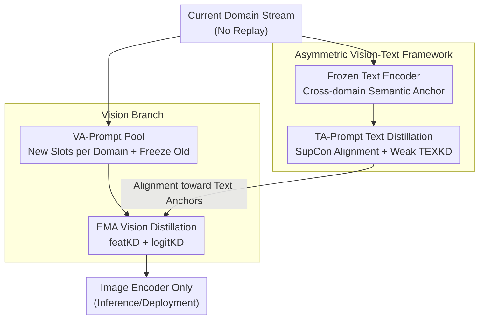

# Prompt-Anchored Vision–Text Distillation for Lifelong Person Re-identification

**Conference**: CVPR 2026  
**arXiv**: [2605.05027](https://arxiv.org/abs/2605.05027)  
**Code**: https://github.com/zu-zi/PAD (Available)  
**Area**: Human Understanding / Person Re-identification / Continual Learning  
**Keywords**: Lifelong Person Re-identification, Exemplar-free, Vision-Text Distillation, Prompt Learning, CLIP

## TL;DR
PAD treats the frozen CLIP text encoder as a cross-domain invariant "semantic anchor." By employing an **asymmetric vision-text distillation**—weak text-side distillation to ensure semantic stability and strong vision-side EMA distillation to maintain plasticity—it simultaneously suppresses catastrophic forgetting and semantic drift in exemplar-free lifelong person Re-ID. It achieves an average mAP of 70.7 on seen domains and 78.6 on unseen domains, significantly outperforming previous SOTA methods.

## Background & Motivation
**Background**: Lifelong Person Re-identification (LReID) aims to train a model on a sequentially arriving stream of domain data to continuously absorb new identities without forgetting old ones. Real-world surveillance systems constantly encounter data from new cameras, scenes, and time periods, making retraining from scratch impractical; thus, incremental learning is essential.

**Limitations of Prior Work**: To avoid privacy and storage issues associated with raw images, mainstream "exemplar-free" methods rely on saving class prototypes or distribution statistics for **vision-only** knowledge distillation (e.g., LSTKC, DKP) or parameter regularization. However, distillation solely in vision space has a fundamental flaw: when domain distributions shift, the feature space remains locally discriminative but gradually deviates from identity semantics—a phenomenon known as **semantic drift**, where originally separable identities become confused. Person ReID is particularly sensitive to this due to large intra-class variance (lighting, viewpoint, occlusion) and small inter-class variance (fine-grained details).

**Key Challenge**: The trade-off between stability (retaining old domains) and plasticity (learning new domains). In pure vision distillation, ensuring stability requires strong constraints on the backbone, which suppresses adaptation to new domains; conversely, adapting to new domains often overwrites old semantics. These two goals conflict within the same vision space.

**Key Insight**: The authors noticed an overlooked resource—the **frozen text encoder in pre-trained Vision-Language Models (CLIP) serves as a cross-domain invariant and stable semantic coordinate system**. Textual descriptions like "a person wearing a red jacket" do not change with pose or lighting. By anchoring visual representations to this fixed text space, the tasks of "preserving stability" and "ensuring plasticity" can be **decoupled into two modalities**, avoiding a hard trade-off within a single vision space.

**Core Idea**: An **asymmetric vision-text framework** is proposed, where the text side handles semantic anchoring (weak distillation to avoid over-constraint) and the vision side handles domain adaptation (strong EMA distillation + growable prompt pool). The frozen text space acts as a "global reference" throughout the lifelong sequence rather than the dominant learning signal.

## Method

### Overall Architecture
PAD (Prompt-Anchored vision–text Distillation) consists of a **text branch** and a **vision branch** with asymmetric roles: the text branch ensures cross-domain semantic stability, while the vision branch maintains plasticity for new domains. During training, the two branches collaborate; **during inference, only the image encoder is retained** (the text branch provides semantic guidance only during training), ensuring low deployment overhead.

Workflow: The frozen CLIP text encoder defines a fixed semantic coordinate system. Learnable **TA-Prompts** (Text-Anchor Prompts) generate class-level text embeddings for each identity within this system. A symmetric image-text SupCon loss pulls visual features toward these text anchors. During domain transitions, a **weak text distillation (TEXKD)** is added using the frozen text teacher from the previous domain to prevent TA-Prompt scores from drifting. On the vision side, the image encoder only unfreezes the last few layers, the classification head, and a growable **VA-Prompt** pool. An **EMA momentum teacher** provides **strong vision distillation (VISKD)** (feature-level MSE + text-anchored logit-level KL) to suppress fine-grained drift. When a new domain arrives, VA-Prompt allocates new slots and freezes old ones, achieving a "grow-without-forgetting" prompt mechanism.

The overall training objective is:
$$\mathcal{L}_{\mathrm{overall}}=\mathcal{L}_{\mathrm{supcon}}+\mathcal{L}_{\mathrm{ID}}+\mathcal{L}_{\mathrm{triplet}}+\mathcal{L}_{\mathrm{KD}},$$
where $\mathcal{L}_{\mathrm{KD}}=\lambda_{\text{text}}\mathcal{L}_{\text{TEXKD}}+\lambda_{\text{feat}}\mathcal{L}_{\text{featKD}}+\lambda_{\text{logit}}\mathcal{L}_{\text{logitKD}}$ aggregates all distillation terms.

### Key Designs

**1. Asymmetric Vision-Text Framework: Decoupling Stability and Plasticity**

This is the core philosophy, directly addressing the conflict in single-modality vision space. PAD assigns different **divisions of labor**: the frozen CLIP text encoder provides an invariant semantic coordinate system as a global reference, while the vision branch remains adaptive. Crucially, the text side applies **weak** constraints (acting as an anchor rather than the primary signal), while the vision side applies **strong** distillation (since vision features are fine-grained and sensitive to drift). Unlike prior works that use pure vision distillation or vision-only prompt adaptation, the text space is naturally stable and requires minimal regularization. Stability is gained almost "for free," allowing the vision side to focus on plasticity.

**2. TA-Prompt (Text Side): Implicit SupCon Alignment + Weak Explicit Distillation**

The text side performs **dual-layer semantic alignment**: implicit alignment and explicit distillation, with the latter intentionally kept weak. For implicit alignment, visual features $\mathbf{v}_i$ and class-specific text features $\mathbf{t}_i$ (generated by TA-Prompts and the frozen encoder) are optimized using a symmetric supervised contrastive loss:
$$\mathcal{L}_{\mathrm{supcon}}=\mathrm{SupCon}(\mathbf{v}\!\to\!\mathbf{t})+\mathrm{SupCon}(\mathbf{t}\!\to\!\mathbf{v}).$$
Since the text encoder is frozen, this aligns all domains to the same cross-modal space, pulling visual clusters toward shared text anchors. Experiments show that this implicit alignment alone is a powerful domain-invariant regularizer.

The explicit TEXKD is a **lightweight patch**: for each domain, the previous checkpoint's text branch acts as a frozen teacher. A global text bank $t^{\mathrm{tea}}$ is used to calculate temperature-scaled softmax cosine similarities. KL divergence then aligns the student TA-Prompt's distribution with the teacher's. Notably, **EMA is not used for the text teacher** because the frozen encoder causes an EMA teacher to collapse into the student too quickly. The weight $\lambda_{\text{text}}$ is kept small (0.5) to avoid over-constraining new domain adaptation.

**3. VA-Prompt Pool + Selective Unfreezing: Growable Plasticity**

Vision-side plasticity relies on VA-Prompts, inspired by DualPrompt: **G-Prompt** (global) and **E-Prompt** (expert pool). For each layer, Top-$k$ relevant experts are selected based on query similarity. During domain transitions, new slots are activated and old ones are frozen, preventing inter-domain interference. The implementation uses 6 general + 6 expert tokens per layer, a pool size of 36, and Top-K=4.

Selective unfreezing: Before the lifelong sequence, the CLIP backbone is adapted to ReID in the first domain. In subsequent domains, only the **last few transformer blocks and the classification head** are unfrozen, where forgetting and transfer are most concentrated. This strikes a balance between prompt-based methods and traditional fine-tuning.

**4. EMA Vision Distillation (VISKD): Dual Anchoring for Feature and Logit Fine-tuning**

Since visual representations are fine-grained and sensitive, **strong** distillation is applied. An EMA momentum teacher updates as $\theta_{tea}\leftarrow\alpha\theta_{tea}+(1-\alpha)\theta_{stu}$ ($\alpha=0.997$). Three layers of visual representations $\{v_{11},v_{12},v_{proj}\}$ are aligned via MSE:
$$\mathcal{L}_{\mathrm{featKD}}=\frac{1}{3}\sum_{i=1}^{3}\|v_i^{stu}-v_i^{tea}\|_2^2.$$
Simultaneously, logit-level distillation is performed using **domain-specific text banks** as anchors to prevent the feature space from collapsing or drifting.

### Loss & Training
- **Total Loss**: $\mathcal{L}_{\mathrm{overall}}=\mathcal{L}_{\mathrm{supcon}}+\mathcal{L}_{\mathrm{ID}}+\mathcal{L}_{\mathrm{triplet}}+\mathcal{L}_{\mathrm{KD}}$.
- **Distillation Weights**: $\lambda_{\text{text}}=0.5$ (weak text constraint); $\lambda_{\text{feat}}=\lambda_{\text{logit}}=0.5$ (strong vision constraint).
- **Backbone**: CLIP ViT-B/16, image size $256\times128$, Adam optimizer, batch size 64, backbone learning rate $5\times10^{-6}$.
- **Protocol**: 5 seen domains trained sequentially without replay.

## Key Experimental Results

### Main Results

Final stage results for AKA-order1 (Market→CUHK-SYSU→Duke→MSMT17→CUHK03):

| Method | Source | Seen mAP | Seen R1 | Unseen mAP | Unseen R1 |
|------|------|-----------|----------|-----------|----------|
| LSTKC | AAAI'24 | 50.0 | 63.1 | 57.0 | 49.9 |
| DKP | CVPR'24 | 51.8 | 64.1 | 59.2 | 51.6 |
| PAEMA | IJCV'24 | 61.8 | 72.7 | 70.3 | 63.2 |
| DAFC | Arxiv'25 | 65.6 | 75.9 | — | — |
| **PAD (Ours)** | — | **70.7** | **81.0** | **78.6** | **71.4** |

PAD achieves the best average performance in both seen and unseen domains across different sequences. On the challenging MSMT17 dataset, PAD significantly leads with 46.9 mAP compared to DAFC's 27.1.

### Ablation Study

Impact of components starting from a full-finetuning CLIP-ReID baseline (Seen average):

| ID | Freeze | VA | TEXKD | VISKD | Seen mAP | Seen R1 | Notes |
|----|--------|----|----|------|----------|---------|------|
| S0 | | | | | 66.2 | 78.5 | Baseline; low stability |
| S1 | ✓ | | | | 66.8 | 78.4 | Freeze only; low adaptation |
| S2 | ✓ | ✓ | | | 68.2 | 80.1 | Plasticity restored with VA-Prompt |
| S3 | ✓ | ✓ | ✓ | | 68.4 | 80.4 | TEXKD stabilizes semantics |
| S4 | ✓ | ✓ | | ✓ | 69.9 | 80.4 | VISKD provides major gain |
| S5 | ✓ | ✓ | ✓ | ✓ | **70.7** | **81.0** | Optimal balance |

### Key Findings
- **VISKD provides a larger contribution than TEXKD**: S2→S4 (+1.7 mAP) vs S2→S3 (+0.2 mAP). This validates the asymmetric design where the text side only needs weak anchoring.
- **TEXKD must remain weak**: Stronger text distillation actually dropped performance (70.7 → 69.5) by over-restricting prompt adaptation.
- **Semantic drift is suppressed**: Use of the frozen text anchor improved alignment with global prototypes by ~0.09 across domains.
- **Minimal Overhead**: Peak storage for prompts is only 13.71M parameters (approx. 26.1 MiB in FP16), with a tiny trainable ratio (1–1.6% for most domains).

## Highlights & Insights
- **Frozen text space as a global anchor**: PAD cleverly outsources the stability task to the text modality. Using a pre-trained invariant coordinate system allows the vision modality to focus on domain-specific learning.
- **Asymmetric Weighting logic**: The principle of "constrain less where it is naturally stable" is highly effective. Weak text constraints prevent over-regularization while strong vision distillation handles sensitive domain drift.
- **EMA Insight**: The decision not to use EMA for the text teacher due to rapid collapse into the student is a nuanced engineering observation.
- **Operational efficiency**: Zero additional inference overhead makes this method highly practical for deployment.

## Limitations & Future Work
- **Hyperparameter Sensitivity**: Weights and temperatures are currently manually tuned; adaptive weighting is a potential future direction.
- **Text Encoder Coverage**: Performance depends on the CLIP text encoder; limitations may arise with fine-grained attributes not well-represented in the pre-training data.
- **Long-term Scaling**: Effectiveness over extremely long domain sequences and more diverse settings (e.g., cloth-changing ReID) requires further validation.

## Related Work & Insights
- **Comparison with CLIP-ReID**: PAD extends cross-modal alignment from static to lifelong settings using TA-Prompts and VISKD.
- **Comparison with Vision-only Methods (LSTKC, DKP)**: PAD leverages the text modality to overcome the semantic drift inherent in pure vision distillation, improving seen mAP from ~50 to 70.7.
- **Comparison with PAEMA/DAFC**: PAD outperforms these recent prompt-based or distribution-aware methods by utilizing the frozen text space as a persistent anchor.

## Rating
- Novelty: ⭐⭐⭐⭐⭐ Decoupling stability/plasticity via an asymmetric vision-text framework is a cohesive and innovative approach.
- Experimental Thoroughness: ⭐⭐⭐⭐⭐ Comprehensive evaluation across 12 domains, multiple orders, and detailed ablations.
- Writing Quality: ⭐⭐⭐⭐ Clear motivation and well-explained asymmetric design.
- Value: ⭐⭐⭐⭐⭐ Sets a new SOTA for LReID with low storage and zero inference overhead.

<!-- RELATED:START -->

## Related Papers

- [\[CVPR 2026\] Vision-Language Attribute Disentanglement and Reinforcement for Lifelong Person Re-Identification](vision-language_attribute_disentanglement_and_reinforcement_for_lifelong_person_.md)
- [\[CVPR 2026\] Dynamic Magic: Unleashing Restricted Knowledge for Lifelong Person Re-Identification](dynamic_magic_unleashing_restricted_knowledge_for_lifelong_person_re-identificat.md)
- [\[CVPR 2026\] COPE: Consistent Occlusion and Prompt Enhancement Network for Occluded Person Re-identification](cope_consistent_occlusion_and_prompt_enhancement_network_for_occluded_person_re-.md)
- [\[CVPR 2026\] Composite-Attribute Person Re-Identification via Pose-Guided Disentanglement](composite-attribute_person_re-identification_via_pose-guided_disentanglement.md)
- [\[CVPR 2026\] View-Aware Semantic Alignment for Aerial-Ground Person Re-Identification](view-aware_semantic_alignment_for_aerial-ground_person_re-identification.md)

<!-- RELATED:END -->
