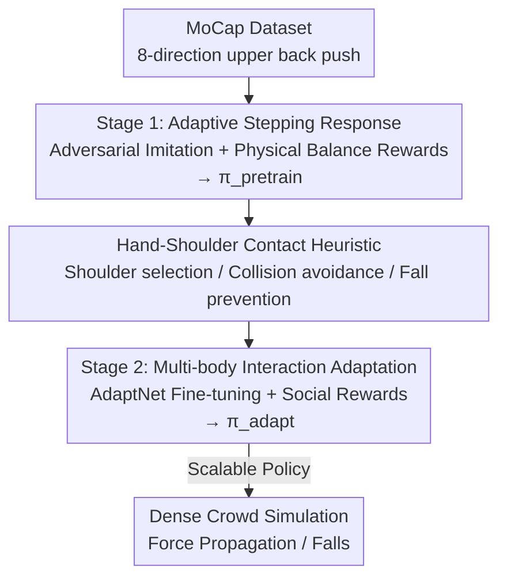

# Push-and-Step: From RL-Based Balance Recovery to Physical Simulation of Dense Crowds

**Conference**: CVPR 2026  
**Paper**: [CVF Open Access](https://openaccess.thecvf.com/content/CVPR2026/html/Jensen_Push-and-Step_From_RL-Based_Balance_Recovery_to_Physical_Simulation_of_Dense_CVPR_2026_paper.html)  
**Code**: https://github.com/alexis-jensen/Push-and-Step  
**Area**: Human Understanding / Physical Simulation / Reinforcement Learning  
**Keywords**: Dense Crowd Simulation, Balance Recovery, Physical Humanoid Simulation, Two-stage Reinforcement Learning, Social-aware Contact

## TL;DR
A two-stage deep reinforcement learning (RL) framework is used to train full-body physical humanoid agents. In the first stage, agents learn "stepping to recover balance" after being pushed through motion imitation and physical balance rewards. In the second stage, the policy is fine-tuned using AdaptNet with a "hand-to-shoulder contact" heuristic. This allows agents in dense crowds to socially dissipate impact by pushing or leaning on neighbors, successfully reproducing phenomena such as force propagation, falls, and crowd crushes in a purely physical simulation.

## Background & Motivation
**Background**: Traditional crowd simulations simplify humans into 2D disks, ellipses, or particles, focusing on navigation and social behaviors (collision avoidance, pathfinding) at moderate densities. Prevailing models typically characterize "non-contact" local interaction rules.

**Limitations of Prior Work**: In **extremely high-density** scenarios (e.g., subway cars, concerts), human interactions are inherently **physical contacts**. Pushing forces propagate through bodies, causing chain-reaction loss of balance or falls. 2D geometric representations cannot characterize how forces are transmitted or amplified at the limb level; even fine-grained particle-based 2D dense crowd models only approximate force propagation waves, failing to capture the true "force-motion-energy" mechanisms behind contact.

**Key Challenge**: To understand and provide early warnings for real-world hazards like crowd crushes, crowds must be simulated as **full-body, articulated, physically-constrained 3D humanoids**. However, the state space and control difficulty of full-body physical simulation are orders of magnitude higher than 2D. Furthermore, agents in dense crowds may unintentionally push neighbors while recovering balance, amplifying disturbances. Previously, no work has completed a dense crowd simulation entirely based on pure physical simulation.

**Goal**: To train a full-body physical control policy capable of recovering balance via **stepping** and **applying contact forces to neighbors** when pushed by unpredictable external forces in dense crowds, ensuring such contact conforms to "socially appropriate" human habits (e.g., touching shoulders rather than the lower back).

**Key Insight**: Starting from human biomechanical balance recovery strategies—where humans utilize muscle stiffness, ankle/hip strategies, and stepping, corresponding to physical quantities like CoM (Center of Mass), CoP (Center of Pressure), and BoS (Base of Support). In dense environments, hands can also be placed on neighbors to expand the recovery area. Encoding these physical principles directly into RL rewards allows the policy to generalize from small expert datasets to various pushing forces.

**Core Idea**: A two-stage RL approach ("individual stepping balance" followed by "multi-body social contact") uses biomechanical balance principles (CoM/CoP targets) as reward grounding. An online heuristic determines "which neighbor's shoulder to lean on," smoothly extending the single-agent policy to dense crowds of arbitrary configurations.

## Method

### Overall Architecture
The method addresses the full-body physical control problem of "how to stand firm after being pushed." All agents are physically simulated, with joints driven directly by Proportional-Derivative (PD) servos. The output of the control policy $\pi$ is the **target posture** fed into the PD servos, which convert it into joint torques. The training is conducted in two sequential stages:

Stage 1 (**Adaptive Stepping Response**) involves a single agent learning reflective stepping and arm-raising actions after being pushed using adversarial imitation learning from a small motion capture dataset, resulting in policy $\pi_\text{pretrain}$. To generalize to diverse forces, balance rewards reflecting physical quantities (CoM, CoP) and motion quality rewards are added. Stage 2 (**Multi-body Interaction Adaptation**) does not retrain from scratch but fine-tunes $\pi_\text{pretrain}$ into $\pi_\text{adapt}$ using the AdaptNet architecture. It introduces a "hand-to-shoulder contact" online heuristic that reads the states of the controlled agent and neighbors to output target positions/orientations for hand contact, which are concatenated into the state vector for $\pi_\text{adapt}$. Ultimately, $\pi_\text{adapt}$ can dissipate energy by stepping and leaning on neighbors in any crowd configuration.

### Key Designs

**1. Two-Stage Training Pipeline: Solidifying Individual Balance Before Multi-agent Contact**

Learning "standing firm while pushing neighbors appropriately" from scratch in a multi-agent dense environment rarely converges due to the vast state space and sparse rewards. The task is split: $\pi_\text{pretrain}$ first learns single-person stepping/arm-raising to handle various push directions and intensities. Stage 2 uses **transfer learning** via AdaptNet to fine-tune $\pi_\text{pretrain}$. This involves freezing $\pi_\text{pretrain}$ and adding two types of increments to the generator network: **latent space injection** (adding new embedding layers for variable-length state vectors) and **internal adaptation** (parallelizing new MLPs alongside existing ones). This preserves stepping abilities while learning hand-to-shoulder contact.

**2. Stage 1: Encoding Biomechanical Balance Principles into Rewards**

Small datasets (single subject, 8 directions) are insufficient to cover real-world forces. Adversarial imitation learning is used (GAN framework where $\pi_\text{pretrain}$ is the generator and a discriminator $D$ evaluates similarity using hinge loss, providing $r_\text{imit}=\text{clip}(D(o_t),-1,1)$). Two physically grounded reward terms are added. The balance reward compares current CoM/CoP with heuristic targets:

$$r_\text{balance} = e^{-\|\text{CoM}-\text{CoM}_\text{target}\|} + e^{-\|\text{CoP}-\text{CoP}_\text{target}\|}$$

The target CoM is set at the center of the BoS at a resting height. The target CoP is calculated using a momentum regulation model: during double-support, CoP is adjusted to maintain balance without stepping; if stepping is necessary, the swing foot placement is determined to cancel body momentum, coupled with linear momentum $p$, angular momentum $L$, and vertical ground reaction force $f_z$ (using damping coefficients $d_l=4, d_h=6$). Motion quality rewards $r_\text{quality}=\tfrac13(r_\text{foot}+r_\text{heading}+r_\text{effort})$ penalize foot sliding, heading deviation, and excessive limb movement.

**3. Stage 2: Hand-Shoulder Contact Heuristic + Social Rewards**

An **online heuristic** determines which hand should contact which neighbor's shoulder. Candidate points are limited to shoulders of neighbors within 5m in front. The heuristic follows three steps: ① **Collision Detection**: predicting the trajectory $p_\text{shoulder}(t)$ over 1s; if the distance to a candidate shoulder is below $\delta=0.25\,\text{m}$, it selects that shoulder to avoid trunk collision. ② **Fall Prevention**: selecting candidate shoulders within reach (0.1–0.6m) based on **collinearity** between $(p_\text{shoulder}(1)-S_i)$ and linear momentum $\vec L$ for efficient energy dissipation. These targets are fed into $\pi_\text{adapt}$ with a hand placement reward $r_\text{hands}$ and a social contact reward $r_\text{social}$ (penalizing excessive contact force $F_\text{contact}$ and placement errors).

### Loss & Training
PPO is used as the backend RL algorithm. The imitation term relies on a GAN-style discriminator hinge loss. Pre-training reward weights are $(w_i,w_g,w_q)=(0.6,0.2,0.2)$, and adaptation weights are $(w_p,w_h,w_s)=(0.5,0.2,0.3)$. Although trained with up to 3 agents, the policy generalizes to any number of agents during inference.

## Key Experimental Results

### Main Results (Verification of Pre-training and Adaptation)
The CoM trajectory and velocity generated by $\pi_\text{pretrain}$ match reference data. $\pi_\text{adapt}$ reproduces real-world dense crowd phenomena:

| Scenario | Setup | Reproduced Phenomenon |
|------|------|----------------|
| 5-Person Queue | Rear agent pushed | Domino-style force propagation; dissipation varies with inter-person distance (arm vs. elbow vs. close distance). |
| Dense Crowd | Random postures, moving wall | Small disturbances trigger rapid chaos and falls at high density; behavior scales with queue results. |
| Impulse-Velocity | Various distances | Simulated impulse-velocity relationship matches linear regression from experimental studies. |

### Ablation Study

Pre-training Reward Ablation (80 trials, 16 directions × 5 intensities):

| Configuration | Heading Deviation ↓ | Foot Sliding ↓ | Kinetic Energy ↓ |
|------|-----------|-----------|-------|
| $\pi_\text{pretrain}$ (Full) | 5.93° | 22 cm | 933 J |
| No $r_\text{imit}$ | 44.81° | 24 cm | 2381 J |
| No $r_\text{quality}$ | 13.19° | 49 cm | 1444 J |

Adaptation Reward Ablation (90 trials, 9 directions × 2 formations × 5 intensities):

| Configuration | Final Hand Height ↓ | Max Hand Height | Transmitted Impulse ↓ |
|------|-----------|-----------|-----------|
| $\pi_\text{adapt}$ (Full) | 0.81 m | 0.85 m | 40 Ns |
| No $r_\text{hand}$ | 1.16 m | 1.16 m | 75 Ns |
| No $r_\text{social}$ | 0.81 m | 0.81 m | 74 Ns |

### Key Findings
- **Balance Reward $r_\text{balance}$ is critical**: Without it, agents withstand ~21 N; with it, they withstand ~230 N—an order of magnitude difference.
- **Imitation manages "heading," Quality manages "cleanliness"**: Removing $r_\text{imit}$ increases heading deviation six-fold; removing $r_\text{quality}$ doubles foot sliding.
- **Social rewards roles**: Removing $r_\text{hand}$ results in hands staying raised (1.16m vs 0.81m); removing $r_\text{social}$ results in hands failing to raise higher to protect the torso, doubling transmitted impulse.

## Highlights & Insights
- **Biomechanics as Reward Grounding**: Using CoM/CoP and momentum to construct rewards allows a single-subject dataset to generalize to diverse forces—a model for overcoming simulation generalization with physical priors.
- **Heuristic + Learning Split**: Decision-making (which shoulder) is handled by an interpretable heuristic, while execution (how to place hands) is handled by RL, stabilizing training under data scarcity.
- **First Physical Simulation of Crowd Crushes**: This provides an end-to-end full-body physical simulation that quantitatively matches real-world impulse-velocity relationships, offering a scalable platform for crowd safety research.

## Limitations & Future Work
- **Data Scarcity**: Reliance on a single subject leads to limited motion diversity and personal style bias.
- **Static Scenarios**: Currently focuses on recovering balance from a standing position, not during locomotion.
- **Rendering Artifacts**: Differences between simple simulation geometries and the SMPL model cause visual interpenetration.

## Related Work & Insights
- **vs. Particle-based 2D Models [14, 50, 57]**: While 2D models show macro waves, this work explains the "force-motion-energy" mechanism at the limb level.
- **vs. Traditional Crowd Simulation**: Traditional models focus on non-contact navigation; this work focuses on unavoidable physical contact in high-density crowds.
- **vs. AdaptNet [66]**: This work adopts the latent space injection and internal adaptation mechanisms but repurposes them for transitioning from individual balance to multi-body social contact.

## Rating
- Novelty: ⭐⭐⭐⭐⭐ 
- Experimental Thoroughness: ⭐⭐⭐⭐ 
- Writing Quality: ⭐⭐⭐⭐ 
- Value: ⭐⭐⭐⭐⭐ 

<!-- RELATED:START -->

## Related Papers

- [\[CVPR 2026\] Beyond Scanpaths: Graph-Based Gaze Simulation in Dynamic Scenes](beyond_scanpaths_graph-based_gaze_simulation_in_dynamic_scenes.md)
- [\[CVPR 2026\] Mocap-2-to-3: Multi-view Lifting for Monocular Motion Recovery with 2D Pretraining](mocap-2-to-3_multi-view_lifting_for_monocular_motion_recovery_with_2d_pretrainin.md)
- [\[CVPR 2026\] SAM 3D Body: Robust Full-Body Human Mesh Recovery](sam_3d_body_robust_full-body_human_mesh_recovery.md)
- [\[ICLR 2026\] Instilling an Active Mind in Avatars via Cognitive Simulation](../../ICLR2026/human_understanding/instilling_an_active_mind_in_avatars_via_cognitive_simulation.md)
- [\[ICLR 2026\] Motion-R1: Enhancing Motion Generation with Decomposed Chain-of-Thought and RL Binding](../../ICLR2026/human_understanding/motion-r1_enhancing_motion_generation_with_decomposed_chain-of-thought_and_rl_bi.md)

<!-- RELATED:END -->
