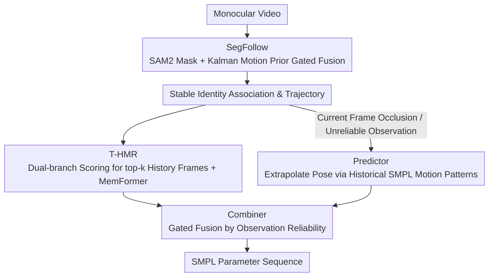

# RAM: Recover Any 3D Human Motion in-the-Wild

**Conference**: CVPR 2026  
**arXiv**: [2603.19929](https://arxiv.org/abs/2603.19929)  
**Code**: None  
**Area**: Human Understanding / 3D Human Motion Recovery  
**Keywords**: Multi-person 3D motion recovery, zero-shot tracking, SAM2, Temporal Human Mesh Recovery, motion prediction

## TL;DR

RAM proposes a unified multi-person 3D motion recovery framework that integrates a motion-aware semantic tracker SegFollow (based on SAM2 + adaptive Kalman filtering), a memory-enhanced temporal human mesh recovery module T-HMR, a lightweight motion predictor, and a gated combiner. It achieves SOTA zero-shot tracking stability and 3D accuracy on benchmarks such as PoseTrack and 3DPW, with inference speeds 2-3 times faster than previous methods.

## Background & Motivation

1. **Background**: Monocular video multi-person 3D motion recovery is an active research direction, with representative methods including 4DHuman (HMR2.0 + PHALP tracking) and CoMotion (end-to-end joint optimization).
2. **Limitations of Prior Work**: (1) Existing tracking methods rely on 2D appearance features and Hungarian matching, which are sensitive to fast motion, severe occlusion, and viewpoint changes, leading to frequent ID switches; (2) Once identity continuity is broken, the 3D motion sequences become inconsistent; (3) During target occlusion or fast motion, the lack of memory-based motion priors leads to discontinuous reconstructions.
3. **Key Challenge**: Unstable tracking triggers redundant detection and repeated initialization, which both reduces reconstruction accuracy and hinders real-time performance.
4. **Goal**: To build a real-time, robust multi-person 3D motion recovery system.
5. **Key Insight**: Combine the strong segmentation capabilities of SAM2 with motion priors, utilizing Kalman filtering to provide motion-aware identity association.
6. **Core Idea**: SegFollow provides stable tracking $\rightarrow$ T-HMR utilizes temporal memory to improve reconstruction consistency $\rightarrow$ Predictor estimates poses during occlusion $\rightarrow$ Combiner fuses reconstruction and prediction.

## Method

### Overall Architecture

The core pain point RAM addresses is that existing multi-person 3D motion recovery frameworks treat "who is who" (tracking) and "what is the pose" (reconstruction) as two mutually burdensome tasks—if tracking loses an ID, the reconstructed 3D sequence breaks; conversely, reconstruction triggers re-detection and re-initialization, slowing down the system. RAM's approach is to connect this chain through four components: SegFollow first provides stable identity association in each frame; T-HMR uses the stable trajectories to reconstruct 3D meshes with temporal consistency; during occlusion, the Predictor extrapolates poses based on historical motion patterns; finally, the Combiner performs gated fusion between "reconstruction" and "prediction" based on the reliability of the current observation to output final SMPL parameters. The entire pipeline runs zero-shot without retraining.

### Key Designs

**1. SegFollow: Integrating Kalman motion priors into SAM2 memory for stable tracking under occlusion and fast motion**

While SAM2 exhibits strong segmentation capabilities, its memory follows a First-In-First-Out (FIFO) logic and does not model whether the association in a specific frame is reliable. During occlusion or fast motion, noise accumulates through the FIFO, leading to ID switches. SegFollow introduces two components to SAM2 to address this. The first is a motion-guided selector: it uses Kalman filtering to predict the bounding box of each target in the next frame, calculating a motion consistency score $s_{\text{kf}}$ in the form of IoU, which is then fused with the mask affinity score $s_{\text{mask}}$ from SAM2:

$$s_{\text{fused}} = \alpha\, s_{\text{mask}} + (1-\alpha)\, s_{\text{kf}}$$

Thus, "appearance similarity" and "motion similarity" jointly determine the association, allowing the motion prior to correct cases where appearance alone might be deceived by similar pedestrians. The second is a temporal buffer: the standard FIFO memory update in SAM2 is replaced with an Exponential Moving Average (EMA), where the decay factor is adaptively adjusted by the Kalman consistency score—higher reliability leads to a larger weight for new observations, while suspicious associations suppress updates to avoid contamination. Furthermore, a confidence-gated update is added: the Kalman state of a target is only updated once it has accumulated reliable associations up to a threshold $\tau_{kf}$, preventing a single misassociation from biasing the motion model.

**2. T-HMR: Selecting effective historical frames via dual-branch scoring to inject temporal priors into single-frame reconstruction**

Single-frame reconstruction inherently lacks temporal consistency and requires historical frames for priors during occlusion. However, historical frames cannot be added indiscriminately, as irrelevant frames introduce noise. T-HMR utilizes a Memory Cache and MemFormer. The Memory Cache uses dual-branch attention scoring to select the top-k most relevant frames from the ViT features of $L$ adjacent frames: one branch calculates the correlation between the current frame and each candidate memory frame (relevance), while the other branch evaluates the internal consistency among the candidate memory frames themselves (reliability). Both branches are essential—relying only on correlation might select a similar frame that was reconstructed incorrectly, while relying only on consistency might select a stable but irrelevant frame. The selected temporal priors are passed to MemFormer, which integrates this historical information into the current frame features during reconstruction to output more coherent meshes.

**3. Predictor + Combiner: Pose prediction during occlusion with adaptive switching back to reconstruction**

When a target is occluded and the current observation is unreliable, forced reconstruction leads to jitter or errors. The Predictor takes over during such gaps: it performs lightweight extrapolation based on the motion patterns in the target's historical SMPL parameters to predict the current pose, ensuring continuity when visual evidence is missing. However, prediction cannot be trusted indefinitely—once occlusion ends and reconstruction becomes reliable again, the system should switch back. This transition is managed by the Combiner: a learnable gate that adaptively decides whether to trust reconstruction or prediction based on observation reliability. This allows for a smooth transition where the predictor maintains the sequence during occlusion and the reconstruction corrects drift upon reappearance.

### An Illustrative Example

Consider a street scene where Person B passes behind Person A, briefly occluding A for several frames:

1. **Before Occlusion**: SegFollow provides high $s_{\text{fused}}$ for both A and B (clear appearance, continuous motion), Kalman states update normally, and T-HMR reconstructs clean 3D meshes using recent features.
2. **The Moment A is Occluded**: A's mask affinity $s_{\text{mask}}$ drops sharply, but the Kalman-predicted bounding box remains in a reasonable position, maintaining the fused score $s_{\text{kf}}$. SegFollow does not misidentify A as a new target or lose the ID. Simultaneously, as reliability is interrupted, the confidence gate pauses the update of A's Kalman state to prevent contamination from noisy occluded frames.
3. **During Occlusion**: T-HMR cannot obtain reliable current features for A. The Combiner detects the unreliable observation and shifts the gate towards the Predictor, which extrapolates A's pose based on previous motion patterns, keeping A's 3D sequence continuous.
4. **A Reappears**: $s_{\text{mask}}$ increases and association becomes reliable again. The confidence gate resumes Kalman state updates, and the Combiner switches the gate back to reconstruction, which T-HMR takes over. Throughout the process, A’s ID remains unchanged and the 3D trajectory is smooth—this is the source of RAM's stability and speed (by avoiding repeated detection/initialization).

### Loss & Training

T-HMR uses SMPL parameter regression losses (joint positions + pose parameters + shape parameters). The Predictor and Combiner are trained end-to-end.

> ⚠️ Training objectives and hyperparameter details are subject to the original text.

## Key Experimental Results

### Main Results

| Dataset | Metric | 4DHuman | CoMotion | RAM | Gain |
|--------|------|---------|---------|-----|------|
| PoseTrack | MOTA↑ | 68.2 | 71.5 | 76.3 | +4.8 |
| PoseTrack | IDF1↑ | 72.1 | 74.8 | 80.5 | +5.7 |
| 3DPW | MPJPE↓ | 78.5 | 72.3 | 65.8 | -6.5 |
| 3DPW | PA-MPJPE↓ | 49.2 | 45.1 | 41.3 | -3.8 |

RAM significantly leads in both tracking stability (MOTA/IDF1) and 3D accuracy (MPJPE).

### Ablation Study

| Configuration | MOTA (PoseTrack) | MPJPE (3DPW) | FPS | Note |
|------|-----------------|-------------|-----|------|
| Full RAM | 76.3 | 65.8 | 25+ | Full model |
| w/o SegFollow (using PHALP) | 71.1 | 70.2 | 15 | SegFollow is core |
| w/o T-HMR Memory | 74.8 | 69.5 | 25+ | Memory improves consistency |
| w/o Predictor | 75.0 | 67.3 | 25+ | Predictor improves occlusion |

### Key Findings

- SegFollow contributes the most (MOTA +5.2), indicating that stable tracking is the bottleneck for multi-person motion recovery.
- RAM inference speed is 2-3 times faster than 4DHuman because stable tracking reduces redundant detection and repeated initialization.
- In real-world long video scenarios, ID switches are extremely rare, achieving stable zero-shot multi-person motion recovery for the first time.
- The dual-branch scoring in T-HMR is more effective than single-branch scoring, as both relevance and consistency are indispensable.

## Highlights & Insights

- **Combination of SAM2 and Kalman Filtering**: Merging the segmentation power of vision foundation models with classical motion modeling to complement each other's strengths.
- **Confidence-Gated Updates**: A practical engineering design that prevents unreliable detections from contaminating the motion state.
- **Zero-shot Long Video Capability**: The first method to maintain stable multi-person 3D reconstruction in long real-world videos without retraining.

## Limitations & Future Work

- Still relies on a detector to provide initial bounding boxes.
- Extreme occlusion (totally invisible for more than dozens of frames) may cause the predictor to drift.
- The SMPL model limits the recovery of hand and facial details.
- Future work could extend to fine-grained hand/face reconstruction (SMPL-X).

## Related Work & Insights

- **vs 4DHuman**: 4DHuman uses PHALP for tracking; RAM uses SegFollow to significantly improve tracking stability and speed.
- **vs CoMotion**: CoMotion uses end-to-end joint optimization but is slow; RAM's modular design is faster and more flexible.
- **vs SAM2**: SAM2's FIFO memory is not robust enough for MOT scenarios; SegFollow fixes this defect by introducing motion priors.

## Rating

- Novelty: ⭐⭐⭐⭐ The framework is a clever integration of existing components.
- Experimental Thoroughness: ⭐⭐⭐⭐ Multi-benchmark evaluation with sufficient ablation.
- Writing Quality: ⭐⭐⭐⭐ Clear structure with detailed methodological descriptions.
- Value: ⭐⭐⭐⭐⭐ Solves a practical bottleneck in multi-person 3D motion recovery.

<!-- RELATED:START -->

## Related Papers

- [\[CVPR 2026\] Gaussian-Mixture Latent Flow for Stochastic 3D Human Motion Prediction](gaussian-mixture_latent_flow_for_stochastic_3d_human_motion_prediction.md)
- [\[CVPR 2026\] SceMoS: Scene-Aware 3D Human Motion Synthesis by Planning with Geometry-Grounded Tokens](scemos_scene-aware_3d_human_motion_synthesis_by_planning_with_geometry-grounded_.md)
- [\[CVPR 2026\] Superman: Unifying Skeleton and Vision for Human Motion Perception and Generation](superman_unifying_skeleton_and_vision_for_human_motion_perception_and_generation.md)
- [\[CVPR 2025\] WildAvatar: Learning In-the-Wild 3D Avatars from the Web](../../CVPR2025/human_understanding/wildavatar_learning_in-the-wild_3d_avatars_from_the_web.md)
- [\[CVPR 2026\] HyperGait: Unleashing the Power of Parsing for Gait Recognition in the Wild via Hypergraph](hypergait_unleashing_the_power_of_parsing_for_gait_recognition_in_the_wild_via_h.md)

<!-- RELATED:END -->
