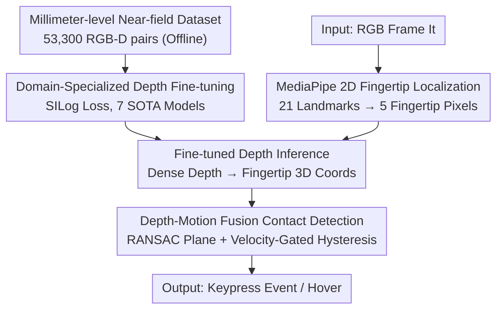

# Real-Time Multimodal Fingertip Contact Detection via Depth and Motion Fusion for Vision-Based Human-Computer Interaction

**Conference**: CVPR 2026  
**Paper**: [CVF Open Access](https://openaccess.thecvf.com/content/CVPR2026/html/Toshpulatov_Real-Time_Multimodal_Fingertip_Contact_Detection_via_Depth_and_Motion_Fusion_CVPR_2026_paper.html)  
**Code**: https://muxiddin19.github.io/Multimodal-Fingertip-Contact-Detection-via-Depth-and-Motion-Fusion  
**Area**: Human Understanding / Monocular Depth Estimation / Human-Computer Interaction  
**Keywords**: Fingertip contact detection, Monocular depth estimation, Domain fine-tuning, Depth-motion fusion, VR text entry

## TL;DR
This paper does not invent a new network but utilizes a specifically collected dataset of 53,300 millimeter-level RGB-depth pairs to fine-tune existing monocular depth models for near-field fingertip scenarios. By layering a "depth + motion" fusion velocity-gated state machine, the system reduces depth error from 12.3 mm to 3.84 mm (a 68% reduction) using only a standard RGB camera. It achieves a 94.4% F1-score for contact detection, enabling "blind typing" on a tabletop at 45.6 WPM with a 3.1% character error rate, approaching the performance of specialized depth hardware and commercial VR input.

## Background & Motivation

**Background**: Directly operating virtual objects with hands in VR/AR is a major trend. A critical component is **contact event detection**—precisely knowing "when" a fingertip touches a real or virtual surface, which is essential for virtual typing, piano playing, or surgical simulations. Ideal solutions currently rely on commercial motion capture (Vicon, OptiTrack, sub-millimeter precision) or specialized depth sensors.

**Limitations of Prior Work**: General-purpose monocular depth models (trained on meter-scale scenes like KITTI or NYU Depth V2) exhibit depth errors in the 12–25 mm range. However, distinguishing "fingertip hovering 5–10 mm above a surface" from "actual contact (≤3 mm)" requires precision under 3 mm. Since general models are off by an order of magnitude, they cause frequent false or missed touches. While commercial motion capture is precise, its high cost ($15k–$50k) restricts high-precision hand tracking to a few labs.

**Key Challenge**: There is a hard trade-off between precision and accessibility (cost). Cheap single-RGB solutions lack precision, while precise solutions are too expensive. The authors argue that the failure of existing depth models on this task is not due to architecture but a **domain gap** caused by a lack of near-field specialized training data.

**Goal**: To achieve millimeter-level, real-time, cross-view (desktop webcam / HMD front camera) fingertip contact detection using only a standard RGB camera and a keyboard layout printed on any flat surface.

**Key Insight**: Instead of designing a new network, focus on **collecting target-domain data + careful fine-tuning**. The "reduction of the domain gap" is treated as core, while architectural innovation is secondary to data and fine-tuning strategies. Motion cues are subsequently used to compensate for the instability of single-frame depth.

**Core Idea**: Use a specialized near-field dataset for domain fine-tuning to bring depth precision to the millimeter level, then use a "depth threshold + velocity-gated hysteresis state machine" fusion to determine contact, approaching dedicated hardware performance on standard RGB.

## Method

### Overall Architecture
The system is a **real-time three-module serial pipeline**: ① MediaPipe detects 21 hand landmarks on RGB frames, using the 2D pixel coordinates of the five fingertips as query points; ② A **monocular depth model fine-tuned on the specialized dataset** predicts a dense depth map, indices the depth at the 2D fingertip positions, and reconstructs 3D coordinates using camera intrinsics; ③ RANSAC plane fitting is performed on the surface to obtain a reference plane, and the signed vertical distance from the fingertips to the plane is calculated. This is fed into a **velocity-gated + depth-hysteresis state machine** to determine if a keypress occurred, filtering out hovering false positives. This is supported by an offline-collected dataset of 53,300 millimeter-level RGB-depth pairs, which makes the fine-tuning in step ② possible.

### Key Designs

**1. Millimeter-level Near-field Specialized Dataset: Closing the Domain Gap at the Source**

The success of the method depends on data, not the network. The authors built a multi-camera rig: the primary sensor is an Intel RealSense D405 depth camera, mounted 35 cm above a white desktop at a 45° angle to provide ground truth depth, supplemented by two RGB cameras at 30°/60° for multi-view evaluation. All cameras were independently calibrated for intrinsics and jointly for extrinsics, allowing a single depth sensor to output synchronized RGB-depth pairs for three views. Natural typing was recorded from 15 participants with diverse hand shapes and skin tones (Fitzpatrick II–V) on three surfaces (white, wood grain, semi-reflective laminate) under 5000K/800lux light at 60 FPS and 640×480 resolution. Raw data was synchronized via timestamps/SDKs and filtered using quality control rules (ROI depth >80%, MediaPipe landmark completion, and motion blur filtering). This yielded 53,300 high-quality samples, stratified by subject ID (8:1:1) to prevent leakage of individual features. A flat target verified a noise floor of $0.3 \pm 0.1$ mm for the D405 at 35 cm ⚠️ (negligible compared to the final 3.84 mm MAE).

**2. Domain-Specialized Depth Fine-tuning (SILog Loss): Turning General Models into Precision Instruments**

With the data, seven SOTA depth models (DepthAnythingV2, ZoeDepth, DepthAnything, DPT, MiDaS, NeWCRFs, AdaBins) were systematically fine-tuned. The strategy was deliberately conservative to avoid catastrophic forgetting: AdamW, low learning rate $1\times10^{-5}$ with cosine annealing, 200,000 steps, and batch size 16. Only random horizontal flips and color jittering were used; **geometric augmentations like rotation or scaling were avoided** as they disrupt the precise spatial relationships required for contact detection. Instead of L1/L2 losses, **Scale-Invariant Logarithmic (SILog) loss** was used, which penalizes relative depth errors—critical for distinguishing "contact (3 mm) vs. hover (8 mm)." SILog implicitly focuses gradients on the 0–15 mm fingertip-surface region. Consequently, the MAE of DepthAnythingV2-ft dropped from 12.3 mm (pre-trained) to 3.8 mm, with $\delta_1$ rising from 87.2% to 95.96%.

**3. Depth-Motion Fusion Contact Determination (RANSAC Plane + Velocity-Gated Hysteresis State Machine): Suppressing Single-frame Jitter with Temporal Motion**

Even with accurate depth, "distance < threshold" remains fragile—motion blur and slight model errors can cause a finger-swiping through the contact zone to be misidentified as a keypress. The authors first use RANSAC on the bottom 40% of the image (where the desk is stable) to fit a robust plane $ax+by+cz+d=0$. For each fingertip, 2D coordinates, depth, and intrinsics are used to reconstruct a 3D point $P_i$ and its signed vertical distance to the plane. Contact is decided by a **velocity-gated + depth-hysteresis state machine**: it uses asymmetric entry/exit thresholds—triggering contact only when distance is below $\tau_{\text{contact}}=4.5$ mm and releasing only when above $\tau_{\text{exit}}=6.0$ mm (to suppress jitter). Simultaneously, a **velocity gate** requires the fingertip to exhibit a downward pressing pattern—vertical velocity peak must exceed $\tau_{\text{velocity}}=15.0$ px/s, and must decelerate below 6.0 px/s at the moment of contact, filtering out transient hovers that meet depth criteria but lack the kinematic signature of an "intentional tap." Parameters were optimized via grid search on the validation set.

### Loss & Training
Depth fine-tuning used Scale-Invariant Logarithmic (SILog) loss (penalizing relative error, concentrating gradients in the 0–15 mm near-field). Optimizer: AdamW, learning rate $1\times10^{-5}$ + cosine annealing, 200,000 steps, batch 16, using photometric but not geometric augmentation. Metrics included MAE, AbsRel/SqRel, RMSE, $\delta_1/\delta_2/\delta_3$, and SILog, with MAE and $\delta_1$ being most critical.

## Key Experimental Results

### Main Results
Hardware: i7-10700K + RTX 3090 + RAMA-WC100 webcam; D405 for ground truth, D415 as a consumer-grade depth baseline. Comparison of models before and after fine-tuning (Pre/Fine):

| Model | MAE(mm) Pre/Fine | RMSE(mm) Pre/Fine | FPS | Contact Accuracy |
|------|------|------|------|------|
| **DepthAnythingV2-ft** | **12.3 / 3.8** | 18.4 / 4.8 | 14.8 | **94.2%** |
| NeWCRFs-ft | 13.9 / 3.9 | 19.7 / 5.8 | 16.9 | 92.3% |
| ZoeDepth-ft | 14.2 / 4.1 | 20.1 / 6.2 | 18.1 | 91.8% |
| MiDaS-ft | 12.9 / 4.9 | 18.7 / 5.1 | 15.9 | 91.3% |
| RealSense D415 (Hardware Baseline) | 2.0 (Spec) | — | 30.0 | 96.1% |
| MediaPipe only (No Depth) | — | — | 60.0 | 68.4% |

The best model, DepthAnythingV2-ft, reduced MAE to 3.84 mm (68% reduction) and reached $\delta_1 = 95.96\%$. Pure data+fine-tuning approached the hardware-based D415 (96.1%), whereas the MediaPipe baseline with no depth managed only 68.4%.

### Ablation Study (Contact Detection Algorithm)

| Configuration | Precision | Recall | F1 | False Positive Rate |
|------|------|------|------|------|
| Proximity-only | 72.3% | 68.5% | 70.3% | 27.7% |
| Depth threshold | 81.4% | 75.2% | 78.2% | 18.6% |
| w/o Depth | 88.2% | 84.6% | 86.4% | 11.8% |
| w/o Velocity | 90.1% | 87.3% | 88.7% | 9.9% |
| **Full system** | 94.8% | 94.1% | **94.4%** | 4.2% |

In end-to-end typing, Ours (848×480) reached **45.6 WPM / 3.1% CER**, significantly outperforming MediaPipe-only (28.3 WPM / 12.4% CER) and 3D hand mesh baselines (32.7 WPM / 6.9% CER). Even novice users achieved 38.3 WPM / 5.3% CER.

### Key Findings
- **Motion fusion is the dominant factor**: Removing depth (w/o Depth) dropped F1 from 94.4% to 86.4%, while removing the velocity gate (w/o Velocity) dropped it to 88.7%. Temporal stability is key to suppressing false positives.
- **Fine-tuning > Architecture Innovation**: Unsupervised Domain Adaptation (AdaBN/DANN/MMD) only reached 8.7–9.2 mm MAE, far inferior to supervised fine-tuning (3.8 mm). In extreme precision scenarios, target-domain labeled fine-tuning is necessary.
- **Precision gradient across fingers**: Accuracy decreases from the index finger (96.2% P / 95.1% R) to the pinky (88.4% / 86.2%). The ring and pinky fingers contribute 62% of typos despite only 28% of keystrokes—consistent with human hand kinematics.
- **Cross-view Transferability**: The system maintains 91.3% F1 and MAE 4.21 mm in 30° egocentric HMD views (from supplementary materials), using the same pipeline for both desktop and HMD.

## Highlights & Insights
- **Evidence for "Data over Architecture"**: In the extreme precision of near-field sensing, the paper proves that domain fine-tuning transforms general models into precision instruments, outperforming unsupervised adaptation by a wide margin.
- **Velocity-Gated Hysteresis State Machine**: Upgrading "contact" from a single-frame depth threshold to an event with kinematic signatures is a robust approach applicable to any "hover vs touch" interaction.
- **Smart use of SILog**: Using relative error losses rather than absolute ones focuses gradients on the 0–15 mm critical zone, a detail worth reusing in similar tasks.
- **Accessibility Value**: Transforming any flat surface and common camera into an input device has practical significance for sterile clinics, factories, and mobile offices where traditional peripherals are unavailable.

## Limitations & Future Work
- **Geometric Proxy vs. Physical Pressure**: Using 3 mm depth as a proxy for contact excludes the 3–5 mm ambiguous zone; the authors acknowledge that soft tissue deformation means geometric proximity $\neq$ physical contact. Pressure sensor validation is left for future work.
- **Dependency on One-time Scale Calibration**: The distance from camera to surface must be measured by the user to convert relative depth to metric units ($\alpha=d_{GT}/d_{pred}$).
- **Window of Applicability**: Optimal placement is 25–45 cm at 30–60°; precision outside this range is unverified.
- **Task Constraint**: Primary focus on "tabletop typing"; complex 3D interactions (grasping, multi-finger gestures) are not covered.

## Related Work & Insights
- **vs Wilson / MRTouch / EgoTouch / TouchInsight**: These either require specialized sensors or lack spatial resolution for precise typing. Ours uses single RGB + fine-tuning + velocity filtering across multiple views.
- **vs Unsupervised Domain Adaptation**: Methods like AdaBN/MMD fail to bridge the millimeter gap. Labeled监督 fine-tuning is required for geometric and metric precision.
- **Insight**: When precision requirements far exceed general benchmarks, prioritize "domain-relevant training data" over architectural updates. A targeted medium-sized dataset + careful fine-tuning is often more effective than model innovation.

## Rating
- Novelty: ⭐⭐⭐ No new network; focus is on dataset, fine-tuning, and fusion engineering.
- Experimental Thoroughness: ⭐⭐⭐⭐⭐ Comprehensive: 7-model comparison, algorithm ablation, cross-domain/surface generalization, and WPM/CER analysis.
- Writing Quality: ⭐⭐⭐⭐ Clear motivation and pipeline; some key data is tucked in supplementary materials.
- Value: ⭐⭐⭐⭐ High utility and reproducibility by democratizing high-precision detection to standard RGB.

<!-- RELATED:START -->

## Related Papers

- [\[CVPR 2026\] IMU-HOI: A Symbiotic Framework for Coherent Human-Object Interaction and Motion Capture via Contact-Conscious Inertial Fusion](imu-hoi_a_symbiotic_framework_for_coherent_human-object_interaction_and_motion_c.md)
- [\[CVPR 2026\] ReMoGen: Real-time Human Interaction-to-Reaction Generation via Modular Learning from Diverse Data](remogen_real-time_human_interaction-to-reaction_generation_via_modular_learning_.md)
- [\[CVPR 2026\] MimicTalker: A Multimodal Interactive and Memory-Enhanced Framework for Real-Time Dyadic 3D Head Generation](mimictalker_a_multimodal_interactive_and_memory-enhanced_framework_for_real-time.md)
- [\[CVPR 2026\] Unleashing Vision-Language Semantics for Deepfake Video Detection](unleashing_vision-language_semantics_for_deepfake_video_detection.md)
- [\[CVPR 2026\] RegFormer: Transferable Relational Grounding for Efficient Weakly-Supervised Human-Object Interaction Detection](regformer_transferable_relational_grounding_for_efficient_weakly-supervised_huma.md)

<!-- RELATED:END -->
