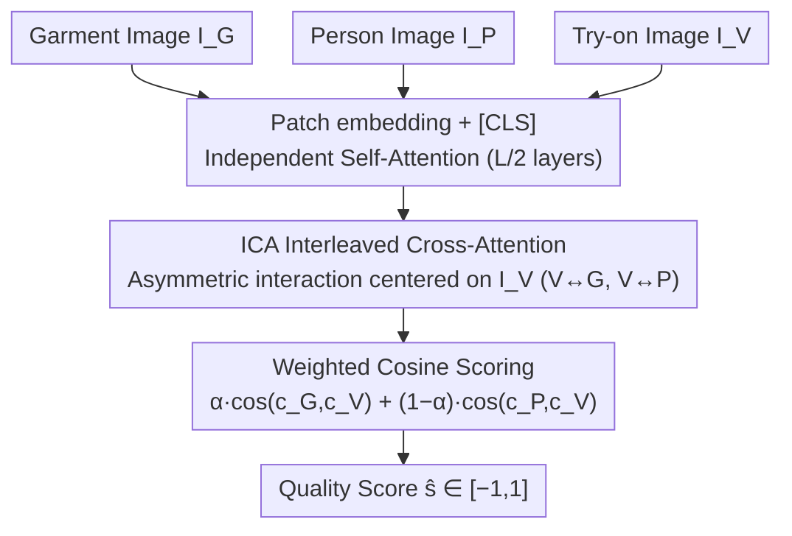

# Reference-Free Image Quality Assessment for Virtual Try-On via Human Feedback

**Conference**: CVPR2026  
**arXiv**: [2603.13057](https://arxiv.org/abs/2603.13057)  
**Code**: [GitHub](https://github.com/litelightlite/VTON-IQA)  
**Area**: Human Understanding / Virtual Try-On Quality Assessment  
**Keywords**: Virtual Try-On, Image Quality Assessment, Reference-Free Assessment, Human Feedback Alignment, Cross-Attention, Large-Scale Annotated Benchmark

## TL;DR

This paper proposes VTON-IQA, a reference-free framework for virtual try-on image quality assessment. By constructing VTON-QBench, a large-scale benchmark featuring 62,688 try-on images and 431,800 human annotations, and utilizing an Interleaved Cross-Attention (ICA) module to model the interactions between garment, person, and try-on images, the method achieves image-level quality predictions highly aligned with human perception.

## Background & Motivation

1.  **Lack of ground-truth reference in real-world scenarios**: In actual e-commerce deployments, ground-truth images of the same person wearing the target garment are typically unavailable, rendering full-reference metrics like SSIM/LPIPS unusable.
2.  **Distribution-level metrics fail to reflect single-image quality**: FID/KID only measure statistical similarity at the dataset level and cannot evaluate the perceptual quality of an individual generated image.
3.  **Existing VTON evaluation methods lack large-scale human validation**: VTON-VLLM focuses on textual criticism rather than quantitative scoring; VTBench uses LLMs for judgment without learning from large-scale human annotations; VTONQA is limited in scale (only 748 pairs, 40 annotators).
4.  **Lack of publicly reproducible evaluation benchmarks**: Current methods lack open-source implementations and standardized benchmarks, hindering reproducible evaluation.
5.  **Try-on quality assessment differs from single-image IQA**: It requires simultaneous verification of garment fidelity and person feature preservation, which essentially demands cross-image interaction modeling.
6.  **Traditional metrics over-penalize global transformations**: SSIM/LPIPS are sensitive to pose changes and scaling, which is inconsistent with human perception.

## Method

### Overall Architecture

VTON-IQA addresses a practical evaluation challenge: in e-commerce, "ground-truth" images are unattainable, making full-reference metrics like SSIM/LPIPS invalid, while FID/KID only provide dataset statistics. The proposed solution is a three-branch Transformer: it takes the garment image $I_G$, person image $I_P$, and generated try-on image $I_V$, processes them into patch embeddings with a [CLS] token, uses independent self-attention in the first L/2 layers for feature extraction, and introduces ICA modules in the remaining L/2 layers for mutual interaction. Finally, a weighted cosine score is calculated from the [CLS] representations to output a continuous quality score $\hat{s} \in [-1, 1]$. The backbone used is DINOv3 ViT-L/16.

### Key Designs

**1. Interleaved Cross-Attention (ICA): Asymmetric interaction centered on the try-on image**

The essence of try-on quality assessment is cross-image judgment—evaluating both garment fidelity and person preservation, which cannot be determined from a single image. ICA inserts cross-attention layers between the standard self-attention and MLP blocks, designed asymmetrically: the try-on branch aggregates information from both garment and person branches $\hat{X}_V = \tilde{X}_V + C_{V \leftarrow G} + C_{V \leftarrow P}$, while the garment and person branches only draw information from the try-on branch $\hat{X}_G = \tilde{X}_G + C_{G \leftarrow V}$ and $\hat{X}_P = \tilde{X}_P + C_{P \leftarrow V}$. This explicitly models bidirectional interactions for (V, G) and (V, P) sets while avoiding direct coupling between G and P, as quality judgment is centered on the try-on image and direct garment-person interaction introduces irrelevant information. Ablations show ICA improves SRCC by +0.133 and PLCC by +0.136.

**2. Weighted Cosine Scoring: Measuring garment and person fidelity separately**

After extracting [CLS] tokens $c_G, c_P, c_V$ from the three branches, a learnable weight $\alpha$ is used to weight the cosine similarities for garment and person fidelity:

$$\tilde{s} = \alpha \cdot \cos(c_G, c_V) + (1-\alpha) \cdot \cos(c_P, c_V)$$

This is followed by a learnable affine transformation and tanh mapping to $[-1, 1]$. $\alpha$ allows the model to learn the relative importance of these components in the final quality score rather than using a fixed ratio.

**3. VTON-QBench: Aligning the model with human perception via large-scale annotation**

Aligning with human judgment requires a sufficiently large annotated dataset. VTON-QBench scales this significantly:

| Dimension | Scale |
|------|------|
| Garment-Person Pairs | 13,153 (including 1.9× synthesized augmentation) |
| Try-on Images | 62,688 |
| VTON Models | 14 (covering GAN/U-Net Diffusion/DiT/Commercial) |
| Qualified Annotators | 13,838 |
| Quality Annotations | 431,800 |

Annotations use three levels: Unnatural (1) / Slightly unnatural but not obvious (2) / Completely natural (3). The final score is the mean across annotators. Data is cleaned in two stages (dummy question screening + abnormal behavior detection, and removing questionnaires with Krippendorff's $\alpha \leq 0.4$), improving $\alpha$ from 0.286 to 0.550. This data enables the fine-tuned model to reach human-level pairwise accuracy (A_macro 0.771 vs human 0.782).

### Loss & Training

Two objectives are optimized jointly: (1) Bradley-Terry preference learning—modeling pairwise preferences for two try-on results of the same person-garment pair using soft-label cross-entropy to align predicted and human preferences; (2) Score regression—using L2 loss to constrain predicted scores against human ratings. The total loss is:

$$\mathcal{L} = -q_{ij}\log p_\theta - (1-q_{ij})\log(1-p_\theta) + \sum_{k}\|\Psi_\theta - S_k\|_2^2$$

## Key Experimental Results

### Main Results: Comparison with Baselines (VTON-QBench Test Set)

| Method | SRCC↑ | PLCC↑ | R²↑ | A_macro↑ | A_micro↑ |
|------|-------|-------|-----|----------|----------|
| SSIM | – | 0.135 | – | 0.596 | 0.593 |
| LPIPS | – | 0.387 | – | 0.701 | 0.695 |
| DINOv3 (zero-shot) | – | 0.261 | – | 0.637 | 0.641 |
| VTON-IQA w/o ICA | 0.617 | 0.615 | 0.372 | 0.722 | 0.747 |
| **VTON-IQA (full)** | **0.750** | **0.751** | **0.553** | **0.781** | **0.790** |

- The ICA module provides significant gains: SRCC +0.133, PLCC +0.136.
- Pairwise accuracy approaches human levels (Human A_macro = 0.782, Model = 0.771).

### Benchmark of 14 VTON Models (VITON-HD, unpaired)

| Model | VTON-IQA↑ | FID↓ |
|------|-----------|------|
| Nano Banana Pro | **0.315** | 10.309 |
| GPT-Image-1.5 | 0.234 | 12.801 |
| FitDit | 0.189 | 9.893 |
| Qwen-Image-Edit | 0.087 | 10.706 |
| IDM-VTON | 0.039 | 9.093 |
| OOTDiffusion | -0.142 | 9.064 |
| LADI-VTON | -0.864 | 21.515 |

Commercial models lead significantly in human-aligned scores; FID/KID do not always align with human perception.

### Ablation Study

- **ICA vs. No ICA**: ICA shows significant improvements across all metrics, validating the necessity of cross-image interaction modeling.
- **Asymmetric vs. Symmetric Interaction**: The asymmetric design (avoiding G↔P coupling) better fits the semantic structure of try-on quality assessment.
- **Task-specific Training vs. Zero-shot**: Fine-tuning DINOv3 yields a PLCC gain of +0.354, showing the critical role of training on VTON-QBench.

## Highlights & Insights

1.  **Unprecedented Dataset Scale**: VTON-QBench is the largest known human subjective assessment dataset for virtual try-on and is planned for open-source release.
2.  **Elegant Asymmetric ICA Design**: The interaction structure centered on the try-on image aligns with assessment semantics and avoids irrelevant coupling.
3.  **Human-level Pairwise Accuracy**: The A_macro difference is only 0.011, indicating the model's practical utility for preference ranking.
4.  **First Unified Benchmark for 14 VTON Models**: Covers GAN/UNet-Diffusion/DiT/Commercial models, revealing systematic biases in traditional metrics compared to human perception.
5.  **Complete Synthetic Augmentation Pipeline**: Uses LoRA+FLUX.1-dev generation, GPT filtering, and human review to expand garment-person pairs by 1.9x.

## Limitations & Future Work

1.  **Coarse Annotation Granularity**: Three levels may fail to capture fine-grained quality differences; continuous or multi-dimensional scoring could be superior.
2.  **Correlation Gap with Humans**: SRCC = 0.750 vs Human 0.760, R² = 0.489 vs 0.536; absolute score prediction still has room for improvement.
3.  **Lack of Multi-dimensional Assessment**: Outputs only a single overall score; lacks diagnostic capability for garment texture, color, shape, or length.
4.  **Heavier Backbone**: DINOv3 ViT-L/16 with three branches has high inference overhead, requiring efficiency considerations for deployment.
5.  **Synthetic Augmentation Depends on Commercial Models**: Pseudo-triplet construction uses Nano Banana Pro, limiting reproducibility and increasing costs.
6.  **Unexplored Dynamic Scenarios**: Does not yet address quality assessment for video try-on.

## Related Work & Insights

| Method | Data Scale | Reference-Free | Image-level Scoring | Human Labels | Open Source |
|------|----------|--------|------------|----------|------|
| SSIM/LPIPS | N/A | ✗ | ✓ | ✗ | ✓ |
| FID/KID | N/A | ✓ | ✗ (Dist-level) | ✗ | ✓ |
| VTONQA | 748 pairs / 8132 imgs | ✓ | ✓ | ✓ | ✗ |
| VTON-VLLM | – | ✓ | ✗ (Text) | ✓ | ✗ |
| VTBench | – | ✓ | ✓ | Indirect | – |
| **VTON-IQA** | **13K pairs / 63K imgs** | **✓** | **✓** | **✓** | **✓** |

VTON-IQA surpasses previous works in data scale, assessment completeness, and commitment to open source.

## Rating

- Novelty: ⭐⭐⭐⭐ — The asymmetric cross-image interaction of ICA is innovative; the large-scale human benchmark fills a gap.
- Experimental Thoroughness: ⭐⭐⭐⭐⭐ — Benchmark of 14 models, comparisons with humans, ablations, and qualitative analysis are extremely comprehensive.
- Writing Quality: ⭐⭐⭐⭐ — Clear structure, detailed dataset construction, and standard mathematical expressions.
- Value: ⭐⭐⭐⭐ — Provides a standardized evaluation benchmark and tools for the virtual try-on community, holding both engineering and academic value.

<!-- RELATED:START -->

## Related Papers

- [\[CVPR 2026\] RefTon: Reference Person Shot Assist Virtual Try-on](refton_reference_person_shot_assist_virtual_try-on.md)
- [\[CVPR 2026\] MOFA-VTON: More Fashion Possibilities with Fine-Grained Adaptations in Virtual Try-On](mofa-vton_more_fashion_possibilities_with_fine-grained_adaptations_in_virtual_tr.md)
- [\[CVPR 2026\] Mobile-VTON: High-Fidelity On-Device Virtual Try-On](mobile_vton_ondevice_virtual_tryon.md)
- [\[CVPR 2026\] rPPG-VQA: A Video Quality Assessment Framework for Unsupervised rPPG Training](rppg_vqa_video_quality_assessment.md)
- [\[CVPR 2026\] COG: Confidence-aware Optimal Geometric Correspondence for Unsupervised Single-reference Novel Object Pose Estimation](cog_confidence-aware_optimal_geometric_correspondence_for_unsupervised_single-re.md)

<!-- RELATED:END -->
