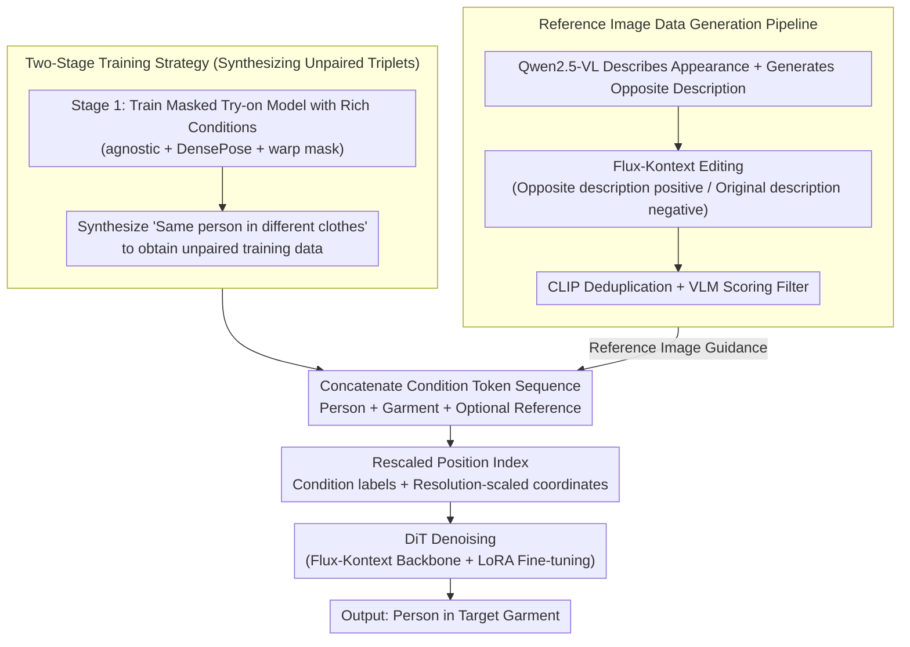

# RefTon: Reference Person Shot Assist Virtual Try-on

**Conference**: CVPR 2026  
**arXiv**: [2511.00956](https://arxiv.org/abs/2511.00956)  
**Code**: [https://github.com/360CVGroup/RefTon](https://github.com/360CVGroup/RefTon)  
**Area**: Human Understanding  
**Keywords**: Virtual try-on, reference image guidance, Flux-Kontext, mask-free try-on, diffusion models

## TL;DR
This paper proposes RefTon, a human-to-human virtual try-on framework based on Flux-Kontext. It introduces additional reference images (photos of others wearing the target garment) to provide more accurate clothing details. Through a two-stage training strategy and a rescaled position indexing mechanism, it achieves end-to-end try-on without auxiliary conditions (e.g., DensePose, segmentation masks), reaching SOTA performance on VITON-HD and DressCode.

## Background & Motivation
1.  **Background**: Virtual Try-On (ViTON) has evolved from GAN-based methods to diffusion-based models, which show significant progress in garment deformation and texture fidelity.
2.  **Limitations of Prior Work**: (a) Many methods rely on complex external models—pose estimators, human parsing, and segmentation models—to handle diverse input conditions, increasing framework complexity while mask quality directly limits final results. (b) More crucially, a flat "garment-only" image cannot fully convey style, texture, and design details—for instance, one cannot distinguish if a fabric is green transparent or light green opaque, nor easily recognize lace neckline designs.
3.  **Key Challenge**: In real shopping scenarios, users focus more on model shots than flat-lay images. However, existing methods do not support "reference model shots" as extra input because public datasets lack such paired data.
4.  **Goal**: (a) Remove dependency on external models and auxiliary conditions. (b) Introduce reference images to accurately convey garment wearing effects. (c) Construct training data containing reference images.
5.  **Key Insight**: Leveraging the powerful image editing capabilities of Flux-Kontext to automatically synthesize reference images of different people wearing the same garment to build the dataset. Meanwhile, improving position encoding to support multi-condition, multi-resolution inputs.
6.  **Core Idea**: Provide more intuitive visual guidance for virtual try-on through reference images (photos of others wearing the target clothing), combined with mask-free two-stage training and rescaled position indexing to achieve a concise and efficient end-to-end try-on.

## Method

### Overall Architecture
RefTon addresses "person-to-person virtual try-on": given a source person image and a target garment, it makes the source person wear the garment, while optionally allowing a "reference image of someone else wearing it" to supplement clothing details. The entire pipeline is built on the Flux-Kontext backbone—source person (or their masked version), target clothing, and optional reference images are first encoded into latents via VAE, concatenated along the sequence dimension, and fed into a DiT (Diffusion Transformer) to denoise and recover the result. The difficulty lies not in denoising itself, but in two aspects: the "unpaired triplets" required for training human-to-human models do not exist in reality, and the model needs to distinguish multiple heterogeneous condition images within a single sequence. RefTon overcomes these obstacles through a two-stage training strategy to generate data, rescaled position indexing to distinguish conditions, and a data pipeline to synthesize reference images.

### Key Designs

**1. Two-Stage Training Strategy: Synthesizing Non-existent Unpaired Data**

Human-to-human try-on requires unpaired triplets $[\bar{\mathbf{p}}_{i,\mathbf{c}_j}, \mathbf{c}_i, \mathbf{p}_{i,\mathbf{c}_i}]$—a person wearing different clothes $\mathbf{c}_j$, the target clothing $\mathbf{c}_i$, and the result of that person wearing the target garment. However, public datasets only provide paired samples $[\mathbf{c}_i, \mathbf{p}_{i,\mathbf{c}_i}]$ (a garment + a person wearing it). RefTon's approach is to use paired data to train a weaker but functional masked model first, then use it to synthesize the missing image: Stage 1 trains a masked try-on model with a full set of conditions (agnostic image, DensePose, warp mask), then uses it to synthesize images of each person "wearing various other clothes"; Stage 2 uses these synthetic images as unpaired inputs to train the true person-to-person model, with a 50% probability of switching between agnostic and synthetic person images to prevent the model from relying on a single source type. This logic is similar to CatVTON, but Stage 1 intentionally stacks richer conditions to ensure higher synthetic data quality, as the ceiling of Stage 2 is limited by this data.

**2. Rescaled Position Index: Distinguishing Heterogeneous Condition Images in One Sequence**

After concatenating multiple images (person, garment, reference) into a single token sequence, the model must know which image each token belongs to and its local spatial position. The original Flux-Kontext position index only has three channels: the first is a binary flag (noise vs. condition), and the latter two encode spatial coordinates—which cannot distinguish more than two types of conditions. RefTon upgrades the first channel to discrete condition labels, assigning unique IDs to each input type. Simultaneously, it generates independent position indices for each condition and scales the spatial coordinates by the "target resolution / condition resolution" ratio, aligning diverse condition sizes to the target coordinate system. This "independent-calculation-then-concatenation" approach is more flexible than Any2AnyTryon's pixel-space canvas, as the number and resolution of conditions are no longer constrained by canvas size. Ablation results show lower FID and KID compared to the original index.

**3. Reference Image Guidance: Supplementing Details Missing from Flat-lay Images**

A flat clothing image cannot convey many aspects—whether a fabric is transparent green or opaque light green, whether the neckline is lace, or how the fabric drapes. These are precisely what online shoppers care about. RefTon admits a reference image $\mathbf{r}_i$ (someone else wearing the target garment) with 25% probability during training. During inference, this reference is optional. The effect is tangible: adding reference images improves all metrics, reducing VITON-HD paired FID from 5.45 to 4.69.

**4. Reference Image Data Generation Pipeline: Synthetic Construction of Reference Shots**

The reference shot idea is effective, but public data lacks "different people wearing the same garment" pairs. RefTon first uses Qwen2.5-VL to describe the person's appearance in the target image, then generates an "opposite description" (changing skin tone, hairstyle, etc.). It then invokes Flux-Kontext to edit the target image—using the opposite description as the positive prompt and the original as the negative prompt—to force an image where the garment remains unchanged but the person is different. Three constraints ensure quality: the reference must retain the target garment, the person's appearance must differ significantly (to prevent the shortcut of just copying the reference), and non-target clothing must vary. Post-generation, CLIP deduplication and VLM quality scoring are used to filter out low-quality samples.

### Loss & Training
Standard flow matching loss is used for training. Flux-Kontext encoders and decoders are frozen, and only Transformer blocks are fine-tuned via LoRA (rank=64, $\alpha=128$). Single-dataset experiments: VITON-HD 20k steps / DressCode 48k steps, batch=128, 8×H100 GPUs. Mixed dataset (VFR) training is used to enhance generalization.

## Key Experimental Results

### Main Results (VITON-HD + DressCode)

| Method | Input Condition | VITON-HD LPIPS↓ | SSIM↑ | FID↓(paired) | FID↓(unpaired) |
|------|---------|----------------|-------|-------------|---------------|
| CatVTON | Mask | 0.057 | 0.870 | 5.43 | 9.02 |
| IDM-VTON | Mask+Pose | 0.102 | 0.870 | 6.29 | - |
| **Ours** | **Mask** | **0.057** | 0.873 | 5.45 | 8.58 |
| **Ours+Ref** | **Mask+Ref** | **0.049** | **0.879** | **4.69** | **8.43** |
| Ours/MF | Mask-free | 0.061 | 0.866 | 5.98 | 8.40 |
| Ours+Ref/MF | Mask-free+Ref | 0.053 | 0.872 | 5.11 | **8.32** |

### Ablation Study

| Setting | VITON-HD FID↓ | DressCode FID↓ | Description |
|------|-------------|---------------|------|
| Masked, No Ref | 5.45 | 3.48 | Baseline |
| Masked, w/ Ref | **4.69** | **2.94** | Ref image significantly improves |
| Mask-free, No Ref | 5.98 | 3.84 | Slight drop without mask |
| Mask-free, w/ Ref | 5.11 | 3.34 | Ref image compensates for mask absence |
| Original Position Index (0.5×) | 5.29 | - | No scaling |
| Rescaled Position Index (0.5×) | **5.09** | - | Improved after scaling |

### Key Findings
- **Reference images consistently improve all metrics**: In masked settings, adding reference images reduced VITON-HD paired FID from 5.45 to 4.69 (↓14%) and LPIPS from 0.057 to 0.049 (↓14%).
- **Mask-free mode remains robust**: Even without agnostic masks, performance is comparable to or better than mask-required baselines (FID 8.40 vs CatVTON 9.02), demonstrating deployment convenience.
- **Cross-dataset generalization**: After training on the mixed VFR dataset, the model outperformed baselines like OOTDiffusion even without specific training on VITON-HD/DressCode.
- **Mask quality concerns**: Ablation visualizations suggest over-cropped masks lose carried items (like handbags), while conservative masks retain unwanted areas. Mask-free mode avoids these trade-offs.

## Highlights & Insights
- **Consumer-centric reference image design**: Real users focus on model shots rather than flat-lays. Reference images capture information flat images cannot—transparency, lace details, and fabric drape. This design intuition is precise.
- **Clever reference data generation pipeline**: Using VLMs to generate appearance descriptions and their opposites, combined with Flux-Kontext editing, effectively changes the person while keeping the garment. The three constraints (garment fidelity, human variety, clothing diversity) prevent shortcut learning during training.
- **Unified framework for multiple input modes**: A single model supports four combinations (masked/mask-free × with/without reference) elegantly via condition labels and probability sampling.

## Limitations & Future Work
- Reference image generation depends on Flux-Kontext editing quality; if the model performs poorly on certain clothing types, reference quality drops.
- Only static image try-on was evaluated; extension to video try-on is pending.
- LoRA capacity might be a bottleneck; whether full-parameter fine-tuning (or higher rank) could further improve results remains to be explored.
- Sampling strategies for reference images (currently 25% probability) have not been fully optimized.

## Related Work & Insights
- **vs CatVTON**: Both use two-stage training and mask-free designs, but CatVTON lacks a reference image mechanism. RefTon significantly improves detail fidelity by introducing it.
- **vs TryOffDiff/ViTON-GUN**: These use a "take off then put on" strategy, which introduces error accumulation and lost garment details. RefTon avoids the strip-down phase by directly using reference shots.
- **vs Any2AnyTryon**: Also supports person-to-person try-on but uses position indices on a concatenated canvas. RefTon generates indices independently for each condition, supporting multi-resolution inputs more flexibly.

## Rating
- Novelty: ⭐⭐⭐⭐ The reference image guided try-on idea is fresh and practical; the data pipeline is clever.
- Experimental Thoroughness: ⭐⭐⭐⭐⭐ Multiple datasets, multiple settings (masked/mask-free × ref/no-ref), cross-domain evaluation, and extensive ablations.
- Writing Quality: ⭐⭐⭐⭐ Clear motivation, detailed method description, and rich visualizations.
- Value: ⭐⭐⭐⭐ Addresses the practical issue of insufficient garment information in virtual try-on, with direct application value.

<!-- RELATED:START -->

## Related Papers

- [\[CVPR 2026\] Mobile-VTON: High-Fidelity On-Device Virtual Try-On](mobile_vton_ondevice_virtual_tryon.md)
- [\[CVPR 2025\] Reference-Free Image Quality Assessment for Virtual Try-On via Human Feedback](../../CVPR2025/human_understanding/reference-free_image_quality_assessment_for_virtual_try-on_via_human_feedback.md)
- [\[CVPR 2026\] MOFA-VTON: More Fashion Possibilities with Fine-Grained Adaptations in Virtual Try-On](mofa-vton_more_fashion_possibilities_with_fine-grained_adaptations_in_virtual_tr.md)
- [\[CVPR 2026\] MV-Fashion: Towards Enabling Virtual Try-On and Size Estimation with Multi-View Paired Data](mv-fashion_towards_enabling_virtual_try-on_and_size_estimation_with_multi-view_p.md)
- [\[ECCV 2024\] Wear-Any-Way: Manipulable Virtual Try-on via Sparse Correspondence Alignment](../../ECCV2024/human_understanding/wear-any-way_manipulable_virtual_try-on_via_sparse_correspondence_alignment.md)

<!-- RELATED:END -->
