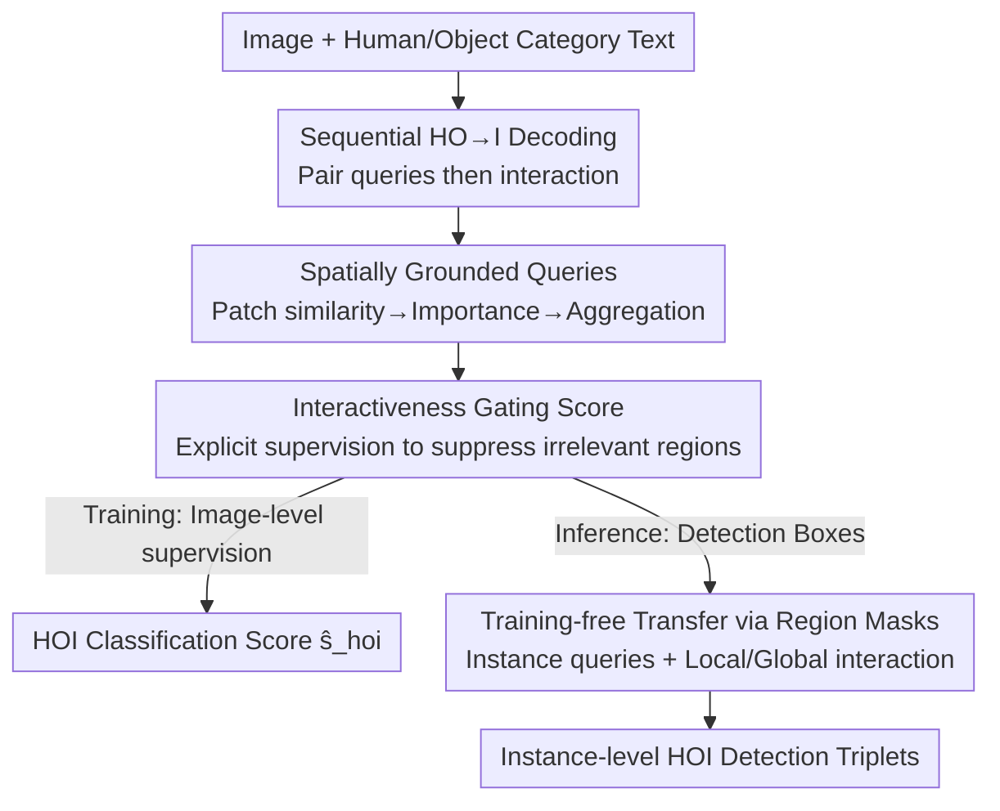

# RegFormer: Transferable Relational Grounding for Efficient Weakly-Supervised Human-Object Interaction Detection

**Conference**: CVPR 2026  
**Paper**: [CVF Open Access](https://openaccess.thecvf.com/content/CVPR2026/html/Park_RegFormer_Transferable_Relational_Grounding_for_Efficient_Weakly-Supervised_Human_Object_Interaction_Detection_CVPR_2026_paper.html)  
**Code**: https://github.com/mlvlab/RegFormer  
**Area**: Human Understanding / Weakly-supervised / HOI Detection  
**Keywords**: Human-Object Interaction detection, Weakly-supervised, Spatial grounding, Interactiveness scoring, Training-free transfer

## TL;DR
RegFormer is a lightweight interaction recognition module: when trained only with image-level labels, it constructs human–object pair queries into "spatially grounded" representations and introduces interactiveness scores as gating. For instance-level HOI detection during inference, it applies region masks to queries and scores using detection boxes, enabling **training-free transfer** from image-level to instance-level. It significantly outperforms previous weakly-supervised methods, approaches fully supervised performance, and achieves ~128× faster inference speed.

## Background & Motivation
**Background**: Human-Object Interaction (HOI) detection aims to localize humans and objects in an image and determine their interactions, outputting ⟨human, interaction, object⟩ triplets. Fully supervised methods require bounding box and interaction category labels for every human–object pair, leading to annotation costs that explode with data scale. Weakly-supervised methods use only image-level labels (which HOI triplets appear in the image) without localization, making them more scalable.

**Limitations of Prior Work**: Without localization signals, common weakly-supervised approaches first enumerate all human–object candidate pairs using an off-the-shelf detector and then pass them to an interaction classification module. This route has two major flaws: (1) The number of candidate pairs is $\tilde N_h \times \tilde N_o$. Traditional methods crop union regions for every pair and run forward passes individually, creating enormous computational overhead that slows down in dense scenes. (2) Union regions often contain irrelevant instances, misleading the classification of specific pairs and generating many false positives. Later works used RoI-Align for one-pass union feature extraction, but union regions still include irrelevant areas, leading to poor generalization. Others used instance features directly, but this **strongly couples** the classifier and detector, requiring retraining if the detector changes.

**Key Challenge**: Under weakly-supervised settings, the goal is to "efficiently process massive candidate pairs" while "discriminatively filtering non-interacting pairs," yet image-level labels provide **no localization information**—the model has no inherent way to know which region corresponds to which human or object.

**Goal**: Develop a lightweight, universal interaction classification module that unifies image-level (HOI classification) and instance-level (HOI detection) inference in a single framework with training-free transfer.

**Key Insight**: The authors observe that by allowing queries to "implicitly" learn spatial cues for humans and objects, the reasoning capability learned at the image level can be directly transferred to the instance level. The key is to **inject spatial information into query construction and a supervisable interactiveness signal**, rather than relying on external boxes during training.

**Core Idea**: Replace "union region cropping" with "spatially grounded human–object queries + interactiveness gating," allowing the model to focus on interaction regions under image-level supervision. During inference, region masks from detection boxes are applied to queries/scores for training-free transfer.

## Method

### Overall Architecture
RegFormer is based on an adaptation of ML-Decoder (a multi-label classifier using category text embeddings as queries). It changes "enumerating all HOI triplet queries at once" to a **sequential HO→I** structure: first, it constructs queries $q^{ho}_k$ for each "human category–object category" pair in a **pairwise instance encoder**, then passes them into an **interaction decoder** to predict interaction scores $\hat s^a_k$. In parallel, the model calculates an **interactiveness score** $r^{ho}_k$ for each pair, used as a gate multiplied by the interaction score and supervised by image-level HOI labels. Vision/text encoders (CLIP, DINOv2) remain frozen throughout training.

For instance-level detection, only one modification is introduced: given human/object instance boxes from a detector, **region masks** $m(p)$ constrain query construction and interactiveness scoring to respective instance regions. Thus, the image-level module becomes an instance-level detector **without any additional training**.

### Key Designs

**1. Sequential HO→I Decoding: From "Triplet Enumeration" to "Pairing then Interaction"**

Traditional ML-Decoder uses text embeddings of all HOI categories (e.g., "human ride bicycle") as queries for one-pass prediction, which becomes computationally expensive as pairs increase. RegFormer adopts a two-step sequential structure: queries are first generated based on "human category–object category" (HO) pairs, and the decoder then predicts interaction categories (I) only for each HO pair ($HO \to I$). This reduces the number of queries from "H × O × A" to "H × O," providing the structural foundation for "single forward pass, 128× speedup" without significant overhead.

**2. Spatially Grounded Queries: Learning localization within queries**

The biggest gap in weakly-supervised learning is the lack of spatial information in queries. Instead of relying on external boxes, the authors inject spatial cues via **patch-level similarity**. Patch features $x(p)$ from the backbone are projected into a shared space with text embeddings for "human" ($e^h$) and the $k$-th object category ($e^o_k$) to calculate cosine similarity, yielding objectiveness scores $s^h(p)$ and $s^o_k(p)$ (Eq. 3). Softmax is then applied over the patch dimension to obtain patch importance weights:

$$\alpha^h(p)=\frac{\exp(s^h(p)/\tau_p)}{\sum_{p'}\exp(s^h(p')/\tau_p)},\quad \alpha^o_k(p)=\frac{\exp(s^o_k(p)/\tau_p)}{\sum_{p'}\exp(s^o_k(p')/\tau_p)}$$

Patch features are weighted and aggregated to form spatial representations $q^h=\sum_p\alpha^h(p)x(p)$ and $q^o_k=\sum_p\alpha^o_k(p)x(p)$. These are concatenated and passed through a projection layer $P_q$ to produce the spatially grounded human–object query $q^{ho}_k=P_q([q^h;q^o_k])$. This makes queries "anchored" to where humans and objects actually appear, facilitating transferable image-level reasoning—ablation shows this alone improves classification by +1.8 mAP and detection Full by +4.59.

**3. Interactiveness Gating Score: Suppressing irrelevant regions with a supervisable signal**

In weakly-supervised settings, all human–object category pairs are used for interaction training. Even if an object is absent, the model might produce false responses in irrelevant regions. The authors introduce **interactiveness scoring**: patch-level similarities are passed through a sigmoid to get patch-level interactiveness $\hat s^h(p)=\sigma(s^h(p))$ and $\hat s^o_k(p)=\sigma(s^o_k(p))$. Image-level interactiveness is then calculated using weighted sums: $r^h=\sum_p\alpha^h(p)\hat s^h(p)$ and $r^o_k=\sum_p\alpha^o_k(p)\hat s^o_k(p)$. The pair-level interactiveness is their geometric mean $r^{ho}_k=(r^h r^o_k)^{0.5}$. This acts as a gate for the final HOI score and is supervised via focal loss:

$$\mathcal{L}=\mathcal{L}_{\text{focal}}(\hat s^{hoi},c^{hoi}),\quad \hat s^{hoi}_k=\hat s^a_k\,(r^{ho}_k)^{\gamma}$$

Since interactiveness is derived from spatial regions related to the human–object pair, the model suppresses irrelevant regions and highlights interaction-critical areas. This is the main performance driver—adding it improves classification by +3.6 mAP and jumps detection Full from 23.38 to 30.01.

**4. Training-free Transfer via Region Masks: Detector boxes as inference-only constraints**

For instance-level detection, the authors apply **region masks** $m(p)$ (1 inside, 0 outside) to given human/object detection boxes. These masks are added as logits to the patch importance calculation, resulting in instance-level patch importance $\alpha^{\tilde h}_i(p)$ and $\alpha^{\tilde o}_j(p)$ (Eq. 9). This constrains query construction to specific instance regions, producing instance-level queries $\tilde q^{ho}_{ij}$. Interactiveness is similarly instantiated. The authors found that "local interactiveness" within boxes alone sometimes assigns high scores to non-interacting pairs due to strong semantic alignment. Thus, they add **masked global interactiveness** (image-level patch importance response within the box). Multiplying local and global terms (Eq. 10) enhances contrast and suppresses non-interaction. The final prediction is multiplied by detector confidence: $\tilde s^{hoi}_{ij}=\tilde s^a_{ij}\cdot(\tilde r^{ho}_{ij})^{\gamma}\cdot(\tilde s^h_i\tilde s^o_j)^{\lambda}$. Since no boxes are used during training, the module is **detector-agnostic**.

### Loss & Training
The training objective is an image-level HOI multi-label focal loss (Eq. 8), supervising the gated HOI score $\hat s^{hoi}_k=\hat s^a_k(r^{ho}_k)^{\gamma}$. Vision encoders (CLIP-RN50 / DINOv2 ViT-S/B) and text encoders (CLIP-RN50 / ViT-B) are frozen. Only lightweight parameters like query projections and decoders are trained. The default configuration uses DINO-B + CLIP-B + DETR. $\gamma$ and $\lambda$ are scaling factors for gating and detection scores (refer to the original paper for precise values).

## Key Experimental Results

### Main Results
Comparison with fully and weakly supervised methods on HICO-DET (mAP excerpts):

| Method | Supervision | Detector | Backbone | Full | Rare | Non-rare |
|------|------|--------|----------|------|------|----------|
| Weakly HOI-CLIP | Weak | Faster R-CNN | CLIP-RN50 | 22.89 | 22.41 | 23.03 |
| RegFormer | Weak | Faster R-CNN | CLIP-RN50 | **25.08** | 25.76 | 24.88 |
| RegFormer | Weak | Faster R-CNN | DINO-B | 33.33 | 35.04 | 32.82 |
| RegFormer | Weak | DETR | DINO-B | 32.90 | 35.18 | 32.21 |
| RegFormer | Weak | H-DETR | DINO-B | **38.14** | 40.31 | 37.49 |
| ADA-CM (Fully) | Full | DETR | CLIP-B | 33.80 | 31.72 | 34.42 |
| HOICLIP (Fully) | Full | DETR | CLIP-B | 34.69 | 31.12 | 35.74 |

With the same backbone, it surpasses the previous weakly-supervised SOTA (Weakly HOI-CLIP) by +2.19 Full. With stronger backbones, it approaches or even exceeds fully supervised methods on Rare classes. On V-COCO, RegFormer with DETR achieves 57.5 AProle2, setting a new weakly-supervised SOTA (previous Weakly HOI-CLIP was 48.1).

### Ablation Study
Component-wise ablation (HICO classification mAP / HICO-DET detection, DINO-S backbone):

| Config | HO→I | SG | IA | HICO | HICO-DET Full |
|------|------|----|----|------|---------------|
| (a) ML-Decoder Baseline | | | | 52.6 | 17.49 |
| (b) + Sequential Decoding | ✓ | | | 53.7 | 17.63 |
| (c) + Spatially Grounded Query | ✓ | ✓ | | 54.4 | 22.08 |
| (e) Full Model | ✓ | ✓ | ✓ | **57.6** | **30.01** |

Internal ablation of interactiveness scoring (HICO-DET):

| Local | Masked Global | Full | Rare | Non-rare |
|------|---------|------|------|----------|
| ✗ | ✗ | 22.08 | 23.91 | 21.53 |
| ✓ | ✗ | 23.44 | 25.77 | 22.75 |
| ✓ | ✓ | **30.01** | **32.05** | **29.39** |

### Key Findings
- **Interactiveness scoring is the primary contributor**: It lifts detection Full from 22.08 (SG only) to 30.01 by suppressing irrelevant regions and highlighting interactions.
- **Local + Global synergy is essential**: Local interactiveness alone results in only 23.44 Full; combined with masked global, it reaches 30.01. Local provides pair-specific localization, while global amplifies contrast to suppress non-interacting pairs.
- **Strong Zero-shot generalization**: RegFormer outperforms the weakly-supervised baseline OpenCat by 10.07 mAP on RF-UC unseen combinations, despite OpenCat using 750k additional images for large-scale pre-training.
- **Efficiency**: RegFormer's inference time remains nearly constant as candidate pairs increase (single backbone forward pass), whereas ML-Decoder slows dramatically. A ~128× speedup is reported.
- **Dense scenes benefit from explicit interactiveness**: While spatial grounding suffices for localization in sparse scenes, explicit interactiveness supervision is required to consistently localize all interacting individuals in dense multi-person scenes.

## Highlights & Insights
- **Treating spatial cues as learnable queries rather than external boxes**: Using patch-text similarity + softmax aggregation enables queries to naturally contain spatial information, bypassing the dilemma of choosing between inefficient union cropping or retraining due to detector coupling.
- **Ingenuity of training-free transfer**: Boxes are untouched during training; at inference, region masks are added to patch importance logits. A simple mask converts the image-level module into an instance-level detector, which is detector-agnostic and allows for plug-and-play detector swapping.
- **Contrast between Local vs. Masked Global interactiveness**: Recognizing that strong semantic alignment might cause local scores for non-interacting pairs to be inflated, "contrast within global context" is introduced as a correction. This can be transferred to other weakly-supervised localization/grounding tasks to suppress false positives.
- Using geometric mean $r^{ho}=(r^h r^o)^{0.5}$ for gating ensures that **both** human and object must have high interactiveness, naturally favoring pairs where both entities are correctly identified.

## Limitations & Future Work
- Still relies on off-the-shelf detectors for instance boxes; missed or incorrect detections limit the performance ceiling.
- Heavily dependent on the text-vision alignment quality of frozen CLIP/DINOv2: if patch similarity is poor for rare categories, spatial grounding may fail.
- Scaling factors $\gamma$ and $\lambda$ for interactiveness gating are hyperparameters; robustness and sensitivity across different datasets are not fully detailed in the main text.
- Validated only on standard benchmarks (V-COCO / HICO-DET); performance in open-vocabulary or more complex multi-person/multi-object scenes remains to be seen.

## Related Work & Insights
- **vs. ML-Decoder (Base)**: ML-Decoder predicts all HOI categories at once and crops union regions, which is inefficient and easily misled by irrelevant regions. RegFormer uses sequential HO→I + spatial queries + interactiveness gating, making it one-pass, more discriminative, and improving classification by +5.0 mAP and detection Full by +12.52.
- **vs. Weakly HOI-CLIP (Weakly-supervised SOTA)**: Both use CLIP, but the former relies on union region features. RegFormer injects spatial cues into queries and explicitly supervises interactiveness, yielding +2.19 Full with the same backbone and even larger gains with stronger ones.
- **vs. Direct Instance Feature Methods**: Those designs couple the classifier and detector; RegFormer's training-free mask transfer makes it detector-agnostic and adaptable.

## Rating
- Novelty: ⭐⭐⭐⭐⭐ Integrating spatial grounding into queries + interactiveness gating + training-free mask transfer is a self-consistent solution to the weakly-supervised gap.
- Experimental Thoroughness: ⭐⭐⭐⭐⭐ Covers two benchmarks, multiple detectors/backbones, zero-shot performance, efficiency, and component-wise ablations.
- Writing Quality: ⭐⭐⭐⭐ Clear methodological narrative; logical flow is complete despite formula complexity.
- Value: ⭐⭐⭐⭐⭐ Approaches fully supervised performance with weakly-supervised labels + 128× speedup + plug-and-play detector compatibility.

<!-- RELATED:START -->

## Related Papers

- [\[CVPR 2026\] RegFormer: Transferable Relational Grounding for Efficient Weakly-Supervised HOI Detection](regformer_transferable_relational_grounding_for_weakly-supervised_hoi_detection.md)
- [\[CVPR 2026\] Decoupled Generative Modeling for Human-Object Interaction Synthesis](decoupled_generative_modeling_for_human-object_interaction_synthesis.md)
- [\[CVPR 2026\] ReGenHOI: Unifying Reconstruction and Generation for 3D Human-Object Interaction Understanding](regenhoi_unifying_reconstruction_and_generation_for_3d_human-object_interaction_.md)
- [\[CVPR 2026\] GenHOI: Towards Object-Consistent Hand-Object Interaction with Temporally Balanced and Spatially Selective Object Injection](genhoi_towards_object-consistent_hand-object_interaction_with_temporally_balance.md)
- [\[CVPR 2026\] Real-Time Multimodal Fingertip Contact Detection via Depth and Motion Fusion for Vision-Based Human-Computer Interaction](real-time_multimodal_fingertip_contact_detection_via_depth_and_motion_fusion_for.md)

<!-- RELATED:END -->
