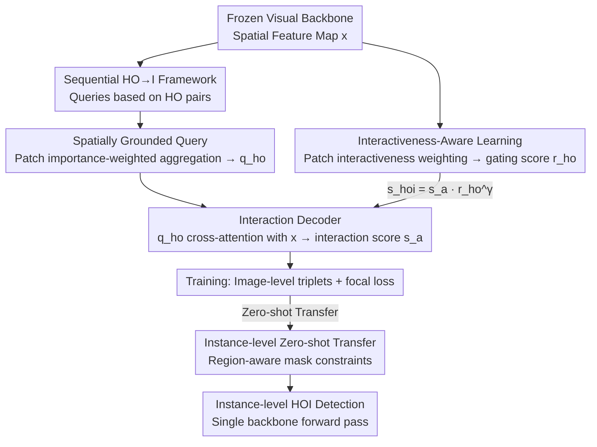

# RegFormer: Transferable Relational Grounding for Efficient Weakly-Supervised HOI Detection

**Conference**: CVPR 2026  
**Paper**: [CVF Open Access](https://openaccess.thecvf.com/content/CVPR2026/html/Park_RegFormer_Transferable_Relational_Grounding_for_Efficient_Weakly-Supervised_Human-Object_Interaction_Detection_CVPR_2026_paper.html)  
**Code**: [https://github.com/mlvlab/RegFormer](https://github.com/mlvlab/RegFormer)  
**Area**: Human Understanding / Human-Object Interaction Detection (HOI) / Weakly-Supervised  
**Keywords**: Human-Object Interaction Detection, Weakly-Supervised, Spatial Grounding Query, Interactiveness Scoring, Zero-shot Transfer

## TL;DR
RegFormer transforms weakly-supervised HOI detection from "enumerating all human-object pairs and cropping regions for classification" to "grounding human-object relations as queries on CLIP spatial feature maps and gating non-interacting pairs with interactiveness scores." Trained only with image-level annotations, it transfers directly to instance-level detection with a single backbone forward pass, achieving 38.14 mAP on HICO-DET with H-DETR, surpassing fully-supervised methods.

## Background & Motivation

**Background**: HOI detection aims to identify $\langle \text{human, interaction, object} \rangle$ triplets (e.g., human-ride-bicycle). Fully-supervised methods require bounding boxes and interaction labels for every human-object pair, which becomes prohibitively expensive as datasets scale. Consequently, weakly-supervised HOI has emerged, utilizing only image-level labels (which triplets appear in the image) for training, without human/object localization. Without localization signals, conventional weakly-supervised methods typically use off-the-shelf detectors to generate candidates and feed all possible pairs into an interaction classification module.

**Limitations of Prior Work**: This "detector + pairwise classification" paradigm suffers from two main issues. First, it is **slow**: mainstream approaches crop union regions for every candidate pair and perform individual forward passes, leading to an explosion in computations ($\tilde N_h\times\tilde N_o$) as the number of candidates increases (Fig.1-A). Even with RoI-Align, union regions often contain irrelevant instances, misleading the classification of specific pairs (Fig.1-B) and degrading generalization. Second, there are **high false positives**: under weak supervision, all human-object combinations are used to train interaction prediction, causing the model to produce strong responses for non-interacting pairs, which contaminates instance-level reasoning.

**Key Challenge**: There is a trade-off between using union region features (efficient but lacks instance discrimination) and instance features from detectors (precise but ties the classifier to the detector) — making it difficult to achieve efficiency, transferability, and accuracy simultaneously.

**Goal**: Develop a lightweight, general-purpose interaction classification module that learns effective interaction reasoning under image-level supervision and transfers to instance-level detection **without additional training**, remaining detector-agnostic.

**Key Insight**: Replace "exhaustive triplet queries" with "spatially grounded HO queries" that aggregate spatial cues from feature maps. Additionally, introduce an "interactiveness scoring" branch as a gate to suppress non-interacting pairs. Both components are position-aware; during inference, instance boxes from a detector constrain query construction and scoring regions, allowing image-level capabilities to be transferred zero-shot to the instance level.

## Method

### Overall Architecture

RegFormer builds upon ML-Decoder (a cross-attention multi-label classifier using label text embeddings as queries). However, RegFormer replaces the exhaustive querying of all HOI classes with a **sequential HO $\to$ I framework**: it first constructs queries based on human-object category pairs (HO) in a "Pairwise Instance Encoder" and then predicts interaction categories (I) for each HO pair in an "Interaction Decoder." This reduces the complexity from "all triplets" to "human categories $\times$ object categories," enabling low-overhead processing of numerous instance pairs.

During training (image-level): Spatial feature maps $x$ are extracted from a frozen backbone (CLIP / DINOv2). The **Pairwise Instance Encoder** calculates patch importance $\alpha$ based on patch-level similarity to human/object categories, aggregating features into a spatially grounded HO query $q^{ho}$. The **Interaction Decoder** performs cross-attention between $q^{ho}$ and $x$ to output an interaction score $\hat s^a$. Simultaneously, an **Interactiveness-Aware** branch computes a gating score $r^{ho}$ for each pair. The final score $\hat s^{hoi}$ is the product of $\hat s^a$ and $r^{ho}$, optimized with focal loss using image-level triplet labels.

During inference (instance-level): For instance boxes provided by a detector, a **region-aware mask** is created for each instance, constraining query aggregation and interactiveness scoring to the bounding boxes. The rest of the pipeline remains identical to training, enabling instance-level HOI detection with **only one backbone forward pass** (achieving approx. $\times 128$ speedup over Fig.1-A).

### Key Designs

**1. Sequential HO $\to$ I Framework: Decoupling triplet queries into "Pair Categories then Interaction"**

ML-Decoder uses text embeddings of all HOI classes (e.g., "human ride bicycle") as queries. The number of queries equals the number of HOI classes, making exhaustive pair enumeration expensive. RegFormer adopts a sequential decoding strategy: queries are organized by human-object **category pairs** (HO), and each HO query decodes its corresponding interaction categories (I). Given text encoder $T$, HO queries are initialized with semantic priors and injected with spatial cues (see Design 2). The interaction decoding phase computes $\bar q^{ho}_k=\text{Att}(q^{ho}_k,x,x)$ and $\hat s^a_k=\sigma(\cos(P_a(\bar q^{ho}_k),e^a))$. This compresses the complexity from "triplet count" to "human $\times$ object categories," allowing massive instance pairs to be processed in a single pass.

**2. Spatially Grounded Query: Aggregating "Who is Where" via patch-level similarity**

Purely text-initialized queries lack spatial information, preventing the injection of local priors (like box coordinates) for zero-shot transfer without retraining. RegFormer aggregates spatial cues from feature maps: it calculates the cosine similarity between each patch $x(p)$ and human/object category text embeddings in a shared space: $s^h(p)=\cos(P^h_v(x(p)),P^h_t(e^h))$ and $s^o_k(p)=\cos(P^o_v(x(p)),P^o_t(e^o_k))$. Patch importance $\alpha^h(p)=\frac{\exp(s^h(p)/\tau_p)}{\sum_{p'}\exp(s^h(p')/\tau_p)}$ is computed via softmax. HO queries are then formed by weighted aggregation $q^h=\sum_p\alpha^h(p)x(p)$ and $q^o_k=\sum_p\alpha^o_k(p)x(p)$, followed by a projection $q^{ho}_k=P_q([q^h;q^o_k])$. Consequently, queries carry local representations of human/object locations and appearances, allowing the model to learn spatial relationships implicitly rather than overfitting to specific detector instance embeddings.

**3. Interactiveness-Aware Learning: A gating score to suppress non-interacting pairs**

Under weak supervision, all human-object category pairs are used for training, regardless of whether they actually interact. RegFormer introduces an interactiveness score: patch interactiveness is obtained via $\hat s^h(p)=\sigma(s^h(p))$, and image-level interactiveness $r^h=\sum_p\alpha^h(p)\hat s^h(p)$ is the weighted sum. Pairwise interactiveness is the geometric mean $r^{ho}_k=(r^h r^o_k)^{0.5}$. This acts as a **multiplicative gate**: $\hat s^{hoi}_k=\hat s^a_k\,(r^{ho}_k)^{\gamma}$, optimized with $\mathcal L_{\text{focal}}(\hat s^{hoi},c^{hoi})$. Since $r$ is derived from specific spatial regions, the model learns to suppress irrelevant responses and emphasize interaction-related regions, filtering false positives effectively.

**4. Instance-level Zero-shot Transfer: Region-aware masks for localization**

To transfer image-level capabilities to the instance level without training, RegFormer applies an indicator mask $m^{\tilde h}_i(p)=1$ if $p$ is inside the detector-provided box, and 0 otherwise. **Instance-aware patch importance** is calculated by adding the log-mask to the similarity: $\alpha^{\tilde h}_i(p)=\frac{\exp((s^h(p)+\log m^{\tilde h}_i(p))/\tau_p)}{\sum_{p'}\exp((s^h(p')+\log m^{\tilde h}_i(p'))/\tau_p)}$, effectively zeroing out patches outside the box. Interactiveness is also instantiated and split into **Local $\times$ Masked-Global** terms: $r^{\tilde h}_i=\underbrace{(\sum_p\alpha^{\tilde h}_i(p)\hat s^h(p))}_{\text{Local Interactiveness}}\underbrace{(\sum_p\alpha^h(p)m^{\tilde h}_i(p))}_{\text{Masked-Global Interactiveness}}$. While local scores might be inflated by strong semantic alignment (Fig.3, col. 3), the masked-global term identifies whether the instance is globally relevant to the interaction, correcting false positives (e.g., from 0.768 down to 0.01). Final inference combines detector confidence: $\tilde s^{hoi}_{ij}=\tilde s^a_{ij}\cdot(r^{ho}_{ij})^{\gamma}\cdot(\tilde s^h_i\tilde s^o_j)^{\lambda}$.

### Loss & Training

The model uses only image-level HOI triplet labels with a single focal loss $\mathcal L_{\text{focal}}(\hat s^{hoi},c^{hoi})$. Visual and text encoders are frozen to preserve pre-trained representations. Default setup: DINO-B visual backbone, CLIP-B text backbone, and DETR detector.

## Key Experimental Results

### Main Results

Comparison with fully/weakly-supervised methods on HICO-DET (Full / Rare / Non-rare mAP):

| Method | Supervision | Detector | Backbone (V/T) | Full | Rare | Non-rare |
|------|------|--------|--------------|------|------|----------|
| QPIC | Full | DETR | RN50 / — | 29.07 | 21.85 | 31.23 |
| GEN-VLKT | Full | DETR | RN50 / CLIP-B | 33.75 | 29.25 | 35.10 |
| HOICLIP | Full | DETR | CLIP-B / CLIP-B | 34.69 | 31.12 | 35.74 |
| Weakly HOI-CLIP | Weak | Faster R-CNN | CLIP-RN50 / CLIP-RN50 | 22.89 | 22.41 | 23.03 |
| **RegFormer** | Weak | Faster R-CNN | CLIP-RN50 / CLIP-RN50 | **25.08** | 25.76 | 24.88 |
| **RegFormer** | Weak | Faster R-CNN | DINO-B / CLIP-B | **33.33** | 35.04 | 32.82 |
| **RegFormer** | Weak | DETR | DINO-B / CLIP-B | **32.90** | 35.18 | 32.21 |
| **RegFormer** | Weak | H-DETR | DINO-B / CLIP-B | **38.14** | 40.31 | 37.49 |

With the same backbone and detector, RegFormer outperforms the previous weakly-supervised SOTA (Weakly HOI-CLIP) by **+2.19** mAP. Using stronger backbones and H-DETR, it reaches 38.14 mAP, **surpassing the fully-supervised HOICLIP (34.69)**. It performs exceptionally well on the Rare set (40.31), where fully-supervised methods typically struggle. On V-COCO, RegFormer (DETR) achieves **57.5** AProle2, significantly higher than Weakly HOI-CLIP's 48.1.

### Ablation Study

Component-level ablation (Tab.1, DINO-S backbone; SG=Spatial Grounding, IA=Interactiveness-Aware; Forward = Backbone forward passes):

| Configuration | HICO Class. mAP | HICO-DET Full | Forward |
|------|--------------|---------------|---------|
| (a) ML-Decoder Baseline | 52.6 | 17.49 | $\tilde N_h\tilde N_o$ |
| (b) +HO→I | 53.7 | 17.63 | $\tilde N_h\tilde N_o$ |
| (c) +HO→I +SG | 54.4 | 22.08 | 1 |
| (d) +HO→I +IA | 56.2 | 23.38 | 1 |
| (e) Full (HO→I+SG+IA) | **57.6** | **30.01** | 1 |

Internal breakdown of Interactiveness-Aware scoring (Tab.5, HICO-DET, DINO-S):

| Configuration | Full | Rare | Non-rare |
|------|------|------|----------|
| W/O Interactiveness Learning | 22.08 | 23.91 | 21.53 |
| Masked-Global only (W/O IA learning) | 26.02 | 26.81 | 25.79 |
| IA learning + Local only | 23.44 | 25.77 | 22.75 |
| IA learning + Local & Global | **30.01** | **32.05** | **29.39** |

### Key Findings

- **Complementary Components, IA gives the max gain**: The performance jumps from 17.49 (baseline) to 30.01 (full). SG improves detection from 17.63 to 22.08 and reduces forward passes to 1. IA further boosts it to 30.01 by suppressing non-interacting pairs.
- **Local and Global Interactiveness are both vital**: Using only local scores (23.44) fails due to semantic alignment noise. Combining local (pair-specific cues) with masked-global (contextual suppression) achieves 30.01.
- **Strong Zero-shot Transferability**: On RF-UC (Unseen Combinations), RegFormer scores 31.53, **+10.07** higher than the weakly-supervised OpenCat (trained on 750k images), even exceeding most fully-supervised systems. Its detector-agnostic training allows it to benefit from stronger detectors like H-DETR.
- **Efficiency through Single Forward Pass**: Inference time remains almost constant as instance pairs increase (approx. $\times 128$ speedup), whereas ML-Decoder slows down exponentially.

## Highlights & Insights

- **"Spatial Grounding" frames transferability as a feature aggregation problem**: By using patch importance rather than detector-specific features, the model retains CLIP/DINO semantic priors while injecting localization, serving as the foundation for detector-agnostic zero-shot transfer.
- **Multiplicative Gating $\hat s^a(r^{ho})^\gamma$ is a simple yet effective false positive filter**: Separating the interactiveness judgment from classification stabilizes the model and provides the largest experimental gain.
- **The Local $\times$ Global contrast is highly informative**: Visually demonstrated in Fig. 3, single-instance signals are often misled by semantic alignment, while global context provides the necessary contrast to correct these scores. This insight applies to other weakly-supervised localization tasks.
- **Detector-agnostic training provides robustness**: By not relying on proposals during training, RegFormer avoids detector bias and error propagation, explaining its superior performance on rare categories.

## Limitations & Future Work

- Inference still depends on external detectors; human/object missed detections limit the upper bound.
- Interactiveness gating uses power parameters $\gamma, \lambda$ and temperature $\tau_p$. Analysis of their robustness is left to the supplementary material.
- Evaluation is primarily on closed-set benchmarks; performance in open-vocabulary or extreme long-tail scenarios needs further verification.
- Patch-level similarity depends on CLIP/DINO alignment quality; poor semantic alignment in the backbone can lead to inaccurate grounding.

## Related Work & Insights

- **vs ML-Decoder (Architecture)**: ML-Decoder uses all triplet queries and multiple forward passes; RegFormer uses sequential HO $\to$ I and spatial grounding for a single pass, improving Full mAP from 17.49 to 30.01.
- **vs Weakly HOI-CLIP (Weakly-supervised SOTA)**: On the same CLIP-RN50 backbone, RegFormer achieves 25.08 vs 22.89, utilizing interactiveness gating to suppress false positives.
- **vs Instance-feature based models (Explanation-HOI/MX-HOI)**: These are coupled with specific detectors and require retraining to switch components; RegFormer is detector-agnostic.
- **vs Fully-supervised HOI (QPIC/GEN-VLKT/HOICLIP)**: RegFormer surpasses HOICLIP using only image-level labels when paired with H-DETR, particularly outperforming them in Rare and Unseen categories while significantly reducing annotation costs.

## Rating
- Novelty: ⭐⭐⭐⭐ The combination of spatial grounding queries, interactiveness gating, and zero-shot instance transfer is logical and well-targeted.
- Experimental Thoroughness: ⭐⭐⭐⭐ Covering HICO-DET/V-COCO/Zero-shot benchmarks with multiple backbones/detectors. Component and interactiveness ablations are extensive.
- Writing Quality: ⭐⭐⭐⭐ Equations and visualizations clearly explain the mechanisms; hyperparameter details are in supplemental.
- Value: ⭐⭐⭐⭐ Significant for reducing HOI annotation costs while achieving high efficiency and detector independence.

<!-- RELATED:START -->

## Related Papers

- [\[CVPR 2026\] Learning to Diversify and Focus: A Reinforcement Framework for Open-Vocabulary HOI Detection](learning_to_diversify_and_focus_a_reinforcement_framework_for_open-vocabulary_ho.md)
- [\[CVPR 2026\] PRISM: Learning a Shared Primitive Space for Transferable Skeleton Action Representation](prism_learning_a_shared_primitive_space_for_transferable_skeleton_action_represe.md)
- [\[ICCV 2025\] Weakly Supervised Visible-Infrared Person Re-Identification via Heterogeneous Expert Collaborative Consistency Learning](../../ICCV2025/human_understanding/weakly_supervised_visible-infrared_person_re-identification_via_heterogeneous_ex.md)
- [\[CVPR 2026\] Action Motifs: Self-Supervised Hierarchical Representation of Human Body Movements](action_motifs_self-supervised_hierarchical_representation_of_human_body_movement.md)
- [\[ICCV 2025\] Bi-Level Optimization for Self-Supervised AI-Generated Face Detection](../../ICCV2025/human_understanding/bi-level_optimization_for_self-supervised_ai-generated_face_detection.md)

<!-- RELATED:END -->
