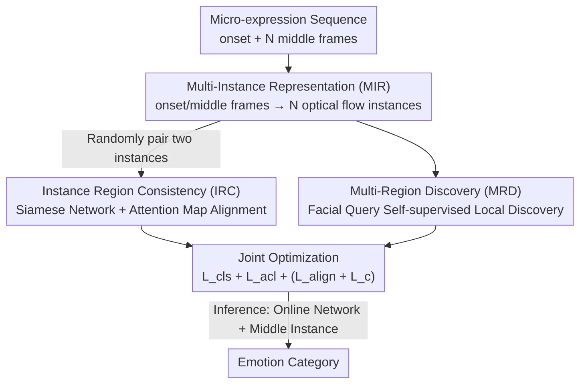

# Region-Aware Instance Consistency Learning for Micro-Expression Recognition

**Conference**: CVPR 2026  
**Paper**: [CVF Open Access](https://openaccess.thecvf.com/content/CVPR2026/html/Cai_Region-Aware_Instance_Consistency_Learning_for_Micro-Expression_Recognition_CVPR_2026_paper.html)  
**Code**: None  
**Area**: Human Understanding / Micro-Expression Recognition  
**Keywords**: Micro-Expression Recognition, Apex-free, Instance Consistency, Attention Consistency, Self-supervised

## TL;DR
This paper views a micro-expression sequence as a multi-instance set composed of "onset frame + multiple middle frames." By using a Siamese network to force the alignment of attention maps across different instances (IRC) and employing learnable facial queries to uncover neglected weak activation regions (MRD), the method completely eliminates the need for expensive apex frame annotations and outperforms state-of-the-art (SOTA) methods across four public datasets.

## Background & Motivation
**Background**: Micro-expressions (ME) are involuntary facial movements that occur when people try to suppress their emotions. They are very short in duration and extremely weak in intensity, making them valuable for lie detection and mental health assessment. The mainstream paradigm for micro-expression recognition (MER) involves manually labeling the **apex frame** (the frame with the maximum motion intensity) and calculating the optical flow between the onset and apex frames (e.g., TV-L1, optical strain), which is then fed into a classification model.

**Limitations of Prior Work**: This paradigm faces two major bottlenecks. First, apex annotation is extremely expensive; experts must scan the sequence frame-by-frame to locate the "most evident" moment. Second, micro-expression data is difficult to collect and label, resulting in small datasets. Since a sequence yields only **one** onset/apex pair, the available samples are scarce, leading to model overfitting on certain fixed activation regions. Recent self-supervised methods like AVF-MAE++ alleviate overfitting but require pre-training on large-scale external datasets, incurring high computational costs.

**Key Challenge**: There is a default assumption that "discriminative motion cues are only hidden in the apex frame," making apex labeling mandatory. However, this compresses a sequence of dozens of frames into a single sample, leading to extremely low data utilization.

**Key Insight**: The authors observe a key phenomenon (Fig. 1): compared to the onset frame, the activated facial regions across **every middle frame are spatially consistent, while the motion intensity simply varies along the timeline** (weak → strong → weak). This spatial stability suggests that effective motion information is not exclusive to the apex frame, and the intensity variations naturally provide data augmentation.

**Core Idea**: Instead of focusing on a single onset/apex pair, the authors represent a sequence as a **set of multiple onset/middle-frame optical flow instances**. They replace the "strong but unique" apex cue with "weak but diverse" motion cues. Two modules are designed to force the model to learn consistent and comprehensive activation region representations from these weak instances—this is named Region-aware Instance Consistency Learning (Ra-ICL).

## Method

### Overall Architecture
Ra-ICL addresses the problem of learning reliable micro-expression representations from weak motion sequences without apex annotations. It consists of three parts: **MIR** transforms the sequence into a set of optical flow instances (data generation); **IRC** uses a Siamese network to align attention across instances and locate global activation regions (backbone supervision); **MRD** uses learnable facial queries to self-supervise the discovery of neglected weak local regions. All three share a ResNet18 backbone and are trained jointly. During inference, only the online network and the middle-frame instance are used for classification.

### Key Designs

**1. Multi-Instance Representation (MIR): Replacing the Single Apex Instance with Weak Instances**

This step directly addresses expensive apex labeling and small data volumes. Instead of taking only the onset/apex pair, the authors **sample $N$ continuous frames from the middle** of the sequence. For each sampled frame $n$, the optical flow field $O_n=\{(u_n(x,y),v_n(x,y))\}$ (horizontal field $u_n$ + vertical field $v_n$) is computed relative to the onset frame using TV-L1. Optical strain (the first-order derivative of optical flow) is added as a third channel to form an RGB-like 3D tensor $I_n=[u_n,v_n,\epsilon_n]$, resulting in an instance set $\{I_n\}_{n=1}^N$. Why middle frames? Ideally, the middle window covers the apex frame. Even if it doesn’t, the window falls within either the activation or decay phase, **avoiding wasted frames at the ends of the sequence where motion is near zero**. These instances share similar activation regions but vary in intensity. The authors state that while this doesn't guarantee the highest intensity, it excludes the lowest intensity and provides data augmentation by expanding one sample into $N$ samples.

**2. Instance Region Consistency (IRC): Extracting Invariant Activation Regions via Cross-Instance Attention Alignment**

Simply having multiple instances is not enough; the model must know which regions are truly activated. IRC is based on the spatial stability hypothesis: instances in the same set share the same label and should activate consistent regions. It **randomly pairs two instances multiple times**, so low-intensity instances are repeatedly paired with high-intensity ones, allowing them to "learn from" the stronger instances. The network uses a BYOL-style Siamese structure: the online network $E_\theta$ and target network $E_\xi$ are isomorphic, and target parameters are updated via Exponential Moving Average $\xi=\tau\xi+(1-\tau)\theta$ ($\tau=0.99$). For a pair $(I_\theta,I_\xi)$, $I_\xi$ is horizontally flipped. Feature maps from both branches go through GAP + FC to compute classification loss $\mathcal{L}_{\text{cls}}=-\log\!\big(e^{\mathbf{W}_y\cdot f'_\theta}/\sum_j e^{\mathbf{W}_j\cdot f'_\theta}\big)$, and CAM is used to obtain class-specific attention maps $\mathbf{M}_j(x,y)=\sum_c \mathbf{W}_j(c)\cdot\mathbf{F}_c(x,y)$. The core is **flipped semantic consistency**, requiring the attention map of $I_\theta$ to align with the flipped attention map of $I_\xi$:

$$\mathcal{L}_{\text{acl}}=\frac{1}{LHW}\sum_{j=1}^{L}\big\|\mathbf{M}_{\theta j}-Flip(\mathbf{M}_{\xi j})\big\|_2.$$

In this way, high-intensity instances serve as "teachers" for low-intensity ones, enabling the localization of weak motion regions. Unlike external saliency detection models, this relies on internal data consistency for self-supervision.

**3. Multi-Region Discovery (MRD): Recovering Neglected Weak Regions via Learnable Facial Queries**

Supervised IRC tends to focus only on the most discriminative regions, neglecting lower-intensity but equally important areas, which can lead to misclassification between similar micro-expressions. MRD addresses this by using **learnable facial queries** (learnable positional embeddings) to "scan the whole face." A Transformer decoder uses $N$ queries as Query and the feature map $\mathbf{F}$ as Key/Value to decode $N$ facial regions $\mathbf{Q}\in\mathbb{R}^{N\times D}$. Each region $\mathbf{Q}_m$ and the projected dense features $\mathbf{F}^{dense}$ compute cosine similarity to get 2D heatmaps $\mathbf{S}_m=\mathrm{sim}(\mathbf{Q}_m,\mathbf{F}^{dense}_m)$, which are pixel-wise normalized into probability distributions $\mathbf{P}(u,v)$ (soft-assigning each pixel to $N$ regions). Based on spatial consistency, pixel assignments between branches must align, constrained by cross-entropy $\mathcal{L}_{\text{align}}=\frac{1}{HW}\sum_{u,v}\text{CrossEntropy}(\mathbf{P}_\xi(u,v),\mathbf{P}_\theta(u,v))$. Weighted Average Pooling (WAP) is then used to get local region embeddings $\mathbf{z}_m=H(\mathbf{P}_m\otimes\mathbf{F}^{dense})$, and cosine similarity ensures consistency between the two branches' local embeddings $\mathcal{L}_c=\frac{1}{N}\sum_m\text{sim}(\mathbf{z}_{\theta m},\mathbf{z}_{\xi m})$. This forces the model's attention to spread across more weak motion patterns.

### Loss & Training
The online and target networks are updated jointly (EMA). Classification, IRC, and MRD are performed simultaneously. The total objective is:

$$\mathcal{L}=\lambda_1\mathcal{L}_\text{cls}+\lambda_2\mathcal{L}_\text{acl}+\lambda_3(\mathcal{L}_\text{align}+\mathcal{L}_c),$$

where $\lambda_1=\lambda_2=\lambda_3=0.5$. The backbone is a randomly initialized ResNet18, $\tau=0.99$, MIR samples $N=16$ frames, and MRD uses 8 facial queries. Optimization uses Adam (lr=0.001, weight decay=1e-4), batch size 128, 100 epochs, and exponential learning rate decay (gamma=0.9) on a single 3090 Ti. Inference uses only the online network with the **middle-frame instance** as input.

## Key Experimental Results

Experiments were conducted on four public datasets: CASME II, SAMM, SMIC-HS (combined for Composite Database Evaluation/CDE) and CAS(ME)³. Metrics used are UF1 (Unweighted F1) and UAR (Unweighted Average Recall) with LOSO cross-validation.

### Main Results
Comparison with SOTA under CDE settings (UF1 / UAR, %):

| Dataset | Metric | Ra-ICL (Ours) | Prev. SOTA | Gain |
|--------|------|------|----------|------|
| Composite | UF1 | **88.05** | 86.03 (HTNet) | +2.02 |
| Composite | UAR | **89.11** | 86.88 (MFDAN) | +2.23 |
| CASME II | UF1 | **96.20** | 95.32 (HTNet) | +0.88 |
| SAMM | UF1 | **86.68** | 81.31 (HTNet) | +5.37 |
| SAMM | UAR | **88.85** | 82.60 (MPFNet) | +6.25 |
| SMIC-HS | UF1 | **81.79** | 80.49 (HTNet) | +1.30 |

On CAS(ME)³, Ra-ICL also achieved top rankings across all categories (UF1 / UAR, %):

| Setting | Metric | Ra-ICL | Prev. SOTA | Gain |
|------|------|--------|----------|------|
| 3-class | UF1 | **75.85** | 68.19 (Lite-Point-GCN) | +7.66 |
| 4-class | UF1 | **61.03** | 47.64 (Lite-Point-GCN) | +13.39 |
| 7-class | UF1 | **44.32** | 35.64 (Lite-Point-GCN) | +8.68 |

Notably, these results were achieved **without any apex frame annotations**, showing significant leads on challenging datasets like SAMM and CAS(ME)³.

### Ablation Study
CDE setting, using configuration M6 (full model) as the baseline for Composite UF1 / UAR (%):

| Config | MIR | IRC | MRD | UF1 | UAR | Note |
|------|-----|-----|-----|-----|-----|------|
| M1 | →Apex* | ✗ | ✗ | 83.22 | 82.64 | Single onset/apex instance baseline |
| M2 | ✓ | ✗ | ✗ | 84.91 | 83.72 | Only MIR; already exceeds apex baseline |
| M4 | ✓ | ✗ | ✓ | 86.18 | 85.92 | MIR+MRD; lacks supervised backbone |
| M5 | ✓ | ✓ | ✗ | 85.81 | 85.46 | MIR+IRC; lacks weak region recovery |
| M6 (ours) | ✓ | ✓ | ✓ | **88.05** | **89.11** | Full Model |

Different sampling strategies (all with IRC+MRD):

| Config | Sampling | UF1 | UAR | Note |
|------|------|-----|-----|------|
| M6 | Middle 16 frames | 88.05 | 89.11 | No apex needed; low flow cost |
| M7 | →Apex-centered 16 | 87.73 | 88.73 | Uses apex info; no performance gain |
| M8 | →All frames | 88.26 | 88.21 | Higher diversity but introduces noise |
| M9 | →Random 16 | 87.89 | 87.87 | Random is also effective |
| M11 | →Activation phase | 86.62 | 87.63 | Explicitly excludes apex; still competitive |
| M12 | →Decay phase | 87.61 | 87.55 | Proves non-apex frames contain valid motion |

### Key Findings
- **MIR is the Foundation**: Moving from M1 to M2 (switching to multi-instance) improved UF1 by 1.7%, supporting the claim that "motion cue diversity is more important than intensity," challenging the "apex frame is most discriminative" dogma.
- **IRC and MRD are Complementary**: Removing IRC (M4) or MRD (M5) leads to performance drops. They respectively handle global invariant activation localization and the recovery of neglected weak regions.
- **Apex is Truly Unnecessary**: M7 (using apex-centered sampling) did not outperform M6 (middle sampling). M11/M12 (excluding apex frames) remained competitive, proving the model learns effective information from non-apex frames.
- **Error Source**: Confusion matrices show errors primarily occur when "Positive is misclassified as Negative," attributed to the bias from the large number of Negative samples.

## Highlights & Insights
- **Revisiting the Input Unit**: Changing "one sequence = one onset/apex sample" to "one sequence = a set of weak instances" solves both expensive annotation and data scarcity. This strategy of "rethinking data representation" is highly transferable to other low-resource tasks.
- **Consistency as Free Supervision**: Flipped attention consistency in IRC and pixel assignment/embedding consistency in MRD utilize internal spatial stability for self-supervision. No external saliency models or large datasets are required.
- **"High-intensity Guides Low-intensity"**: The random pairing design allows weak instances to be paired with strong ones, acting as implicit distillation to "light up" weak motion regions.
- **MRD Counters Discriminative Bias**: Using learnable queries to scan the face and force attention to spread fixes the tendency of CAM methods to focus only on locally salient regions, which is crucial for distinguishing similar micro-expressions.

## Limitations & Future Work
- The model is sensitive to class imbalance; higher Negative sample counts lead to systematic Positive→Negative misclassification without explicit rebalancing.
- Middle sampling assumes coverage of activation/decay phases; its robustness across widely varying frame rates or extremely short sequences is unknown ⚠️.
- The method still relies on TV-L1 optical flow; end-to-end motion learning from raw frames is a potential improvement.
- Inference currently uses a fixed "middle instance"; exploring multi-instance ensemble inference could yield further gains.

## Related Work & Insights
- **vs. Apex-based Methods (HTNet, MFDAN, FRL-DGT, etc.)**: These require onset/apex pairs, depend on apex labels, and yield only one sample per sequence. Ra-ICL eliminates labels and maximizes data utility, leading by 5.37% UF1 on SAMM.
- **vs. External Pre-training (AVF-MAE++, Micron-BERT)**: Those methods rely on external large-scale data or multi-modality pre-training. Ra-ICL is more efficient by using self-supervision within small-scale ME data.
- **vs. Random Frame-Pair Methods (FRL-DGT, MARNet)**: While those also sample multiple frames to avoid external data, Ra-ICL adds dual-consistency constraints (IRC+MRD) and middle-sampling to filter noise.

## Rating
- Novelty: ⭐⭐⭐⭐⭐ The "sequence → multi-weak-instance" paradigm is a brilliant way to bypass apex labels.
- Experimental Thoroughness: ⭐⭐⭐⭐⭐ Extensive results across four datasets with detailed ablation on sampling and modules.
- Writing Quality: ⭐⭐⭐⭐ Motivations and modules are clear, though mathematical notation is somewhat dense.
- Value: ⭐⭐⭐⭐⭐ Eliminating apex labels provides genuine engineering and methodological value for low-resource micro-expression tasks.

<!-- RELATED:START -->

## Related Papers

- [\[CVPR 2026\] CLEX: Complementary Label Exchange Learning for Noisy Facial Expression Recognition](clex_complementary_label_exchange_learning_for_noisy_facial_expression_recogniti.md)
- [\[ICLR 2026\] From Pixels to Semantics: Unified Facial Action Representation Learning for Micro-Expression Analysis](../../ICLR2026/human_understanding/from_pixels_to_semantics_unified_facial_action_representation_learning_for_micro.md)
- [\[CVPR 2026\] OMG-Bench: A New Challenging Benchmark for Skeleton-based Online Micro Hand Gesture Recognition](omg-bench_a_new_challenging_benchmark_for_skeleton-based_online_micro_hand_gestu.md)
- [\[CVPR 2026\] Dynamic Label Noise Suppression with Optimal Teacher Pool for Facial Expression Recognition](dynamic_label_noise_suppression_with_optimal_teacher_pool_for_facial_expression_.md)
- [\[CVPR 2026\] D³FER: Dual Channel and Dual Branch Network for Robust Facial Expression Recognition under Dual Challenges](d3fer_dual_channel_and_dual_branch_network_for_robust_facial_expression_recognit.md)

<!-- RELATED:END -->
