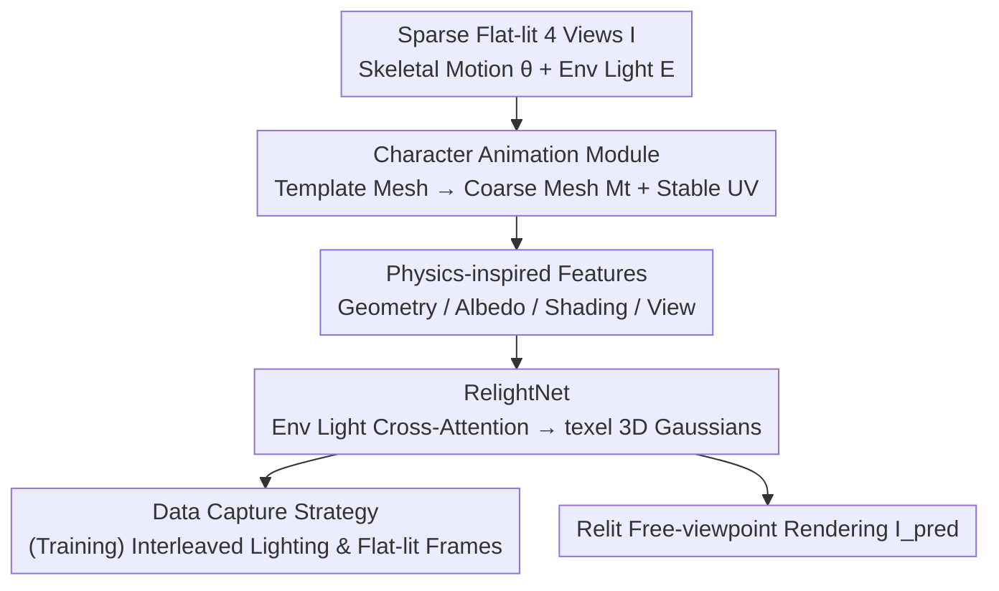

# Relightable Holoported Characters: Capturing and Relighting Dynamic Human Performance from Sparse Views

**Conference**: CVPR 2026  
**Paper**: [CVF Open Access](https://openaccess.thecvf.com/content/CVPR2026/html/Singh_Relightable_Holoported_Characters_Capturing_and_Relighting_Dynamic_Human_Performance_from_CVPR_2026_paper.html)  
**Code**: None  
**Area**: 3D Vision / Human Reconstruction and Relighting  
**Keywords**: Full-body Relighting, Sparse Views, 3D Gaussian, Rendering Equation, Light Stage

## TL;DR
RHC utilizes a transformer network, RelightNet, to perform cross-attention between "physics-inspired features (geometry/albedo/shading/view)" and environment lighting to implicitly solve the rendering equation in a **single forward pass**. It enables photo-realistic, free-viewpoint relighting of dynamic full-body characters with unseen motions from just 4 flat-lit cameras—avoiding slow OLAT-based acquisition and achieving significantly higher clarity than inverse rendering methods.

## Background & Motivation
**Background**: Creating "digital twins" of real people with controllable viewpoints and lighting is a core requirement for VR telepresence, film, and gaming. Mainstream approaches are divided into two categories: **inverse rendering** from mono/multi-view natural light videos, which uses analytical BRDFs (Microfacet / Disney / Lambertian) to decompose appearance into geometry, material, and light; and **Light Stage** setups with programmable LEDs to capture OLAT (one-light-at-a-time) data, synthesizing arbitrary lighting through linear superposition of light transport.

**Limitations of Prior Work**: Inverse rendering suffers from inherent ambiguities between geometry, material, and lighting, and simplified BRDFs cannot compensate for tracking errors, leading to limited relighting clarity. OLAT-based methods require the subject to remain static and necessitate exhausting the "light × view × dynamic geometry" combinations, which is impractical for dynamic full-body characters—non-rigid deformations of clothing violate the static scene assumption of linear superposition, causing geometric errors to contaminate the relighting results. Consequently, these methods are either limited to easily trackable rigid parts (faces, hands) or can only "playback" pre-recorded performances without generalizing to new motions.

**Key Challenge**: Photo-realism requires precise lighting control from a Light Stage, but precise OLAT acquisition is inherently incompatible with "dynamic full-body + arbitrary new motions." Conversely, inverse rendering capable of handling dynamics sacrifices realism due to the infeasibility of explicitly solving the rendering equation, relying instead on coarse BRDF approximations.

**Goal**: Achieve controllable, photo-realistic relighting of dynamic characters with unseen full-body motions from **sparse flat-lit views** (4 cameras) available at inference time, completed in a single forward pass.

**Key Insight**: Instead of explicitly solving the rendering equation, the authors **let the network learn it implicitly**. By approximating the terms of the rendering equation (geometry, albedo, shading, view) as feature maps in UV space and feeding them to the network, the integration task—accumulating light from all incident directions for each surface point—is modeled as cross-attention between texels and the environment map.

**Core Idea**: Use "physics-inspired features + environment light cross-attention" to implicitly compute the rendering equation in a single forward pass, outputting texel-aligned 3D Gaussians attached to a coarse mesh.

## Method

### Overall Architecture
The input consists of 4-view sparse images $I$ under flat lighting, skeletal motion $\theta$, a target environment HDR map $E$, and target camera parameters. The output is a photo-realistic relit image $I_{pred}$ under the target view and lighting. The pipeline consists of three steps: first, the **Character Animation Module** drives a personalized template mesh according to the skeleton to create a coarse mesh $M_t$ that roughly matches the observations, providing stable UV parametrization; second, **physics-inspired features** (geometry/albedo/shading/view) are extracted in this UV space to approximate the terms of the rendering equation; finally, **RelightNet** performs cross-attention between these features and the environment light to regress texel-aligned 3D Gaussian parameters $g$, which are placed in global space and rasterized. Crucially, the rendering equation's integral is not evaluated at inference; only a single forward pass is executed.

### Key Designs

**1. Physics-inspired Features: Decomposing the Rendering Equation into UV-space Approximations**

The rendering equation $L_o(x,\omega_o)=\rho(x)\int_{\omega_i} f_r(x,\omega_i,\omega_o)L_i(x,\omega_i)V(x,\omega_i)\langle\omega_i,n\rangle\,d\omega_i$ is nearly impossible to solve directly for a deforming body with tracking noise: geometry is over-smoothed, and simple BRDFs cannot describe complex materials like skin or fabric. The authors' solution is to not recover the true albedo and BRDF, but to **approximate the four terms** (geometry, albedo, shading, view) as UV feature maps, letting RelightNet compensate for the residuals between these approximations and the true appearance.

Specifically: **Geometry features** use a stack of 3-frame mesh normals $\tilde n=\{n_{t-2},n_{t-1},n_t\}$ for temporal structure, combined with high-frequency normals $\hat n$ estimated from input images via Sapiens and back-projected to UV space, plus a position map $p$ for near-field inter-reflections. **Albedo features** leverage the approximation "flat-lit appearance ≈ surface albedo," back-projecting input images to UV space to get an initial $\rho$ with holes, which is then inpainted by AlbedoNet $\hat\rho=\mathcal H(\rho,\tilde n,\gamma)$. **Shading features** only compute the pre-integrated diffuse reflection of the direct environment light $d=\int_{\omega_i}L_i(x,\omega_i)V(x,\omega_i)\langle\omega_i,n\rangle\,d\omega_i$, allowing the network to focus on high-frequency appearance. **View features** $\gamma$ represent the direction from the position map to the camera origin for each texel.

**2. RelightNet: Modeling "Integration over all Directions" via Cross-Attention**

The challenge is that the integral over incident directions is computationally heavy. RelightNet transforms this into an attention mechanism: the network $g=\mathcal F(f;E),\ f=\{\tilde n,\hat n,p,\hat\rho,d,\gamma\}$ is a 2D convolutional network in UV space using mixed convolutions, self-attention, and **cross-attention** layers. It linearly projects the flattened environment light (with 2D positional encoding) into $(K_e,V_e)$ and each texel feature into $Q_f$ for multi-head cross-attention—this directly corresponds to each texel aggregating light contributions from all directions. The output is **not the final RGB**, but texel-aligned 3D Gaussian parameters: position $p_i$, scale $s_i$, rotation $r_i$, opacity $o_i$, and color $c_i$. The network predicts offsets relative to the mesh surface. While diffuse reflection and self-shading are explicitly modeled by $d$, the end-to-end RelightNet learns full light transport—specular reflections (via $\gamma$ and cross-attention on $E$) and subsurface scattering (via geometry and UV self-attention).

**3. Interleaved Data Capture: Alternating Env-lit and Flat-lit Tracking Frames**

Training RelightNet requires satisfying three conflicting needs: diverse lighting coverage, diverse motion coverage, and reliable geometric tracking. Traditional OLAT is linear in cost with respect to lighting conditions and fails for dynamics due to cumulative geometric errors. The authors **interleave two types of frames** in a multi-view Light Stage: ① "Relit frames" using random environment maps projected onto LEDs; ② "Tracking frames" under uniform flat lighting. This interleaving ensures that geometry and lighting are densely aligned in time. Flat-lit frames provide robust tracking for non-rigid clothing and serve as a texture reference for adjacent relit frames, enabling end-to-end training of the feed-forward RelightNet **without analytical decomposition of material and light**. A large-scale dataset of 5 subjects and 1000+ natural lighting conditions is released as a benchmark.

### Loss & Training
A separate model is **trained for each subject** (comprising character animation $G$, AlbedoNet $\mathcal H$, and RelightNet $\mathcal F$). Among 40 cameras, 37 are used for training and 3 for testing. Training uses 1015 HDR environment maps from Laval Indoor, while testing uses 8 unseen maps. Each subject set includes approximately 28,420 training frames and 14,336 test frames, captured at 60 Hz with an even split between flat-lit and relit frames. Test sequences are recorded separately and contain unseen motions. (⚠️ Full loss formulations are provided in the supplementary material).

## Key Experimental Results

### Main Results
Evaluation was conducted on 5 subjects with different clothing using PSNR / LPIPS / SSIM. The following table highlights the performance (LPIPS and SSIM scaled by 100 in the original text):

| Method | S1 PSNR↑ | S1 LPIPS↓ | S1 SSIM↑ | S5 PSNR↑ | S5 LPIPS↓ | S5 SSIM↑ |
|------|----------|-----------|----------|----------|-----------|----------|
| R4D + GT Env | 29.89 | 10.31 | 87.15 | 29.11 | 8.48 | 84.04 |
| IA + GT Env | 27.25 | 18.25 | 81.39 | 28.61 | 16.94 | 80.35 |
| MA + GT Env | 28.52 | 10.44 | 82.76 | 30.01 | 8.42 | 84.20 |
| HPC | 25.84 | 11.41 | 88.04 | 27.08 | 9.00 | 84.37 |
| HPC + NG | 30.52 | 8.75 | 87.49 | 30.52 | 8.41 | 80.41 |
| **Ours (RHC)** | **31.38** | **7.01** | **90.00** | **32.07** | **5.55** | **89.34** |

RHC leads across almost all subjects and metrics. Note that inverse rendering methods (IA/MA) are limited by SMPL tracking and BRDF assumptions even with ground-truth lighting. HPC achieves sharp details under flat light but is not inherently relightable; applying NG for relighting introduces inconsistent shading and artifacts in fine structures like the face.

### Ablation Study
| Configuration | PSNR↑ | LPIPS↓ | SSIM↑ | Description |
|------|-------|--------|-------|------|
| Ours w/o geometry features | 31.73 | 5.58 | 89.01 | Loses ability to correct pose errors |
| Ours w/o albedo feature | 31.82 | 5.78 | 88.53 | Cannot correct texture drift from tracking |
| Ours w/o diffuse shading | 31.59 | 5.74 | 88.80 | Loses explicit self-shadowing, worse occlusions |
| Ours w/o camera encoding | 31.52 | 5.68 | 88.77 | Fails to model view-dependent effects |
| Ours w/o cross attention | 31.88 | 5.56 | 89.18 | Concatenating env light limits conditioning |
| Ours w/ sparse-view tracking | 30.72 | 6.06 | 87.83 | Sparse 4-view tracking leads to hand errors |
| Ours w/ 0 input views (pose only) | 31.39 | 6.23 | 87.50 | Pure pose-based inference without images |
| OLAT data capture | 26.42 | 10.46 | 89.86 | Training on OLAT data causes error accumulation |
| **Ours (full)** | **32.07** | **5.55** | **89.34** | Full model |

### Key Findings
- **Geometry features contribute the most**: Their removal leads to the most significant performance drop, as the model loses the ability to correct pose-related errors and fails to preserve high-frequency wrinkles.
- **The capture strategy is a core contribution**: Replacing the interleaved strategy with "OLAT capture" causes PSNR to plummet from 32.07 to 26.42, validating the advantage of "relit-frame/flat-lit-frame" interleaving.
- **Generalization to unseen OLAT lighting**: Although the model was not trained on OLAT environments, it generalizes well to single-light conditions.

## Highlights & Insights
- **Integral as Attention**: Transforming the integration over incident directions into a cross-attention mechanism between texel Queries and environment light Keys/Values is a mathematically elegant and physically justified design.
- **Learning Residuals from Physics Primaries**: Instead of forcing explicit decomposition (the source of ambiguity in inverse rendering), the model uses physics-inspired approximations as inputs and learns the residual, resulting in both stability and realism.
- **Interleaved Capture Logic**: Using flat-lit frames as "tracking anchors and texture references" and relit frames for "relighting supervision" solves the deadlock of dynamic OLAT feasibility.
- **3D Gaussian Output**: Predicting texel-aligned Gaussians initialized from the mesh ensures inherent 3D and temporal consistency, avoiding the artifacts common in pure 2D diffusion-based relighting.

## Limitations & Future Work
- **Person-specific nature**: Each subject requires a dedicated model, necessitating retraining for every new person.
- **Reliance on Light Stage training data**: While inference requires only 4 cameras, training depends on expensive Light Stage hardware.
- **Sparse-view tracking errors**: Actual 4-view skeletal tracking is less accurate than dense-view tracking, with the primary bottleneck being hand precision.
- **Comparison gaps**: Lacks direct comparison with "Relightable Full Body Gaussian Codec Avatars [52]" due to the absence of open-source code.

## Related Work & Insights
- **vs Inverse Rendering (R4D / IA / MA)**: These methods explicitly decompose appearance into components using analytical BRDFs; RHC uses physics-inspired features and a network to implicitly solve the rendering equation, avoiding decomposition ambiguities and achieving higher clarity.
- **vs OLAT / Light Stage**: Traditional methods rely on linear superposition for static or playback-only scenes; RHC uses a feed-forward network to generalize to unseen motions.
- **vs HPC (Holoported Characters)**: HPC provides sharp free-viewpoint rendering but is not relightable; RHC integrates relighting natively into the representation using 3D Gaussians.

## Rating
- Novelty: ⭐⭐⭐⭐⭐ Transforming the rendering integral into cross-attention is a brilliant and self-consistent idea.
- Experimental Thoroughness: ⭐⭐⭐⭐ Extensive testing on 5 subjects and multiple baselines, though person-specific.
- Writing Quality: ⭐⭐⭐⭐⭐ Very clear logic connecting motivation to the rendering equation terms.
- Value: ⭐⭐⭐⭐⭐ The first method to achieve sparse-view, unseen-motion, single-pass full-body relighting.

<!-- RELATED:START -->

## Related Papers

- [\[ECCV 2024\] 3DFG-PIFu: 3D Feature Grids for Human Digitization from Sparse Views](../../ECCV2024/human_understanding/3dfg-pifu_3d_feature_grids_for_human_digitization_from_sparse_views.md)
- [\[CVPR 2026\] FusionAgent: A Multimodal Agent with Dynamic Model Selection for Human Recognition](fusionagent_a_multimodal_agent_with_dynamic_model_selection_for_human_recognitio.md)
- [\[CVPR 2026\] FisherPoser: Human Motion Estimation from Sparse Observations with Hierarchical Region-Wise Fisher-Matrix Uncertainty Modeling](fisherposer_human_motion_estimation_from_sparse_observations_with_hierarchical_r.md)
- [\[CVPR 2026\] Ultra Diffusion Poser: Diffusion-Based Human Motion Tracking From Sparse Inertial Sensors and Ranging-Based Between-Sensor Distances](ultra_diffusion_poser_diffusion-based_human_motion_tracking_from_sparse_inertial.md)
- [\[CVPR 2026\] Beyond Scanpaths: Graph-Based Gaze Simulation in Dynamic Scenes](beyond_scanpaths_graph-based_gaze_simulation_in_dynamic_scenes.md)

<!-- RELATED:END -->
