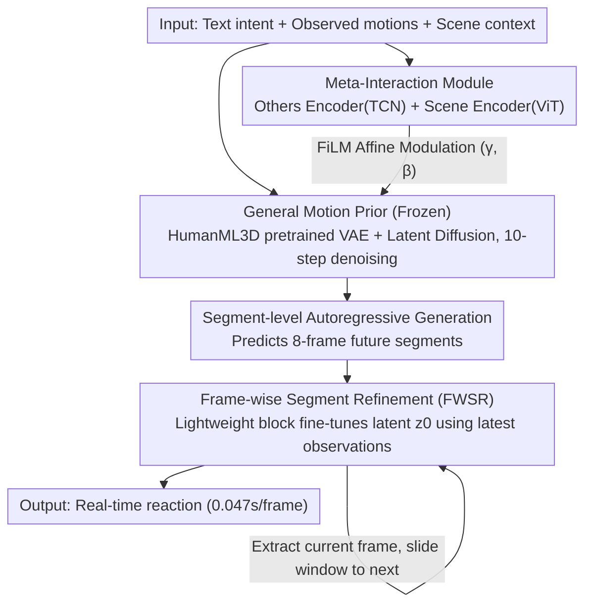

# ReMoGen: Real-time Human Interaction-to-Reaction Generation via Modular Learning from Diverse Data

**Conference**: CVPR 2026  
**arXiv**: [2604.01082](https://arxiv.org/abs/2604.01082)  
**Code**: None  
**Area**: Human Motion Generation / Human Understanding / Interaction Motion Generation  
**Keywords**: Interaction Reaction Generation, Modular Learning, Motion Prior, Real-time Generation, Human-Human/Human-Scene Interaction

## TL;DR

ReMoGen is proposed as a modular framework for real-time human interaction-to-reaction motion generation. It leverages a frozen general motion prior learned from large-scale single-person motion data, adapts to different interaction domains (human-human/human-scene) via independently trained Meta-Interaction modules, and introduces Frame-wise Segment Refinement to achieve low-latency online updates (0.047s/frame), outperforming SOTA on Inter-X and LINGO datasets.

## Background & Motivation

1. **Background**: Human motion generation has evolved from text-driven single-person motion to multi-agent interaction scenarios. Existing methods include: text-to-motion (T2M, MotionDiffuse) which generates isolated actions; human-scene interaction (TRUMANS, LINGO) which introduces spatial awareness but is limited to single individuals; and human-human interaction (ReGenNet, FreeMotion) which attempts joint generation mostly in offline modes.
2. **Limitations of Prior Work**: 
    - **Data Scarcity and Heterogeneity**: Single-person motion data is abundant (HumanML3D), but human-human (Inter-X) and human-scene (LINGO) interaction data are scarce with large distribution differences. End-to-end training overfits to a single domain.
    - **Real-time Responsiveness**: Diffusion models offer high quality but high latency, making them unsuitable for real-time use; autoregressive models are fast but suffer from error accumulation leading to drift.
    - Most existing methods assume full observation of the partner's complete trajectory, which is infeasible in actual online interaction.
3. **Key Challenge**: How to achieve high-fidelity and low-latency interaction reaction generation simultaneously under data scarcity conditions.
4. **Goal**: (1) Efficient knowledge transfer across heterogeneous interaction domains; (2) Real-time responsiveness without sacrificing motion quality.
5. **Key Insight**: Decoupling general motion prior learning from interaction-specific adaptation—freezing a backbone pretrained on massive single-person data and injecting interaction awareness through lightweight modules.
6. **Core Idea**: Prior-guided modular learning + Frame-wise Segment Refinement. The former addresses data heterogeneity, while the latter addresses real-time requirements.

## Method

### Overall Architecture

The input consists of text intent, observed motions of other agents, and scene context. ReMoGen comprises three components: (1) A frozen text-conditioned single-person motion prior (VAE + Latent Diffusion Model pretrained on HumanML3D); (2) Meta-Interaction modules (adapters independently trained for HHI and HSI); (3) Frame-wise Segment Refinement (FWSR, a lightweight frame-by-frame correction module). Generation follows a segment-level autoregressive manner: predicting a future segment $\hat{M}_f^i \in \mathbb{R}^{F \times D}$ conditioned on a history window $M_h^i \in \mathbb{R}^{H \times D}$ and text $W$ (where $H=2$ frames and $F=8$ frames).

### Key Designs

**1. General Motion Prior: Freezing the motion base learned from large-scale single-person data**

Interaction data (human-human in Inter-X, human-scene in LINGO) is sparse and distinct. End-to-end training on a single domain causes the model to overfit quickly and lose general kinematic common sense. ReMoGen first trains a strong prior on the massive HumanML3D dataset and freezes it. Following the DART architecture, a Transformer VAE compresses a motion segment into a latent representation $z$. A conditional diffusion denoiser $G_\psi$ iteratively denoises $z$ under text embedding $w$ and history window conditions to decode back to motion (10 diffusion steps, 10 FPS):

$$\hat{z}_0 = G_\psi(z_t, t, M_h^i, w)$$

Freezing this is the anchor of the method—ablation shows that joint fine-tuning of the prior drags the FID from 0.181 to 0.298, proving that interaction training erodes pretrained kinematic knowledge.

**2. Meta-Interaction Module: Injecting "what others are doing and scene layout" into the frozen prior**

The prior alone generates single-person motions and is unaware of interactions. A bypass is needed to feed interaction cues without modifying prior parameters. Two independent encoders process the interaction context: the Others Encoder (TCN) extracts relative velocity, approach direction, and spatial relationships from the partner's trajectory; the Scene Encoder (ViT) summarizes surrounding geometry and functional spaces. Injection occurs in the Meta-Interaction Block—self-attention is applied to ego features to get $h'$, then cross-attention with interaction cues extracts signals, which are converted into FiLM-style affine parameters $(\gamma, \beta)$ to modulate the features:

$$h_{mod} = (1 + \tanh\gamma) \odot h' + \tanh\beta$$

This "feature-level affine only, no weight modification" approach allows modules for each domain to be trained independently (HHI on Inter-X, HSI on LINGO), bypassing the difficulty of training on heterogeneous data. During inference, multiple modules can be mixed via $\Delta_{total} = \sum_i \alpha_i \Delta_i$ (with L2-norm clamp) to handle hybrid scenarios.

**3. Frame-wise Segment Refinement (FWSR): Layering frame-by-frame fine-tuning over segment generation**

Segment-level autoregression faces a latency-quality trade-off: longer segments are more dynamically stable but slower to respond. FWSR maintains the quality of long segments while applying a lightweight Meta-Interaction Block to the initial latent $z_0$ at each frame within the segment to incorporate the latest observed cues:

$$\hat{z}^f = \text{Modulate}(z_0, \text{concat}(M_h^{(f-1)}, X_{dyn}^{(f)}))$$

Only the prediction at the current frame is taken, and the history buffer is updated. The large backbone handles stable long-term dynamics, while the lightweight adapter handles fast, fine-grained reactions. FWSR training freezes both the prior and Meta-Interaction modules.

### Loss & Training

- **Phased Training**: Prior pretrained on HumanML3D → Meta-Interaction modules trained for 65k iterations (prior frozen) → FWSR trained for 65k steps (prior and Meta-Interaction frozen).
- **Objectives**: Reconstruction loss $L_{rec}$, latent space loss $L_{latent}$, and auxiliary temporal delta loss $L_{aux}$.
- **Optimizer**: AdamW (lr=1e-4), batch size 1024, gradient clipping 1.0, EMA 0.999.
- Trainable on a single NVIDIA RTX 3090.

## Key Experimental Results

### Main Results

**Human-Human Interaction (Inter-X)**

| Method | FID ↓ | R-Prec.(Top3) ↑ | MM Dist. ↓ | Latency (s/frame) ↓ |
|------|-------|-----------------|-----------|---------------------|
| ReGenNet | 11.622 | 0.269 | 6.092 | 0.210 |
| FreeMotion | 3.383 | 0.284 | 5.438 | 0.221 |
| SymBridge | 2.569 | 0.355 | 4.955 | 0.040 |
| **Ours** | **0.181** | **0.464** | **4.076** | 0.042 |
| **Ours+FWSR** | **0.166** | 0.462 | **4.076** | 0.047 |

**Human-Scene Interaction (LINGO)**

| Method | FID ↓ | R-Prec.(Top3) ↑ | MM Dist. ↓ | Latency ↓ |
|------|-------|-----------------|-----------|-----------|
| TRUMANS | 4.731 | 0.178 | 10.822 | 0.074 |
| LINGO | 3.633 | 0.218 | 9.597 | 0.189 |
| **Ours** | **1.201** | **0.530** | **3.408** | **0.042** |

### Ablation Study

**Ablation on Motion Prior Usage (Inter-X)**

| Configuration | FID ↓ | R-Prec. ↑ | MM Dist. ↓ |
|------|-------|-----------|-----------|
| Prior Only | 3.735 | 0.231 | 5.736 |
| No Prior | 0.270 | 0.412 | 4.385 |
| Joint-Finetune | 0.298 | 0.439 | 4.188 |
| **Ours (Frozen Prior + Module)** | **0.181** | **0.464** | **4.076** |

**FWSR Ablation**

| Configuration | FID ↓ | Latency ↓ |
|------|-------|-----------|
| Segment Autoreg. | 0.181 | 0.042 |
| Slide window per frame | 4.136 | 0.305 |
| **Segment + FWSR** | **0.166** | 0.047 |

### Key Findings

- **Frozen Prior + Modular Adaptation is superior to Joint-Finetuning**: FID 0.181 vs 0.298; joint fine-tuning erodes pretrained kinematic knowledge.
- **FWSR yields significant quality gains with minimal latency (0.042→0.047s)**: FID improves from 0.181 to 0.166.
- **Zero-shot Compositional Generalization**: Combining HHI and HSI modules on EgoBody ($\alpha_{HHI}=\alpha_{HSI}=0.5$) outperforms zero-shot single modules.
- **Prior initialization allows surpassing 500k-step training from scratch within just 2k-10k fine-tuning steps** (EgoBody).
- Real-time threshold of 0.1s/frame is comfortably met (0.042-0.047s/frame), whereas ReGenNet and FreeMotion fail.

## Highlights & Insights

- **Elegant modular decoupling**: The design philosophy of prior (motion base), Meta-Interaction (interaction awareness), and FWSR (real-time responsiveness) is orthogonal and independently optimizable. This pattern is transferable to other generation tasks under data scarcity.
- **The FiLM-modulated Meta-Interaction Block** provides a robust adapter design paradigm for motion generation—injecting signals via feature-level affine transforms without touching base parameters.
- **Compositional Inference** (weighted mixing of modules) allows the framework to naturally support mixed interaction scenarios without retraining.

## Limitations & Future Work

- Currently limited to two-person and simple scene interactions; does not cover multi-person group dynamics.
- Composition weights $\alpha_i$ for Meta-Interaction require manual setting; adaptive learning could be explored.
- Scene encoding uses voxelized 3D occupancy, which may lack precision for fine-grained object interaction (e.g., manipulating items on a desk).
- Fine-grained hand interactions (e.g., handshaking, handing over objects) are not addressed.
- FWSR might react insufficiently during extremely abrupt motion changes.

## Related Work & Insights

- **vs SymBridge**: Both are real-time, but SymBridge focuses on human-robot interaction and suffers higher FID (2.569 vs 0.181). ReMoGen significantly improves quality through stronger priors.
- **vs FreeMotion**: FreeMotion's offline version has an FID of 0.492 but unacceptable latency; ReMoGen achieves better FID (0.166) in real-time.
- **vs ControlNet/LoRA Paradigm**: ReMoGen successfully transfers adapter design patterns from image generation to motion generation, using FiLM modulation in place of additive injection.

## Rating

- Novelty: ⭐⭐⭐⭐ The three-layer design (prior freezing + modular adaptation + frame-wise refinement) is clear and innovative, though individual components (FiLM, segment autoregression) are existing techniques.
- Experimental Thoroughness: ⭐⭐⭐⭐⭐ Comprehensive experiments across HHI/HSI/Hybrid scenarios, detailed ablations, and EgoBody transfer experiments.
- Writing Quality: ⭐⭐⭐⭐ Problem definition is clear, and the four research questions structure the experiments well.
- Value: ⭐⭐⭐⭐ Real-time interaction reaction generation is a crucial but overlooked problem; this framework provides an extensible solution.

<!-- RELATED:START -->

## Related Papers

- [\[CVPR 2026\] Real-Time Multimodal Fingertip Contact Detection via Depth and Motion Fusion for Vision-Based Human-Computer Interaction](real-time_multimodal_fingertip_contact_detection_via_depth_and_motion_fusion_for.md)
- [\[CVPR 2026\] PolySLGen: Online Multimodal Speaking-Listening Reaction Generation in Polyadic Interaction](polyslgen_online_multimodal_speaking-listening_reaction_generation_in_polyadic_i.md)
- [\[CVPR 2026\] Avatar Forcing: Real-Time Interactive Head Avatar Generation for Natural Conversation](avatar_forcing_real-time_interactive_head_avatar_generation_for_natural_conversa.md)
- [\[CVPR 2026\] MimicTalker: A Multimodal Interactive and Memory-Enhanced Framework for Real-Time Dyadic 3D Head Generation](mimictalker_a_multimodal_interactive_and_memory-enhanced_framework_for_real-time.md)
- [\[CVPR 2026\] Interact2Ar: Full-Body Human-Human Interaction Generation via Autoregressive Diffusion Models](interact2ar_full-body_human-human_interaction_generation_via_autoregressive_diff.md)

<!-- RELATED:END -->
