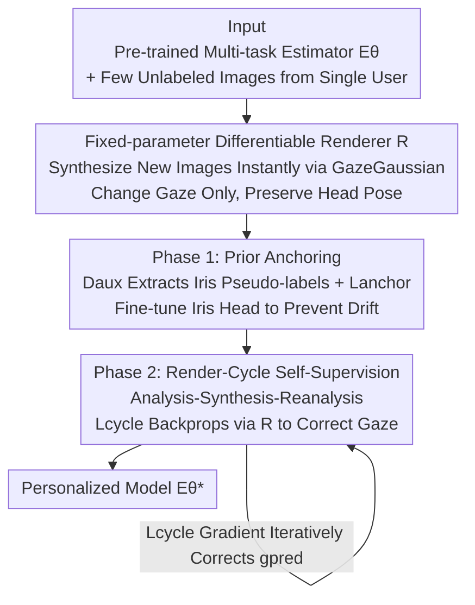

# Render-to-Adapt: Unsupervised Personal Adaptation for Gaze Estimation

**Conference**: CVPR 2026  
**Paper**: [CVF Open Access](https://openaccess.thecvf.com/content/CVPR2026/html/Ge_Render-to-Adapt_Unsupervised_Personal_Adaptation_for_Gaze_Estimation_CVPR_2026_paper.html)  
**Code**: Not mentioned  
**Area**: Human Understanding / Gaze Estimation  
**Keywords**: Gaze Estimation, Unsupervised Personal Adaptation, Differentiable Rendering, Self-Supervised Learning, Test-Time Adaptation

## TL;DR
This paper argues that the group-level assumptions of mainstream Unsupervised Domain Adaptation (UDA) are disconnected from real-world scenarios where systems serve only one new user at a time. It proposes a new paradigm, **Unsupervised Personal Adaptation (UPA)**, and constructs a **Render-Cycle consistency** self-supervision signal using a fixed-parameter differentiable renderer. By rendering predicted gaze into a new image and reading back the iris position, the method uses the consistency of iris locations to backpropagate and correct gaze deviations. This approach achieves stable gains for **every user** in cross-dataset person-specific adaptation, significantly outperforming existing SOTAs.

## Background & Motivation

**Background**: Appearance-based gaze estimation, which directly regresses gaze direction from face or eye images using deep networks, has matured. however, model error rises sharply when encountering new users, backgrounds, or lighting conditions, which remains a core challenge in the field. To bridge this gap, the community extensively utilizes **Unsupervised Domain Adaptation (UDA)**: assuming labeled source domain data and unlabeled target domain data are available to align distribution characteristics across groups, thereby improving the **average** performance on the target domain.

**Limitations of Prior Work**: The authors identify two flaws in UDA for real deployment through validation experiments. First, the **task setting is unrealistic**—scenarios like consumer electronics or driver monitoring involve facing only **one** new user, whereas UDA requires accumulating a target dataset of "that user + dozens of others" for group-level adaptation. Second, it is **unreliable at the individual level**—personalized analysis of the SOTA method UnReGA reveals that error actually increases for some subjects after adaptation (Fig. 2a). UMAP visualization of these failures in the appearance feature space shows they mostly fall outside the 80% confidence ellipse (Fig. 2c), identifying them as **outlier users**. Thus, UDA pulls the model toward the group mean, harming the outliers who need adaptation the most.

**Key Challenge**: There is a fundamental misalignment between UDA’s goal of "minimizing group average error" and the real-world demand for "error reduction and reliability for the current user." Furthermore, the single-user, unlabeled setting lacks the individual data required for geometric calibration.

**Goal**: To define and solve a more practical task—given a pre-trained general model and a **small number of unlabeled images from a single new user**, how to quickly and robustly calibrate the model to that specific user to minimize gaze error.

**Key Insight**: High-fidelity **differentiable rendering** techniques like GazeNeRF and GazeGaussian can synthesize geometrically consistent face images for new users instantly. This provides a tool to bypass the lack of labels: generating data on-site using a renderer. The core assumption is that if the initial gaze prediction is correct, the iris position extracted from a real image should be **consistent** with the iris position extracted from a new image synthesized using that predicted gaze.

**Core Idea**: Utilize a **Render-Cycle consistency**—"predicted gaze → render new image → read back iris → compare consistency"—as an unlabeled error signal. This signal is backpropagated through the differentiable renderer to directly correct deviations in the initial gaze prediction.

## Method

### Overall Architecture

R2A (Render-to-Adapt) addresses the UPA task: given a **multi-task estimator** $E_\theta$ pre-trained on a source domain (outputting gaze vectors and iris contour points simultaneously) and a few unlabeled images $I_U=\{I_{real}\}$ from a single new user, it outputs an optimized personalized model $E_\theta^*$. The process is a closed loop of "analysis-synthesis-reanalysis": $E_\theta$ first analyzes the real image to obtain the predicted gaze $g_{pred}$ and iris position; a fixed-parameter differentiable renderer $R$ uses $g_{pred}$ to synthesize a new image $I_{recon}=R(I_{real},g_{pred})$ (changing gaze direction while preserving head pose); $E_\theta$ then re-analyzes $I_{recon}$ to read back the iris position. If the two iris positions are inconsistent, the consistency loss $\mathcal{L}_{cycle}$ is backpropagated through the differentiable renderer to unsupervisedly correct the bias in $g_{pred}$. The calibration process has two stages: first using the renderer to generate data + auxiliary priors to stabilize the iris prediction head, then running the self-supervised loop to calibrate the gaze head.

### Key Designs

**1. Fixed-parameter Differentiable Renderer R: Using the Renderer as an Instant Personalized Data Generator**

The fundamental dilemma of UPA is the lack of individual data for geometric calibration under single-user, unlabeled settings. R2A introduces a differentiable renderer $R$ with frozen parameters $\phi$, where $I_{recon}=R(I_{source},g_{target};\phi)$: it uses $I_{source}$ as an appearance template (extracting identity, texture, lighting) and $g_{target}$ as the target gaze to synthesize a new image while **preserving the source head pose**. Pre-trained weights from GazeGaussian are used for implementation. The key is "differentiability"—$R$ is differentiable with respect to its inputs (especially $g_{target}$), allowing losses calculated on $I_{recon}$ to be backpropagated to the input gaze via the chain rule. Assumptions are validated (Fig. 3b): when using ground truth gaze $g_{gt}$ as a control signal, the iris position of the synthesized $I_{recon}$ is nearly identical to the original, proving that $R$ faithfully translates gaze vector changes into iris position changes.

**2. Phase 1 - Prior Anchoring Loss $\mathcal{L}_{anchor}$: Stabilizing the Iris Head via Traditional Vision Priors**

Self-supervised loops can easily cause model drift or collapse without labels. Thus, iris prediction capabilities are reinforced before formal calibration. $R$ synthesizes diverse $I_{synth}$ from the user's few real images $I_{real}$ by pairing them with **random gazes and head poses** for data augmentation. A **non-learning** auxiliary detector $D_{aux}$ (Dlib for eye landmark localization + OpenCV Hough Circle Transform for iris center estimation) extracts stable iris pseudo-labels $iris_{pseudo}$ for the augmented set. The anchoring loss supervises both real and reconstructed domains:

$$\mathcal{L}_{anchor}=\mathcal{L}_1(iris_{pred\_real},iris_{pseudo\_real})+\mathcal{L}_1(iris_{pred\_recon},iris_{pseudo\_recon})$$

The role of $D_{aux}$ is not to provide perfect labels, but to **anchor** the iris subtask to a stable prior, preventing $E_\theta$ from deviating during the self-supervision process.

**3. Phase 2 - Render-Cycle Consistency $\mathcal{L}_{cycle}$: Core Self-Supervised Calibration via Backprop**

This is the core of the framework. In the self-supervision loop, the following is performed for each $I_{real}$: prior analysis $iris_{pseudo\_real}=D_{aux}(I_{real})$, initial analysis $(g_{pred},iris_{pred\_real})=E_\theta(I_{real})$, synthesis $I_{recon}=R(I_{real},g_{pred})$, and re-analysis $iris_{pred\_recon}=E_\theta(I_{recon})$. The consistency loss is the $\mathcal{L}_1$ distance between the two iris predictions:

$$\mathcal{L}_{cycle}=\mathcal{L}_1(iris_{pred\_real},iris_{pred\_recon})$$

The causal chain is as follows: if the initial $g_{pred}$ is incorrect, the rendered gaze in $I_{recon}$ will be incorrect, causing $iris_{pred\_recon}$ to deviate from $iris_{pred\_real}$, leading to $\mathcal{L}_{cycle}\neq 0$. The gradient of this loss is backpropagated through the differentiable $R$, pulling $g_{pred}$ toward the ground truth. The total loss is a weighted sum $\mathcal{L}_{total}=\lambda_{anchor}\mathcal{L}_{anchor}+\lambda_{cycle}\mathcal{L}_{cycle}$, empirically $\lambda_{anchor}=\lambda_{cycle}=1$. $\mathcal{L}_{anchor}$ prevents drift, while $\mathcal{L}_{cycle}$ performs precise gaze calibration.

### Loss & Training
The estimator $E_\theta$ uses a ResNet backbone with two heads: a gaze head outputting a 2D vector (yaw, pitch) and an iris head outputting a 68D vector (34 2D contour points for both eyes). Source pre-training used Adam, a learning rate of $10^{-4}$, for 10 epochs. During adaptation, the renderer is frozen. Phase 1 fine-tunes only the iris head with $\mathcal{L}_{anchor}$, and Phase 2 updates the entire estimator with $\mathcal{L}_{total}$. The process requires only a few unlabeled images (1–20) from a single user.

## Key Experimental Results

Experiments treat **each subject in the target dataset as an independent, unlabeled adaptation task**: using ETH-XGaze (DE) or Gaze360 (DG) as labeled source domains, fine-tuning is tested on individuals from MPIIGaze (DM), EyeDiap (DD), and GazeCapture (DC). The metric is gaze angular error (degrees, lower is better).

### Main Results
Comparison of four adaptation strategies (angular error in °, lower is better):

| Strategy | Method | DE→DM | DE→DD | DG→DM | DG→DD |
|------|------|-------|-------|-------|-------|
| No Adaptation | Baseline | 8.75 | 9.08 | 10.13 | 9.58 |
| Group-level UDA | UnReGA | 5.11 | 5.70 | 5.42 | 5.80 |
| Supervised Personalized (Upper Bound) | Baseline + Labeled FT | 4.30 | 4.12 | 5.38 | 4.96 |
| **Unsupervised Personalized (Ours)** | **R2A** | **4.84** | **5.28** | **4.92** | **5.43** |

R2A significantly outperforms both "No Adaptation" and group-level UDA across all cross-dataset settings, narrowing the gap with the "Supervised Upper Bound." Notably, on DG→DM, R2A (4.92°) even **surpasses** supervised fine-tuning (5.38°). Benchmarking against other SOTA paradigms (Table 2) shows that adapting group-level UDA mechanisms like PnP-GA and UnReGA to the UPA task (marked with ∗) leads to significant performance degradation, confirming that group-level alignment is unsuitable for single-user optimization. R2A achieves SOTA on all benchmarks designed for UPA.

### Ablation Study
Incremental component addition (DE→DM / DE→DD / DG→DM / DG→DD, angular error in °):

| Configuration | DE→DM | DE→DD | DG→DM | DG→DD | Note |
|------|-------|-------|-------|-------|------|
| ResNet-18 (Baseline) | 8.75 | 9.08 | 10.13 | 9.58 | Direct application |
| + oma | 7.23 | 7.49 | 7.69 | 8.50 | Pre-train with iris task |
| + oma + js | 6.29 | 6.45 | 6.24 | 6.17 | Phase 1 iris pre-tuning |
| **+ oma + js + sg (Full R2A)** | **4.84** | **5.28** | **4.92** | **5.43** | Add Phase 2 self-supervision |
| $\mathcal{L}_{anchor}$ only | 6.29 | 6.45 | 6.24 | 6.17 | No self-supervised correction |
| $\mathcal{L}_{cycle}$ only | 5.21 | 5.86 | 5.43 | 6.07 | No prior anchoring |
| $\mathcal{L}_{anchor}+\mathcal{L}_{cycle}$ | 4.84 | 5.28 | 4.92 | 5.43 | Synergistic optimum |

Impact of sample size: for num=1, error is 5.78 / 6.11 / 6.03 / 6.05; for num=10, 4.84 / 5.28 / 4.92 / 5.43; for num=20, it slightly decreases to 4.77 / 5.20 / 4.89 / 5.12.

### Key Findings
- **Phase 2 self-supervised loop contributes the most**: Moving from +oma+js to full R2A drops DE→DM error from 6.29° to 4.84°, the largest single step gain. This proves Render-Cycle correction is the primary driver of error reduction, not just iris pre-tuning.
- **Both losses are indispensable**: Using only $\mathcal{L}_{cycle}$ (5.21°) is better than only $\mathcal{L}_{anchor}$ (6.29°), but neither matches the combined result (4.84°). $\mathcal{L}_{anchor}$ prevents drift while $\mathcal{L}_{cycle}$ provides correction.
- **Minimal samples required**: Just 1 image significantly reduces baseline error; performance saturates at 10 images with minimal gain at 20, showing R2A has low data requirements.
- **Friendlier to outlier users**: Fig. 5 shows that adaptation not only lowers overall error but also suppresses extreme outliers, filling the reliability gap left by UDA for isolated individuals.
- **Renderer interchangeability**: Using either GazeNeRF (5.13°) or GazeGaussian (4.84°) as $R$ is effective, though the latter performs better.

## Highlights & Insights
- **Redefining tasks is more valuable than just beating metrics**: The authors first prove that UDA's group-level assumptions are unrealistic and unreliable for single-user deployment before proposing UPA. This narrative makes the method's necessity very robust.
- **Differentiable renderer as a "gradient channel"**: A clever aspect is using the renderer as a backpropagatable intermediary. Even though the loss is calculated on the synthesized image, the gradient passes through $R$ back to the input gaze, effectively supervising the gaze head without labels. This "render-in-the-loop" concept is transferable to any task where a predicted quantity can be consumed by a differentiable generator (e.g., head pose, expression, landmarks).
- **Using consistency to bypass labels**: The essence of cycle consistency is "self-consistency equals correctness." By grounding this in iris positions—a geometrically strong cue—the method targets gaze geometry more directly than prior auxiliary self-supervised tasks.
- **Auxiliary priors to prevent collapse**: Utilizing non-learning traditional CV modules (Dlib + Hough) to provide anchoring pseudo-labels is a cheap but effective trick to stop self-supervised drift.

## Limitations & Future Work
- **Strong dependence on renderer fidelity**: The self-supervision signal relies on $R$ faithfully mapping gaze changes to iris changes. If fidelity drops due to extreme poses, occlusions, or lighting, the direction of $\mathcal{L}_{cycle}$ becomes unreliable. ⚠️ The paper validates fidelity with GT gaze but lacks discussion on degradation behavior when rendering fails.
- **Correction signal tied to iris position**: Consistency relies solely on iris contour points. Gaze components that do not significantly affect iris position (e.g., extreme pitch) might receive weak supervision.
- **Auxiliary detector as a potential bottleneck**: $D_{aux}$ relies on Dlib/Hough, which may be unstable in low-quality or non-frontal images. Noise in pseudo-labels could contaminate the anchoring loss.
- **Potential Improvements**: Replacing the manual CV anchoring prior with more robust learnable landmarks, or introducing multi-view consistency using multiple cues (iris + eye corners + sclera) to mitigate the limitations of a single iris signal.

## Related Work & Insights
- **vs Group-level UDA (UnReGA / PnP-GA / CRGA)**: These methods align source/target group distributions to improve average error. This paper proves such mechanisms can harm outliers by pulling them toward the mean. R2A uses person-specific, non-statistical calibration for stable individual gains.
- **vs Supervised/Few-shot Personalization**: Those methods rely on a small number of labeled calibration points; the core difficulty is overfitting on sparse data. R2A is label-free and uses render-based self-supervision, reducing deployment costs.
- **vs Previous Unsupervised Test-time Adaptation (e.g., ELF-UA)**: Prior works relied on auxiliary self-supervised tasks weakly correlated with gaze geometry. R2A uses differentiable rendering to align the supervision **directly with gaze-iris geometry**.
- **vs GazeNeRF / GazeGaussian**: These are differentiable renderers reused as tools. R2A's contribution is not the rendering itself, but integrating it into the "analysis-synthesis-reanalysis" self-supervised calibration loop.

## Rating
- Novelty: ⭐⭐⭐⭐⭐ Proposes the UPA paradigm, refutes UDA's applicability, and utilizes Render-Cycle consistency as a "gradient channel" imaginatively.
- Experimental Thoroughness: ⭐⭐⭐⭐ Five datasets, multi-source-target settings, and comprehensive ablations; however, lacks in-depth analysis of renderer failure and outlier segmentation.
- Writing Quality: ⭐⭐⭐⭐⭐ Motivation is built step-by-step with validation experiments, the causal chain of the method is well-explained, and figures are clear.
- Value: ⭐⭐⭐⭐ Directly addresses deployment pain points in consumer electronics/driver monitoring. Personalized calibration with few unlabeled samples makes it highly practical.

<!-- RELATED:START -->

## Related Papers

- [\[CVPR 2026\] GazeShift: Unsupervised Gaze Estimation and Dataset for VR](gazeshift_unsupervised_gaze_estimation_and_dataset_for_vr.md)
- [\[CVPR 2026\] See Through the Noise: Improving Domain Generalization in Gaze Estimation](see_through_the_noise_improving_domain_generalization_in_gaze_estimation.md)
- [\[CVPR 2026\] GazeOnce360: Fisheye-Based 360° Multi-Person Gaze Estimation with Global-Local Feature Fusion](gazeonce360_fisheye-based_360_multi-person_gaze_estimation_with_global-local_fea.md)
- [\[CVPR 2026\] Gaze Target Estimation Anywhere with Concepts](gaze_target_estimation_anywhere_with_concepts.md)
- [\[CVPR 2026\] HamiPose: Hamiltonian Optimization for Unsupervised Domain Adaptive Pose Estimation](hamipose_hamiltonian_optimization_for_unsupervised_domain_adaptive_pose_estimati.md)

<!-- RELATED:END -->
