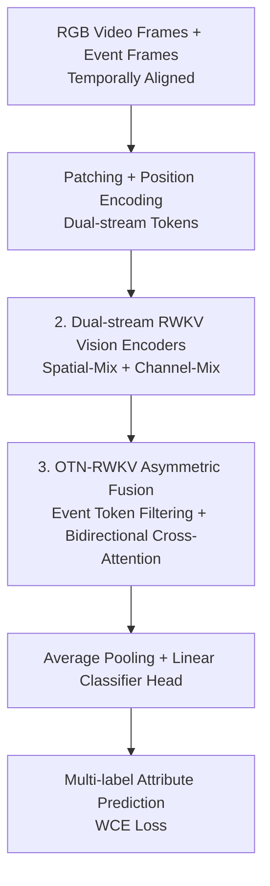

# RGB-Event based Pedestrian Attribute Recognition: A Benchmark Dataset and An Asymmetric RWKV Fusion Framework

**Conference**: CVPR 2026  
**Paper**: [CVF Open Access](https://openaccess.thecvf.com/content/CVPR2026/html/Wang_RGB-Event_based_Pedestrian_Attribute_Recognition_A_Benchmark_Dataset_and_An_CVPR_2026_paper.html)  
**Code**: https://github.com/Event-AHU/OpenPAR  
**Area**: Human Understanding / Pedestrian Attribute Recognition  
**Keywords**: Pedestrian Attribute Recognition, RGB-Event Multimodal, RWKV, Emotional Attributes, Benchmark Dataset

## TL;DR
This paper introduces the first RGB-Event multimodal pedestrian attribute recognition task and constructs EventPAR, the first large-scale dataset containing 100,000 paired RGB-Event frames with 6 types of emotional attributes. An asymmetric RWKV fusion framework (dual-stream RWKV encoding + OTN-RWKV event token filtering and bidirectional cross-fusion) is proposed, achieving SOTA performance across three datasets.

## Background & Motivation

**Background**: Pedestrian Attribute Recognition (PAR) enables models to identify matching items (hairstyle, gender, clothing style, accessories, etc.) from a predefined attribute list for a given pedestrian image or video. It is widely applied in pedestrian detection/tracking, Re-ID, and vision-language retrieval. However, almost all existing PAR systems are based on single-modal RGB cameras.

**Limitations of Prior Work**: First, RGB cameras are constrained by inherent limitations such as lighting sensitivity, cluttered backgrounds, and motion blur, which hinder performance. While multimodal fusion is common in other vision tasks, PAR remains focused on single-modal RGB. Second, existing PAR benchmarks define attributes based solely on **visible appearance cues**, neglecting "invisible" **emotional information**. Recognizing emotions like anxiety, anger, or joy is crucial for understanding pedestrian behavioral intent, improving safety assessments, and providing personalized services.

**Key Challenge**: Filing the modal gap requires paired RGB-Event data, yet **no datasets exist** in this field. Additionally, there are no existing annotations for emotional dimensions. Without data, training and evaluation are impossible.

**Goal**: (1) Construct a large-scale, multimodal (RGB+Event) benchmark dataset containing emotional attributes, covering multiple scenes/seasons with degradation and adversarial noise; (2) Retrain mainstream PAR methods on this dataset to establish a benchmark; (3) Design a framework to efficiently fuse RGB spatial features with event temporal information.

**Key Insight**: Event cameras offer natural advantages in high dynamic range, high temporal resolution, low power consumption, and low-light/high-speed scenarios. However, event streams contain noise and are insensitive to static objects, thus they must complement rather than replace RGB frames. RWKV is selected as the backbone because its linear-complexity WKV attention provides both Transformer-like parallelism and RNN-like temporal modeling capabilities, making it suitable for processing long video sequences.

**Core Idea**: Use the event modality to compensate for information loss in RGB under complex environments. Efficiency is achieved through an **asymmetric** fusion module (where event tokens are filtered to remove redundancy before bidirectional cross-attention with RGB) and emotions are integrated into attribute recognition.

## Method

### Overall Architecture
Given temporally aligned RGB video frame sequences $X_r\in\mathbb{R}^{T\times H\times W\times C}$ and event frame sequences $X_e$ stacked by exposure time, patches are extracted and position-encoded to form two streams of tokens. These are fed into Visible-RWKV and Event-RWKV encoders for feature extraction. The features enter the OTN-RWKV asymmetric fusion module: the event side uses a similarity matrix to filter redundant tokens, retaining only the most representative ones, followed by bidirectional cross-attention fusion with linear complexity. The fused representation undergoes average pooling and a linear classification head for multi-label attribute prediction.

### Key Designs

**1. EventPAR Dataset: The First Large-Scale RGB-Event Pedestrian Attribute Benchmark with Emotion**

To address the lack of paired RGB-Event data and emotional annotations, the authors collected **spatiotemporally aligned** visible light and event streams using a DVS346 event camera. EventPAR consists of 100,000 RGB-Event sample pairs across 12 attribute groups and 50 fine-grained attributes. Notably, it **incorporates 6 basic emotions** (happiness, sadness, anger, surprise, fear, disgust) for the first time alongside appearance attributes. Data collection spanned several months across seasons (summer/winter), scenes, and weather conditions (day/night, sunny/rainy). Manual noise, occlusions, and **adversarial attacks** were injected to simulate real-world environments. The scale is comparable to PA100K and follows a long-tail distribution. Seventeen representative PAR methods (CNN, Transformer, Mamba, human-centric pre-training, and vision-language models) were retrained to establish a baseline.

**2. Dual-stream RWKV Vision Encoders: Encoding RGB and Events with Linear Complexity**

The two streams of tokens are processed by Vision-RWKV encoders (stacked $L$ layers). Each block contains Spatial-Mix and Channel-Mix modules. In Spatial-Mix, tokens undergo Q-Shift (a vision-specific token shift for local context) before three linear layers generate $R_s, K_s, V_s$. Bi-WKV bidirectional attention calculates the global result $wkv=\text{Bi-WKV}(K_s, V_s)$, and $\sigma(R_s) \odot wkv$ is projected to output $O_i$ ($i\in\{r, e\}$, where $\sigma$ is sigmoid gating). Channel-Mix then performs channel-wise fusion: $O'_i=(\sigma(R_c) \odot V_c)W_O$, where $V_c=\text{SquaredReLU}(K_c)W_V$, with residual connections to mitigate gradient vanishing. RWKV's linear complexity $O(N)$ is more efficient than Transformer's $O(N^2)$ for long video sequences.

**3. OTN-RWKV Asymmetric Fusion: Filtering Redundant Event Tokens Before Cross-Attention**

This core module handles the asynchronous imaging noise of event cameras, which often contains **redundant information**. OTN-RWKV first applies a similarity matrix to $O'_e$ to select the top-K most similar token pairs, preserving only the most representative: $O''_e=\text{KNPfilter}(\text{sim}(O'_e, O'_e)) \odot O'_e$. After filtering, the token counts are aligned. Instead of simple concatenation or 1x1 convolution (which loses fine-grained details), it uses linear-complexity bidirectional interaction:

$$O_{fusion}=\sigma(R_s) \odot \text{LN}(K_s \odot \text{Bi-WKV}) + O'_e$$

Here, Bi-WKV includes relative positional decay $e^{-(|t-i|-1)/M \cdot v_s}$. Unlike LCR, this method replaces the learnable vector $w$ with $V_s$ from the encoder to focus fusion on the current sample. The "asymmetry" lies in filtering event tokens while keeping RGB tokens intact.

### Loss & Training
The fused representation undergoes average pooling and a linear classification head for attribute prediction $P_{attr}$. Training utilizes Weighted Cross Entropy (WCE) loss to handle the long-tail imbalance of attributes:

$$\mathcal{L}_{wce}=-\frac{1}{N}\sum_{i=1}^{N}\sum_{j=1}^{M}\omega_j\big(y_{ij}\log(p_{ij})+(1-y_{ij})\log(1-p_{ij})\big)$$

where $\omega_j$ is the weight for the $j$-th attribute, $N$ is the number of samples, and $M$ is the number of attributes.

## Key Experimental Results

### Main Results
Evaluated on EventPAR, MARS-Attribute, and DukeMTMC-VID-Attribute using mean Accuracy (mA), Accuracy (Acc), Precision, Recall, and F1. Public datasets without events used simulated data for fair comparison.

Comparison on EventPAR (Selected):

| Method | Pub. | mA | Acc | F1 |
|------|------|------|------|------|
| RethinkingPAR | arXiv20 | 81.37 | 80.84 | 86.93 |
| VTB | TCSVT22 | 88.41 | 83.83 | 88.53 |
| PromptPAR | TCSVT24 | 86.51 | 82.27 | 87.64 |
| SequencePAR | PR25 | 86.27 | 84.42 | 88.83 |
| **OTN-RWKV (RGB Only)** | - | 79.32 | 76.00 | 83.22 |
| **OTN-RWKV (RGB+Event)** | - | **87.70** | **84.94** | **89.18** |

While the RGB-only version is average (mA 79.32), **adding the event modality improves mA/Acc/F1 to 87.70/84.94/89.18**, surpassing all methods.

Cross-dataset performance (MARS-Attribute / DukeMTMC-VID-Attribute, RWKV-B backbone):

| Dataset | Acc | Prec | Recall | F1 |
|--------|------|------|--------|------|
| MARS-Attribute | **73.21** | **85.63** | 81.53 | **83.22** |
| DukeMTMC-VID-Attribute | **73.15** | **84.45** | 82.16 | **82.78** |

### Ablation Study
| Configuration | Key Metrics (mA/Acc/F1) | Note |
|------|---------------------|------|
| RGB(1) + Event(5) | 87.70 / 84.94 / 89.18 | Full optimal setup |
| RGB(1) Only | 79.41 / 76.22 / 83.27 | RGB limited by noise |
| Event(5) Only | 87.14 / 84.52 / 88.91 | Event modality is strong |
| RGB(3) + Event(5) | 85.97 / 81.91 / 86.61 | Too many RGB frames decreases performance |
| Concat Fusion | 87.63 / 84.60 / 88.96 | Weaker than OTN-RWKV |
| 1x1 Conv Fusion | 83.77 / 80.33 / 86.44 | Obvious information loss |

### Key Findings
- **Modality Complementarity**: RGB and Event both perform well individually but are stronger together. However, increasing RGB frames from 1 to 3/5 reduces performance (86.61/86.75) due to redundancy and noise, validating the need for event token filtering.
- **OTN-RWKV Fusion > Naive Fusion**: Similarity aggregation + bidirectional cross-attention outperforms Concat/Add/1x1Conv and Max/Mean/GNN aggregation.
- **RWKV Backbone > ViT/ResNet-50**: RWKV leads in mA/Acc/F1, verifying the advantages of linear attention backbones in PAR.

## Highlights & Insights
- **Triple Contribution**: The paper establishes the first RGB-Event PAR task, a 100k-pair dataset with 6 emotion categories, and a 17-method benchmark.
- **Emotion Integration**: Including emotions in PAR is a neglected dimension with practical significance for behavioral intent and risk assessment, inspiring broader "human-centric" perception tasks.
- **Transferable Asymmetric Fusion**: When two modalities have unequal information density, filtering the redundant side before cross-fusion is more efficient than symmetric concatenation.

## Limitations & Future Work
- **Simulated Event Data**: Events for MARS/DukeMTMC are simulated from RGB, creating a domain gap compared to real DVS346 data.
- **Subjectivity of Emotion Labels**: Determining 6 emotion types from visual appearance is inherently difficult and subjective; the paper does not analyze emotion sub-task accuracy specifically.
- **Inference Overhead**: Testing time for RGB+Event is 361s (201MB), much higher than RGB-only (68s/107MB), necessitating cost-benefit considerations for deployment.
- **Hyperparameter Sensitivity**: The sensitivity of top-K filtering in OTN-RWKV and the exact meaning of "OTN" are not fully detailed.

## Related Work & Insights
- **vs. Traditional Single-modal PAR**: Prev. methods use only RGB, limited by lighting/blur and lack emotional dimensions. This work uses events to compensate.
- **vs. Naive Multimodal Fusion**: While Concat/Add are simple, they lose fine-grained details. OTN-RWKV filters redundancy while preserving cross-modal details.
- **vs. Other RWKV Vision Works**: Unlike RWKV-SAM (segmentation), this is the first application of RWKV for pedestrian attributes with an asymmetric cross-modal fusion variant.

## Rating
- Novelty: ⭐⭐⭐⭐ First RGB-Event PAR task + emotions + asymmetric RWKV fusion.
- Experimental Thoroughness: ⭐⭐⭐⭐ Three datasets + 17-method benchmark, though public events are simulated.
- Writing Quality: ⭐⭐⭐⭐ Clear protocols, framework diagrams, and contribution statements.
- Value: ⭐⭐⭐⭐⭐ Foundational dataset and benchmark for event-camera pedestrian perception.

<!-- RELATED:START -->

## Related Papers

- [\[CVPR 2026\] ImmerIris: A Large-Scale Dataset and Benchmark for Off-Axis and Unconstrained Iris Recognition in Immersive Applications](immeriris_a_large-scale_dataset_and_benchmark_for_off-axis_and_unconstrained_iri.md)
- [\[CVPR 2026\] EventGait: Towards Robust Gait Recognition with Event Streams](eventgait_towards_robust_gait_recognition_with_event_streams.md)
- [\[ECCV 2024\] Event-based Head Pose Estimation: Benchmark and Method](../../ECCV2024/human_understanding/event-based_head_pose_estimation_benchmark_and_method.md)
- [\[CVPR 2026\] IMU-HOI: A Symbiotic Framework for Coherent Human-Object Interaction and Motion Capture via Contact-Conscious Inertial Fusion](imu-hoi_a_symbiotic_framework_for_coherent_human-object_interaction_and_motion_c.md)
- [\[CVPR 2026\] OMG-Bench: A New Challenging Benchmark for Skeleton-based Online Micro Hand Gesture Recognition](omg-bench_a_new_challenging_benchmark_for_skeleton-based_online_micro_hand_gestu.md)

<!-- RELATED:END -->
