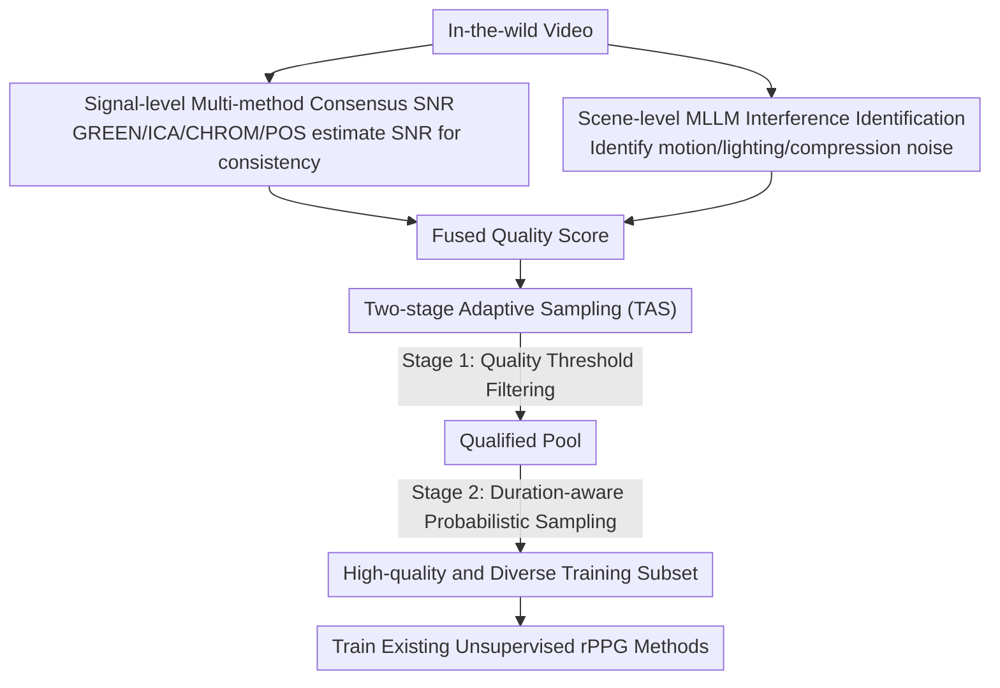

# rPPG-VQA: A Video Quality Assessment Framework for Unsupervised rPPG Training

**Conference**: CVPR 2026  
**arXiv**: [2604.11156](https://arxiv.org/abs/2604.11156)  
**Code**: [https://github.com/Tianyang-Dai/rPPG-VQA](https://github.com/Tianyang-Dai/rPPG-VQA)  
**Area**: Human Understanding  
**Keywords**: Remote Photoplethysmography (rPPG), Video Quality Assessment, Unsupervised Learning, Multimodal Large Language Models (MLLM), Data Filtering

## TL;DR
rPPG-VQA proposes the first video quality assessment framework specifically for remote heart rate detection (rPPG), combining signal-level multi-method consensus SNR with scene-level MLLM interference identification, alongside a two-stage adaptive sampling strategy to filter in-the-wild videos for training set construction.

## Background & Motivation

**Background**: Unsupervised rPPG aims to utilize unlabeled video data to learn non-contact heart rate detection. However, prevailing research focuses on methodological innovation while neglecting the impact of data quality.

**Limitations of Prior Work**: (1) Noise from motion and lighting in in-the-wild videos can drown out weak physiological signals; (2) AI-generated videos entirely lack a real physiological basis; (3) Traditional VQA metrics assess human-perceptual quality, which is decoupled from rPPG requirements; (4) Single SNR metrics are easily deceived by periodic non-physiological signals (e.g., flashing lights).

**Key Challenge**: Videos with high visual quality may lack extractable physiological signals, whereas videos with poor visual quality may still contain valid signals—traditional VQA cannot distinguish between these cases.

**Core Idea**: A dual-branch evaluation—the signal-level branch uses multi-method consensus SNR to eliminate method bias, while the scene-level branch utilizes MLLMs to identify interferences such as motion and lighting.

## Method

### Overall Architecture
The framework addresses whether in-the-wild videos fed into rPPG models contain usable physiological signals. Each video is simultaneously processed through two complementary branches: the signal-level branch extracts pulse waves using multiple rPPG algorithms to verify if they consistently yield high SNR; the scene-level branch utilizes an MLLM to judge the presence of signal-destroying factors like motion, lighting, or compression. These indicators are fused into a unified quality score, which then guides a Two-stage Adaptive Sampling (TAS) process to select a high-quality and diverse subset from mass unvetted videos as the unsupervised rPPG training set.

### Key Designs

**1. Signal-level Multi-method Consensus SNR: Using consistency to verify signal authenticity**

A single SNR metric is easily deceived by periodic noise (e.g., flashing lights or screen refresh) that mimics heartbeats. The key observation is that real physiological pulse signals are "method-agnostic." Conventional methods like GREEN, ICA, CHROM, and POS, based on different color or blind source separation assumptions, should all yield high SNR when facing real blood flow signals. Conversely, noisy videos often yield high SNR for only specific algorithms. The framework calculates SNR across multiple algorithms and checks for consistency; high consensus indicates reliable signals, while divergence identifies false positives.

**2. Scene-level MLLM Interference Identification: Supplementing scene context**

The signal-level branch only analyzes the extracted waveforms and cannot distinguish between weak signals and signals obliterated by scene interference. The scene-level branch employs an MLLM to perform human-like reasoning on video frames to identify unstable lighting, severe head/camera motion, or compression artifacts. This compensates for SNR blind spots—specifically filtering videos that appear valid at a signal level but fail during actual training due to movement, while also excluding visually realistic but signal-deficient AI-generated content.

**3. Two-stage Adaptive Sampling (TAS): Balancing quality and diversity**

Soft filtering by quality scores alone can lead to a "high-quality but homogeneous" dataset, lacking diversity. TAS splits selection into two steps: Stage 1 uses a quality threshold to eliminate obviously low-quality videos, ensuring a performance baseline. Stage 2 performs duration-aware probabilistic sampling within the qualified pool. Instead of binary selection, sampling probability is proportional to quality while considering video duration, ensuring high-quality videos are preferred without sacrificing data diversity.

### Loss & Training
The framework does not introduce new training objectives. Instead, the filtered subsets are used to train existing unsupervised rPPG methods (e.g., ContrastPhys, SiNC) to validate the gains provided by data quality filtering.

## Key Experimental Results

### Main Results

| Sampling Strategy | HR MAE on PURE Test Set | Description |
| :--- | :--- | :--- |
| All (Full Data) | High Error | Low-quality data hurts training |
| Random | Medium Error | Random sampling outperforms using all data |
| rPPG-VQA | Lowest Error | Quality filtering shows significant effect |

### Ablation Study

| Configuration | HR MAE | Description |
| :--- | :--- | :--- |
| Signal-level + Scene-level | Optimal | Dual branches are complementary |
| Signal-level Only | Sub-optimal | Misses scene-based interferences |
| Scene-level Only | Medium | Lacks direct signal quality assessment |

### Key Findings
- Training with all available in-the-wild videos is inferior to training on a quality-filtered subset.
- The dual-branch approach is essential as individual branches have distinct blind spots.
- The TAS strategy maintains training set diversity while ensuring high quality.

## Highlights & Insights
- **First systematic study of data quality in rPPG**: Fills a critical gap in the unsupervised rPPG data pipeline.
- **Method-agnostic signal quality metric**: Utilizes consensus among multiple algorithms to eliminate bias, a concept transferable to other signal processing tasks.

## Limitations & Future Work
- High computational cost associated with MLLM inference.
- Manual tuning required for the quality threshold.
- Potential development of an end-to-end quality-aware training framework.

## Related Work & Insights
- **vs. Traditional VQA (PSNR/SSIM)**: Traditional metrics focus on human perception and are decoupled from rPPG requirements.
- **vs. Posterior Signal Assessment**: Posterior methods require prior signal extraction and cannot pre-screen raw videos effectively.

## Rating
- Novelty: ⭐⭐⭐⭐ First systematic solution for rPPG data quality.
- Experimental Thoroughness: ⭐⭐⭐⭐ Comprehensive comparison of sampling strategies.
- Writing Quality: ⭐⭐⭐⭐ Precise problem definition.
- Value: ⭐⭐⭐⭐ Unlocks the potential of utilizing in-the-wild data for unsupervised rPPG.

<!-- RELATED:START -->

## Related Papers

- [\[CVPR 2026\] Reference-Free Image Quality Assessment for Virtual Try-On via Human Feedback](reference-free_image_quality_assessment_for_virtual_try-on_via_human_feedback.md)
- [\[CVPR 2026\] AVATAR: Reinforcement Learning to See, Hear, and Reason Over Video](avatar_reinforcement_learning_to_see_hear_and_reason_over_video.md)
- [\[CVPR 2026\] GazeShift: Unsupervised Gaze Estimation and Dataset for VR](gazeshift_unsupervised_gaze_estimation_and_dataset_for_vr.md)
- [\[CVPR 2026\] From Intuition to Investigation: A Tool-Augmented Reasoning MLLM Framework for Generalizable Face Anti-Spoofing](from_intuition_to_investigation_a_tool-augmented_reasoning_mllm_framework_for_ge.md)
- [\[CVPR 2026\] Render-to-Adapt: Unsupervised Personal Adaptation for Gaze Estimation](render-to-adapt_unsupervised_personal_adaptation_for_gaze_estimation.md)

<!-- RELATED:END -->
