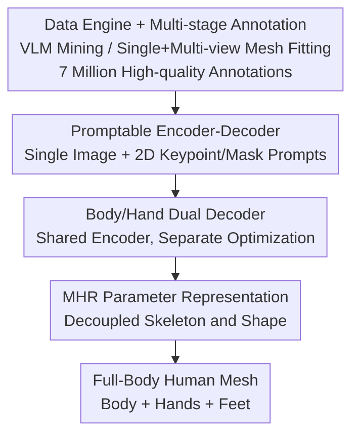

# SAM 3D Body: Robust Full-Body Human Mesh Recovery

**Conference**: CVPR 2026  
**Paper**: [CVF Open Access](https://openaccess.thecvf.com/content/CVPR2026/html/Yang_SAM_3D_Body_Robust_Full-Body_Human_Mesh_Recovery_CVPR_2026_paper.html)  
**Code**: Open source (the paper states both 3DB and MHR have been open-sourced)  
**Area**: Human Understanding  
**Keywords**: Human Mesh Recovery, Promptable Inference, Full-body Pose, Data Engine, MHR

## TL;DR
SAM 3D Body (3DB) is a SAM-style promptable single-view full-body human mesh recovery model. It utilizes a shared encoder + body/hand dual-decoder architecture based on the MHR representation, which decouples skeleton and shape. Coupled with a data engine capable of mining hard samples and producing 7 million high-quality annotations, it achieves SOTA performance on both body and hand poses in in-the-wild images.

## Background & Motivation

**Background**: Estimating 3D human pose (skeletal structure) and shape (soft tissue) from a single image is a fundamental capability for vision and embodied AI to understand and interact with humans. Significant progress has been made in Human Mesh Recovery (HMR), primarily relying on SMPL/SMPL-X parametric models, with a recent shift from body-only to full-body methods including hands and feet.

**Limitations of Prior Work**: Existing methods lack robustness on in-the-wild images, frequently failing in the presence of challenging poses, heavy occlusion, or rare viewpoints. Additionally, it remains difficult to accurately estimate both global body pose and fine-grained hand/foot details within a unified framework. The authors attribute these issues to two factors: (1) Large-scale, diverse human data with high-quality mesh annotations is inherently difficult to collect and computationally expensive. Existing datasets either suffer from low pose diversity due to laboratory collection or poor mesh quality due to pseudo-labeling. (2) Current architectures lack dedicated optimization mechanisms for body vs. hand poses and fail to address monocular image ambiguities effectively.

**Key Challenge**: There is an inherent conflict between the optimization objectives for the body and hands—they differ in input resolution, camera estimation, and supervision targets. Forced integration into a single decoder can degrade the performance of both. Furthermore, representations like SMPL entangle skeletal structure and soft tissue quality within the shape space, limiting interpretability and controllability.

**Goal**: To build a single-view full-body HMR model that is robust in-the-wild, accurate in both body and hands, and supports interactive guidance, complemented by a data engine capable of churning out high-quality diverse data at scale.

**Key Insight**: Borrowing the "promptable inference" philosophy from the SAM family—allowing users or downstream systems to guide predictions using 2D keypoints or masks—provides a natural way to resolve ambiguities in challenging scenarios. Simultaneously, the MHR (Momentum Human Rig) representation is used to replace SMPL by decoupling skeleton and shape.

**Core Idea**: A "Promptable Encoder-Decoder + Body/Hand Dual Decoder + MHR Representation" trinity resolves architectural issues, while a "VLM-driven Hard Sample Mining + Multi-stage Mesh Fitting" data engine addresses the data bottleneck. Together, they make full-body HMR robust in-the-wild.

## Method

### Overall Architecture
The input to 3DB is a cropped image of a human (optionally accompanied by hand crops, 2D keypoint prompts, or mask prompts), and the output is a full-body human mesh (pose, shape, camera, skeleton) represented by MHR parameters. The model is a **Promptable Encoder-Decoder**: a shared image encoder encodes the image into dense features, while prompts (2D keypoints, masks) are encoded as additional tokens. Subsequently, the **Body Decoder** and **Hand Decoder** each use a set of query tokens via cross-attention to fuse prompt information with visual context, regressing MHR and camera parameters. The hand output can be merged into the body output for hand refinement.

The foundation is the **Data Engine**, which first uses a VLM to mine difficult/informative in-the-wild images, followed by **Multi-stage Mesh Fitting** (single-view + multi-view optimization, dense keypoint detection) to produce 7 million high-quality annotations to supervise model training. The overall flow can be viewed as "Data Engine feeding data → Promptable Encoder-Decoder → Dual-Decoder task division → MHR parameter output."

### Key Designs

**1. Data Engine + Multi-stage Annotation Pipeline: Mining Hard Samples with VLM for 7M Quality Annotations**

To address the scarcity of high-quality 3D supervision and the limited diversity of in-the-wild datasets, the authors built a semi-automated data engine. The core is a **VLM-driven mining strategy**: the VLM identifies challenging scenarios for pose estimation—occlusions, rare poses (acrobatics/dance), human-human interactions, extreme scales, low visibility (low light/motion blur), and hand-body coordination (sign language/sports)—from tens of millions of images. These high-information samples are routed for annotation, and mining rules are iteratively updated based on error analysis of the current model. Selected images receive initial 2D joints from the current 3DB version, which are refined by annotators with visibility labels. This is followed by **Single-view Mesh Fitting**, optimizing MHR parameters against 595 dense 2D keypoints with a loss comprising $L_{\text{2D}}$ re-projection, initial anchoring regularization (L2 penalty to prevent drift), and learned Gaussian Mixture priors. For multi-view datasets, **Multi-view Fitting** is performed: meshes are initialized via triangulated sparse 3D keypoints, then second-order optimization jointly fits all views and frames with an additional 3D keypoint loss and temporal smoothness loss $L_{\text{multi}}=\sum_k \lambda_k L_k$. The 595 dense keypoints provide a "minimal manifold" capturing varied body shapes and gestures.

**2. Promptable Encoder-Decoder: Introducing SAM-style Interaction to HMR to Resolve Monocular Ambiguity**

Addressing monocular ambiguity, 3DB adopts a promptable architecture similar to the SAM family. The image is encoded into dense features $F$ by a visual backbone. Two types of optional prompts are used: 2D keypoint prompts (positionally encoded with learned embeddings) and mask prompts (convolved and added to image embeddings). The decoder processes a set of query tokens, including MHR+camera tokens, 2D keypoint prompt tokens, auxiliary 2D/3D keypoint tokens, and optional hand location tokens. These are concatenated into a complete query $T=[T_{\text{pose}},T_{\text{prompt}},T_{\text{keypoint2D}},T_{\text{keypoint3D}},T_{\text{hand}}]$, which fuses prompt information with visual context via cross-attention $O=\text{Decoder}(T,F)$. This design allows the model to run fully automatically or accept interactive guidance from users/detectors. Training includes random prompt sampling to simulate interactive settings and enhance robustness.

**3. Body/Hand Dual Decoder: Shared Encoder + Separate Decoders to Resolve Optimization Conflicts**

Estimating body and hand poses involves different resolutions and supervision targets. 3DB uses a **shared image encoder + two independent decoders**. The body decoder outputs the full-body rig (including hands), while the hand decoder consumes hand crop features $F_{\text{hand}}$ to provide a refined hand output $O_{\text{hand}}$. Hand location tokens $T_{\text{hand}}\in\mathbb{R}^{2\times D}$ help the body decoder locate hands. During inference, the body decoder's output is the default, but if hands are detected, the hand decoder's results are merged—specifically using hand decoder wrist positions and body decoder elbow positions to re-prompt the body decoder for a refined full-body configuration. This division allows hands to benefit from specialized training without sacrificing body estimation accuracy.

**4. MHR Representation: Decoupling Skeleton Structure and Shape**

Unlike standard SMPL, 3DB is built on the **Momentum Human Rig (MHR)**—an enhanced version of ATLAS that explicitly decouples skeletal structure from body shape. The model regresses MHR parameters $\theta=\{P,S,C,Sk\}$, representing pose, shape, camera pose, and skeleton, respectively. This decoupling offers richer control and interpretability. For evaluation against SMPL-based benchmarks, MHR meshes are mapped back to the SMPL format.

### Loss & Training
The model is trained with a comprehensive multi-task loss $L_{\text{train}}=\sum_i \lambda_i L_i$, where each $L_i$ targets specific heads (2D/3D keypoints, MHR parameters, hand detection). To stabilize training, certain terms (e.g., 3D keypoints) utilize a warm-up schedule. The training set is a massive 7-million-scale mix of single-view (MS COCO, MPII, 3DPW, SA-1B subsets), multi-view (Ego-Exo4D, Harmony4D, Goliath, InterHand2.6M), and high-fidelity synthetic data (Goliath extensions).

## Key Experimental Results

### Main Results
Compared against SOTA on five standard benchmarks, reporting PA-MPJPE / MPJPE / PVE (mm, lower is better) and PCK@0.05 (higher is better). 3DB has two variants: 3DB-H (ViT-H, 632M) and 3DB-DINOv3 (DINOv3, 840M). Selected results for 3DB-H against representative single-image methods:

| Model | 3DPW PA-MPJPE ↓ | EMDB MPJPE ↓ | EMDB PVE ↓ | RICH PA-MPJPE ↓ | COCO PCK ↑ | LSPET PCK ↑ |
|------|-----------------|--------------|-----------|-----------------|-----------|-------------|
| HMR2.0b | 54.3 | 118.5 | 140.6 | 48.1 | 86.1 | 53.3 |
| CameraHMR | 35.1 | 70.3 | 81.7 | 34.0 | 80.5 | 49.1 |
| PromptHMR | 36.1 | 71.7 | 84.5 | 37.3 | 79.2 | 55.6 |
| NLF-L+fit | 33.6 | 68.4 | 80.6 | 28.7 | 74.9 | 54.9 |
| **3DB-H (Ours)** | **33.2** | **62.9** | **74.3** | 31.9 | **86.8** | **68.9** |

3DB-H outperforms all single-image methods and competes with video-based methods (WHAM/TRAM/GENMO). Its advantage is particularly pronounced on Out-of-Distribution (OOD) datasets like EMDB and RICH (EMDB MPJPE 62.9 vs 68.4 for the next best), demonstrating superior generalization.

### Ablation Study
A core human preference study was conducted: in a user study with 7,800 participants, 3DB was preferred by a **win ratio of approximately 5:1**. The paper claims this is the first single model to match the performance of body-specific specialized models while nearing the performance of hand-specific models.

| Evaluation Metric | Result | Note |
|----------|------|------|
| User Preference (7800) | ~5:1 win ratio | Qualitative preference significantly leads previous methods |
| Quantitative (5 Benchmarks) | Single-image SOTA | Best within unified body+hand framework |
| OOD Generalization (EMDB/RICH) | Significant lead | Large gains on unseen datasets |

### Key Findings
- **OOD Generalization is the highlight**: 3DB shows the most significant gains on unseen datasets (EMDB, RICH), validating the contribution of the hard-sample data engine.
- **Simultaneous Body and Hand Excellence**: The dual-decoder allows a single model to achieve SOTA body performance and near-specialized hand performance, breaking the tradition of inferior hand quality in full-body methods.
- **Interactive Prompts Ensure Robustness**: The promptable design resolves ambiguity in challenging scenes, while random prompt sampling during training ensures stability.
- **Benefit from Larger Backbones**: 3DB-DINOv3 (840M) provides further performance gains over 3DB-H (632M).

## Highlights & Insights
- **Transferring the SAM Paradigm to HMR**: Using 2D keypoints/masks as prompt tokens inside a transformer creates a flexible system that is both fully automatic and human-in-the-loop. This is a transferable insight for any ambiguous 3D estimation task.
- **Dual-Decoder as a Pragmatic Solution**: Handling the resolution and supervision conflicts between the body and hands via shared encoding and separate decoding (with wrist-elbow cross-prompting) is a more effective engineering solution than a single unified head.
- **The Data Engine is the Competitive Moat**: Iterative hard sample mining combined with 595-keypoint multi-stage fitting resolves the quality-diversity trade-off. 7 million high-quality annotations form the bedrock of its SOTA performance.
- **Representation Shift (MHR vs. SMPL)**: Decoupling skeleton structure and soft tissue at the representation level provides a cleaner parameter space for interpretable and controllable reconstruction.

## Limitations & Future Work
- **Dependency on Large-scale Proprietary Data**: 7M annotations come from licensed galleries and multi-view captures; the cost of replicating the data pipeline is high for external teams.
- **Hand Decoder Dependencies**: Proper hand refinement relies on hand crops and wrist localization; failures in detection limit the gains. Inference also relies on an external FOV estimator (MoGe-2) for camera intrinsics, which may introduce external errors.
- **Loss Detail Disclosure**: The main text provides a high-level structure, but critical training details like warm-up schedules and specific $\lambda_i$ weights are largely contained in the supplementary materials.
- **MHR to SMPL Mapping**: Mapping MHR to SMPL format for benchmark comparison may introduce minor errors, and the fairness of cross-representation comparisons requires careful scrutiny.

## Related Work & Insights
- **vs. SMPL/SMPL-X Systems**: While mainstream HMR entangles skeleton and shape, 3DB uses MHR for explicit decoupling.
- **vs. Body-only Methods (HMR 2.0)**: 3DB moves to an articulated full-body approach, achieving body performance comparable to specialized models.
- **vs. Hand-specific Models**: 3DB narrows the performance gap between full-body methods and specialized hand models through specialized decoding heads.
- **vs. Promptable Works (PromptHMR)**: 3DB integrates prompts directly into the transformer architecture and, combined with the dual-decoder and MHR, achieves significantly stronger OOD generalization (EMDB MPJPE 62.9 vs. 71.7).

## Rating
- Novelty: ⭐⭐⭐⭐ Pragmatic combination of promptable, dual-decoder, and MHR.
- Experimental Thoroughness: ⭐⭐⭐⭐⭐ Solid evidence via 5 benchmarks, 7800-person user study, and OOD analysis.
- Writing Quality: ⭐⭐⭐⭐ Clear motivation for both data and model, though some details are left to supplements.
- Value: ⭐⭐⭐⭐⭐ Open-source model and MHR are highly valuable for robotics, embodied AI, and biomechanics.

<!-- RELATED:START -->

## Related Papers

- [\[CVPR 2026\] MetricHMSR: Metric Human Mesh and Scene Recovery from Monocular Images](metrichmsr_metric_human_mesh_and_scene_recovery_from_monocular_images.md)
- [\[CVPR 2026\] PAMotion: Physics-Aware Motion Generation for Full-Body Interaction with Multiple Objects](pamotion_physics-aware_motion_generation_for_full-body_interaction_with_multiple.md)
- [\[CVPR 2026\] ViBES: A Conversational Agent with Behaviorally-Intelligent 3D Virtual Body](vibes_a_conversational_agent_with_behaviorally_intelligent_3d_virtual_body.md)
- [\[CVPR 2026\] Occluded Human Body Capture with Frequency Domain Denoising Prior](occluded_human_body_capture_with_frequency_domain_denoising_prior.md)
- [\[CVPR 2026\] AudioAvatar: Personalized Audio-driven Whole-body Talking Avatars](audioavatar_personalized_audio-driven_whole-body_talking_avatars.md)

<!-- RELATED:END -->
