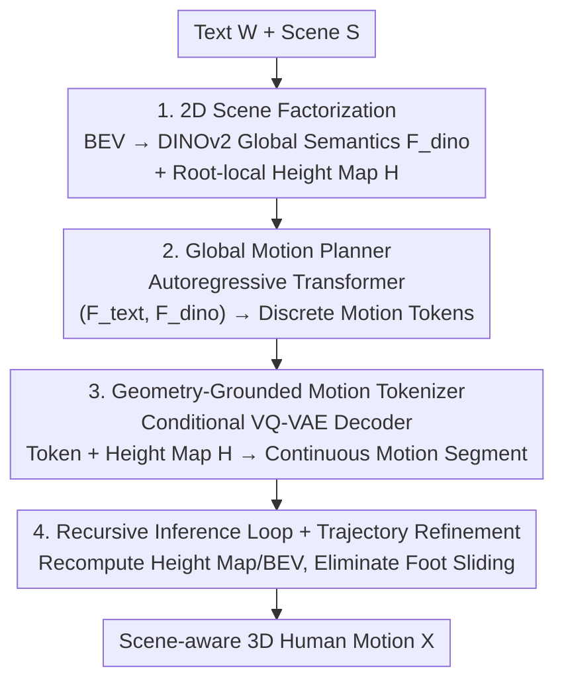

# SceMoS: Scene-Aware 3D Human Motion Synthesis by Planning with Geometry-Grounded Tokens

**Conference**: CVPR 2026  
**Paper**: [CVF Open Access](https://openaccess.thecvf.com/content/CVPR2026/html/Ghosh_SceMoS_Scene-Aware_3D_Human_Motion_Synthesis_by_Planning_with_Geometry-Grounded_CVPR_2026_paper.html)  
**Code**: https://anindita127.github.io/SceMoS  
**Area**: Human Understanding  
**Keywords**: Scene-aware motion synthesis, human-scene interaction, BEV, height map, geometry-grounded tokenization  

## TL;DR
SceMoS replaces expensive 3D voxel/point cloud supervision with two lightweight 2D scene cues—DINOv2 features from Birds-Eye-View (BEV) for global semantic planning and local 2D height maps to embed surface physics directly into the motion token vocabulary. It achieves SOTA motion realism and contact accuracy on TRUMANS while reducing trainable scene encoding parameters by an order of magnitude (~4M vs. ~50M).

## Background & Motivation
**Background**: Text-driven scene-aware human motion synthesis (HSI) requires both understanding semantic intent ("walk to the sofa") and satisfying physical feasibility (avoiding penetration). Existing methods often use unified generation frameworks to learn high-level planning and low-level contact reasoning simultaneously, relying on expensive 3D scene representations such as voxel occupancy grids, point clouds, or SDFs.

**Limitations of Prior Work**: Scene representations face a dilemma: scene-level representations are either cumbersome or lack the detail necessary for fine-grained contact reasoning; meanwhile, dense 3D formats like point clouds/voxels are computationally expensive and difficult to scale to full scenes. The cubic memory complexity of voxel grids and the unstructured nature of point clouds force methods to use heavy 3D backbones (voxel CNNs, transformers) just to "see" the scene, introducing significant spatial redundancy for tasks primarily involving near-surface interactions.

**Key Challenge**: Existing methods are forced to learn three things simultaneously in a **single entangled generation process**: perceiving complex geometry, planning spatial intent, and executing precise motion. In real-world, noisy, unannotated scenes, motion must be both semantically aligned with text ("sit on the sofa") and physically aligned with geometry ("walk without penetrating furniture"). This dual requirement creates a persistent conflict between "generalization capability" and "efficiency."

**Goal**: To generate long-range, goal-oriented human motion that is both semantically coherent and physically compliant without relying on dense 3D volumetric inputs.

**Key Insight**: Interactions between humans and environments primarily rely on two complementary types of 2D information: global layout cues for spatial reasoning and local geometric cues for physical contact. Based on this, "global planning" and "local execution" are explicitly decoupled, with both layers utilizing lightweight 2D representations.

**Core Idea**: Replace full 3D supervision with "BEV Semantics (Global) + Local Height Map (Contact)" factorization, and encode scene geometry directly into a discrete motion token vocabulary.

## Method

### Overall Architecture
Human motion is represented as a sequence of $N$ SMPL-X poses $X=\{x_i\}$, where each frame $x_i$ includes root translation offset, 6D joint orientation, root-invariant local joint offsets, joint velocities, and a 4-dimensional foot-ground contact indicator. Given a text instruction $W$ (encoded by T5 as $F_{text}$) and scene $S$, the model learns a mapping $\mathcal{G}:(F_{text}, F_{dino}, H)\to X$. The overall framework consists of two stages: ① **Global Motion Planner**—an autoregressive transformer that predicts a sequence of discrete motion tokens $\{z_i\}$ token-by-token, conditioned on text $F_{text}$ and DINOv2 features $F_{dino}$ of the BEV map; ② **Geometry-Grounded Motion Tokenizer**—a conditional VQ-VAE whose decoder additionally takes the local 2D height map $H$ to decode each token back into continuous motion segments. During inference, a recursive loop is used: after decoding each segment, the height map is recomputed and the BEV is recaptured based on the new root position to stitch long-range trajectories; finally, a trajectory refinement module is used to eliminate foot sliding.

### Key Designs

**1. 2D Scene Factorization: Replacing Dense 3D with BEV Semantics + Local Height Maps**

To address the high cost and redundancy of dense 3D representations, the authors represent the scene using two complementary 2D modalities. **Global**: A single Birds-Eye-View RGB image $I_{bev}$ is rendered from an elevated corner of the scene (with the camera pointing toward the character's start to reduce occlusion), and DINOv2 patch features $F_{dino}$ are extracted. This captures the spatial layout (walkable areas) and semantic positions of major objects (e.g., where "sofa" and "table" are relative to the start) efficiently, contrasting with heavy voxel grids. **Local**: A $g\times g$ 2D height map $H$ is centered at the root joint and oriented along the body's forward direction at frame $i$, covering a predefined range. This representation naturally supports causal autoregression—it is calculated from the scene state at the end of the previous token. One cue manages "where to go/what to do" while the other manages "how high to step," preserving necessary geometry while avoiding the cost of 3D volumetric reasoning.

**2. Global Motion Planner: Long-range Motion as Autoregressive Token Prediction in Discrete Space**

To ensure long-range goal-oriented motion is both semantically coherent and spatially reasonable, the authors model it as autoregressive token prediction in a discrete motion space. A causal transformer $G$ with $L=8$ layers and 8 heads operates on compressed visual and text cues ($F_{dino}$, $F_{text}$) to model the conditional distribution $P(z_i \mid z_{<i}, F_{text}, F_{dino})$. At each step, a token $z_i' = \arg \max_{z_i} P(z_i \mid z_{<i}, F_{text}, F_{dino})$ is sampled to assemble a high-level motion plan. Each input token is formed by concatenating a "learned embedding + positional encoding + linear projection of condition vectors $F_{text}/F_{dino}$." The model is trained by maximizing the log-likelihood of ground-truth tokens $L_{plan} = -\sum_i \log P(z_i = z_i^* \mid \cdot)$, and uses Classifier-Free Guidance (CFG) by randomly dropping $F_{text}/F_{dino}$ to allow adjustable conditioning strength during inference. Planning in discrete token space stabilizes long-term coherence and text alignment.

**3. Geometry-Grounded Motion Tokenizer: Embedding Surface Physics into the VQ-VAE Vocabulary**

To prevent motion tokens from violating contact or causing penetration in real environments, the authors train a **conditional** VQ-VAE to learn a codebook $C = \{c_k\}_{k=1}^K$ ($K=1024$, dimension $D_z=512$). An encoder $E$ downsamples the motion sequence into a latent sequence $Z=E(X)$, where each $z_i$ is quantized to the nearest neighbor $Z_q$. Unlike standard motion VQ-VAEs, the interaction decoder $D$ is explicitly conditioned on the local scene geometry: $\hat X = D(Z_q, H)$, where $H$ is the local height map corresponding to the end pose of the previous token. This forces discrete tokens to encode not just kinematic patterns but **geometry-specific** motion behaviors—for example, a token represents "bending the knee to contact a surface at height $h$." During training, the decoder can only minimize reconstruction loss if the selected token is physically compatible with the given $H$, effectively embedding local contact physics into the token space. The total loss is $L_{VQ} = \lambda_{rec}L_{rec} + \beta \|\mathrm{sg}[Z_q] - Z \|_2$.

**4. Recursive Inference Loop + Trajectory Refinement: Stitching Long-range and Eliminating Foot Sliding**

To address the limitations of single-segment generation and root trajectory estimation errors, a recursive inference strategy is designed. During inference, $F_{text}$ and $F_{dino}$ are fed as prefixes to the planner $G$ to sample tokens, which are then decoded into continuous segments. The local height map for the current token is recomputed based on the **updated scene state** (centered at the root position of the previous segment's last frame). This allows the planner to extend long-range trajectories seamlessly as the scene evolves. Furthermore, a lightweight trajectory refinement module $R$ predicts smoothed root velocities $\hat t_{\delta,i} = R(x^{local}_i)$ from local motion features $x^{local}_i$. It is trained using an L1 loss $L_{traj} = \lambda_r \|t_\delta - \hat t_\delta\|_1 + \lambda_v \|\Delta t_\delta - \Delta \hat t_\delta\|_1$. Replacing raw root trajectories with refined ones significantly reduces foot sliding and improves contact consistency.

### Loss & Training
The VQ-VAE is trained for approximately 5K epochs (~700k iterations) using Adam with a learning rate of $10^{-5}$ and batch size 128, where $\lambda_{rec}=1.0, \beta=0.1$. The input $N=80$ frames are downsampled by a factor of 4 to $\hat n=20$ tokens. The height map has a grid size of 32 and a radius of $\pm 0.6$m. The planner transformer has 8 layers, 8 heads, and a hidden dimension of 512, trained with batch size 32. $F_{dino}$ has a dimension of 768 (49 patches), and $F_{text}$ is 1024. The VQ-VAE converges in ~98 hours, and the planner in ~75 hours. Full inference for 80 frames takes approximately 8 seconds.

## Key Experimental Results

### Main Results
Evaluated on TRUMANS (15 hours of SMPL-X motion, 100 indoor scenes, split into 1–70 train / 71–80 val / 81–100 test). Metrics: FID↓ (realism), Div→ (diversity), PFC↓ (foot contact legality), Cont.↑ (contact score), Penetration↓ (mean/max).

| Method | Scene Representation | Scene Params | FID↓ | PFC↓ | Cont.↑ | Penetration (Mean/Max)↓ |
|--------|----------------------|--------------|------|------|--------|--------------------------|
| TRUMANS | Voxel 3D Grid | ~86M | 0.34 | 0.58 | 0.98 | 1.83 / 11.75 |
| TeSMo | 2D Map + 3D Point Cloud | ~35M | 0.48 | 0.65 | 0.92 | 2.11 / 11.98 |
| Humanise | 3D Point Cloud | ~55M | 0.82 | 1.21 | 0.96 | 1.95 / 14.37 |
| SceneDiffuser | 3D Point Cloud | ~55M | 0.75 | 1.09 | 0.91 | 1.71 / 17.49 |
| **SceMoS** | BEV + 2D Height Map | **~4M** | **0.31** | 0.61 | **0.98** | **1.81 / 11.12** |

SceMoS achieves the lowest FID (0.31) and highest contact score (0.98), performing comparable to or better than TRUMANS, which uses voxels and an order of magnitude more parameters (~4M vs ~86M).

### Ablation Study
VQ reconstruction quality (MPJPE/MPJVE in mm) ablation to verify scene geometry and design choices:

| Variant | MPJPE↓ | MPJVE↓ | Cont.↑ | Penetration (Mean/Max)↓ |
|---------|--------|--------|--------|-------------------------|
| A1: Scene-agnostic VQ-VAE | 25.89 | 15.98 | 0.86 | 4.43 / 18.91 |
| A2a: Height map 16×16 | 21.48 | 11.02 | 0.98 | 2.12 / 15.01 |
| A2b: Height map 64×64 | 22.56 | 10.99 | 0.97 | 1.88 / 14.21 |
| A3: Voxel Occupancy | 21.32 | 12.39 | 0.92 | 3.88 / 16.95 |
| A4a: FiLM Modulation | 27.89 | 15.66 | 0.91 | 2.12 / 14.89 |
| A4b: Cross-Attention | 22.86 | 13.24 | 0.97 | 2.25 / 15.01 |
| A7: Without Trajectory Refinement | 26.89 | 15.57 | 0.79 | 2.78 / 15.56 |
| **Scene-aware VQ-VAE (Ours, 32×32)** | **21.88** | **10.45** | **0.99** | **1.83 / 14.23** |

### Key Findings
- **Adding Local Geometry = Significant Realism Gain**: Moving from scene-agnostic A1 to 32×32 height maps improved MPJVE from 15.98 to 10.45 and contact from 0.86 to 0.99, showing that lightweight local geometry helps the codebook learn "grounded" motion.
- **Two-stage Decoupling is Vital**: Removing the planner/decoder separation (A5) significantly degraded FID, validating the factorization of "global planning vs. local execution."
- **2D is Sufficient, 3D is Redundant**: Replacing height maps with 3D voxels (A3) resulted in worse MPJVE and penetration—dense volumetric inputs are unnecessary for near-surface interactions.
- **Backbone and Fusion Matter**: Simple feature concatenation outperformed FiLM/cross-attention; DINOv2 semantics were significantly better than CLIP. 32×32 is the optimal resolution for height maps.

## Highlights & Insights
- **Leveraging "Right 2D Projections" over 3D Supervision**: Using BEV for global semantics and local height maps for contact physics achieves results on par with voxel methods while slashing parameters. The core insight is that near-surface tasks do not require dense volumetric details.
- **Embedding Physics into Tokens**: Conditioning the VQ-VAE decoder on height maps allows discrete tokens to encode geometry-specific semantics (e.g., knee contact at height $h$), creating a reusable paradigm for embedding geometry into discrete motion representations.
- **Causal Height Map Design**: Height maps are calculated from the previous token's state, fitting autoregressive generation and supporting recursive updates for long-range trajectories—a concept transferable to other "perceive-as-you-go" embodied tasks.

## Limitations & Future Work
- Assumes **static scenes** and targets macro full-body interactions (sitting, walking); fine-grained object manipulation (dexterous hand-object contact) remains difficult as height maps do not capture hand affordances.
- 2D cues are tuned for indoor environments; extending to **outdoor** uneven terrain or heavy occlusion would require retraining the planner on diverse outdoor data.
- Inference still has moderate latency (~8s for 80 frames) due to iterative planning and recomputation; adaptive height map scaling is proposed for acceleration.
- Strong dependence on the TRUMANS benchmark; cross-dataset generalization has not been fully verified, and BEV camera placement remains a manual prior.

## Related Work & Insights
- **vs. TRUMANS**: TRUMANS uses 3D voxels + ViT-B (~86M scene params); SceMoS uses 2D BEV + height maps (~4M) to achieve lower FID (0.31 vs 0.34), proving lightweight 2D is competitive with dense 3D.
- **vs. TeSMo**: TeSMo uses 2D maps as intermediate proxies but still requires 3D point clouds and diffusion; SceMoS is fully 2D-based and grounds geometry into tokens with fewer parameters.
- **vs. T2M-GPT / MoMask**: These methods perform VQ-VAE+GPT for scene-agnostic motion; SceMoS extends this paradigm to scene-aware synthesis by introducing geometry-grounded tokenization to bridge the gap between intent and physics.

## Rating
- Novelty: ⭐⭐⭐⭐⭐ "2D Scene Factorization + Geometry-Grounded Tokens" is a clear anti-consensus contribution to HSI representation.
- Experimental Thoroughness: ⭐⭐⭐⭐ Extensive ablations on representations/fusion/resolution; however, verification is limited to the TRUMANS benchmark.
- Writing Quality: ⭐⭐⭐⭐⭐ Logical flow from motivation to method; the intuition behind 2D factorization is well-articulated.
- Value: ⭐⭐⭐⭐⭐ High deployability for animation/VR/embodied AI due to the order-of-magnitude reduction in parameters.

<!-- RELATED:START -->

## Related Papers

- [\[CVPR 2026\] InterPhys: Physics-aware Human Motion Synthesis in a Dynamic Scene](interphys_physics-aware_human_motion_synthesis_in_a_dynamic_scene.md)
- [\[CVPR 2026\] SyncMos: Scalable Motion Synchronisation for Multi-Agent Scene Interaction](syncmos_scalable_motion_synchronisation_for_multi-agent_scene_interaction.md)
- [\[CVPR 2026\] HSI-GPT2: A Dual-Granularity Large Motion Reasoning Model with Diffusion Refinement for Human-Scene Interaction](hsi-gpt2_a_dual-granularity_large_motion_reasoning_model_with_diffusion_refineme.md)
- [\[CVPR 2026\] RAM: Recover Any 3D Human Motion in-the-Wild](ram_recover_any_3d_human_motion_in-the-wild.md)
- [\[CVPR 2026\] LLaMo: Scaling Pretrained Language Models for Unified Motion Understanding and Generation with Continuous Autoregressive Tokens](llamo_scaling_pretrained_language_models_for_unified_motion_understanding_and_ge.md)

<!-- RELATED:END -->
