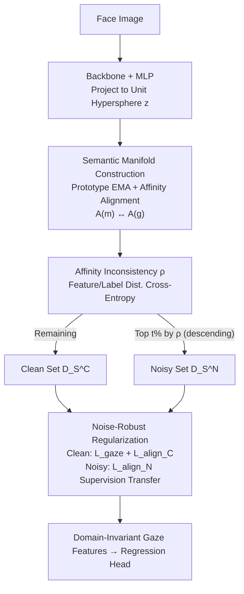

# See Through the Noise: Improving Domain Generalization in Gaze Estimation

**Conference**: CVPR 2026  
**arXiv**: [2604.16562](https://arxiv.org/abs/2604.16562)  
**Code**: To be confirmed  
**Area**: Human Understanding / Gaze Estimation / Domain Generalization  
**Keywords**: Gaze Estimation, Domain Generalization, Label Noise, Semantic Manifold, Noise-Robust Regularization

## TL;DR
SeeTN attributes "poor cross-domain generalization in gaze estimation" to source domain label noise for the first time. It identifies noisy samples by aligning feature affinities with continuous label affinities via a prototype-constructed semantic manifold. By applying specific regularization to clean and noisy samples, it transfers supervision from clean to noisy samples, reducing angular error by 12–18% across four cross-domain settings without sacrificing source domain accuracy.

## Background & Motivation

**Background**: Appearance-based gaze estimation uses CNNs to regress 3D gaze directions from face/eye images and performs well in controlled environments. However, performance drops significantly when deployed to unseen domains (different cameras, lighting, head poses). Recent work focuses on "Cross-Domain Generalization," using adversarial learning, contrastive learning, and consistency constraints to learn domain-invariant representations.

**Limitations of Prior Work**: Existing generalization methods almost always assume source domain labels are clean, ignoring the prevalent **label noise** in gaze datasets. Precise gaze annotation is extremely difficult due to unstable human attention and variations in lighting, head pose, and occlusion. Consequently, datasets like Gaze360 contain a significant proportion of labels that deviate from the true gaze direction. Preliminary experiments show that injecting Gaussian noise with a 60° standard deviation into Gaze360 labels increases cross-domain error on MPIIGaze from 7.94° to 12.17° (20% noise) and 14.38° (30% noise)—more noise leads to worse generalization.

**Key Challenge**: Directly applying Learning from Noisy Labels (LNL) methods from the classification domain fails due to two inherent difficulties. First, gaze estimation is a **regression task**: label noise involves continuous offsets rather than discrete misclassifications. The feature space lacks clear clusters, making "small-loss" selection and transition matrix estimation unreliable. Second, in cross-domain scenarios, **correcting labels alone is insufficient**—error correction improves source domain quality but does not bridge the distribution gap between source and target domains.

**Goal**: Address both "noise identification in regression" and "domain generalization" without accessing any target domain data.

**Key Insight**: Gaze angles are continuous; similar labels should correspond to similar features. This topological consistency of "label affinity $\leftrightarrow$ feature affinity" serves as a robust supervision signal independent of individual absolute labels. If a sample's "neighbor relationships" in label space and feature space do not match, it is likely a noisy sample.

**Core Idea**: Construct a semantic manifold to bind continuous gaze labels and features. Use "feature-label affinity inconsistency" as a noise detector, then regularize clean and noisy samples separately to transfer gaze semantics from clean samples to noisy ones. This simultaneously filters noise and learns domain-invariant features.

## Method

### Overall Architecture

SeeTN (See-Through-Noise) addresses the issue where noisy labels in the source domain degrade cross-domain generalization. Instead of correcting labels individually, it establishes a semantic structure based on **relative relationships between samples**: features $f$ extracted by the backbone are projected via an MLP onto a unit hypersphere to obtain $z$, and a set of learnable prototypes $\mu_k$ spans $z$ into a semantic manifold $\mathcal{M}$. On this manifold, the feature affinity matrix $A^{(m)}$ is computed and aligned with the label affinity matrix $A^{(g)}$, explicitly preserving the "similar label $\rightarrow$ similar feature" topology. Based on this manifold, the cross-entropy inconsistency $\rho$ between feature and label distributions is used to sort and split samples into a noisy set $D_S^N$ and a clean set $D_S^C$ each epoch. Finally, clean samples receive direct label supervision, while noisy samples receive supervision transferred from clean samples via manifold affinity. At inference, only the backbone and regression head are used.

The workflow is a three-stage serial pipeline:

### Key Designs

**1. Semantic Manifold Construction: Binding Continuous Labels to Feature Space via Relative Relationships**

Standard MAE loss targets individual sample numerical accuracy while ignoring the semantic structure of the feature/label space. This results in samples with similar labels being scattered in the feature space. SeeTN explicitly constructs a semantic manifold $\mathcal{M}$ to strengthen this correspondence: features are first projected to the unit hypersphere $z = \mathrm{Norm}(\mathrm{MLP}(f))$ to emphasize gaze semantics. Then, $K$ prototypes $\mu_k$ are initialized and pushed towards feature centers via EMA:

$$r = \mathrm{Softmax}(z\,\mu^T/\tau), \qquad \mu_k \leftarrow \tau\mu_k + (1-\tau)\frac{\sum_i r_{i,k} z_i}{\sum_i r_{i,k}}$$

where $r\in\mathbb{R}^{B\times K}$ is the soft assignment of $z$ to prototypes. The sample representation on the manifold is $p = z\,\mu^T$. Manifold feature affinity $A^{(m)}_{i,j}=\frac{p_i\cdot p_j}{\|p_i\|\|p_j\|}$ is aligned with label affinity $A^{(g)}_{i,j}=\frac{y_i\cdot y_j}{\|y_i\|\|y_j\|}$ by minimizing $|A^{(m)}-A^{(g)}|$. This bypasses the difficulty of defining noise boundaries for continuous labels by using **pairwise relative relationships**.

**2. Affinity Inconsistency ρ: A Noise Detector for Regression**

Classification uses "small-loss" to select clean samples, which is ineffective for regression. SeeTN quantifies "affinity inconsistency" as a comparable distribution. The rows of the manifold affinity matrix are normalized into a distribution $\hat y^{(m)}_i=\mathrm{Softmax}(A^{(m)}_{i,:})$, representing the relationship of $x_i$ to other samples. The cross-entropy with the label relationship distribution $\hat y^{(g)}_i$ serves as the noise indicator:

$$\rho_i = -\sum_{j=1}^{B}\hat y^{(g)}_{i,j}\log \hat y^{(m)}_{i,j}$$

Samples with high $\rho$ are considered likely noisy. Samples are re-partitioned each epoch to mitigate confirmation bias. Replacing $\rho$ with an L1-loss criterion significantly degrades performance (e.g., $D_E\!\to\!D_M$ 7.73° vs. 6.58°), proving this pairwise detector is more reliable than per-sample loss.

**3. Noise-Robust Regularization: Strict Supervision for Clean, Transferred for Noisy**

Clean samples $D_S^C$ use standard regression $L_{gaze}$ and rigid MAE alignment $L^C_{align}$. Noisy samples $D_S^N$ ignore their untrustworthy labels and instead use the manifold affinity $A^{(m)}$ (derived from clean samples) to constrain their feature affinity $A^{(f)}_{i,j}$ with clean samples:

$$L^N_{align} = -\frac{1}{B_N}\sum_{x_i\in D_S^N}\frac{A^{(f)}_{i,:}\cdot A^{(m)}_{i,:}}{\|A^{(f)}_{i,:}\|\|A^{(m)}_{i,:}\|}$$

This uses **soft cosine similarity alignment**. It refines the relationship between noisy and clean samples to "infect" them with clean gaze semantics without forcing them towards a potentially incorrect specific label.

### Loss & Training

The total loss is $L_{al}=L_{gaze}+L^C_{align}+\lambda\,L^N_{align}$ with $\lambda=0.1$. Backbone: ResNet-18 / ResNet-50. Optimizer: Adam with learning rate 1e-4. Training: 100 epochs for Gaze360, 10 epochs for ETH-XGaze, with a warm-up period (10 or 2 epochs) to obtain reliable $\rho$. Prototypes $K=12$, batch size 128.

## Key Experimental Results

Evaluated on ETH-XGaze ($D_E$), Gaze360 ($D_G$), MPIIFaceGaze ($D_M$), and EyeDiap ($D_D$). Errors are mean angular error (°).

### Main Results

Performance gains across different backbones (from Tab. 1):

| Setting | ResNet-18 | +SeeTN | ResNet-50 | +SeeTN |
|------|-----------|--------|-----------|--------|
| $D_E\!\to\!D_M$ | 8.07 | **6.58** (↓18.5%) | 7.64 | **6.31** (↓17.4%) |
| $D_E\!\to\!D_D$ | 8.78 | **7.18** (↓18.2%) | 8.39 | **6.84** (↓18.4%) |
| $D_G\!\to\!D_M$ | 7.94 | **6.57** (↓17.2%) | 7.68 | **6.75** (↓12.1%) |
| $D_G\!\to\!D_D$ | 8.73 | **7.57** (↓13.3%) | 8.65 | **7.42** (↓14.2%) |
| within $D_E$ | 4.64 | 4.40 (↓5.1%) | 4.32 | 4.16 (↓3.7%) |
| within $D_G$ | 11.14 | 10.73 (↓3.7%) | 10.78 | 10.45 (↓3.1%) |

**Comparison with SOTA**: On $D_G$ as source, SeeTN (ResNet-18) outperforms AGG by 2.63° and FSCI by 0.49°. Its gains are most prominent on $D_G$, which contains more noise than $D_E$.

**Comparison with LNL methods**: DivideMix fails on regression ($D_E\!\to\!D_D$ 20.09° vs. baseline 8.78°) due to its classification-centric MixMatch. SeeTN leads significantly.

### Ablation Study

Impact of loss components (Tab. 4) and hyperparameters (Tab. 5):

| Configuration | $D_E\!\to\!D_M$ | $D_G\!\to\!D_M$ | Note |
|------|------|------|------|
| baseline (only $L_{gaze}$) | 8.07 | 7.94 | No noise handling |
| + $L^C_{align}$ | 7.14 | 7.26 | Clean sample manifold alignment |
| + $L^N_{align}$ (Full) | **6.58** | **6.57** | Noisy sample supervision transfer |
| $K=8$ / 12 / 16 | 7.37 / **6.58** / 7.59 | 6.90 / 6.57 / 6.44 | $K{=}12$ is optimal |
| Indicator L1 vs $\rho$ | 7.73 / **6.58** | 7.25 / **6.57** | $\rho$ is superior |

### Key Findings
- **$L^N_{align}$ is the primary contributor**: Removing it causes performance drops of 0.54°–0.77°, proving that utilizing noisy samples via transfer is better than discarding them.
- **Prototypes $K$**: Too many prototypes can capture domain-specific styles; $K=12$ is the "sweet spot."
- **Noise Ratio $t\%$**: Set according to dataset quality; $D_E$ uses 5%, while the noisier $D_G$ uses 10%.
- **No degradation on source domain**: Unlike many generalization methods that trade source accuracy for cross-domain stability, SeeTN improves within-domain error by 3–5%.

## Highlights & Insights
- **Problem Reframing**: It is the first work to reframe "cross-domain generalization" in gaze estimation as a "label noise" problem.
- **Pairwise Relative Relationships**: Using the consistency between label and feature neighbor relations provides a robust proxy for noise identification in regression. This $\rho$ indicator logic is potentially applicable to age or pose estimation.
- **Dual Regularization Strategy**: The combination of rigid alignment (precision for clean samples) and soft alignment (relation-preserving for noisy samples) avoids the secondary errors typically introduced by hard label correction.
- **Efficiency**: All mechanisms are training-time only, resulting in zero additional inference cost.

## Limitations & Future Work
- **Simplistic Partitioning**: Using a fixed top $t\%$ threshold is a hard strategy that might include "hard-to-learn" clean samples in the noisy set.
- **Hyperparameter Sensitivity**: Optimal values for $K$ and $t$ vary by source dataset, needing manual tuning.
- **Noise Assumptions**: Performance was mainly validated against synthetic Gaussian noise; the impact of systematic bias or asymmetric real-world noise requires further study.
- **Future Directions**: Adaptive partitioning using GMMs on $\rho$ and extending the manifold to unlabeled target domains for semi-supervised consistency.

## Related Work & Insights
- **vs. PureGaze/AGG/FSCI (Gaze DG)**: These methods assume clean source labels. SeeTN demonstrates that explicitly handling label noise provides superior results, especially on noisy source sets like Gaze360.
- **vs. DivideMix (LNL)**: SeeTN adapts LNL to continuous regression by replacing classification-specific components with manifold affinity inconsistency.
- **vs. SUGE (Gaze LNL)**: While SUGE suppresses noise within a domain, SeeTN addresses the harder cross-domain setting and treats noisy samples as carriers of transferable supervision.

## Rating
- Novelty: ⭐⭐⭐⭐⭐ 
- Experimental Thoroughness: ⭐⭐⭐⭐ 
- Writing Quality: ⭐⭐⭐⭐ 
- Value: ⭐⭐⭐⭐ 

<!-- RELATED:START -->

## Related Papers

- [\[CVPR 2026\] Through the Frequency Lens: Cross-Domain Generalisable Gaze Estimation with Adaptive Modulation](through_the_frequency_lens_cross-domain_generalisable_gaze_estimation_with_adapt.md)
- [\[CVPR 2026\] Render-to-Adapt: Unsupervised Personal Adaptation for Gaze Estimation](render-to-adapt_unsupervised_personal_adaptation_for_gaze_estimation.md)
- [\[CVPR 2026\] Gaze Target Estimation Anywhere with Concepts](gaze_target_estimation_anywhere_with_concepts.md)
- [\[CVPR 2026\] GazeShift: Unsupervised Gaze Estimation and Dataset for VR](gazeshift_unsupervised_gaze_estimation_and_dataset_for_vr.md)
- [\[CVPR 2026\] HamiPose: Hamiltonian Optimization for Unsupervised Domain Adaptive Pose Estimation](hamipose_hamiltonian_optimization_for_unsupervised_domain_adaptive_pose_estimati.md)

<!-- RELATED:END -->
## Related Papers

- [\[CVPR 2026\] Render-to-Adapt: Unsupervised Personal Adaptation for Gaze Estimation](render-to-adapt_unsupervised_personal_adaptation_for_gaze_estimation.md)
- [\[CVPR 2026\] Gaze Target Estimation Anywhere with Concepts](gaze_target_estimation_anywhere_with_concepts.md)
- [\[CVPR 2026\] GazeOnce360: Fisheye-Based 360° Multi-Person Gaze Estimation with Global-Local Feature Fusion](gazeonce360_fisheye-based_360_multi-person_gaze_estimation_with_global-local_fea.md)
- [\[CVPR 2026\] HamiPose: Hamiltonian Optimization for Unsupervised Domain Adaptive Pose Estimation](hamipose_hamiltonian_optimization_for_unsupervised_domain_adaptive_pose_estimati.md)
- [\[CVPR 2026\] GazeShift: Unsupervised Gaze Estimation and Dataset for VR](gazeshift_unsupervised_gaze_estimation_and_dataset_for_vr.md)

<!-- RELATED:END -->
