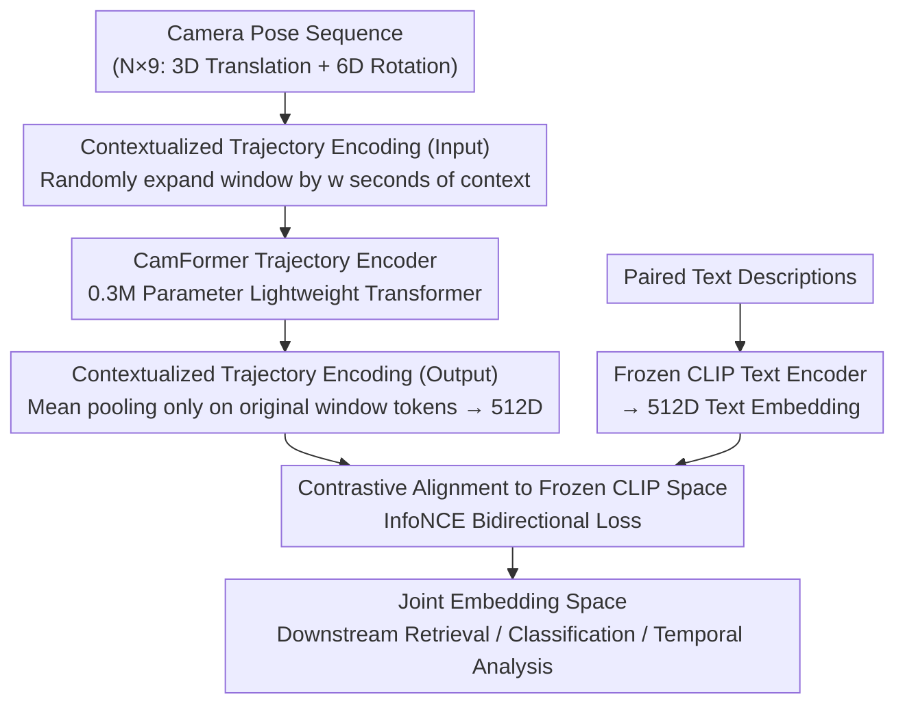

# Seeing without Pixels: Perception from Camera Trajectories

**Conference**: CVPR 2026  
**arXiv**: [2511.21681](https://arxiv.org/abs/2511.21681)  
**Code**: [https://sites.google.com/view/seeing-without-pixels](https://sites.google.com/view/seeing-without-pixels)  
**Area**: Human Understanding / Multi-modal Learning  
**Keywords**: Camera Trajectory, Contrastive Learning, Video Perception, Modality Fusion, Action Understanding

## TL;DR

This paper systematically promotes camera pose trajectories (6DoF pose sequences) as a standalone video perception modality for the first time. By training a lightweight Transformer encoder, CamFormer, through a contrastive learning framework, camera trajectories are mapped into a joint embedding space aligned with text. Experiments across 10 downstream tasks on 5 datasets demonstrate that camera trajectories are both lightweight and robust video signals—even outperforming video models with thousands of times higher computational costs in physical activities.

## Background & Motivation

1. **Background**: The field of video understanding has explored numerous modalities—vision, audio, IMU, thermal, depth, and touch—aligning them with text via contrastive learning. However, camera pose trajectories have been largely overlooked as semantic perception signals, typically relegated to geometric tasks like 3D reconstruction and visual odometry.
2. **Limitations of Prior Work**: Visual encoders involve extreme computational overhead (e.g., EgoVLPv2 at ~89.5 GMACs) and suffer in scenarios with visual occlusion or out-of-view actions. Sensors like IMU require specialized hardware and cannot be retroactively obtained from existing videos.
3. **Key Challenge**: Camera trajectories are inherent to any video and can be directly estimated, yet they have been considered too low in information density (only 9D vectors per frame) and semantically ambiguous for video understanding.
4. **Goal**: To validate the seemingly impossible hypothesis: video content can be understood using only camera motion trajectories, without any pixel information.
5. **Key Insight**: Human perception is active—we move to see; camera trajectories serve as the physical fingerprint of the videographer’s intent. A basketball layup is accompanied by an upward tilt, moving a tire involves a top-down sweep, and walking presents a rhythmic forward-and-backward oscillation—these are semantic motion signatures.
6. **Core Idea**: Use contrastive learning to map low-dimensional camera trajectories into a text semantic space, proving that "how you move" indeed reveals "what you are doing."

## Method

### Overall Architecture

The input consists of camera pose sequences $\mathbf{p} \in \mathbb{R}^{N \times 9}$ (3D translation + 6D continuous rotation relative to the sequence midpoint) corresponding to video clips, along with paired text descriptions (action narrations or video titles). The CamFormer encoder $f$ is trained via contrastive learning to align trajectory embeddings with the output of a frozen CLIP text encoder $g$. The learned embeddings can be directly applied to various downstream tasks such as retrieval, classification, and temporal analysis.

### Key Designs

**1. CamFormer Trajectory Encoder: Processing sparse pose signals with a model three orders of magnitude lighter**

Camera trajectories consist of only 9 dimensions per frame (3D translation + 6D continuous rotation). Since the information density is significantly lower than that of an RGB image, the encoder does not require a large parameter count. CamFormer is a lightweight Transformer with only 0.3M parameters (4 layers, 4 heads, 256D FFN, 0.1 dropout). The 9D pose sequence is first linearly projected to $d_{in}=128$ dimensions, combined with positional encodings, and processed through Transformer blocks to fuse temporal information. After temporal mean pooling, it is linearly projected to $d_{out}=512$ dimensions to match the CLIP text encoder. The entire forward pass requires only 0.02 GMACs, which is three orders of magnitude lighter than standard video encoders (150M parameters, 89.5 GMACs).

**2. Contextualized Trajectory Encoding: Expanded input with target-only pooling for disambiguation**

The semantics of short-window trajectories are naturally ambiguous: a 1-second "reaching" motion could indicate picking up a cup or opening a door. While lengthening the window introduces irrelevant adjacent actions, the authors propose expanding the base temporal window $[t_1, t_2]$ with a total of $w$ seconds of random context ($w \sim \mathcal{U}(0, w_{max})$, $w_{max}=8s$). The entire expanded sequence enters CamFormer, but the final embedding is computed by **mean pooling only the $N$ output tokens corresponding to the original window**. This allows the local representation to absorb global information through self-attention (e.g., "approaching a cabinet before reaching" implies opening a door) without being contaminated by neighboring actions.

**3. Alignment to Frozen CLIP Space: Mapping trajectories without reconstructing semantics**

To map "how you move" to "what you are doing," a semantic reference frame is required. Instead of training from scratch, the authors use a frozen CLIP text encoder $g$ as a fixed semantic anchor. A classic dual InfoNCE contrastive loss is used to pull trajectory embeddings toward corresponding text:

$$\mathcal{L} = \mathcal{L}_{P \to T} + \mathcal{L}_{T \to P}$$

Since the text side is frozen, CamFormer does not need to learn a semantic space from scratch; it only needs to learn to "transport" trajectories to the semantic coordinates already organized by CLIP. This leverages powerful text representations while providing a clear and simple optimization target for the 0.3M parameter encoder.

### Loss & Training

The training loss is the InfoNCE contrastive loss (including a temperature hyperparameter $\tau$), with the text encoder completely frozen. The egocentric domain was pre-trained on Ego-Exo4D (221.3h), and the exocentric domain was pre-trained on DynPose-100K (157.5h). Pose sampling rates ranged from 5 to 30Hz depending on the dataset.

## Key Experimental Results

### Main Results

**First-person Text Retrieval (5-way MCQ, Ego-Exo4D)**

| Method | Modality | GMACs | Parameters | Physical iv/oov | Procedural iv/oov | Overall |
|------|------|-------|--------|----------------|----------------|------|
| CLIP | Image | 2.95 | 59M | 25.2/18.2 | 26.8/21.9 | 22.9 |
| EgoVLPv2 (Ego-Exo4D) | Video | 89.49 | 150.7M | 39.1/25.6 | 50.5/45.4 | 38.4 |
| CamFormer | Trajectory | **0.02** | **0.3M** | **56.1/46.4** | 34.3/32.7 | 44.8 |
| CamFormer⋆ | Video+Trajectory | 89.51 | 151M | 56.0/45.8 | **51.4/45.9** | **46.0** |

**Activity Classification Accuracy (Ego-Exo4D)**

| Activity | CamFormer Accuracy |
|------|-----------------|
| Basketball | >90% |
| Bouldering | >90% |
| Cooking | Lower (Procedural) |

### Ablation Study

| Pose Source | Activity Classification (Scratch) | Activity Classification (Pre-trained) | Gain |
|---------|----------------|------------------|------|
| MegaSaM | 53.67 | 60.83 | +7.16 |
| ViPE | 60.83 | 66.15 | +5.32 |
| π³ | 61.47 | 66.15 | +4.68 |
| Aria (Hardware) | 61.83 | 71.28 | +9.45 |

### Key Findings
- **Physical vs. Procedural Activities**: CamFormer achieves >90% accuracy on activities with large body movements (basketball, climbing), significantly outperforming video models. However, its performance is lower on fine-grained procedural tasks (cooking, repair) where motion signatures are weak; in these cases, trajectories serve better as complementary signals.
- **Out-of-View Actions**: When actions are not visible in the first-person frame (oov), CamFormer shows a distinct advantage. For example, it is difficult to distinguish "landing" from video frames alone, but the trajectory clearly shows the downward movement.
- **Cross-dataset Zero-shot Generalization**: CamFormer pre-trained on Ego-Exo4D applied directly to Nymeria achieved 31.6% accuracy (chance=20%), outperforming video baselines on non-visible categories like "legs" and "focused attention."
- **Estimated Poses are Effective**: While Aria hardware poses yield the best results, RGB-only estimators (MegaSaM/ViPE/π³) also work effectively, proving the practical utility of the method.
- **Exocentric Effectiveness**: In exocentric text retrieval on DynPose-100K, CamFormer (36.2%) outperformed LMM baselines such as ShotVL (33.1%).

## Highlights & Insights
- The concept of **"perception without pixels"** is inherently provocative. A miniature model with 0.3M parameters and 0.02 GMACs defeating a video model with 150M parameters and 89.5 GMACs suggests that motion intent signals have been significantly undervalued.
- **Contextualized Encoding** is a universal technique for handling low-density modalities—expanding the input window while pooling only the target window's output can be directly transferred to sparse signals like IMU or audio.
- The fusion of **trajectories as a complementary modality** is extremely simple—averaging feature vectors—yet yields consistent gains, indicating high complementarity and minimal redundancy between trajectories and visual features.
- Camera trajectories as a modality offer unique advantages: they can be estimated retroactively from any video, require no specialized hardware, are privacy-friendly (no pixels), and have extremely low computational costs.

## Limitations & Future Work
- Trajectory signals are weak in procedural activities (cooking/repair), requiring integration with vision for optimal performance.
- Currently, only Transformer encoder architectures and InfoNCE loss have been explored; other architectures and training objectives (e.g., MAE self-supervision) warrant investigation.
- Pose estimation errors affect downstream performance; high-quality hardware poses (Aria) improve results by 5-10 points over estimated poses.
- Deep integration with LLM/VLMs, such as using trajectory embeddings as additional input tokens for VLMs, has not yet been explored.

## Related Work & Insights
- **vs. PRIMUS (IMU-text contrastive learning)**: PRIMUS achieved only 23.2% on Ego-Exo4D retrieval, while CamFormer reached 44.8%. While IMUs capture motion, they have higher sampling rates, more noise, and require specific hardware.
- **vs. CLIP/EgoVLPv2 (Vision-text)**: CamFormer outperforms video models in physical activities with substantially fewer resources, though video remains superior for procedural tasks. Fusion yields the best results.
- **vs. CameraBench/ShotVL (Camera motion description generation)**: These LMM methods describe camera motion as a video attribute (e.g., "zoom", "pan"), whereas CamFormer interprets the trajectory directly as a semantic signal, which proves more effective.

## Rating
- Novelty: ⭐⭐⭐⭐⭐ Systematically studies camera trajectories as an independent perception modality for the first time with a fresh perspective.
- Experimental Thoroughness: ⭐⭐⭐⭐⭐ Covers 5 datasets, 10 tasks, multiple pose sources, and both egocentric/exocentric views.
- Writing Quality: ⭐⭐⭐⭐⭐ Organizes experimental sections in a Q&A format that is engaging, with well-designed figures.
- Value: ⭐⭐⭐⭐⭐ Introduces a lightweight, robust, and privacy-friendly new modality for video understanding with high practical value.

<!-- RELATED:START -->

## Related Papers

- [\[CVPR 2026\] Pose-guided Enriched Feature Learning for Federated-by-camera Person Re-identification](pose-guided_enriched_feature_learning_for_federated-by-camera_person_re-identifi.md)
- [\[CVPR 2026\] Superman: Unifying Skeleton and Vision for Human Motion Perception and Generation](superman_unifying_skeleton_and_vision_for_human_motion_perception_and_generation.md)
- [\[ICLR 2026\] DenseMarks: Learning Canonical Embeddings for Head Images via Point Trajectories](../../ICLR2026/human_understanding/densemarks_learning_canonical_embeddings_for_human_heads_images_via_point_tracks.md)
- [\[CVPR 2026\] Towards Storytelling Animations: Joint Synthesis of Human and Camera Motions](towards_storytelling_animations_joint_synthesis_of_human_and_camera_motions.md)
- [\[CVPR 2026\] Learning Effective Sign Features without Text for Gloss-free Sign Language Translation](learning_effective_sign_features_without_text_for_gloss-free_sign_language_trans.md)

<!-- RELATED:END -->
