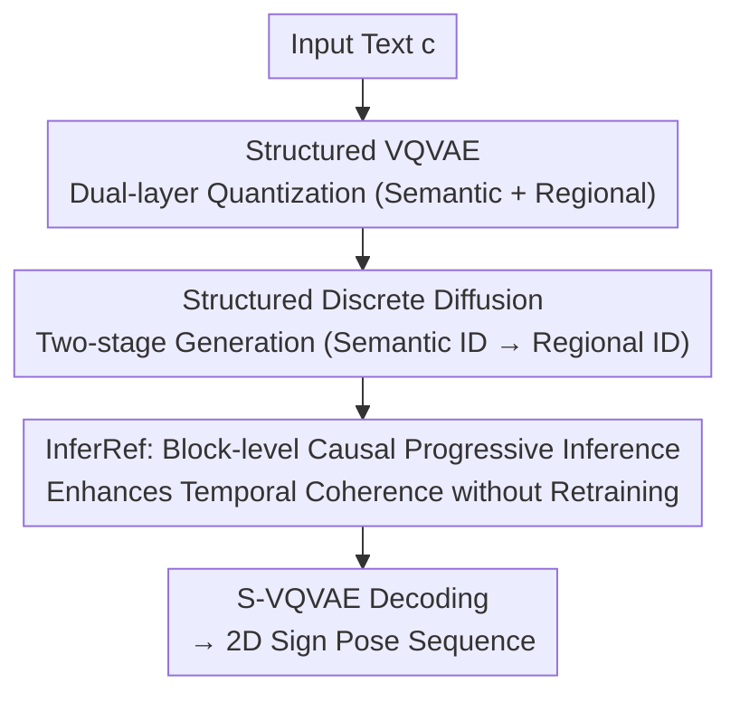

# SignPR: A Progressive Vector-Quantized Diffusion Framework for Sign Language Production

**Conference**: CVPR 2026  
**Paper**: [CVF Open Access](https://openaccess.thecvf.com/content/CVPR2026/html/Liu_SignPR_A_Progressive_Vector-Quantized_Diffusion_Framework_for_Sign_Language_Production_CVPR_2026_paper.html)  
**Code**: Not mentioned  
**Area**: Human Understanding  
**Keywords**: Sign Language Production, Text2Pose, Vector-Quantized Diffusion, Discrete Diffusion, Temporal Coherence

## TL;DR
Addressing the gloss-free Text2Pose task, SignPR proposes a "structural + temporal" dual-progressive vector-quantized diffusion framework. It utilizes a structured VQVAE to decompose each frame's pose into semantic-level (global) and regional-level (hand/face/body) discrete tokens. The diffusion process first generates semantically consistent coarse poses before refining regional details. During inference, block-level causal progressive refinement is employed to ensure temporal coherence. SignPR outperforms previous T2P methods on Phoenix14T, CSL-Daily, and USTC-CSL datasets.

## Background & Motivation
**Background**: Sign Language Production (SLP) aims to convert spoken text into sign language sequences, where "Text-to-Pose sequence" is a core sub-task (generated poses can further drive sign language videos). Based on whether glosses are used as intermediaries, it is categorized into Text2Gloss2Pose (T2G2P) and Text2Pose (T2P). T2G2P simplifies text-sign alignment through gloss labels and generally yields better results; however, gloss annotations are scarce and expensive. T2P directly maps text to continuous poses without glosses, making it more practical yet more challenging. Mainstream T2P methods use VQ-VAE to compress continuous poses into discrete tokens, subsequently predicting token sequences from text using Auto-Regressive (AR) or diffusion models.

**Limitations of Prior Work**: T2P struggle simultaneously with semantic consistency, action accuracy, and temporal coherence. (1) **Suboptimal structural modeling**: One class of methods (T2S-GPT, MS2SL, SOKE) compresses whole-frame or multi-frame poses into a **single token**, capturing semantics but losing fine-grained movements like hand shapes and facial expressions. Another class models body regions independently, preserving details but suffering from **global semantic inconsistency** and disorganized combinations due to limited inter-regional interaction and simplistic fusion. (2) **Weak temporal control**: AR methods maintain temporal causality but suffer from exposure bias and slow decoding. Diffusion methods offer fast parallel generation and diversity but lack explicit temporal control; specifically, discrete diffusion updates all temporal tokens in parallel, further weakening causality and leading to jitter and inter-frame instability.

**Key Challenge**: There is a natural conflict between "semantic consistency of a single-token whole body" and "action details of independent regional modeling." Similarly, "parallel efficiency of diffusion" conflicts with "temporal causal coherence." Existing methods typically prioritize one over the other.

**Goal**: To achieve structural modeling that balances semantic consistency with action accuracy, and temporal generation that balances parallel efficiency with causal coherence.

**Key Insight**: Resolve these conflicts using a "progressive refinement" approach. Structurally, refine from coarse (semantic) to fine (regional). Temporally, transform full-parallel diffusion into block-level causal progression, applied **only during the inference stage** without altering training.

**Core Idea**: Replace "single-layer token one-shot parallel diffusion" with "dual-layer quantization + semantic-to-regional two-stage progressive diffusion + block-level causal inference," performing progressive refinement across both structural and temporal dimensions.

## Method

### Overall Architecture
SignPR aims to generate a 2D sign language pose sequence $X=\{x_s\}_{s=1}^S$ ($x_s\in\mathbb{R}^{J\times2}$ with $J$ keypoints) from text $c$. The pipeline consists of two stages: Stage 1 trains a Structured VQVAE (S-VQVAE) to quantize pose sequences into a semantic ID sequence $I_{se}$ (capturing global dynamics/semantics) and four regional ID sequences $I_{re}$ (body, left hand, right hand, head for details). Stage 2 uses Structured Discrete Diffusion (S-Diffusion) to first denoise semantic IDs $\hat I_{se}$ from text, then denoise regional IDs $\hat I_{re}$ conditioned on both semantic IDs and text. During inference, Block-level Causal Progressive Refinement (InferRef) is applied. Finally, $\hat I_{se}$ and $\hat I_{re}$ are de-quantized via codebook lookup and decoded by the S-VQVAE decoder to reconstruct the pose sequence. A two-layer Transformer length predictor estimates the target frame count $S$.

### Key Designs

**1. Structured VQVAE: Dual-layer Discrete Representation with Consistency Constraints**

To address the trade-set between "losing details with single tokens" and "losing semantics with partitioning," S-VQVAE quantizes each frame into two levels. **Semantic Layer**: An encoder $E_{se}$ (one GCN + two Transformers) encodes the whole-frame pose into $z^{se,s}$. The ID is selected via $\ell_2$ nearest neighbor in the semantic codebook $C^{se}$: $i^{se,s}=\arg\min_j\lVert z^{se,s}-C^{se}_j\rVert_2$, resulting in a global semantic ID sequence. **Regional Layer**: The pose is partitioned into four regions (body, left hand, right hand, head), each encoded by an independent GCN + two Transformers and an independent codebook, capturing fine-grained actions. During decoding, de-quantized regional and semantic embeddings are concatenated for reconstruction by decoder $D^{re}$. Crucially, to prevent the layers from diverging, the authors introduce a **Structural Consistency Constraint**: a lightweight two-layer MLP $\phi_p$ predicts the corresponding regional IDs from the semantic latent variable $\hat z^{se,s}$, defined as $L_{cons}=\frac{1}{S}\sum_s\sum_{p}L_{CE}(\phi_p(\hat z^{se,s}),i^{p,s})$. This forces the semantic representation to "know" its corresponding regional details. Ablations show that removing $L_{cons}$ causes BLEU1 to drop significantly from 31.91 to 24.08.

**2. Structured Discrete Diffusion: Two-stage Progressive Generation**

Built upon the dual-layer discrete space, S-Diffusion first performs **Semantic Discrete Diffusion**: following the discrete forward process $q(i^{se}_t\mid i^{se}_0)$, ground-truth IDs are gradually corrupted. A U-Net denoising network $\phi_g$ predicts clean semantic IDs $\hat I^{se}_0=\phi_g(I^{se}_t,t^{se},c)$. Each semantic U-Net block contains temporal self-attention, text cross-attention, and FFN. This is followed by **Regional Discrete Diffusion**: $\hat I^{re}_0=\phi_l(I^{re}_t,t^{re},c,\hat I^{se}_0)$, which adds a Regional Attention (RT) module for inter-region information exchange and a cross-attention $CA_{se}$ conditioned on semantic poses. This "semantic-first, regional-detail-later" sequence is key to achieving both consistency and accuracy.

**3. InferRef: Causal Progressive Inference without Retraining**

Standard discrete diffusion lacks explicit causality by updating all tokens in parallel, leading to jitter. InferRef transforms inference into **block-level causal progressive refinement**. The sequence is divided into $N=\lceil S/K\rceil$ blocks $\{B_i\}$ of size $K$. Generation is modeled as $p(I\mid c)=\prod_i p(B_i\mid c,B_{<i})$. A **block-level causal mask** ensures that tokens in $B_i$ attend to previously generated blocks $B_{<i}$ but are masked from future blocks. When predicting $B_i$, the model simultaneously refines $B_{<i}$, establishing temporal causality while allowing for error correction in previous segments. This is applied to both semantic and regional stages. It targets only inference, requiring no retraining and reducing deployment costs.

### Loss & Training
Keypoints are extracted using HRNet (42 hand + 68 face + 11 upper body). S-VQVAE and S-Diffusion consist of 75.50M and 680.04M parameters, respectively. Both use AdamW, batch size 32, 100K iterations, and a 1e-4 initial learning rate with cosine decay on 8 A6000 GPUs. The S-VQVAE loss includes L1 reconstruction, structural consistency $L_{cons}$, and codebook commitment and quantization losses.

## Key Experimental Results

### Main Results
Evaluated on Phoenix14T (German), CSL-Daily (Chinese), and USTC-CSL (Chinese). Metrics include ROUGE-L and BLEU1–4 for semantics via back-translation, DTW-MJE for temporal alignment, and FID/MPJPE for action accuracy. Results for Phoenix14T TEST (↓ indicates lower is better):

| Type | Method | BLEU1 | BLEU4 | FID↓ | MPJPE↓ |
|------|------|-------|-------|------|--------|
| T2G2P | Sign-IDD | 26.45 | 8.66 | 2.46 | 47.19 |
| T2P | MoMP | 16.87 | 4.58 | 2.97 | 45.71 |
| T2P | **SignPR (Ours)** | **31.91** | **9.41** | **2.15** | **23.04** |

SignPR outperforms the T2G2P SOTA model Sign-IDD despite not using glosses, nearly halving the MPJPE (47.19 to 23.04). It shows a significant improvement over the T2P baseline MoMP (BLEU1 16.87 to 31.91). Significant gains are also observed on CSL-Daily and USTC-CSL.

### Ablation Study
On Phoenix14T TEST:

| Configuration | BLEU1 | FID↓ | MPJPE↓ | Description |
|------|-------|------|--------|------|
| Full SignPR | 31.91 | 2.15 | 23.04 | Dual-layer + Two-stage + InferRef |
| w/o $L_{cons}$ | 24.08 | 2.80 | 38.63 | No structural consistency constraint |
| w/o GCN | 26.65 | 2.35 | 28.07 | Encoder replaced by Transformer |
| Semantic Diff Only | 22.26 | 2.85 | 42.96 | No regional diffusion |
| Regional Diff Only | 23.12 | 2.58 | 40.32 | No semantic diffusion |

### Key Findings
- **$L_{cons}$ is critical**: Removing it results in the largest performance drop, confirming that the "link" between semantic and regional layers is essential for the dual-level architecture.
- **Two-stage diffusion is necessary**: Neither semantic nor regional diffusion alone achieves optimal results. The "semantic-to-regional" progression itself provides a performance gain.
- **GCN is superior for pose encoding**: Using Transformer instead of GCN results in a 5-point drop in BLEU1, as GCN better utilizes the graph structure of the human body.
- **Regional modules correct semantic errors**: Regional refinement not only adds hand details but also corrects arm positioning and improves facial expressions.

## Highlights & Insights
- **Progressive refinement resolves structural conflicts**: The dual-layer approach handles global consistency and local fidelity separately and then merges them, bypassing the "single token vs. partition" dilemma.
- **InferRef acts as a training-free temporal patch**: It suppresses parallel diffusion jitter by modifying only the inference stage, making it applicable to other discrete diffusion tasks.
- **Retrospective refinement (refining $B_{<i}$)**: Simultaneously updating previous blocks while predicting current ones combines the causality of AR with the error-correction capabilities of diffusion.
- **Surpassing gloss-based methods**: Demonstrates that proper structural and temporal modeling can substitute for the alignment benefits provided by glosses.

## Limitations & Future Work
- High parameter count (S-Diffusion 680M) and inference complexity (two-stage + block-causal) may limit real-time applications.
- Sensitivity of the block size $K$ on the coherence-efficiency trade-off requires further analysis.
- Generated output is 2D pose; end-to-end realism via pose2video hasn't been comprehensively validated.
- Drastic metric improvements on USTC-CSL Split-I suggest potential weaknesses in certain baseline comparisons.

## Related Work & Insights
- **vs. Single-token methods (T2S-GPT, MS2SL)**: SignPR adds regional layers to fix blurry details, significantly lowering MPJPE.
- **vs. Partitioned methods**: SignPR overcomes weak inter-region interaction via $L_{cons}$ and Regional Attention (RT).
- **vs. AR methods (PT-GN)**: SignPR avoids exposure bias and the need for frame-by-frame decoding while maintaining causality.
- **vs. Standard Discrete Diffusion**: InferRef introduces temporal causality without the need for specialized training.

## Rating
- Novelty: ⭐⭐⭐⭐⭐ (Structural + temporal progressive design is highly innovative for T2P)
- Experimental Thoroughness: ⭐⭐⭐⭐ (Extensive datasets and ablations; missing some efficiency analysis)
- Writing Quality: ⭐⭐⭐⭐ (Clear motivation and logic)
- Value: ⭐⭐⭐⭐ (Gloss-free surpassing SOTA is a strong result; transferable refinement ideas)

<!-- RELATED:START -->

## Related Papers

- [\[CVPR 2026\] Focal–General Diffusion Model with Semantic Consistent Guidance for Sign Language Production](focal-general_diffusion_model_with_semantic_consistent_guidance_for_sign_languag.md)
- [\[CVPR 2026\] BoostSLT: Boosting Sign Language Translation via a Plug-and-Play Diffusion-Based Semantic Enhancer](boostslt_boosting_sign_language_translation_via_a_plug-and-play_diffusion-based_.md)
- [\[CVPR 2026\] Learning Effective Sign Features without Text for Gloss-free Sign Language Translation](learning_effective_sign_features_without_text_for_gloss-free_sign_language_trans.md)
- [\[CVPR 2026\] Progressive Guessing to Fixed Point: Rethinking Human Motion Prediction with Deep Equilibrium Models](progressive_guessing_to_fixed_point_rethinking_human_motion_prediction_with_deep.md)
- [\[ECCV 2024\] A Simple Baseline for Spoken Language to Sign Language Translation with 3D Avatars](../../ECCV2024/human_understanding/a_simple_baseline_for_spoken_language_to_sign_language_trans.md)

<!-- RELATED:END -->
