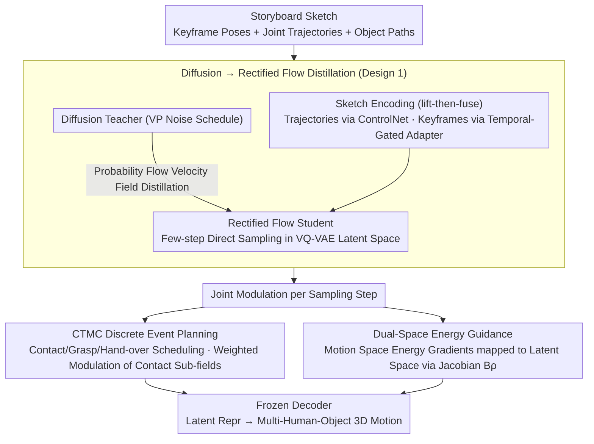

# Sketch2Colab: Sketch-Conditioned Multi-Human Animation via Controllable Flow Distillation

**Conference**: CVPR 2026  
**arXiv**: [2603.02190](https://arxiv.org/abs/2603.02190)  
**Code**: None  
**Area**: Human Understanding  
**Keywords**: Multi-person motion generation, Sketch-guided, Rectified flow distillation, Human-Object-Human collaboration, CTMC discrete events

## TL;DR

Ours proposes Sketch2Colab, which generates coordinated multi-human-object interaction 3D motions from storyboard sketches by distilling sketch-driven diffusion priors into a rectified flow student network, combined with energy guidance and Continuous-Time Markov Chain (CTMC) discrete event planning, achieving SOTA constraint compliance and perceptual quality on CORE4D and InterHuman.

## Background & Motivation

**Background**: Diffusion models have achieved significant progress in single-human motion generation, with mature solutions for text, trajectory, and style control. However, coordinated multi-person-object interaction scenarios (e.g., two people carrying a table) remain an unsolved challenge. Representative works like COLLAGE have explored this using LLM planning and latent diffusion.

**Limitations of Prior Work**: (1) Text as a control channel is too coarse, making it difficult to express precise temporal and spatial layouts. (2) Achieving precise compliance under multi-entity strong constraints in diffusion models requires expensive posterior guidance or specialized control modules, leading to slow and unstable sampling. (3) Multi-entity interactions involve discrete events (contact, grasping, hand-over), which are challenging to model with pure continuous flows.

**Key Challenge**: Sketches provide more precise spatiotemporal control signals than text. However, extending sketch constraints to multi-human-object scenes faces issues such as keyframe misalignment, multi-agent phase drift, and the difficulty of optimizing discrete states for contact and hand-over.

**Goal**: How to generate coordinated multi-human-object 3D motion sequences from storyboard sketches (keyframe poses + joint trajectories + object paths)?

**Key Insight**: Diffusion-to-rectified flow distillation for fast and stable sampling + energy guidance for precise constraints + CTMC for handling discrete contact events.

**Core Idea**: Distill a diffusion teacher into a rectified flow student; use differentiable energy functions in dual spaces (raw motion space + latent space) to guide constraint compliance; use CTMC to plan discrete interaction events to modulate the continuous flow.

## Method

### Overall Architecture

The objective of Sketch2Colab is to translate a storyboard sketch (keyframe poses for each character, joint trajectories, and object motion paths, with optional text descriptions) into a coordinated 3D motion sequence of multiple humans and objects. The pipeline first uses an alignment encoder to encode 2D/3D control signals from the sketch. A rectified flow student network then generates the motion flow within the VQ-VAE latent space. During this flow process, a Continuous-Time Markov Chain (CTMC) manages discrete events such as contact, grasping, and hand-over, scheduling them into the continuous flow. Simultaneously, a set of differentiable energy functions exerts pressure on both the motion space and latent space to pull the generation toward the constraints given by the sketch. Finally, a frozen decoder reconstructs the latent representation into the final multi-human-object motion. The three core components have distinct roles—rectified flow for continuous dynamics, CTMC for discrete events, and energy guidance for precise constraints—yet they are tightly coupled at each sampling step.

### Key Designs

**1. PF-Distillation: Replacing a slow but accurate diffusion teacher with a fast and stable rectified flow student**

Training a multi-human-object rectified flow model from scratch is difficult due to the number of entities, strong constraints, and the inherent complexity of the motion distribution. The authors first train a sketch-driven diffusion teacher (VP noise schedule) to extract the probability flow velocity field $v_\theta^{PF}$. The student network is then trained to minimize both the standard rectified flow objective $\mathcal{L}_{RF}$ and a distillation objective $\mathcal{L}_{distill}$ aligned with the teacher. This allows the student to inherit the motion priors learned by the teacher while gaining the "few-step sampling" capability of rectified flow. Sketch conditions are incorporated via a "lift-then-fuse" approach: joint/object trajectories are injected through a ControlNet-style path, while keyframe poses are added via a temporal-gated keyframe adapter that only "opens" at corresponding timestamps to prevent keyframe information from contaminating the entire generation.

**2. Dual-Space Conditioning: Utilizing two forces in the motion and latent spaces to ensure geometric accuracy and manifold adherence**

Sampling solely in the latent space does not guarantee that the generated results strictly adhere to the sketch—keyframes must align, trajectories must be followed, and contact between two people must be precise. The authors define these constraints as differentiable energy functions: $E_{key}$ for keyframe alignment, $E_\tau$ for trajectory tracking, $E_{int}$ for contact and spacing, and $E_{phys}$ for physical constraints like foot skating and ground plane alignment. The challenge is that these energies are defined in the raw motion space, while sampling occurs in the latent space, requiring gradients to be propagated across spaces. Since auto-differentiation through the decoder is computationally expensive, the authors use a learned low-rank block-Toeplitz Jacobian approximation $\mathbf{B}_\rho$ to map raw space energy gradients back to the latent space efficiently. A latent space anchor $\mathcal{L}_{lat}$ is also added to keep samples on the motion manifold. While raw space guidance alone can push samples off the manifold, and latent space guidance alone lacks geometric precision for keyframes/contacts, the dual-space approach provides complementary forces.

**3. CTMC Discrete Event Planning: Explicitly scheduling discrete events like contact, grasping, and hand-over rather than relying on continuous flow to learn them**

In collaborative tasks like two people carrying a table, events like "when the hand touches the table" or "when the object is handed over" are inherently discrete. Fitting these solely with continuous flow leads to blurred mode transitions and flickering contact points. The authors define a Continuous-Time Markov Chain over contact states, learning transition rates between states using physics-informed objectives to obtain a contact/hand-over schedule $\boldsymbol{\pi}_t$. This schedule is not applied post-hoc; instead, it modulates the continuous flow by using importance weighting to adjust sub-fields and contact weights. This pushes the continuous flow to make contact at the "appropriate" moments and release at others, ensuring crisp, phase-correct arrangements for discrete events while maintaining smooth continuous motion.

### Loss & Training

The total training loss combines $\mathcal{L}_{RF}$ (Rectified Flow), $\mathcal{L}_{distill}$ (Distillation), $\mathcal{L}_{Lyap}$ (Lyapunov potential for stable dynamics), $\mathcal{L}_{CTMC}$ (Discrete event transition rates), $\mathcal{L}_{lat}$ (Latent space anchor), and various energy terms. Classifier-Free Guidance is used during sampling (10% condition dropout, guidance strength $\omega \in [1.4, 1.8]$). The motion representation utilizes SMPL-X with 22 joints and 6D rotations.

## Key Experimental Results

### Main Results (CORE4D and InterHuman)

| Method | Constraint Compliance | FID↓ | Perceptual Quality | Inference Speed |
|------|-----------|------|---------|---------|
| COLLAGE | Baseline | - | Baseline | Slow (Diffusion) |
| Sketch2Anim | Single-human only | - | - | Medium |
| **Ours** | **SOTA** | **Lowest** | **Highest** | **Fast (Rectified Flow)** |

### Ablation Study

| Configuration | Constraint Compliance | Description |
|------|-----------|------|
| Full model | Optimal | Complete solution |
| w/o CTMC | Decreased (blurry contact) | Loss of discrete events |
| w/o dual-space | Decreased (geom. bias) | Lack of precise guidance |
| w/o distillation | Significant decrease | Unstable training from scratch |

### Key Findings

- Diffusion-to-rectified flow distillation performs significantly better than directly extending diffusion baselines to multi-entity scenes (avoiding misalignment and phase drift).
- CTMC contributes most to contact quality; without it, contact exhibits flickering and timing errors.
- Dual-space guidance is more effective than pure raw-space or pure latent-space guidance.

## Highlights & Insights

- **Three-layer Architecture**: A systematic design where continuous dynamics are handled by rectified flow, precise constraints by energy guidance, and discrete events by CTMC.
- **Sketches over Text**: Sketches naturally encode spatiotemporal information (when, where, and what pose), providing much more precision than text descriptions for interaction control.
- **Jacobian Bridge**: The use of a learned low-rank block-Toeplitz Jacobian to map raw-to-latent space gradients avoids expensive auto-differentiation.

## Limitations & Future Work

- Requires storyboard-level input—creating precise keyframe sketches still requires animator skills.
- The discrete state space of the CTMC is fixed (contact/non-contact), and more complex interaction semantics (e.g., "carefully", "forcefully") are not yet modeled.
- Evaluation is primarily on CORE4D and InterHuman; the complexity of actual film or game production scenarios is higher.

## Related Work & Insights

- **vs COLLAGE**: COLLAGE uses text + LLM planning + latent diffusion; Ours uses sketches + rectified flow + CTMC, providing more precise control and faster inference.
- **vs Sketch2Anim**: Sketch2Anim supports only single-human motion, whereas Ours extends to multi-human-object collaboration.
- **vs MotionLab**: MotionLab also uses rectified flow but targets single-human generation/editing; Ours specializes in multi-entity sketch control.

## Rating

- Novelty: ⭐⭐⭐⭐⭐ The combination of distillation, energy, and CTMC is a first in motion generation.
- Experimental Thoroughness: ⭐⭐⭐⭐ Tested on two major multi-person interaction benchmarks.
- Writing Quality: ⭐⭐⭐⭐ Systematically described method but formula-heavy.
- Value: ⭐⭐⭐⭐⭐ Significant potential for the animation and gaming industries.

<!-- RELATED:START -->

## Related Papers

- [\[CVPR 2026\] MGDHand: Multi-Granularity Prior-to-Inertial Distillation Framework for Sequential 3D Hand Pose Estimation from Sparse IMUs](mgdhand_multi-granularity_prior-to-inertial_distillation_framework_for_sequentia.md)
- [\[CVPR 2026\] Gaussian-Mixture Latent Flow for Stochastic 3D Human Motion Prediction](gaussian-mixture_latent_flow_for_stochastic_3d_human_motion_prediction.md)
- [\[CVPR 2026\] Unified Number-Free Text-to-Motion Generation Via Flow Matching](unified_number-free_text-to-motion_generation_via_flow_matching.md)
- [\[CVPR 2026\] Bridging Facial Understanding and Animation via Language Models](bridging_facial_understanding_and_animation_via_language_models.md)
- [\[CVPR 2026\] FMPose3D: monocular 3D pose estimation via flow matching](fmpose3d_monocular_3d_pose_estimation_via_flow_matching.md)

<!-- RELATED:END -->
