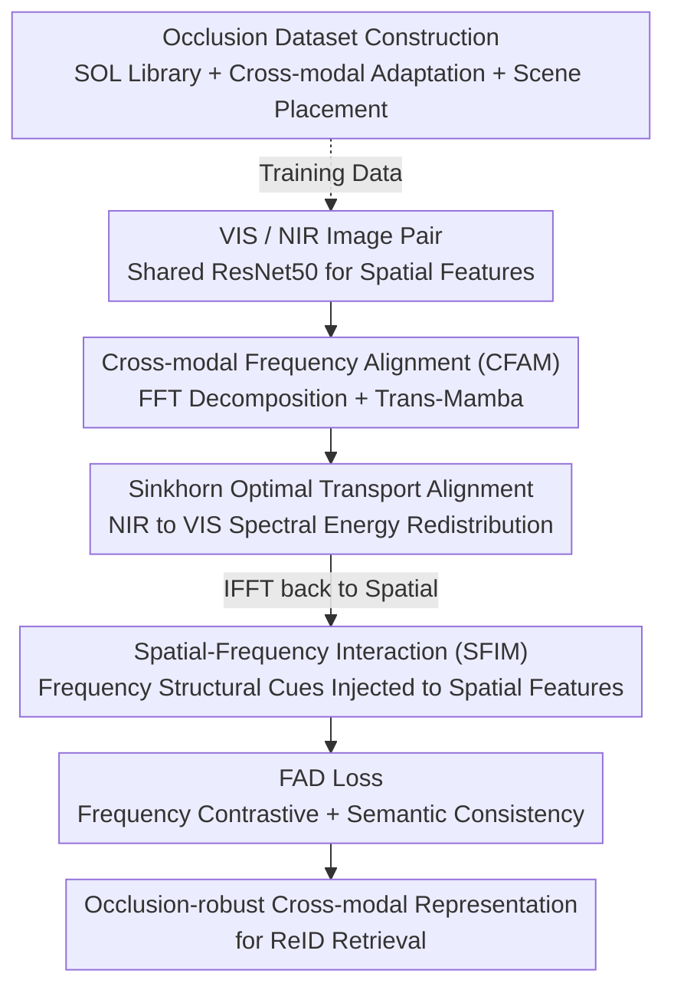

# Spatial-Frequency Collaborative Learning for Occluded Visible-Infrared Person Re-Identification

**Conference**: CVPR 2026  
**Paper**: [CVF Open Access](https://openaccess.thecvf.com/content/CVPR2026/html/Yu_Spatial-Frequency_Collaborative_Learning_for_Occluded_Visible-Infrared_Person_Re-Identification_CVPR_2026_paper.html)  
**Code**: None  
**Area**: Human Understanding / Cross-modal Person Re-Identification  
**Keywords**: Visible-Infrared ReID, Occlusion, Frequency Domain Learning, Amplitude-Phase Decomposition, Optimal Transport

## TL;DR
Aiming at Occluded Visible-Infrared Person Re-Identification (Occluded VI-ReID), this paper proposes the SFCL framework: using FFT to decompose features into amplitude (encoding modality appearance) and phase (preserving identity structure). It aligns modalities in the frequency domain using Optimal Transport, injects frequency structural cues back into spatial features, and employs a frequency-contrastive and semantic-consistent FAD loss. The method outperforms previous SOTA on two self-constructed occlusion datasets (Occ-SYSU-MM01 All-Search Rank-1 65.97%, +4.31%).

## Background & Motivation

**Background**: Visible-Infrared Person Re-Identification (VI-ReID) aims to match the same identity between daytime visible cameras and nighttime infrared cameras, serving as a core technology for cross-device security retrieval and nighttime surveillance. The vast majority of mainstream approaches assume full visibility of pedestrians, relying on spatial domain cues—local body parts, salient regions, or poses—to align features across modalities.

**Limitations of Prior Work**: Occlusion (from road signs, vehicles, or other pedestrians) is ubiquitous in real-world scenarios. Specifically, VI-ReID faces a unique challenge: **the same person often encounters occlusions at different positions in visible and infrared images**, disrupting structural correspondences and making part-level alignment unreliable. Worse, modality discrepancies (color, brightness, imaging mechanisms) are entangled with identity cues, while occlusions introduce local perturbations with random shapes and positions. Pure spatial domain alignment, interfered with by both types of noise, is prone to failure. The only previous cross-modal occlusion method and several single-modal methods remain confined to spatial domain strategies.

**Key Challenge**: Identity information must evade both modality discrepancies and occlusion perturbations. However, these three elements (identity/modality/occlusion) are mixed in the spatial domain, making decoupling difficult.

**Key Insight**: The authors observe that the frequency domain provides a physically interpretable perspective for decoupling. By decomposing images/features into amplitude and phase spectra via FFT: **amplitude reflects global appearance energy and attenuates with modality brightness (encoding modality-specific "style")**; **phase preserves fine structural details and remains nearly invariant across modalities (encoding modality-shared "geometric identity")**. Figure 1 in the paper validates this by "exchanging amplitude and phase between modalities"—the reconstructed hybrid image inherits the "appearance of the provider + structure of the receiver." Furthermore, modality differences concentrate in specific frequency bands with high amplitude variance, while differences caused by occlusion are more diffuse with weaker amplitudes. These two interferences exhibit **distinguishable patterns** in the frequency domain, whereas identity-related structures remain more stable due to phase invariance.

**Core Idea**: Replace "pure spatial" with "spatial-frequency collaboration." Decouple modality style and identity structure via amplitude-phase decomposition in the frequency domain, align cross-modal spectra, and then inject aligned frequency structural priors back into the spatial branch. This allows global frequency constraints and local spatial details to complement each other for robust cross-modal matching under occlusion.

## Method

### Overall Architecture

SFCL is a dual-branch (VIS / NIR, sharing a ResNet50 backbone) and dual-domain (spatial/frequency) collaborative architecture. Given a pair of visible and infrared images, the backbone extracts spatial features. Subsequently, the **Cross-modal Frequency Alignment Module (CFAM)** decomposes spatial features into amplitude/phase via FFT, models them separately with Trans-Mamba blocks, exchanges information via cross-modal attention, and aligns spectra using Sinkhorn Optimal Transport. These are transformed back via IFFT to obtain frequency domain representations $O^{vis}_{fre}, O^{nir}_{fre}$. Then, the **Spatial-Frequency Interaction Module (SFIM)** adaptively injects these structural cues back into the spatial features to obtain fused representations $O^{vis}_{sf}, O^{nir}_{sf}$. Finally, the **FAD Loss** performs cross-modal contrastive learning in the frequency domain and semantic consistency constraints in the label space to supervise the network.

### Key Designs

**1. CFAM: Decoupling modality style and identity structure in the frequency domain and aligning modalities via Optimal Transport**

This module directly addresses the entanglement of modality differences and occlusions in the spatial domain. It decomposes spatial features $X^m_{spa}$ (viewed as a 2D response field) using FFT: $A_m, P_m = \text{FFT}(X^m_{spa})$, where amplitude $A_m$ encodes modality-specific appearance and phase $P_m$ preserves identity structure. A **Trans-Mamba (TM) block** jointly models both. Since amplitude is sensitive to local spectral fluctuations and phase changes smoothly across bands, the amplitude branch uses a Vmamba encoder + refiner for global spectral modeling, while the phase branch uses a Transformer for local structures, followed by bidirectional interaction via cross-branch MLPs ($[A^m_{tm}, P^m_{tm}] = \text{TM}(A_m, P_m)$). Cross-modal frequency attention is then applied: visible modality uses its amplitude as a query to interact with infrared key/value, with a symmetric process for the phase domain to adaptively aggregate spectral cues.

The core is **Cross-modality Frequency Sinkhorn (CFS)**, which formulates cross-modal spectral matching as an entropy-regularized optimal transport problem. Since occlusions cause local energy loss and distribution imbalance in amplitudes, CFS sets infrared as the source and visible as the target distribution, redistributing spectral energy via Sinkhorn iterations to establish energy-conserving mappings. The spectral cost matrix is defined as $C_{ij} = \|\tilde{A}^{vis}_i - \tilde{A}^{nir}_j\|_2^2$, solved via:

$$Z^* = \arg\min_{Z \in U(a,b)} \langle Z, C\rangle - \varepsilon H(Z)$$

where marginal constraints $U(a,b)$ ensure energy conservation and the entropy term $H(Z)$ ensures smoothness. This differentiable process redistributes reliable frequencies from infrared to the visible domain. Aligned spectra are then reconstituted via IFFT as $O^{vis}_{fre}=\text{IFFT}(\tilde A^{vis}, \tilde P^{vis}, \tilde P^{nir})$.

**2. SFIM: Adaptively injecting frequency structural cues back to spatial features to recover local details**

While CFAM establishes cross-modal frequency consistency, it lacks complete local structural information. SFIM returns these cues to the spatial domain. Given spatial embedding $X^{vis}_{spa}$ and frequency representation $O^{vis}_{fre}$, it calculates a cosine similarity correlation matrix $S^{vis}_{ij} = \langle x^{vis}_{spa,i}, o^{vis}_{fre,j}\rangle / (\|x^{vis}_{spa,i}\|_2 \|o^{vis}_{fre,j}\|_2)$ as adaptive weights. This allows spatial positions to selectively focus on relevant frequency responses, yielding $X^{vis}_{sf} = S \cdot O^{vis}_{fre}$.

To suppress high-frequency noise introduced by occlusions, SFIM uses **Gabor Modulation** to emphasize structure-related bands: $G(O^{vis}_{fre})[k,:] = O^{vis}_{fre}[k,:] \cdot \exp(-(\omega_k-\omega_0)^2 / 2\sigma_\omega^2)$, where $\omega_0$ is the center frequency. An adaptive attention map with a soft threshold $\tau$ aggregates frequency cues based on structural relevance to produce $\hat F^{vis}_{spa}$. Finally, **cross-covariance pooling** ($T^{vis}_{spa}=\frac{1}{\sqrt{N_sN_f}}(\hat F^{vis}_{spa}-\ell\mu_s^\top)^\top(\hat F^{vis}_{fre}-\ell\mu_f^\top)$) captures high-order correlations between the spatial and frequency domains, followed by power normalization and an MLP for the fused representation $O^{vis}_{sf}$.

**3. FAD Loss: Frequency contrastive + semantic consistency for dual constraints**

To enhance discriminability under occlusion and alleviate semantic-spectral inconsistency, the FAD loss combines two complementary constraints. The **frequency contrastive term** projects frequency embeddings into unit vectors $r^{vis}, r^{nir}$, calculating similarity $s_{ij}=\langle r^{vis}_i, r^{nir}_j\rangle/\tau$. It uses an InfoNCE-style contrastive objective to pull same-identity pairs together and push different identities apart: $L_{cfc}=\frac{1}{2}(L_{v\to n}+L_{n\to v})$. The **semantic consistency term** feeds fused features into a shared classifier to obtain distributions $p^{vis}, p^{nir}$. It performs bidirectional KL divergence ($L_{csc}$) between a sample and its K-nearest neighbors' average distribution to softly align cross-modal decision boundaries.

**4. Semantic Occlusion Dataset Construction (SOL + Adaptation + Scene-Aware Placement)**

Existing VI-ReID datasets lack sufficient occluded samples. The authors constructed Occ-SYSU-MM01 and Occ-RegDB. They used the **Semantic Occlusion Library (SOL)**: YOLOv8-seg detects surveillance objects and SAM extracts pixel-level masks. Each occluder is associated with an attribute tuple $\phi(o_i)=(c_i, s^{sce}_i, p^{pt}_i, s^{siz}_i)$. To ensure cross-modal consistency, visible occluders are calibrated to NIR style via grayscale conversion, intensity normalization, histogram alignment, and Gaussian smoothing. Placement follow scene-aware rules ($X_o = m_{\epsilon,p}\odot X + (1-m_{\epsilon,p})\odot o_{\epsilon,p}$) with random scaling $\epsilon\sim U(0.1,0.7)$, category rotation, and feathered blending.

### Loss & Training
Total loss: $L_{total}=L_{id}+L_{tri}+\lambda_1 L_{cfc}+\lambda_2 L_{csc}$, where the first two are standard ReID ID and triplet losses. Hyperparameters: $\lambda_1=1.0, \lambda_2=0.8$. Implementation: PyTorch, 2×RTX 4090, images resized to 288×144, with standard augmentations.

## Key Experimental Results

### Main Results (Occ-SYSU-MM01 All-Search / Occ-RegDB V-I)

| Method | Source | Occ-SYSU R1 | Occ-SYSU mAP | Occ-RegDB(V-I) R1 | Occ-RegDB(V-I) mAP |
|------|------|------|------|------|------|
| DTRM | TIFS-2022 | 48.45 | 49.95 | 62.09 | 50.10 |
| DEEN | CVPR-2023 | 56.27 | 54.43 | 71.69 | 52.15 |
| CSDN | TMM-2025 | 60.25 | 59.16 | 73.35 | 52.88 |
| MPL | TCSVT-2025 | 60.92 | 60.43 | 72.82 | 52.71 |
| DNS (2nd Best) | ECCV-2024 | 61.66 | 60.59 | 73.51 | 53.39 |
| **SFCL (Ours)** | CVPR-2026 | **65.97** | **64.77** | **77.18** | **56.31** |

SFCL outperforms the second-best DNS by **+4.31% R1 / +4.18% mAP** on Occ-SYSU-MM01 All-Search.

### Ablation Study (Occ-SYSU-MM01, progressive module addition)

| Configuration | R1 | mAP | Params(M) | FLOPs(G) | Latency(ms) | Note |
|------|------|------|------|------|------|------|
| Base | 59.22 | 59.89 | 23.55 | 9.21 | 0.40 | Backbone only |
| + CFAM | 61.63 | 61.57 | 60.85 | 14.36 | 0.91 | Freq. alignment, R1 +2.41% |
| + CFAM + SFIM | 63.79 | 63.93 | 70.50 | 22.26 | 1.25 | Spatial injection, +2.16% |
| + Full SFCL | **65.97** | **64.77** | 70.50 | 22.26 | 1.25 | Full config, +6.57% total |

### Key Findings
- **Progressive effectiveness**: CFAM provides the foundation (+2.41% R1), SFIM injects structural cues (+2.16%), and FAD loss provides a "cost-free" boost (+2.18%).
- **Reasonable cost**: Parameters increase from 23.55M to 70.50M, but the performance gain outweighs the moderate inference overhead.
- **Robustness**: The method generalizes to holistic scenarios, achieving 79.13% R1 on standard SYSU-MM01, surpassing DNS by +1.86%.

## Highlights & Insights
- **Decoupling Style and Structure**: Using amplitude/phase for "modality style vs. identity structure" provides a strong physical intuition. Moving alignment to the frequency domain separates modality discrepancies from geometric features.
- **OT in Frequency Domain**: Formulating spectral alignment as an Optimal Transport problem via Sinkhorn iterations ensures energy conservation, which is particularly robust against local energy loss caused by occlusions.
- **Semantic Occlusion Benchmarks**: The construction of SOL-based datasets with cross-modal calibration (Gray->Norm->Hist->Blur) provides a more realistic evaluation for occluded VI-ReID.

## Limitations & Future Work
- **Computational Cost**: Parameters nearly triple (from 23.5M to 70.5M), posing challenges for deployment on edge surveillance devices.
- **Synthetic Data Reliance**: Conclusions are based on self-constructed occlusion datasets; generalization to actual street-scene occlusions requires further validation. ⚠️
- **OT Iteration**: The stability and convergence cost of Sinkhorn iterations under extreme energy imbalance deserve further investigation.
- **Phase Invariance**: The assumption that phase is "modality-invariant" is an approximation; its stability under drastic viewpoint changes or heavy occlusion remains an empirical premise. ⚠️

## Related Work & Insights
- **vs. Spatial-only Occlusion ReID**: Traditional methods rely on body parts or pose reconstruction, which fail when occlusions occur at different positions across modalities. This work uses global frequency priors to overcome this unique VI-ReID challenge.
- **vs. OCMF (TMM-2023)**: OCMF operates in the spatial domain (54.66% R1); SFCL surpasses it significantly by leveraging frequency decoupling and OT alignment.
- **Inspiration**: The mechanism of FFT decomposition + OT spectral alignment is applicable to other tasks requiring style/structure decoupling, such as domain adaptation or cross-modal medical image registration.

## Rating
- Novelty: ⭐⭐⭐⭐⭐ (First to use spatial-frequency collaboration for occluded VI-ReID)
- Experimental Thoroughness: ⭐⭐⭐⭐ (Comprehensive across 4 datasets, though relies on synthetic occlusion)
- Writing Quality: ⭐⭐⭐⭐ (Clear motivation and logical flow)
- Value: ⭐⭐⭐⭐ (High practical utility for real-world surveillance)

<!-- RELATED:START -->

## Related Papers

- [\[CVPR 2026\] MFEN: Multi-Frequency Expert Network for Visible-Infrared Person Re-ID](mfen_multi-frequency_expert_network_for_visible-infrared_person_re-id.md)
- [\[CVPR 2026\] Towards Cross-Modal Preservation, Consistency and Alignment for Privacy-Preserving Visible-Infrared Person Re-Identification](towards_cross-modal_preservation_consistency_and_alignment_for_privacy-preservin.md)
- [\[CVPR 2026\] BIT: Matching-based Bi-directional Interaction Transformation Network for Visible-Infrared Person Re-Identification](bit_matching-based_bi-directional_interaction_transformation_network_for_visible.md)
- [\[CVPR 2026\] COPE: Consistent Occlusion and Prompt Enhancement Network for Occluded Person Re-identification](cope_consistent_occlusion_and_prompt_enhancement_network_for_occluded_person_re-.md)
- [\[ICCV 2025\] Weakly Supervised Visible-Infrared Person Re-Identification via Heterogeneous Expert Collaborative Consistency Learning](../../ICCV2025/human_understanding/weakly_supervised_visible-infrared_person_re-identification_via_heterogeneous_ex.md)

<!-- RELATED:END -->
