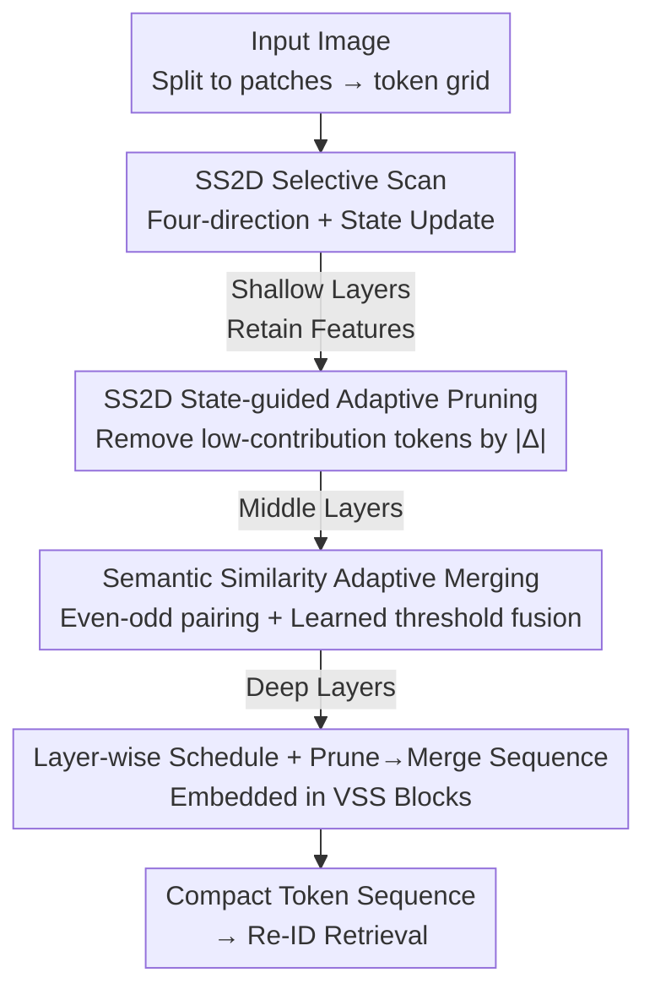

# SSM-Aware Token-Efficient VMamba via Adaptive Patch Pruning and Merging for Person Re-Identification

**Conference**: CVPR 2026  
**Paper**: [CVF Open Access](https://openaccess.thecvf.com/content/CVPR2026/html/Huang_SSM-Aware_Token-Efficient_VMamba_via_Adaptive_Patch_Pruning_and_Merging_for_CVPR_2026_paper.html)  
**Code**: https://github.com/YuanHuang0982/TE-VMamba  
**Area**: Human Understanding / Person Re-Identification / Model Efficiency  
**Keywords**: Person Re-Identification, Visual State Space Models, VMamba, Token Pruning, Token Merging

## TL;DR
TE-VMamba leverages the SS2D state update intensity (step size $\Delta$) and token similarity to guide token reduction. It prunes redundant tokens that contribute minimally to the state in shallow layers based on $\Delta$ and merges semantically similar tokens in deep layers. On Market-1501, it reduces FLOPs by over 60% while Rank-1 accuracy actually increases.

## Background & Motivation
**Background**: Person Re-Identification (Re-ID) constantly seeks a balance between "discriminative power" and "deployment efficiency." The CNN era relied on part-level modeling (PCB/OSNet), while the Transformer era utilized global attention (TransReID/DC-Former). Recently, Visual State Space Models (SSM) like VMamba have emerged as efficient backbone candidates due to their linear-complexity Selective Scan (SS2D).

**Limitations of Prior Work**: Although VMamba claims linear time complexity, "linear complexity" does not equate to "fast practical inference." It still performs serial state updates on a dense $H\times W$ token grid, limiting parallelism; alternating horizontal/vertical scans also introduce significant data movement overhead. Under real-world deployment conditions like high-resolution input, batch size = 1, or edge hardware, GPU utilization remains low, and the number of tokens directly hampers latency, memory, and energy consumption.

**Key Challenge**: Reducing tokens is a recognized efficiency method, but existing pruning/merging methods (DynamicViT, EViT, ToMe, etc.) are designed for "Global Attention ViTs." Directly applying them to SSMs ignores the "directional and recursive" nature of SS2D state updates—which sequentially update a shared hidden state along a scan path. Arbitrarily deleting tokens interrupts the scanning sequence and destroys structures carrying identity information, leading to state inconsistency.

**Goal**: Design an "SSM-aware" token reduction mechanism where pruning/merging decisions stem from the state update dynamics themselves rather than external heuristics, achieving significant token reduction without performance degradation.

**Key Insight**: The authors observe that the input-dependent step size $\Delta_k$ in SS2D directly determines the magnitude by which a token rewrites the hidden state. Tokens with $\Delta_k$ close to 0 contribute almost nothing to the recursion but still consume computation. This naturally serves as an SSM-native importance metric, which is more aligned with Mamba's propagation than ViT attention scores.

**Core Idea**: Use the SS2D state update intensity $\Delta$ to define token importance. Prune tokens using adaptive thresholds in shallow layers, merge them based on semantic similarity in deep layers, and use learnable layer-wise thresholds to dynamically balance accuracy and computation.

## Method

### Overall Architecture
TE-VMamba follows the four-stage hierarchical structure of VMamba: input images are divided into patches and passed through several VSS Blocks. Inside each block, state updates are performed via SS2D selective scanning. The modification involves inserting two lightweight modules **after each SS2D block**—first pruning, then merging—to maintain the SS2D state update path while removing redundant tokens.

The process follows a depth-wise schedule: **shallow layers (early stage)** remain untouched to focus on basic feature extraction; **middle layers (approx. layers 5–10)** perform $\Delta$-guided adaptive pruning to remove tokens with minimal state contribution; **deep layers (approx. layers 12–18)** perform similarity-based merging to fuse semantically redundant tokens among survivors. Since identity cues are naturally sparse and backgrounds are highly repetitive, this "denoise first, compress later" arrangement maintains discriminative power while significantly reducing tokens. Pruning and merging are executed sequentially (Prune→Merge) after each SS2D block, maintaining overall linear complexity.

### Key Designs

**1. SS2D State Update Guided Adaptive Pruning: Letting $\Delta$ Identify Redundancies**

The motivation is clear: SS2D is recursive; each token sequentially rewrites a shared hidden state. Tokens with extremely small update intensities barely change the state but still occupy recursive computation. The authors treat the Mamba gating step size as an importance measure: $\Delta_k = \mathrm{Softplus}(W_\Delta x_k + U_\Delta h_{k-1})$. A larger $\Delta_k$ indicates a stronger influence on the state update, while a value near 0 means the token is almost uninvolved in the recursive dynamics. A layer-wise adaptive threshold is used for filtering: $\theta = \mu - \alpha\sigma$, where $\mu$ and $\sigma$ are batch statistics of $|\Delta_k|$ for the current layer, and $\alpha$ controls pruning aggressiveness ($\alpha=0.7$ in experiments). Tokens with $|\Delta_k| < \theta$ are pruned. This makes pruning an "endogenous" model operation driven by state update statistics rather than an external heuristic. It removes inactive tokens, stabilizing the scan trajectory and automatically retaining more tokens during occlusions or large viewpoint changes.

**2. Semantic Similarity Adaptive Merging: Consolidating Information Tokens**

After pruning, many surviving tokens represent nearly identical semantic regions (e.g., uniform backgrounds or clothing textures). To maintain spatial coherence, TE-VMamba utilizes alternating scans—horizontal in odd layers and vertical in even layers—ensuring spatially adjacent tokens remain close in the sequence. The sequence is divided into fixed even-odd pairs $(a_k, b_k)$ as merging units. Normalized dot-product similarity is calculated for each pair: $s_k = \dfrac{a_k^\top b_k}{\lVert a_k\rVert_2 \lVert b_k\rVert_2}$. A lightweight gate head (tau head, 2-layer MLP + sigmoid) predicts a threshold $\theta$ layer-wise and instance-wise based on global feature statistics. If $s_k > \theta$, tokens are fused via average merging $z_k = \dfrac{a_k + b_k}{2}$; otherwise, they are kept. Shallow merging is conservative to preserve details, while deep merging aggressively averages semantically consistent regions. This learnable gating replaces manual constants, achieving instance-aware compression that complements pruning.

**3. Layer-wise Schedule + Prune→Merge Order: Integrated Seamlessly**

Both modules are inserted after the SS2D block and its state update, specifically in the **Prune $\rightarrow$ Merge** order. This sequence is intentional: pruning first blocks insignificant tokens from the subsequent recursion to prevent them from "polluting" state propagation. Merging then only integrates tokens that "truly influence the hidden state." The authors compared alternative orders: Merge→Prune causes redundant tokens to rewrite the feature distribution before removal, disturbing recursion; Simultaneous execution leads to unstable trajectories and decision conflicts between $\Delta$-pruning and similarity-merging. Only Prune→Merge maintains the recursive relationship $h_t = \bar{A}h_{t-1} + \bar{B}x_t$ and linear complexity while avoiding instability.

### Loss & Training
End-to-end training follows standard Re-ID protocols: Label Smoothing Cross-Entropy $L_{CE}$ + Batch-Hard Triplet Loss $L_{Tri}$, with total loss $L = L_{CE} + \lambda L_{Tri}$ ($\lambda=1.0$, margin 0.3, smoothing 0.1). Pruning/merging thresholds $\theta_p, \theta_m$ are parameterized and learned via softplus to provide smooth gradients and avoid instability from hard token masks. While the forward pass involves binary choices, the softplus form ensures $\theta$ remains continuous and optimizable. Pruning thresholds $\theta$ are regularized toward a target sparsity to stabilize behavior. Optimizer: AdamW, learning rate 3e-4, batch size 128.

## Key Experimental Results

### Main Results
Comparison with CNN / Transformer / Mamba methods on Market-1501, CUHK03-NP, and MSMT17 (No re-ranking, Rank-1 / mAP):

| Method | Market-1501 R-1 | CUHK03-NP(Lab) R-1/mAP | CUHK03-NP(Det) R-1/mAP | MSMT17 R-1/mAP |
|------|------|------|------|------|
| DC-Former (Transformer) | 96.0 | 84.4 / 83.3 | 79.6 / 77.5 | 86.9 / 70.7 |
| PHA (Transformer) | 96.1 | 84.5 / 83.0 | 83.2 / 80.3 | 86.1 / 68.9 |
| **Ours** (TE-VMamba-Tiny) | 93.6 | 96.3 / 92.1 | 94.0 / 90.6 | 82.8 / 62.9 |
| **Ours** (TE-VMamba-Base) | **96.7** | **97.3 / 94.0** | **95.4 / 91.7** | 83.3 / 62.7 |

TE-VMamba-Base achieves the highest Rank-1 (96.7%) on Market-1501 and SOTA on both CUHK03-NP splits, remaining competitive with strong Transformers on MSMT17. Performance on Occluded-ReID is also notable:

| Method | Rank-1 | mAP |
|------|------|------|
| ADP | 89.2 | 85.1 |
| FLaN-Net | 92.6 | **89.5** |
| **Ours** (TE-VMamba) | **95.5** | 85.3 |

### Ablation Study
Contribution of Pruning/Merging on Market-1501 (Tiny):

| Backbone | Configuration | Rank-1 (Gain) | mAP (Gain) | FLOPs(G) (Gain) |
|------|------|------|------|------|
| VMamba-Tiny | No reduction | 98.2 | 91.6 | 5.02 |
| | Merging only | 98.5 (+0.3) | 91.1 (−0.5) | 5.02 (0) |
| | Pruning only | 93.9 (−4.3) | 84.3 (−7.3) | 1.86 (−3.16) |
| | Pruning + Merging | 93.6 (−4.6) | 84.2 (−7.4) | 1.86 (−3.16) |

Ablation on module order (Base):

| Order | Rank-1 | mAP | FLOPs(G) |
|------|------|------|------|
| Prune→Merge | 96.7 | 87.1 | **3.82** |
| Merge→Prune | 96.7 | 87.4 | 7.69 |
| Simultaneous | 95.5 | 86.4 | 3.83 |

For Base, token reduction on both query and gallery reduces FLOPs from 15.46G to 3.82G, latency from 397ms to 218ms, and increases throughput from 322 to 590 im/s.

### Key Findings
- **Merging is far "friendlier" than pruning**: Merging alone barely drops accuracy (and sometimes improves it), as it only consolidates redundancy. Pruning alone drops accuracy significantly, suggesting $\Delta$-importance doesn't perfectly align with identity cues. Their combination significantly reduces FLOPs while preserving accuracy...
- **Base is more robust than Tiny**: Tiny drops 4.6% Rank-1 under reduction, while Base only drops 1.5%, indicating larger models have more redundancy to prune.
- **Order is critical**: Prune→Merge achieves the best efficiency (3.82G FLOPs), confirming that pruning before merging aligns better with recursive scanning.
- **Layer-wise analysis**: The baseline shows a surge in $|\Delta|$ mean in layers 5–10 (noise updates). Pruning flattens this curve; layers 12–18 show higher similarity, making them ideal for merging.

## Highlights & Insights
- **Using $\Delta$ as importance is "free" and SSM-native**: Step size $\Delta_k$ is already present in Mamba. Using it for token selection avoids extra scoring networks and fits the state update dynamics better than ViT attention scores.
- **Depth-wise scheduling is empirically supported**: Instead of arbitrary choices, the schedule is based on analyzing $|\Delta|$ and similarity curves to identify where noise is high (prune) and redundancy is high (merge).
- **Transferability**: The concept of using internal gating/selection metrics for token reduction can be transferred to any SSM-based vision backbone beyond Re-ID.

## Limitations & Future Work
- **Pruning alone causes noticeable drops**: $\Delta$-importance is not perfectly aligned with identity cues. Merging is required to buffer this, suggesting $\Delta$ as a proxy for importance still has room for refinement.
- **Standard benchmark focus**: Latency/throughput were measured on an RTX 5080; real-world edge deployment benefits (with batch=1) require further verification.
- **Empirical hyperparameters**: Settings like layers 5–10 for pruning and $\alpha=0.7$ rely on VMamba-specific tuning.
- Future work: Integrating $\Delta$ with identity-discriminative supervision for pruning or making targets instance-adaptive could mitigate accuracy loss.

## Related Work & Insights
- **vs. ViT Token Reduction (DynamicViT/ToMe)**: They rely on global attention. This paper highlights that SSMs require directional/recursive awareness and scan-consistency, which TE-VMamba addresses via $\Delta$ and even-odd pairing.
- **vs. Transformer-based Re-ID**: While Transformers excel in discriminative power, their complexity is quadratic. TE-VMamba maintains efficiency while outperforming them on CUHK03-NP and Occluded-ReID.
- **vs. Hybrid CNN–Mamba Re-ID**: Existing works show SSMs are competitive; this work moves from theoretical "linear complexity" to practical "reduced FLOPs/latency."

## Rating
- Novelty: ⭐⭐⭐⭐ Using SSM-native $\Delta$ for pruning+merging is a clever and structurally aligned approach.
- Experimental Thoroughness: ⭐⭐⭐⭐ Solid results across four datasets and multiple ablations, though edge hardware testing is missing.
- Writing Quality: ⭐⭐⭐⭐ Clear argumentation on motivation, mechanisms, and ordering.
- Value: ⭐⭐⭐⭐ Provides a reusable token reduction paradigm for efficient SSM vision backbones, reducing FLOPs by >60%.

<!-- RELATED:START -->

## Related Papers

- [\[CVPR 2026\] View-Aware Semantic Alignment for Aerial-Ground Person Re-Identification](view-aware_semantic_alignment_for_aerial-ground_person_re-identification.md)
- [\[CVPR 2026\] Pose-guided Enriched Feature Learning for Federated-by-camera Person Re-identification](pose-guided_enriched_feature_learning_for_federated-by-camera_person_re-identifi.md)
- [\[CVPR 2026\] VRCLIP: Multimodal Canonical Correlation Alignment for CLIP-Driven Vision-Radio Person Re-Identification](vrclip_multimodal_canonical_correlation_alignment_for_clip-driven_vision-radio_p.md)
- [\[CVPR 2026\] Composite-Attribute Person Re-Identification via Pose-Guided Disentanglement](composite-attribute_person_re-identification_via_pose-guided_disentanglement.md)
- [\[CVPR 2026\] Vision-Language Attribute Disentanglement and Reinforcement for Lifelong Person Re-Identification](vision-language_attribute_disentanglement_and_reinforcement_for_lifelong_person_.md)

<!-- RELATED:END -->
