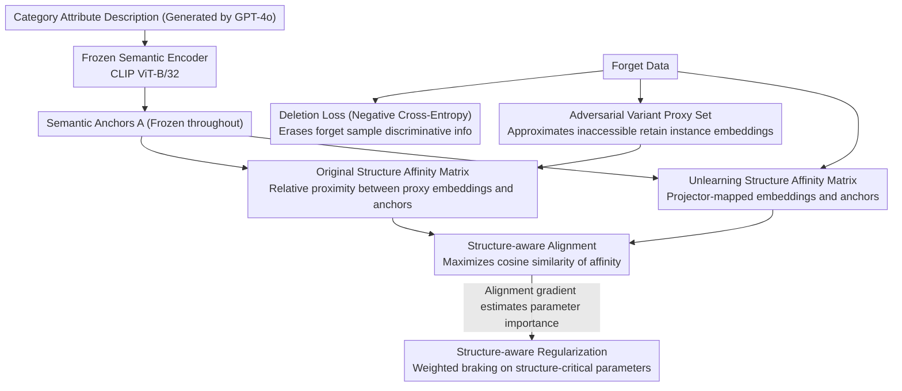

# Stake the Points: Structure-Faithful Instance Unlearning

**Conference**: CVPR2026  
**arXiv**: [2603.12915](https://arxiv.org/abs/2603.12915)  
**Code**: To be confirmed  
**Area**: Human Understanding  
**Keywords**: machine unlearning, instance-level unlearning, structural preservation, semantic anchors, CLIP

## TL;DR

Structguard is proposed to maintain the semantic relationship structure between retained instances during the unlearning process through semantic anchors, preventing structural collapse. It achieves average improvements of 32.9%, 19.3%, and 22.5% in image classification, face recognition, and retrieval tasks, respectively.

## Background & Motivation

1.  **Driven by Data Protection Regulations**: Regulations such as GDPR require models to remove the influence of specific user data. Since retraining from scratch is prohibitively expensive, research into Machine Unlearning (MU) has emerged.
2.  **Instance-level Unlearning is More Practical**: Real-world deletion requests typically target specific individuals rather than entire categories, making instance-level unlearning more practically significant than class-level unlearning.
3.  **Prior Work Neglects Semantic Structure**: Existing MU methods (e.g., Neggrad, Adv, L2UL) destroy the semantic relationships between retained instances while deleting target instances, leading to progressive structural collapse of the representation space.
4.  **Negative Correlation Between Structural Collapse and Performance**: The authors experimentally found a significant negative correlation between the degree of structural collapse and the balance accuracy of deletion-retention. Better structural preservation leads to better unlearning performance.
5.  **No Retain Set Required**: In real-world scenarios, original training data is often inaccessible due to policy or storage constraints. This method relies solely on the pre-trained model and the data to be forgotten.
6.  **Knowledge is Encoded in Relationships**: Knowledge in deep models is not stored in isolation but is organized through semantic relationships. The unlearning process must protect this relational structure.

## Method

### Overall Architecture

Structguard aims to address an overlooked side effect in instance-level machine unlearning: while deleting, the semantic relationships between retained instances are also destroyed, causing progressive structural collapse in the representation space. The core observation is that model knowledge exists not in isolated samples but is encoded in the relational structure between instances. Therefore, this structure must be treated as an explicit object of protection during unlearning.

The Mechanism is as follows: first, a set of fixed "semantic anchors" (stakes) is created for each category to serve as markers. The affinity between retained instance embeddings and these anchors is recorded as the "original structure." During unlearning, negative cross-entropy is used to erase the discriminative information of the forget samples, while the affinity between the erased embeddings and the anchors is forced to align back to the original structure. Simultaneously, regularization is applied to parameters most critical to the structure. Since common retain sets are often inaccessible in practical scenarios, retained instance embeddings are approximated using adversarial variants generated from the forget samples. The entire process depends only on the pre-trained model and the forget data, with no retain set required.

### Key Designs

**1. Semantic Anchors: Creating data-independent fixed reference stakes to anchor the unlearning process**

Collapse occurs because unlearning gradients lack external references, allowing embeddings to drift freely. Structguard uses GPT-4o to generate attribute descriptions (texture, shape, typical context, etc.) for each category $c$. These descriptions are concatenated and fed into a frozen semantic encoder $T(\cdot)$ (CLIP ViT-B/32) to obtain class-level anchors $a_c$. All anchors are stacked into a matrix $A \in \mathbb{R}^{b \times d}$ and frozen. Language is chosen over images for anchors because attribute descriptions are naturally data-independent and stable. Ablation shows semantic anchors perform 7.84% higher than visual prototype anchors on CIFAR-10, confirming language-guided reference points are more robust.

**2. Structure Definition and Proxy Set: Quantifying "knowledge structure" as an embedding-anchor affinity matrix and filling the missing retain set with adversarial samples**

With anchors, the "structure" is concretized into an affinity matrix: the original structure $S^{\text{ori}} = V^{\text{ori}} \cdot A^\top$ records the relative proximity of retain instance embeddings $V^{\text{ori}}$ to anchors, while the unlearning structure $S^{\text{unl}} = V^{\text{unl}} \cdot A^\top$ represents the affinity after mapping through a learnable projector $p_\omega$. Given the key constraint that $V^{\text{ori}}$ is unavailable, the authors generate adversarial variants of forget samples to approximate the embedding distribution of retain instances, forming a proxy set to calculate $S^{\text{ori}}$ as the alignment target without real retain data.

**3. Structure-aware Alignment: Maximizing the cosine similarity of structure before and after unlearning**

While erasing information is easy, doing so without affecting relationships is difficult. The alignment loss expresses this as a direct constraint, forcing the affinity vectors of each instance before and after unlearning to be as collinear as possible:

$$\mathcal{L}_{\text{align}} = -\frac{1}{b} \sum_{i=1}^{b} \cos(S_i^{\text{ori}}, S_i^{\text{unl}})$$

It maximizes the cosine similarity between $S^{\text{ori}}$ and $S^{\text{unl}}$, preserving the "pattern" of instances relative to anchors rather than absolute positions. Thus, unlearning can change the category assignment of a sample without disrupting the relative geometry of retained instances. Ablation shows this is the most critical component.

**4. Structure-aware Regularization: Weighted braking for structure-critical parameters**

While alignment constrains output structure, regularization provides security at the parameter level:

$$\mathcal{L}_{\text{reg}} = \frac{1}{2} \sum_i I_i \cdot (\psi_i^{\text{unl}} - \psi_i^{\text{ori}})^2$$

Here, $I_i$ is the structural importance score of the $i$-th parameter, estimated by the absolute gradient of the alignment loss—higher gradients indicate parameters more vital for maintaining structure. The update $(\psi_i^{\text{unl}} - \psi_i^{\text{ori}})^2$ is penalized by weight, restricting structure-critical parameters while allowing more freedom for irrelevant parameters, focusing erasure in directions that do not destroy the structure.

### Loss & Training

The total loss splits "erasure" and "retention" into separate paths: the deletion loss $\mathcal{L}_{\text{del}}$ bypasses the projector to erase forget sample discriminative information using negative cross-entropy; the retention loss $\mathcal{L}_{\text{ret}}$ uses cross-entropy through the projector to maintain semantic relationships. These are combined with the alignment and regularization losses:

$$\mathcal{L} = \mathcal{L}_{\text{del}} + \mathcal{L}_{\text{ret}} + \mathcal{L}_{\text{align}} + \mathcal{L}_{\text{reg}}$$

## Key Experimental Results

### Image Classification (CIFAR-10 / CIFAR-100 / ImageNet-1K)

| Method | CIFAR-10 $\mathcal{A}_{\text{test}}$ (k=256) | CIFAR-100 $\mathcal{A}_{\text{test}}$ (k=256) | ImageNet-1K $\mathcal{A}_{\text{test}}$ (k=256) | $\mathcal{A}_f$ |
|------|:---:|:---:|:---:|:---:|
| L2UL | 45.44 | 48.71 | 31.19 | 100.0 |
| Adv | 36.69 | 46.45 | 21.27 | 100.0 |
| **Ours** | **56.32** | **56.91** | **41.15** | **100.0** |

- Surpasses Oracle by 17.73% ($\mathcal{A}_{\text{test}}$) and 21.77% ($\mathcal{A}_r$) on CIFAR-10 (k=256).
- Surpasses all baselines by an average of 21.57% ($\mathcal{A}_{\text{test}}$) on ImageNet-1K.
- As k increases, the degradation of Ours is much lower than L2UL (22.21% drop for L2UL vs 9.68% for Ours on CIFAR-100).

### Face Recognition (Lacuna-10)

| Method | k=3 $\mathcal{A}_{\text{test}}$ | k=64 $\mathcal{A}_{\text{test}}$ | $\mathcal{A}_f$ |
|------|:---:|:---:|:---:|
| L2UL | 75.37 | 12.26 | 100.0 |
| **Ours** | **77.29** | **27.71** | **100.0** |

Surpasses L2UL by an average of 5.92% ($\mathcal{A}_{\text{test}}$) and 5.23% ($\mathcal{A}_r$).

### Ablation Study

| SA | SR | CR | CIFAR-10 $\mathcal{A}_{\text{test}}$ | CIFAR-100 $\mathcal{A}_{\text{test}}$ |
|:---:|:---:|:---:|:---:|:---:|
| ✗ | ✓ | ✓ | Max decrease | Max decrease |
| ✓ | ✗ | ✓ | Small decrease | Large decrease |
| ✓ | ✓ | ✗ | Large decrease | Small decrease |
| ✓ | ✓ | ✓ | **Best** | **Best** |

- **SA (Structure-aware Alignment)** is the most critical component; performance drops the most when removed.
- On CIFAR-10, CR > SR (classifier regularization matters more with fewer classes). On CIFAR-100, SR > CR (parameter constraints matter more with many classes).
- Anchor Type: Semantic anchors outperform visual prototype anchors (+7.84% on CIFAR-10), indicating language-guided anchors provide better structural reference.

## Highlights & Insights

- **Novel Concept**: First to formalize "structural preservation" as a core goal of MU, revealing the causal link between structural collapse and the deletion-retention balance.
- **Sophisticated Anchor Design**: Leverages LLM attribute descriptions + CLIP encoding to build stable, data-independent reference points.
- **Comprehensive Validation**: Significant gains across classification, recognition, and retrieval tasks demonstrate the versatility of the mechanism.
- **Excellent Representation Consistency**: Grad-CAM and representation cosine similarity analysis show that retained sample representations are nearly unaffected by the unlearning process.
- **No Retain Set Required**: Operates using only the pre-trained model and forget set, aligning better with real-world application scenarios.

## Limitations & Future Work

- Dependency on CLIP and GPT-4o for anchor generation may affect performance based on model/prompt choice and increases deployment costs.
- The proxy set approximates the retain set via adversarial samples; quality might be insufficient when the number of forget samples is small.
- The projector $p_\omega$ introduces additional parameters and computational overhead.
- Only ResNet architectures were evaluated; effectiveness on Transformer architectures like ViT remains unproven.
- Multi-round sequential unlearning requests were not discussed (e.g., whether anchors need updating).
- Class-level anchors have limited capability to describe intra-class diversity; fine-grained scenarios might require sub-class anchors.

## Related Work & Insights

| Method | Goal | Granularity | Requires Retain Set | Structural Preservation |
|------|------|------|:---:|:---:|
| Fisher [Golatkar'20] | undo | Instance | ✓ | ✗ |
| UNSIR [Tarun'23] | undo | Class | ✓ | ✗ |
| L2UL [Chen'24] | misclassify | Instance | ✗ | ✗ |
| LoTUS [Kim'24] | undo | Instance | ✓ | ✗ |
| **Ours** | misclassify | Instance | ✗ | **✓** |

Ours is the first instance-level unlearning method to simultaneously satisfy "No Retain Set" and "Structural Preservation." Like L2UL, it uses a misclassification goal without a retain set but comprehensively outperforms it across all tasks by explicitly maintaining knowledge structure via semantic anchors.

## Rating

- Novelty: ⭐⭐⭐⭐ — The structural preservation perspective is novel; semantic anchor design is ingenious.
- Experimental Thoroughness: ⭐⭐⭐⭐ — Comprehensive triple-task evaluation with rich ablation, visualization, and anchor analysis.
- Writing Quality: ⭐⭐⭐⭐ — Clear illustrations and rigorous logical motivation.
- Value: ⭐⭐⭐⭐ — Provides a new paradigm for structural preservation in the MU field with high practicality.

<!-- RELATED:START -->

## Related Papers

- [\[CVPR 2026\] Region-Aware Instance Consistency Learning for Micro-Expression Recognition](region-aware_instance_consistency_learning_for_micro-expression_recognition.md)
- [\[CVPR 2026\] Humanoid-GPT: Scaling Data and Structure for Zero-Shot Motion Tracking](humanoid-gpt_scaling_data_and_structure_for_zero-shot_motion_tracking.md)
- [\[CVPR 2025\] Structure-Aware Correspondence Learning for Relative Pose Estimation](../../CVPR2025/human_understanding/structure-aware_correspondence_learning_for_relative_pose_estimation.md)
- [\[CVPR 2026\] BarbieGait: An Identity-Consistent Synthetic Human Dataset with Versatile Cloth-Changing for Gait Recognition](barbiegait_an_identity-consistent_synthetic_human_dataset_with_versatile_cloth-c.md)
- [\[CVPR 2026\] MOFA-VTON: More Fashion Possibilities with Fine-Grained Adaptations in Virtual Try-On](mofa-vton_more_fashion_possibilities_with_fine-grained_adaptations_in_virtual_tr.md)

<!-- RELATED:END -->
