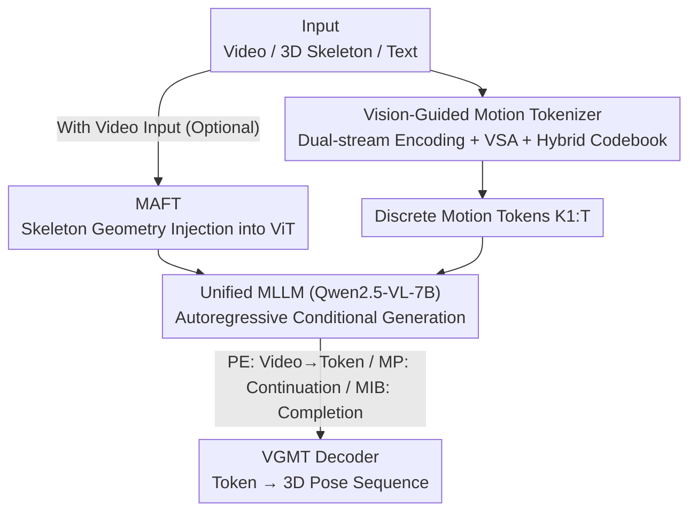

# Superman: Unifying Skeleton and Vision for Human Motion Perception and Generation

**Conference**: CVPR 2026  
**Paper**: [CVF Open Access](https://openaccess.thecvf.com/content/CVPR2026/html/Wang_Superman_Unifying_Skeleton_and_Vision_for_Human_Motion_Perception_and_CVPR_2026_paper.html)  
**Code**: https://github.com/BradleyWang0416/Superman  
**Area**: Human Understanding / 3D Pose / Multimodal MLLM  
**Keywords**: Human motion, 3D pose estimation, motion prediction, motion in-betweening, VQ-VAE, MLLM

## TL;DR
Superman unifies "3D pose perception from video" and "skeleton-based motion generation" into a conditional sequence generation problem: it first employs a **vision-guided motion tokenizer** (VQ-VAE + dual vision/geometry streams + hybrid codebook) to quantize continuous motion into cross-modal discrete tokens, then utilizes a single MLLM (Qwen2.5-VL-7B) to autoregressively predict these tokens. This framework performs 3D pose estimation, motion prediction, and motion in-betweening within a single model, achieving an 11~12% improvement over specialized SOTAs on Human3.6M.

## Background & Motivation

**Background**: In human motion analysis, 3D pose estimation, motion prediction, and motion in-betweening have long been treated as three isolated tasks, each with specifically optimized models. The rise of MLLMs offers the potential for unification by representing continuous motion as discrete tokens for language modeling.

**Limitations of Prior Work**: The authors identify three gaps in the current ecosystem. ① **Disconnection between Perception and Generation**: "Perception" models like MotionLLM and LLaVA-Pose can interpret actions from video but only output text rather than new poses; "Generation" models like MotionGPT can generate motion from text but cannot process raw visual input—forming a "read-only" vs "write-only" dichotomy. ② **Static Single-frame Focus**: Generative MLLMs such as ChatPose, PoseLLaVA, and UniPose mostly utilize densely parameterized SMPL models for single frames, losing temporal dynamics. ③ **Decoupling of Motion Vocabulary and Vision**: Existing motion token vocabularies are trained solely on skeleton data, severing links with the visual domain.

**Key Challenge**: Perception and generation are two sides of the same coin and should mutually reinforce each other. However, current paradigms are forced into different architectures for inherently similar tasks, which is inefficient and prevents knowledge sharing. The primary bottleneck is the lack of a **cross-modal motion vocabulary** that understands both vision and skeleton geometry.

**Goal**: To use a single MLLM as a "unified motion processor" capable of handling multiple inputs (video, skeleton sequences, text) and outputting structured 3D motion tokens, thereby unifying pose estimation (perception) with motion prediction and in-betweening (generation) in one architecture.

**Key Insight**: Treat motion as a "universal language." First, construct a vision-guided motion tokenizer where each token is jointly determined by visual appearance and 3D skeleton geometry (hybrid codebook). Then, apply an MLLM for autoregressive conditional generation on this language, turning all tasks into "conditional sequence completion."

## Method

### Overall Architecture

Superman unifies multi-task human motion analysis into a **conditional sequence generation** problem in two stages. The first stage is the **Vision-Guided Motion Tokenizer (VGMT)**: a VQ-VAE that takes a video clip and its corresponding 3D skeleton sequence, encodes them through dual vision and skeleton streams, and quantizes them using a hybrid codebook to compress $F$ frames of continuous motion into $T$ discrete tokens. This stage is **frozen** after separate training to provide a vision-grounded motion vocabulary. The second stage is the **Unified MLLM**: using Qwen2.5-VL-7B as the backbone, different tasks are unified by varying "conditional inputs"—3D Pose Estimation translates video into token sequences; Motion Prediction involves autoregressive continuation of tokens; Motion In-betweening fills in tokens between start and end sequences. An optional lightweight **MAFT** module can be attached to the vision side to inject skeleton geometry into the ViT vision stream for vision-input tasks.

### Key Designs

**1. Vision-Guided Motion Tokenizer (VGMT): Binding appearance and geometry in a single token via a hybrid codebook**

To address the decoupling of motion vocabulary and vision, VGMT uses **dual-stream encoding + hybrid codebooks** to ensure each token is inherently cross-modal. The vision stream extracts per-frame feature maps $F_f$ via a vision backbone, using 2D joint projections $p_{j,f}$ as reference points to sample queries $q_{j,f}$. To combat occlusion, **Visual-Skeleton Attention (VSA)** predicts sampling offsets and aggregation weights to fuse joint-level visual features $v_{j,f}=\mathrm{VSA}(q_{j,f},F_f,p_{j,f})$. The skeleton stream uses 2D convolutions to model spatio-temporal kinematics on a joint-time grid, mapping coordinates to skeleton features $S$.

Quantization is the key: to allow a token to represent a motion pattern rather than a static frame, both streams are temporally downsampled into window-level representations $z^v_w,z^s_w$. A **paired hybrid codebook** $C=\{(c^v_k,c^s_k)\}_{k=1}^K$ defines each codeword with both a visual prototype and a geometric prototype. The token index $k_w$ is determined by the **minimum joint distance** of both modalities:

$$k_w=\arg\min_k \big(\lVert z^v_w-c^v_k\rVert_2^2+\lVert z^s_w-c^s_k\rVert_2^2\big)$$

This discretization links visual evidence with motion semantics. Training uses a VQ objective: $L_{VQ}=\lVert X_w-\hat X_w\rVert_2^2+\beta_s\lVert \mathrm{sg}[z^s_w]-\hat c^s_w\rVert_2^2+\beta_v\lVert \mathrm{sg}[z^v_w]-\hat c^v_w\rVert_2^2$, where $\mathrm{sg}[\cdot]$ is the stop-gradient and $\beta_s=\beta_v=0.5$.

**2. Unified MLLM Conditional Sequence Generation: Turning three tasks into "token continuation" with one LLM**

Addressing the architecture split between perception and generation, the authors treat VGMT tokens as a language for a decoder-only MLLM (Qwen2.5-VL-7B). Tasks differ only by **conditions**. 3D Pose Estimation: generates tokens conditioned on video-enhanced visual features $\hat Z_{grid}$, objective $L_{est}=\sum_t \log P(k_t\mid K_{<t},\hat Z_{grid})$. Motion Prediction: autoregressively continues future tokens $K_{T'+1:T}$ given history $K_{1:T'}$, objective $L_{pred}=\sum_{t=T'+1}^T \log P(k_t\mid K_{<t})$. Motion In-betweening: uses prompts like `[START] k1 [MIDDLE] kT [END]` to train the LLM to fill the gap. Joint multi-task training on mixed data leads to positive knowledge transfer.

**3. Motion-Aware Fine-Tuning (MAFT): Injecting geometry into ViT with <0.2% parameters**

ViT grid features often lack geometric sensitivity to human pose. MAFT is an optional module: it uses 2D joint projections as reference points for multi-scale deformable sampling to aggregate pose-center features $Z_{pose}$. A VSA module fuses these with grid tokens $Z_{grid}$ via cross-attention, producing augmented visual tokens $\hat Z_{grid}=\mathrm{VSA}(Z_{grid},Z_{pose})$. It adds <0.2% parameters and <0.03% computation but significantly improves pose estimation.

### Loss & Training
- VGMT Stage: $L_{VQ}$ (reconstruction + dual-modal commitment, $\beta_s=\beta_v=0.5$), trained separately and then frozen.
- MLLM Stage: Standard autoregressive cross-entropy on joint PE/MP/MIB samples; Qwen2.5-VL-7B is tuned via LoRA (+ optional MAFT), with trainable parameters accounting for 12.67% (w/o MAFT) or 12.87% (w/ MAFT) of the original model. Codebook size $K=8192$.

## Key Experimental Results

Datasets: Human3.6M (train + test) and 3DPW (test-only for zero-shot). Metric: MPJPE (mm, lower is better).

### Main Results (Human3.6M, Table 2, MPJPE↓)

| Model | Type | T | PE (MPJPE) | MP (Avg) | MIB (Avg) |
|------|------|---|-----------|----------|-----------|
| MotionBERT (ICCV'23) | Traditional Multi-task | 16 | 56.70 | 26.82 | 44.86 |
| Skeleton-in-Context (CVPR'24) | Traditional Multi-task | 16 | 55.57 | 30.48 | 36.66 |
| Human-in-Context (Arxiv'25) | Traditional Multi-task | 16 | 53.86 | 23.58 | 37.01 |
| PoseLLaVA (AAAI'25) | MLLM·Single-frame | 1 | 62.43 | N/A | N/A |
| MotionGPT3 (ICLR'26) | LLM | 16 | N/A | 42.70 | 42.70 |
| **Superman (w/ MAFT)** | Ours | 16 | **51.61** | **23.30** | **35.99** |

- Superman improves PE by ~11.97% over traditional multi-task SOTA (Human-in-Context) and ~10.91% over MLLM SOTA (PoseLLaVA).
- Superman is the only model in the table capable of performing all three tasks at SOTA levels.

### Generalization (3DPW Zero-shot, Table 4, trained only on Human3.6M)

| Model | MP Avg↓ | MIB Avg↓ |
|------|---------|----------|
| Skeleton-in-Context | 140.71 | 127.68 |
| Human-in-Context | 141.90 | 131.99 |
| MotionGPT3 | 228.17 | 204.71 |
| **Superman** | **62.05** | **60.68** |

Superman leads significantly in zero-shot cross-dataset scenarios (reducing MP error by more than half), demonstrating the robustness of the cross-modal vocabulary.

### Ablation Study

**Tokenizer Design and Fusion Weights (Table 6)**

| Configuration | Recon Error↓ | PE (N-MPJPE)↓ |
|------|-----------|---------------|
| Vision-only | 22.5 | 51.3 |
| Skeleton-only (MotionGPT-style) | 7.7 | 47.8 |
| Fusion $\beta_s, \beta_v=0.3, 0.7$ | 6.8 | 45.8 |
| Fusion $\beta_s, \beta_v=0.7,0.3$ | 5.3 | 45.1 |
| **Fusion $\beta_s, \beta_v=0.5,0.5$** | **4.7** | **44.9** |

**Unified Multi-task vs. Specialized Models (Table 7, MPJPE↓)**

| Training Strategy | PE | MP | MIB |
|----------|----|----|-----|
| Specialized (PE-only) | 46.5 | N/A | N/A |
| Specialized (MP-only) | N/A | 27.3 | N/A |
| Specialized (MIB-only) | N/A | N/A | 33.1 |
| **Unified** | **44.9** | **26.1** | **30.6** |

### Key Findings
- **Dual-modal fusion is vital**: Vision-only reconstruction error is 22.5mm (barely usable) vs. 4.7mm for balanced fusion—both modalities are essential.
- **Unified training leads to positive transfer**: The unified model outperforms specialized versions on all three tasks.
- **MAFT's efficiency**: It provides a significant boost for vision tasks at minimal computational cost.
- **Scalability**: Scaling from 3B to 7B and increasing codebook size consistently reduces error.

## Highlights & Insights
- **"Hybrid Codebook" as the Bridge**: By pairing visual and geometric prototypes, the "motion language" is grounded in vision for the first time, which is more fundamental than just adding loss constraints.
- **Unification through Conditions**: Defining tasks through conditions (vision features vs. history tokens) rather than network heads provides a clean abstraction and explains the positive transfer in joint training.
- **"On-demand Failure" of MAFT**: It activates only for vision-input tasks, avoiding interference with pure skeleton tasks while enhancing perception.

## Limitations & Future Work
- Data is limited to Human3.6M (indoor, fixed joint format); complex multi-person or occluded wild scenes require more validation.
- Dependency on a fixed 2D pose detector might lead to error propagation.
- Pose representation is based on joint coordinates without SMPL-like shape/surface information, limiting applications requiring dense meshes.
- The 7B MLLM backbone dominates computation; smaller models or distillation could be explored for real-time applications.

## Related Work & Insights
- **vs. MotionGPT / MotionGPT3**: These generate motion from text but lack visual perception; Superman integrates vision into the tokenizer and MLLM for both perception and generation.
- **vs. MotionLLM / LLaVA-Pose**: These understand actions but output text; Superman outputs discrete tokens decodable into 3D poses.
- **vs. Skeleton-in-Context / Human-in-Context**: These vocabularies lack raw visual input; Superman’s cross-modal codebook offers higher precision and better generalization.

## Rating
- Novelty: ⭐⭐⭐⭐⭐ Hybrid codebooks grounding "motion language" in vision for unified perception and generation.
- Experimental Thoroughness: ⭐⭐⭐⭐ Extensive multi-task results and multi-dimensional ablations, though wild/multi-person scenes are lacking.
- Writing Quality: ⭐⭐⭐⭐ Clear motivation regarding "gaps" and well-structured two-stage methodology.
- Value: ⭐⭐⭐⭐⭐ Provides a scalable paradigm for unifying human motion analysis with minimal overhead.

<!-- RELATED:START -->

## Related Papers

- [\[CVPR 2026\] MoLingo: Motion-Language Alignment for Text-to-Human Motion Generation](molingo_motion-language_alignment_for_text-to-motion_generation.md)
- [\[CVPR 2026\] Seeing without Pixels: Perception from Camera Trajectories](seeing_without_pixels_perception_from_camera_trajectories.md)
- [\[ICLR 2026\] InfBaGel: Human-Object-Scene Interaction Generation with Dynamic Perception and Iterative Refinement](../../ICLR2026/human_understanding/infbagel_human-object-scene_interaction_generation_with_dynamic_perception_and_i.md)
- [\[CVPR 2026\] Real-Time Multimodal Fingertip Contact Detection via Depth and Motion Fusion for Vision-Based Human-Computer Interaction](real-time_multimodal_fingertip_contact_detection_via_depth_and_motion_fusion_for.md)
- [\[CVPR 2026\] FrankenMotion: Part-level Human Motion Generation and Composition](frankenmotion_part-level_human_motion_generation_and_composition.md)

<!-- RELATED:END -->
