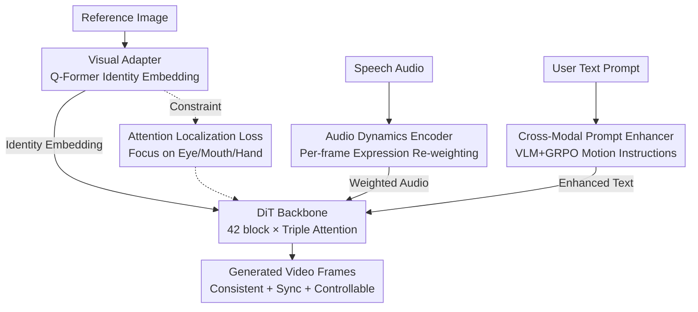

# SyncDreamer: Controllable and Expressive Avatar Generation Beyond the Talking Head

**Conference**: CVPR 2026  
**Paper**: [CVF Open Access](https://openaccess.thecvf.com/content/CVPR2026/html/Nazarieh_SyncDreamer_Controllable_and_Expressive_Avatar_Generation_Beyond_the_Talking_Head_CVPR_2026_paper.html)  
**Code**: None (Project page only: https://fnazarieh.github.io/SyncDreamerWeb/)  
**Area**: Digital Human Generation / Diffusion Models / Multi-modal  
**Keywords**: Audio-driven talking head, Diffusion Transformer, Identity preservation, Text-controlled movement, GRPO

## TL;DR
SyncDreamer utilizes a Diffusion Transformer framework to generate identity-preserving, emotionally expressive avatar videos with fine-grained text control over gestures and gaze, using only a single reference image, audio, and text prompts. It locks identity through a visual adapter (with attention localization loss), converts speech rhythm/energy into expression drivers via an audio dynamics encoder, and transforms short text into actionable movement instructions through a GRPO-trained cross-modal prompt enhancer, achieving SOTA on both portrait and full-body benchmarks.

## Background & Motivation

**Background**: Audio-driven talking head/digital human generation is a core task in digital human synthesis. Mainstream methods are divided into two categories: portrait-based (head-shoulders crop, focusing on facial expressions/lips and minor head movement) and full-body (such as EchoMimicV2, CyberHost, which use external pose encoders to extend motion to the upper/full body). Most backbones are diffusion models, recently shifting towards Diffusion Transformers (DiT).

**Limitations of Prior Work**: Three specific issues exist. First, full-body methods rely on **intermediate representations** like 3D landmarks or pose sequences to generate body motion, which restricts motion flexibility and prone to visual distortion under large poses. Second, expression control relies mostly on **discrete emotional labels** (e.g., happy/disgust/surprised), failing to capture continuous, fine-grained variations in rhythm, energy, and intensity within the audio, resulting in flat expressions that do not match the speech emotion. Third, DiT-based methods **treat text only as a descriptive prior** (conveying background/style); adding commands like "turn left" or "raise the right hand" has almost no impact on the generation, making fine-grained behaviors like gestures, gaze, and head movements uncontrollable.

**Key Challenge**: The goal is a unification of "emotional audio dynamics + spatial identity consistency + text-based behavior control," but existing methods handle these separately and constrain each other—preserving identity often sacrifices expressivity through fixed poses, while seeking expressivity leads to identity drift, with text remaining largely ineffective.

**Goal**: To achieve end-to-end (a) identity preservation under large poses/long sequences, (b) continuous and variable emotional movement, and (c) actual text-driven body behavior, all without relying on any intermediate pose representations.

**Key Insight**: Integrate three dedicated modules on a shared DiT backbone—a visual adapter to lock identity, an audio dynamics encoder to explicitly model acoustic expressivity as temporal weights, and a cross-modal prompt enhancer using reinforcement learning to transform "passive text" into "active motion control signals."

## Method

### Overall Architecture

The backbone of SyncDreamer is a DiT: reference images are encoded by a 3D VAE, text is encoded by umT5, and Gaussian noise is added. These enter a denoising network composed of 42 Transformer blocks, each containing three levels of attention: Self-Attention, Visual-Cross-Attention, and Audio-Cross-Attention. Finally, 3D VAE decodes the video frames. The three innovative modules are connected to these three condition inputs:

- **Visual Adapter** distills compact identity embeddings from the reference image, feeds them to Visual-Cross-Attention, and is constrained by **attention localization loss** to focus attention on key regions such as eyes, mouth, and hands;
- **Audio Dynamics Encoder** re-weights Wav2Vec2 features frame-by-frame based on "expressivity significance" before feeding them to Audio-Cross-Attention;
- **Cross-Modal Prompt Enhancer** expands the user's short prompt into "controllable motion instructions" by combining visual cues from the reference image before entering umT5.

Training occurs in two stages: Stage 1 learns motion and scene composition priors on the HumanVID text-video pairs; Stage 2 introduces audio conditions (Hallo3 / HDTF / AVSpeech) and uses classifier-free guidance by randomly dropping a modality with 0.1 probability.

### Key Designs

**1. Visual Adapter + Attention Localization Loss: Pinning Identity under Large Poses and Long Sequences**

The pain point is appearance drift (misaligned facial features, lost details) during intense expressions or large head rotations. The Visual Adapter first encodes the reference image into visual tokens via an Image Encoder, then uses a Q-Former-like Query-Based Encoder: a set of learnable queries **selectively aggregates** the most identity-relevant information (features, clothing, background context) from visual tokens via cross-attention, obtaining a compact set of reference embeddings injected into the backbone's Visual-Cross-Attention.

However, injection alone is insufficient—in long sequences, cross-attention "diverges," making spatial latents near the mouth attend to irrelevant regions. The attention localization loss adds spatial priors: semantic masks $M_{ij}\in\{0,1\}$ for key regions (eyes, mouth, hair, jaw) are obtained from the reference image using a segmentation model. It punishes attention weights falling outside these regions:

$$L_{loc}=\frac{1}{N}\sum_{i=1}^{N}\sum_{j=1}^{K}A_{ij}(1-M_{ij})$$

where $A_{ij}$ are normalized attention weights, and $N, K$ are the number of spatial latents and reference tokens, respectively. The final objective is $L=L_{diff}+\lambda_{loc}\cdot L_{loc}$ with $\lambda_{loc}=0.4$, applied only to mid-level attention blocks where identity/semantic features are most discriminative. This is "soft supervision"—the reference embeddings aren't spatially anchored themselves, but by punishing divergent attention, compact and semantically coherent correspondences are forced, significantly improving identity consistency during large rotations, occlusions, and long sequences.

**2. Audio Dynamics Encoder: Turning Rhythm/Energy into Driven Expression Temporal Weights**

The limitation is that encoders like Wav2Vec2 or Whisper only capture linguistic content, losing rhythms, intensity, and non-verbal sounds (e.g., humming), while discrete emotion labels fail to capture continuous emotional fluctuations. This encoder adds a temporal context module atop Wav2Vec2, calculating "per-frame expressivity significance" via a sliding window. Let $A\in\mathbb{R}^{T\times d}$ be the Wav2Vec2 feature sequence. For each frame $t$, a local window $A_{t-k:t+k}$ (window $k=3$) is sent to a temporal MLP $f_{temp}$ to output a scalar weight $w_t=f_{temp}(A_{t-k:t+k})\in[0,1]$. Features are then re-weighted: $\tilde A_t=w_t\cdot A_t$. Highly expressive segments (beats, intensity peaks, emotional transitions) are amplified, while flat or silent segments are suppressed, allowing facial/body motion to follow the emotional rhythm of the speech.

**3. Cross-Modal Prompt Enhancer (GRPO): Transforming "Descriptive Text" into "Motion Control Signals"**

Existing methods treat text as a passive descriptor, providing no control over gestures/head movements/gaze. This module is implemented in three steps: (A) **Paired Dataset Construction**: Standard talking face datasets lack rich captions; the authors extract one frame per video as a reference and use an LLM to generate short aligned captions. (B) **Cross-Modal Attribute Extraction**: Qwen2-VL extracts structured semantic attributes (clothing, background, objects, body pose, implicit actions like "tilting head" or "holding a pen") from the reference image, merging them with the user's original prompt into a "motion-aware instruction." (C) **GRPO Training**: Using Group Relative Policy Optimization (a ranking-based RL without an explicit reward model): multiple candidate prompts are generated for each input and ranked by a task-specific reward focused on "visual relevance, action specificity, and linguistic fluency," encouraging the model to favor candidates that produce more grounded and coherent generation. The enhanced prompt is encoded by T5 as a condition for body motion generation, allowing precise control over gestures, turns, and gaze.

### Loss & Training

The backbone is based on DiT, with a diffusion reconstruction loss $L_{diff}$ plus the attention localization loss: $L=L_{diff}+0.4\cdot L_{loc}$. Two-stage training: Stage 1 learns motion/scene priors (HumanVID text-video pairs), and Stage 2 adds audio conditions (Hallo3 + HDTF + AVSpeech). Training used 2 A100 GPUs with 100-step denoising during training and inference. Classifier-free guidance is achieved by dropping audio/image/text modalities with a 0.1 probability. The dataset aggregates full-body (HumanVID 19K), upper-body (Hallo3 10K), and facial close-ups (HDTF + AVSpeech), resulting in 650,000 single-speaker clips (5–30 seconds) after SyncNet alignment and InsightFace filtering.

## Key Experimental Results

### Main Results

On the portrait benchmark HDTF, SyncDreamer performs best across all metrics (lower FID/FVD is better, higher Sync-C is better, lower Sync-D is better, higher IQA is better):

| Dataset | Method | FID ↓ | FVD ↓ | Sync-C ↑ | Sync-D ↓ | IQA ↑ |
|--------|------|-------|-------|----------|----------|-------|
| HDTF | HunyuanVideo Avatar | 54.9 | 528.3 | 7.34 | 6.48 | 3.56 |
| HDTF | OmniAvatar | 53.7 | 514.7 | 7.92 | 6.36 | 3.68 |
| HDTF | **SyncDreamer** | **52.8** | **508.1** | **8.04** | **6.15** | **3.72** |

On the in-the-wild benchmark AVSpeech, it leads in most metrics (Sync-D is slightly behind OmniAvatar's 6.73):

| Dataset | Method | FID ↓ | FVD ↓ | Sync-C ↑ | Sync-D ↓ | IQA ↑ |
|--------|------|-------|-------|----------|----------|-------|
| AVSpeech | OmniAvatar | 68.4 | 73.8 | 6.24 | **6.73** | 2.78 |
| AVSpeech | **SyncDreamer** | **67.9** | **72.6** | **6.31** | 7.05 | **2.81** |

On the full-body benchmark EMTD, it significantly outperforms pose-dependent methods, with CSIM (identity similarity) jumping from 0.393 up to 0.598:

| Dataset | Method | FID ↓ | FVD ↓ | PSNR ↑ | SSIM ↑ | CSIM ↑ |
|--------|------|-------|-------|--------|--------|--------|
| EMTD | EchoMimicV2 | 42.69 | 528.10 | 22.09 | 0.741 | 0.393 |
| EMTD | **SyncDreamer** | **41.77** | **483.59** | **22.38** | **0.746** | **0.598** |

### Ablation Study

The paper reports qualitative impacts of the three modules (Fig. 8/10/9) without a full quantitative ablation table:

| Configuration | Phenomenon | Description |
|------|------|------|
| Full model | Identity stable, expressions synced, text controllable | Complete model |
| w/o Localization Loss | Identity drift, feature misalignment | Especially evident during large motions like page-turning (Fig. 8) |
| w/o Audio Dynamics Encoder | Flat expressions, lower emotional fidelity | Most degradation during singing/humming (Fig. 10) |
| w/o Prompt Enhancer (Min. prompt) | Weak motion generalization, objects vanish | Contextual elements like notebooks/pens are lost (Fig. 9) |

### Key Findings
- The three modules are complementary: Visual Adapter + Localization Loss manage spatial/identity consistency, the Audio Dynamics Encoder handles rhythm/intensity synchronization, and the Prompt Enhancer manages text controllability.
- The significant CSIM increase in the full-body scene (0.393→0.598) shows that learning motion end-to-end from audio+text, without pose templates, preserves identity better than pose-driven methods.
- The Prompt Enhancer is crucial for "object continuity": manual prompt expansion improves object retention but lacks expressivity; only grounded, automated enhanced prompts achieve context-aware gestures and object-consistent, clear frames simultaneously.

## Highlights & Insights
- Framed the "text-controllable motion" problem as a "prompt under-specification" issue and solved it using an RL-trained (GRPO) **prompt enhancer** rather than modifying the generative architecture—this is a transferable insight: rather than making the downstream model stronger, make the upstream conditions "controllable" via preprocessing.
- The attention localization loss is a lightweight "soft spatial prior": reference embeddings do not need physical spatial anchoring; simply punishing cross-attention divergence to irrelevant regions forces identity consistency with low engineering cost.
- The Audio Dynamics Encoder explicitly quantifies "expressivity" as a per-frame weight $w_t \in [0,1]$, effectively providing a continuous scalar metric for emotion, bypassing the ceiling of discrete emotion labels.

## Limitations & Future Work
- Ablations are primarily qualitative; there is no quantitative table showing Exactly how much each module contributes to the metrics.
- Sync-D on AVSpeech is slightly inferior to OmniAvatar, implying further room for improvement in lip-sync accuracy under in-the-wild scenarios.
- The Prompt Enhancer relies on external VLMs (Qwen2-VL) and LLM captions; errors in attribute extraction propagate directly to motion control. Grounding ability for extremely rare poses/objects is not fully verified.
- Real-time performance of a 42-block DiT with 100-step denoising for interactive applications is questionable, and inference speed was not reported.

## Related Work & Insights
- **vs. EchoMimicV2 / CyberHost (pose-driven full-body)**: These rely on 3D landmarks and keypoints to drive the upper body, which limits motion flexibility; SyncDreamer learns motion end-to-end, leading to a substantial CSIM lead on EMTD.
- **vs. Hallo3 / OmniAvatar (DiT, text as style)**: These treat text as static style/scene priors, where motion instructions are largely ignored; SyncDreamer uses GRPO to transform text into active control signals for gestures, turns, and gaze.
- **vs. Discrete Emotion Label Methods**: Those use classes like happy/disgust to supervise expressions; this work uses continuous per-frame expressivity weights, better matching speech rhythm and emotional transitions.

## Rating
- Novelty: ⭐⭐⭐⭐ The use of GRPO to train a prompt enhancer for text-to-motion signals is quite innovative, though the overall structure remains a DiT + condition injection paradigm.
- Experimental Thoroughness: ⭐⭐⭐⭐ Covers portrait/wild/full-body benchmarks with SOTA results, though numerical ablations and inference speed are missing.
- Writing Quality: ⭐⭐⭐⭐ Motivations are progressive and module functions are clear.
- Value: ⭐⭐⭐⭐ Provides an extensible base for "controllable, expressive, pose-free digital humans," practical for interactive/creative applications.

<!-- RELATED:START -->

## Related Papers

- [\[CVPR 2026\] Avatar Forcing: Real-Time Interactive Head Avatar Generation for Natural Conversation](avatar_forcing_real-time_interactive_head_avatar_generation_for_natural_conversa.md)
- [\[ICCV 2025\] Controllable and Expressive One-Shot Video Head Swapping](../../ICCV2025/human_understanding/controllable_and_expressive_one-shot_video_head_swapping.md)
- [\[CVPR 2026\] OMG-Avatar: One-shot Multi-LOD Gaussian Head Avatar](omg-avatar_one-shot_multi-lod_gaussian_head_avatar.md)
- [\[CVPR 2026\] Beyond Scanpaths: Graph-Based Gaze Simulation in Dynamic Scenes](beyond_scanpaths_graph-based_gaze_simulation_in_dynamic_scenes.md)
- [\[ECCV 2024\] Avatar Fingerprinting for Authorized Use of Synthetic Talking-Head Videos](../../ECCV2024/human_understanding/avatar_fingerprinting_for_authorized_use_of_synthetic_talking-head_videos.md)

<!-- RELATED:END -->
