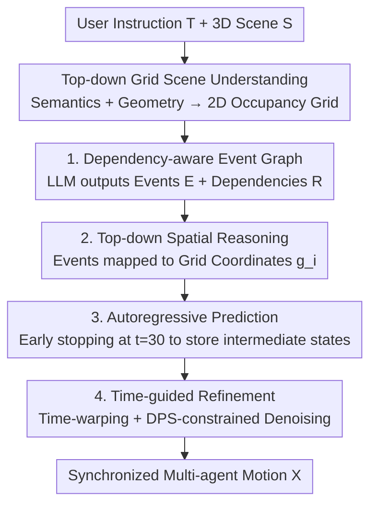

# SyncMos: Scalable Motion Synchronisation for Multi-Agent Scene Interaction

**Conference**: CVPR 2026  
**Paper**: [CVF Open Access](https://openaccess.thecvf.com/content/CVPR2026/html/Li_SyncMos_Scalable_Motion_Synchronisation_for_Multi-Agent_Scene_Interaction_CVPR_2026_paper.html)  
**Code**: None  
**Area**: Human Understanding / 3D Scene Human Motion Generation  
**Keywords**: Multi-agent motion generation, temporal synchronization, diffusion models, LLM event planning, human-scene interaction

## TL;DR
SyncMos utilizes an LLM event planner to decompose natural language instructions into temporal dependency graphs. By applying time-warping and Diffusion Posterior Sampling (DPS) as post-processing **without retraining** the single-agent diffusion motion model, it aligns the actions of an arbitrary number of agents (e.g., handing over objects) in time, achieving scalable multi-agent 3D scene interaction generation.

## Background & Motivation
**Background**: Text-guided 3D human motion generation in scenes has advanced rapidly. Single-agent models (e.g., LINGO for autoregressive long-range synthesis, InterGen for two-person interaction) can generate controllable behaviors based on scene context and natural language.

**Limitations of Prior Work**: Expanding single-agent capabilities to multi-agent systems is challenging not in space, but in **time**. Interactions such as "A hands a bottle to B, and B takes it to drink" involve causal sequences and synchronization—the handing and receiving must occur simultaneously. Existing multi-agent methods either fix the number of agents or only model pairwise relationships; they require retraining or redesigning models for every new interaction/relationship configuration, leading to poor scalability. Furthermore, temporal synchronization is often overlooked; even if individual actions appear realistic, multi-agent combinations suffer from temporal misalignments, such as hands reaching before the other party is ready.

**Key Challenge**: Single-agent models lack a global temporal coordination mechanism across agents, while training specialized multi-agent or group-relationship models is non-scalable (failing when agent numbers change). Embedding temporal alignment into network training inherently conflicts with scalability to arbitrary agent counts.

**Goal**: (1) Parse free-text instructions into explicit, machine-readable temporal dependencies of events; (2) Achieve global temporal alignment of multiple agents without retraining the underlying single-agent models; (3) Ensure the solution is scalable to the number of agents and model-agnostic regarding the specific single-agent diffusion generator.

**Key Insight**: The authors decompose "multi-agent coordination" into two layers: a high-level LLM transforms narratives into structured event graphs (who, what, which sequence, where), and a low-level temporal synchronization module treats alignment as a **post-processing correction of generated trajectories** rather than a constraint during generation. Since single-agent models can already generate reasonable motions, the generated "coarse" trajectories can be "stretched/pushed" to the correct moments and then refined using a diffusion prior to fix distortions caused by warping.

**Core Idea**: Use "LLM event planning + treating time-warped trajectories as noisy observations for DPS-guided denoising" to replace "training models specifically for multi-agent relationships," thereby achieving scalable multi-agent temporal synchronization with zero retraining.

## Method

### Overall Architecture
SyncMos is a two-tier architecture: the **high-level text-guided event planner** converts user instructions $T$ and scene $S$ into a structured event dependency graph $G$; the **low-level temporal synchronization module** uses a single-agent diffusion model (implemented with LINGO) as a backbone. It first generates coarse motions for each agent based on the event graph, then performs temporal alignment refinement to output synchronized multi-agent motion $X$. The entire pipeline requires no retraining of the underlying generator.

The high-level planner contains three sub-modules: scene understanding (extracting semantics and geometry to construct a top-down grid as a unified 2D coordinate system), dependency-aware story planning (LLM outputs event set $E$ and temporal dependencies $R$), and top-down spatial reasoning (mapping abstract events to specific grid locations). The low-level synchronization module consists of two steps: autoregressive prediction (stopping early to save intermediate states in a buffer) and time-guided refinement (applying time-warping and DPS-constrained denoising to the buffered states).

### Key Designs

**1. Dependency-aware Story Planner: Converting Narratives into Machine-readable Temporal Dependency Graphs**

To address the lack of explicit representation for causal sequences and synchronization in multi-agent interactions, the planner feeds user text $T$ and scene description $D$ into an LLM to output an event dependency graph $G=(E, R)$. Here, $E=\{e_i\}_{i=1}^{N}$ is a set of single-actor events where each $e_i=(\text{actor}_i, \text{event description}_i)$ specifies "who does what"; $R=R_{\text{seq}}\cup R_{\text{par}}$ encodes temporal dependencies into two types: **Sequential** `{"after":e_i,"before":e_j}` for causal antecedents (e.g., pick up → hand out), and **Parallel** `{"parallel":[e_i,e_j]}` for interactions that must occur simultaneously.

The implementation uses few-shot + Chain-of-Thought prompting, allowing the LLM to work in **two steps within a single response**: first listing all single-actor events based on $(D, T)$, then inferring their temporal dependencies. By providing these two dependency templates in in-context examples, the LLM produces both semantic and machine-readable $E$ and $R$ at once. Compared to "Event-Driven Storytelling," which generates events autoregressively without global dependency modeling, this approach handles concurrency and long causal chains more efficiently, maintaining a near-constant token volume.

**2. Top-down Grid Spatial Reasoning: Mapping Abstract Events to Specific Physical Locations**

The story planner only defines semantics and timing, not **where** actions occur. This step first uses an LLM scene describer to extract semantic relationships between objects ("chair near table") to get text description $D$, and introduces a **top-down grid** $M$ that encodes scene occupancy and navigable areas into a 2D image. This serves as a unified coordinate interface between instructions and motion generation—users can specify locations via "at grid (10, 18)," and the reasoner uses the same coordinates to infer spatial layouts (e.g., placing two interacting characters at a physically reasonable distance).

For each event $e_i$, the spatial reasoner predicts a grounded representation $g_i=(\text{grid}_i, \text{action}_i, \text{hand\_target}_i)$: a 2D position, an action label, and an optional target object. Occupancy and accessibility constraints ensure positions do not overlap, adjacent events are continuous, and the layout is consistent with the physical environment. This provides clear location and interaction cues for downstream motion generation.

**3. Autoregressive Prediction + Early Stopping Buffer: Reserving "Semi-finished" States for Temporal Correction**

Standard autoregressive diffusion completely denoises each motion segment before generating the next, making it impossible to modify timing without full regeneration. This method instead runs **partial** reverse diffusion until an intermediate step $t$ (set to $t=30$). It then uses the DDPM reconstruction formula to predict a clean estimate $\hat{x}_0$ from $x_t$: $\hat{x}_0=\frac{1}{\sqrt{\bar{\alpha}}}\left(x_t-\sqrt{1-\bar{\alpha}}\,\epsilon_\theta(x_t,t)\right)$, resulting in a "usable but coarse" preliminary trajectory $\mathcal{D}$.

Why stop at $t=30$? The difference between the estimate and the ground truth is $\hat{x}_0-x_0=\frac{\sqrt{1-\bar{\alpha}}}{\sqrt{\bar{\alpha}}}(\epsilon-\epsilon_\theta(x_t,t))$. For LINGO (linear beta, $T=100$), the coefficient at $t=30$ is $\frac{\sqrt{1-\bar{\alpha}}}{\sqrt{\bar{\alpha}}}\approx 0.3$, which provides a stable trajectory for refinement while saving time. Crucially, $x_t$, time-step metadata, and conditions are stored in a buffer $B$—these intermediate states serve as the "semi-finished raw material" for subsequent time-guided refinement, avoiding regeneration from pure noise.

**4. Time-guided Refinement: Treating Warped Trajectories as Noisy Observations and Using DPS for Realism**

Directly applying time-warping moves key event moments but introduces unnatural distortions because it ignores the diffusion model's generation prior. This paper treats the time-warped trajectory $y$ as a "noisy temporal observation" and uses constrained-guided denoising for correction. First, spline-based time-warping is applied to the preliminary estimate $\mathcal{D}$: the total length is fixed, and timing is adjusted by pushing/pulling keyframes—frame index $l$ specifies the key event to change, and $\delta$ is the desired temporal offset. Pulling frames forward compresses previous segments, while pushing them stretches segments. This results in a target trajectory $y$ that is explicit but potentially noisy.

A simple L2 temporal constraint $C(\hat{x}_0)=\|y-\hat{x}_0\|^2$ is then applied to each motion segment. Specifically, the intermediate state $x_t$ is retrieved from buffer $B$, and controlled noise is re-injected via forward diffusion (q-sampling) to allow the model exploration space. Then, gradient-guided denoising is performed:

$$x_{i-1}\gets\mu_\theta(x_i,i)-\lambda\nabla_{x_i}C(\hat{x}_0)+\sigma_i z$$

where $\mu_\theta$ is the predicted denoising mean, $\sigma_i$ is the noise variance, $z\sim\mathcal{N}(0,I)$, and $\lambda$ controls the strength of the temporal constraint. This step ensures the temporal constraints are met (moving key events to target moments) while preserving the smoothness and coherence of the diffusion model's generation. Through this "predictive autoregression → constrained refinement" two-stage process, the system achieves global synchronization across agents without retraining.

## Key Experimental Results

Evaluation is divided into three levels: (1) Dependency-aware story planner vs. baseline LLM planners; (2) Controlled temporal editing of the synchronization module (ablation/control experiments); (3) End-to-end multi-agent scalability.

### Main Results
Using 30 self-constructed multi-character narrative benchmarks (House/Office/Restaurant scenes, 2-5 agents per scene; including 15 Synchronisation cases for parallel tests and 15 Dependency cases for long causal chains), the method is compared against the Event-Driven Storytelling baseline. Metrics include Event Coverage (EC), Dependency Accuracy (DA), Passed Scenarios (PS), and Scenario Passage Rate (SPR).

| Subset | Backbone | DA Baseline (%) | DA Ours (%) | SPR Baseline (%) | SPR Ours (%) |
|------|----------|-----------|-----------|------------|------------|
| Synchronisation | Qwen-3-235B | 68.4 | **89.9** | 33.3 | **53.3** |
| Synchronisation | GPT-4o | 67.1 | **86.3** | 33.3 | **53.3** |
| Dependency | GPT-4o | 20.5 | **96.9** | 0.0 | **80.0** |
| Dependency | Qwen-3-235B | 17.2 | **84.4** | 6.7 | **66.7** |

The Dependency subset (long causal chains) shows the most significant improvement: DA rose from 11.8–20.5% to 80–97%, and SPR increased from near zero to a maximum of 80% (GPT-4o).

### Synchronization Controlled Experiments
Using LINGO data, 15 grasping test cases were constructed, applying ±0.5/±1.0/±1.5 s offsets to the reference grasping moment. Success is defined as the temporal error being within 0.1 s of the target offset (using DTW to measure alignment; divergence counts as failure).

| Model | +0.5s | +1.0s | +1.5s | −0.5s | −1.0s | −1.5s |
|------|-------|-------|-------|-------|-------|-------|
| LINGO (No Sync) | 0.0 | 0.0 | 0.0 | 0.0 | 0.0 | 0.0 |
| SyncMos | **84.7** | **78.0** | 76.0 | **88.0** | 75.3 | 37.3 |

Success rates are >70% within ±1.0 s, reaching 88% for small offsets (±0.5 s). However, large offsets near action boundaries cause the diffusion process to become unstable, with success rates dropping to approximately 35–40% (−1.5 s only 37.3%). Table 3 shows narrow interquartile ranges for target shifts, indicating that failure at −1.5 s is due to "insufficient shift" rather than trajectory divergence.

### Key Findings
- **Token scalability is a core advantage of the planner**: In Synchronisation scenarios, the method maintains a stable ~10k tokens per case, with EC/DA/SPR remaining steady as event counts increase. The baseline's tokens explode in Dependency scenarios with more than 8 events due to redundant re-generation.
- **Reliable timing modification without retraining**: Native LINGO is incapable of temporal editing (0% success). Adding the synchronization module makes medium-range offsets reliable and controllable.
- **No cumulative temporal drift for multi-agent systems**: In chain handover tests with $N\in\{2,3,5,10\}$, the Temporal Sync Metric (TSM) increases only slightly with more agents, while Temporal Sync Error (TSE) remains stable (no drift accumulation even in 10-agent chains). Contact Distance (CD) also remains stable, proving the effectiveness of the lightweight post-processing module.
- **Failure modes concentrate at large boundary offsets**: Instability in the diffusion process when pushing keyframes toward the ends of action segments with large offsets is the primary source of failure.

## Highlights & Insights
- **Redefining temporal synchronization as "post-processing + noisy observation correction"**: Instead of adding constraints during generation or retraining, the single-agent model is allowed to generate freely. Time-warping results are then treated as noisy observations and pulled back to the prior manifold via DPS—a clever insight that enables "zero retraining + scalability" and decouples the framework from the generator.
- **Reuse of early-stopping intermediate states**: Denoising only to $t=30$ and buffering intermediate states saves computation and preserves "secondary-editable" diffusion states, avoiding re-generation from pure noise. This "semi-finished state buffer" concept can be transferred to any task requiring post-hoc controllable editing of diffusion outputs.
- **Top-down grid as a unified coordinate interface**: Using a 2D grid to handle both "user-specified positions" and "model spatial reasoning" allows natural language like "at grid (10,18)" to map directly to 3D scene coordinates—a grounded and intuitive design.
- **Two-step dependency graph generation in a single LLM response**: Listing events before inferring dependencies, combined with sequential/parallel templates for in-context demonstration, keeps token costs near-constant and scalable for long narratives.

## Limitations & Future Work
- Success rates for large offsets at boundaries (e.g., −1.5 s) are low (~37%), as the diffusion process is unstable at motion segment ends, limiting the adjustable temporal range.
- Temporal synchronization depends on the generation quality of the single-agent backbone (LINGO); if the underlying model generates unrealistic movements, post-processing cannot fix them.
- ⚠️ The planner's DA/SPR performance is heavily influenced by the LLM backbone (GPT-4o and Qwen-3-235B are significantly better than their mini/8B versions), making deployment effectiveness highly dependent on the chosen LLM.
- The benchmark scale is relatively small (30 narratives, 15+15 subsets), and scene types are limited to three categories; complex non-chain dependencies (e.g., many-to-many concurrent interactions) have not yet been fully validated.
- Synchronization only uses simple L2 temporal constraints + contact determination for single-object grasping; fine-grained physical contact (forces, grasping poses) is not modeled.

## Related Work & Insights
- **vs InterGen**: InterGen handles dual-person interaction but relies on joint modeling of fixed-size joints without explicit temporal control. It is difficult to scale to more agents or produce varied temporal behaviors. SyncMos uses a general framework + post-processing sync without retraining, scaling to any agent count with explicit timing control.
- **vs LINGO (Backbone)**: LINGO enables long-term single-actor human-scene autoregressive generation but lacks cross-agent temporal alignment (0% success in temporal editing). SyncMos uses it as a backbone, adding a planner + DPS synchronization to provide multi-agent coordination with zero retraining.
- **vs Event-Driven Storytelling**: This decomposes narratives into sequential events for scalable multi-character generation but lacks explicit temporal dependency modeling and precise cross-agent synchronization. SyncMos models both sequential and parallel dependencies, significantly outperforming it in long causal chains while keeping token usage constant.
- **vs Classic Motion Warping / Laplacian Optimization**: Classic methods rely on interpolation and constrained editing but do not respect generation priors, leading to distortion. SyncMos treats warped results as noisy observations and uses DPS to restore realism, balancing temporal control with natural motion.

## Rating
- Novelty: ⭐⭐⭐⭐ Redefining multi-agent temporal synchronization as "single-agent model + warped noisy observation + DPS post-processing" for zero-retraining scalability is highly novel.
- Experimental Thoroughness: ⭐⭐⭐ The three-tier evaluation design is clear, but the benchmark scale is small, and there is a lack of direct baselines for the synchronization module (given no direct prior work). Boundary failure rates are somewhat high.
- Writing Quality: ⭐⭐⭐⭐ The two-tier architecture and two-stage synchronization are well-explained; algorithm pseudocode and formulas are complete.
- Value: ⭐⭐⭐⭐ Provides a model-agnostic, lightweight synchronization module that can be plugged into existing single-agent diffusion generators, offering practical value for embodied AI and virtual character simulation.

<!-- RELATED:START -->

## Related Papers

- [\[CVPR 2026\] InterAgent: Physics-based Multi-agent Command Execution via Diffusion on Interaction Graphs](interagent_physics-based_multi-agent_command_execution_via_diffusion_on_interaction_graphs.md)
- [\[CVPR 2026\] HSI-GPT2: A Dual-Granularity Large Motion Reasoning Model with Diffusion Refinement for Human-Scene Interaction](hsi-gpt2_a_dual-granularity_large_motion_reasoning_model_with_diffusion_refineme.md)
- [\[CVPR 2026\] InterPhys: Physics-aware Human Motion Synthesis in a Dynamic Scene](interphys_physics-aware_human_motion_synthesis_in_a_dynamic_scene.md)
- [\[CVPR 2026\] SceMoS: Scene-Aware 3D Human Motion Synthesis by Planning with Geometry-Grounded Tokens](scemos_scene-aware_3d_human_motion_synthesis_by_planning_with_geometry-grounded_.md)
- [\[CVPR 2026\] PAMotion: Physics-Aware Motion Generation for Full-Body Interaction with Multiple Objects](pamotion_physics-aware_motion_generation_for_full-body_interaction_with_multiple.md)

<!-- RELATED:END -->
