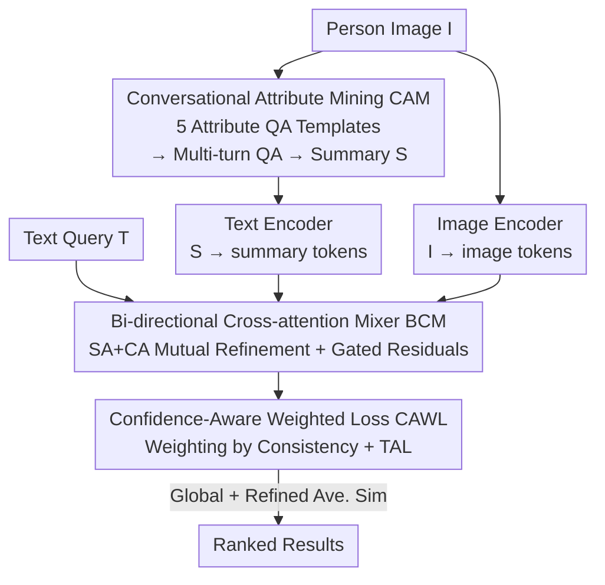

# Tackling Alignment Ambiguity in Person Retrieval through Conversational Attribute Mining

**Conference**: CVPR 2026  
**Paper**: [CVF Open Access](https://openaccess.thecvf.com/content/CVPR2026/html/Zou_Tackling_Alignment_Ambiguity_in_Person_Retrieval_through_Conversational_Attribute_Mining_CVPR_2026_paper.html)  
**Code**: https://github.com/sugelamyd123/CECA  
**Area**: Multi-modal VLM / Text-to-Image Person Retrieval  
**Keywords**: Text-to-Image Person Retrieval, Cross-modal Alignment, MLLM, Conversational Attribute Mining, Confidence Weighting

## TL;DR
To address the persistent "alignment ambiguity" in Text-to-Image Person Retrieval, this paper utilizes Multimodal Large Language Models (MLLM) to extract fine-grained attributes through "multi-turn QA" and summarizes them into a compact description. A Bi-directional Cross-attention Mixer refines these summaries with image tokens, while a Confidence-Aware Weighted Loss suppresses noise in MLLM-generated dialogues, achieving new SOTA Rank-1 results across three benchmarks.

## Background & Motivation
**Background**: Text-to-Image Person Retrieval (TIPR) aims to retrieve specific persons from a gallery given a natural language description (e.g., "a man in a blue-white-black striped shirt, blue jeans, and green shoes"). Prevailing approaches use Vision-Language Pre-trained (VLP) models like CLIP or ALBEF as backbones to project images and text into a joint embedding space. Recent works also perform in-domain pre-training on large-scale ReID datasets.

**Limitations of Prior Work**: Cross-modal alignment inherently suffers from "alignment ambiguity." Models often capture only local or coarse-grained cues, lacking a deep understanding of fine-grained person attributes (e.g., shirt patterns, headwear, or bags), leading to matches with "visually similar but different identity" candidates. While some works have introduced MLLMs, they typically use them "coarsely"—either for text expansion (data augmentation) or as a reranker for candidates.

**Key Challenge**: MLLM-generated descriptions contain rich, learnable fine-grained information, but current methods rely on shallow utilization (e.g., simple judgments or pre-training supervision). They fail to truly integrate the fine-grained correspondences between generated text and original images into the retrieval model, leaving alignment ambiguous and uninterpretable. Furthermore, MLLM outputs are not always reliable; wholesale trust in noisy dialogues can degrade alignment.

**Goal**: (1) Explicitly and structurally extract fine-grained attribute cues from MLLMs; (2) Enable token-level refinement between these cues and visual features; (3) Identify and suppress low-quality dialogues during training.

**Core Idea**: Instead of "single-sentence expansion," the authors propose "Conversational Attribute Mining." An MLLM is prompted in a multi-turn QA format to clarify person attributes bit by bit, which are then summarized. This summary serves as a third modality, refined against image tokens via bi-directional cross-attention. A Confidence-Aware Weighted Loss is used to adaptively trust or suspect each dialogue.

## Method

### Overall Architecture
CECA (Conversation-Enhanced Cross-modal Alignment) uses CLIP-ViT/B-16 as the backbone. It takes a person image and a text query as input and outputs retrieval results sorted by similarity. The pipeline consists of three components: **Conversational Attribute Mining (CAM)**, where an MLLM engages in QA to generate an attribute summary; a **Bi-directional Cross-attention Mixer (BCM)**, which refines image tokens and summary tokens via token-level interaction; and a **Confidence-Aware Weighted Loss (CAWL)**, which dynamically adjusts weights based on dialogue consistency during training. The final score is the average of global and refined similarities.

### Key Designs

**1. Conversational Attribute Mining (CAM): Clarifying fine-grained attributes through multi-turn QA rather than one-shot expansion**

Asking an MLLM to "describe this person" often leads to omissions or vague descriptions. CAM uses five pre-defined templates targeting key visual cues (tops, hats, pants, shoes, handheld items), treating the MLLM as an "Answerer." Given image $I$ and question templates $Q=\{q_t\}_{t=1}^{T}$, the Answerer encodes the image and question text jointly to decode answer $a_t$. This decomposition forces the model to organize cues more completely and focused. After obtaining the dialogue $D=[q_1,a_1,\dots,q_T,a_T]$, another encode-decode step generates a compact summary $S$ (i.e., $\text{Summary}=\text{Dec}(I,Q_1,A_1,\dots,Q_N,A_N)$), which provides structured, interpretable semantic cues. Empirical results show Rank-1 improves with turns, plateauing after 5 turns.

**2. Bi-directional Cross-attention Mixer (BCM): Token-level refinement between summary and image instead of simple concatenation**

To establish fine-grained correspondences, the global tokens of the summary and image are first combined into an enhanced representation $\mathbf{c}_{cls}=(1-\omega)\mathbf{v}_{cls}+\omega\mathbf{s}_{eos}$ (with fusion weight $\omega=0.3$). After removing special tokens, sequences for image, summary, and text ($f_v,f_s,f_t$) are processed. BCM applies Self-Attention (SA) for refinement within each modality followed by Cross-Attention (CA) to exchange information:

$$\mathbf{f}_v'=\mathrm{CA}(\mathbf{f}_v,\mathbf{f}_s)+\mathrm{SA}(\mathbf{f}_v),\quad \mathbf{f}_s'=\mathrm{CA}(\mathbf{f}_s,\mathbf{f}_v)+\mathrm{SA}(\mathbf{f}_s)$$

Signals are fused back via gated residuals: $\mathbf{s}_{mix}=\mathbf{f}_s+\sigma(g_t)\,\mathrm{MLP}(\mathbf{f}_s')$ and $\mathbf{v}_{mix}=\mathbf{f}_v+\sigma(g_v)\,\mathrm{MLP}(\mathbf{f}_v')$, where $\sigma$ is the sigmoid gate and $g_t, g_v$ are learnable parameters. The text branch utilizes only SA to maintain global semantic consistency. Tokens are further pooled via a refinement module $\mathbf{x}_{re}=\mathrm{MaxPool}(\mathrm{MLP}(\mathbf{x})+\mathrm{FC}(\mathbf{x}))$ to highlight local features, resulting in a dialogue-enhanced visual representation $\mathbf{c}_{re}=(1-\omega)\mathbf{v}_{re}+\omega\mathbf{s}_{re}$ for alignment with text $t_{re}$.

**3. Confidence-Aware Weighted Loss (CAWL): Suppressing noisy dialogues via consistency weighting**

MLLM-generated dialogues may contain visual hallucinations. CAWL models this as a gated InfoNCE mixture:

$$\mathcal{L}_{\text{CAWL}}=\sum_{i=1}^{K}\Big(\tilde\alpha_i\big(\mathcal{L}^{i}_{s2t}+\mathcal{L}^{i}_{s2v}\big)+(1-\tilde\alpha_i)\mathcal{L}^{i}_{t2v}\Big)$$

$K$ is the batch size, and $\tilde\alpha_i$ is the normalized confidence weight. Higher $\tilde\alpha_i$ indicates high consistency between "dialogue-text" and "dialogue-image," leading to more trust in summary-based supervision ($\mathcal{L}_{s2t},\mathcal{L}_{s2v}$). Otherwise, the model relies more on the original text-image alignment ($\mathcal{L}_{t2v}$). Confidence $\alpha_i$ is the geometric mean of similarities: $\alpha_i=\sqrt{p_{s2t}(i)\cdot p_{s2v}(i)}$. The total loss is $\mathcal{L}_{\text{total}}=\mathcal{L}_{\text{global}}+\mathcal{L}_{\text{refined}}+\mathcal{L}_{\text{CAWL}}$, supervised by Triplet Alignment Loss (TAL). At inference, similarity is the sum of global and refined scores: $I^*=\arg\max_i(\mathrm{sim}^{global}(I_i,T_j)+\mathrm{sim}^{refined}(I_i,T_j))$.

### Loss & Training
The backbone is CLIP-ViT/B-16 with a hidden dimension of 512 and 8 attention heads. Training lasts 60 epochs using the Adam optimizer. The learning rate is $1\times10^{-5}$ for the backbone and $1\times10^{-4}$ for fusion modules, with a 5-epoch linear warmup. TAL hyper-parameters include $m=0.1$ and $\tau=0.015$. Qwen2-VL-7B-Chat is used for CAM by default.

## Key Experimental Results
Evaluations were conducted on CUHK-PEDES, ICFG-PEDES, and RSTPReid.

### Main Results
CECA achieves state-of-the-art Rank-1 performance in both "No ReID Pre-training" and "With ReID Pre-training" settings. Rank-1 (%) comparison:

| Setting | Method | CUHK-PEDES | ICFG-PEDES | RSTPReid |
|------|------|-----------|-----------|----------|
| No Pre-train | ICL (CVPR'25) | 77.91 | 69.02 | 70.55 |
| No Pre-train | GAHR (TIFS'25) | 76.64 | 68.69 | 68.85 |
| No Pre-train | **CECA** | **78.30** | **72.25** | **71.40** |
| W/ Pre-train | ICL♮ (CVPR'25) | 79.06 | 70.05 | 72.55 |
| W/ Pre-train | GA-DMS (EMNLP'25) | 77.60 | 69.51 | 71.25 |
| W/ Pre-train | **CECA** | **79.65** | **74.32** | **73.45** |

Without pre-training, CECA outperforms the runner-up by +0.39%, +3.23%, and +0.85% in Rank-1 across three datasets. With pre-training, it reaches 79.65% Rank-1 on CUHK-PEDES. However, mAP performance is not always superior (e.g., 65.92 on CUHK-PEDES vs. RaSa's 69.38).

### Ablation Study
Removing components (Rank-1 / mAP across datasets):

| No. | CAM | BCM | CAWL | CUHK R-1 | ICFG R-1 | RSTP R-1 |
|------|-----|-----|------|----------|----------|----------|
| #1 (Full) | ✔ | ✔ | ✔ | 78.30 | 72.25 | 71.40 |
| #2 | ✔ | ✘ | ✔ | 75.26 | 70.17 | 69.35 |
| #3 | ✔ | ✔ | ✘ | 77.66 | 71.02 | 69.10 |
| #4 | ✔ | ✘ | ✘ | 74.42 | 69.12 | 65.35 |
| #5 (Baseline) | ✘ | ✘ | ✘ | 73.57 | 65.70 | 63.60 |

### Key Findings
- **CAM provides primary gains**: Adding CAM alone (#4 vs #5) improves ICFG-PEDES Rank-1 by +3.42%, confirming the value of explicit attribute mining.
- **BCM is critical**: Comparing #2 vs #1 shows BCM contributes +3.24% and +3.75% Rank-1 on CUHK and RSTPReid, respectively, through token-level refinement.
- **CAWL stabilizes training**: Removing CAWL results in performance drops (e.g., 71.40 → 69.10 on RSTPReid), validating its noise suppression role.
- **Dialogue Turns**: Performance improves up to 5 turns and then plateaus.
- **MLLM Robustness**: Switching Qwen2-VL to LLaVA-1.5 or BLIP-2 shows consistent results (e.g., CUHK Rank-1 78.30 vs 78.12 vs 77.60).

## Highlights & Insights
- **Dialogue as a Third Modality**: Instead of using MLLM for text expansion or judging, the summary tokens participate directly in representation learning via bi-directional attention.
- **Geometric Mean Confidence**: Using $\sqrt{p_{s2t}\cdot p_{s2v}}$ requires the dialogue to be consistent with both text and image simultaneously. Unilateral consistency (potential hallucination) is effectively penalized.
- **Transferability**: The CAM paradigm (attribute templates → multi-turn QA → summary) is applicable to other fine-grained retrieval tasks like vehicle ReID or retail search.

## Limitations & Future Work
- **Weak mAP**: CECA focuses on pushing the correct target to the top (Rank-1) but shows lower mAP compared to some counterparts, indicating the overall ranking quality for all relevant samples needs improvement.
- **Training Efficiency**: Each training image requires multi-turn MLLM inference for dialogues, which incurs high preprocessing costs (though inference for retrieval does not require an MLLM).
- **Fixed Templates**: Handcrafted templates might miss attributes not covered in the questions (e.g., tattoos, specific accessories).
- **Static Turns**: A fixed 5-turn dialogue might be inefficient; adaptive turn numbers based on sample complexity could be better.

## Related Work & Insights
- **vs. Generative Methods (HAM / NAM / GA-DMS)**: These methods rely on large-scale domain pre-training with noisy psuedo-captions. CECA explicitly mines fine-grained cues at a structural level without requiring massive data scales.
- **vs. Discriminative Methods (ICL)**: ICL acts as a posterior judge during reranking. CECA integrates conversational info into the representation learning phase for deeper, more interpretable alignment.
- **vs. CLIP-tuning (IRRA / RDE)**: These rely on loss design or backbone adaptation. CECA adds the dialogue modality and token refinement to significantly push the Rank-1 SOTA using the same CLIP backbone.

## Rating
- Novelty: ⭐⭐⭐⭐ Treats MLLM dialogue as an independent modality with token-level refinement and confidence-based denoising.
- Experimental Thoroughness: ⭐⭐⭐⭐ Comprehensive evaluation across benchmarks, settings, ablations, and visualizations.
- Writing Quality: ⭐⭐⭐⭐ Clear structure and logic, though some minor formula extraction noise exists.
- Value: ⭐⭐⭐⭐ Consistent SOTA results on TIPR; the CAM/CAWL paradigm is transferable to other retrieval tasks.

<!-- RELATED:START -->

## Related Papers

- [\[CVPR 2026\] Vision-Language Attribute Disentanglement and Reinforcement for Lifelong Person Re-Identification](vision-language_attribute_disentanglement_and_reinforcement_for_lifelong_person_.md)
- [\[CVPR 2026\] Composite-Attribute Person Re-Identification via Pose-Guided Disentanglement](composite-attribute_person_re-identification_via_pose-guided_disentanglement.md)
- [\[CVPR 2026\] Towards Cross-Modal Preservation, Consistency and Alignment for Privacy-Preserving Visible-Infrared Person Re-Identification](towards_cross-modal_preservation_consistency_and_alignment_for_privacy-preservin.md)
- [\[CVPR 2026\] View-Aware Semantic Alignment for Aerial-Ground Person Re-Identification](view-aware_semantic_alignment_for_aerial-ground_person_re-identification.md)
- [\[CVPR 2026\] ViBES: A Conversational Agent with Behaviorally-Intelligent 3D Virtual Body](vibes_a_conversational_agent_with_behaviorally_intelligent_3d_virtual_body.md)

<!-- RELATED:END -->
