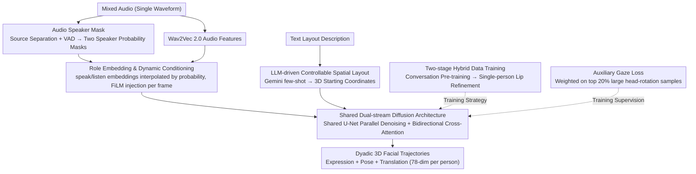

# Talking Together: Synthesizing Co-Located 3D Conversations from Audio

**Conference**: CVPR 2026  
**arXiv**: [2603.08674](https://arxiv.org/abs/2603.08674)  
**Code**: None  
**Area**: Human Understanding  
**Keywords**: Dyadic Conversation, 3D Facial Animation, Diffusion Models, Co-located Space, Eye Interaction

## TL;DR

This paper introduces the first method to generate complete facial animations for two participants **co-located in the same 3D space** from a single mixed audio stream. By utilizing a dual-stream diffusion architecture (shared U-Net + cross-attention), a two-stage hybrid data training strategy, LLM-driven text-to-spatial layout control, and an auxiliary gaze loss, the system achieves natural mutual gaze, head movements, and space-aware 3D animation synthesis for dyadic conversations.

## Background & Motivation

- **Limitations of Prior Work**: Existing audio-driven 3D facial animation methods either focus on a single speaker (CodeTalker, FaceFormer, SelfTalk) or generate the two parties as independent "video-conferencing" style avatars (DualTalk), ignoring the critical physical co-location relationships in real face-to-face interactions—relative position, orientation, and mutual gaze.
- **Key Challenge**: (1) Large-scale co-located dyadic 3D conversation data is extremely scarce; (2) Separating voices from a single mixed audio and modeling speak-listen interaction dynamics is difficult; (3) The system needs to synthesize complete 3D animations including spatial relationships (translation, rotation) and eye contact.
- **Novelty**: The authors propose the first conversation generation system that explicitly models 3D spatial relationships between two people, constructing a large-scale dataset covering 2M+ interaction pairs, achieving a paradigm shift from "video-conferencing avatars" to "face-to-face in-room conversations."
- **Value**: VR/AR remote telepresence, immersive social interaction, and virtual digital human dialogue.

## Method

### Overall Architecture

This paper addresses a problem previously unaddressed: given an audio track of two people talking together, it generates facial animations for both participants **standing in the same 3D space**, including mutual gaze, head turning, and nodding in response to the partner. The input is a single mixed audio waveform $\mathbf{A} \in \mathbb{R}^T$, and the output consists of 3D facial animation sequences for both participants—expression vectors $\bm{\psi} \in \mathbb{R}^{L \times 63}$, skeletal poses $\bm{\theta} \in \mathbb{R}^{L \times 4 \times 3}$ (neck, head, and two eyes), and global translation $\mathbf{t} \in \mathbb{R}^{L \times 3}$. These are concatenated into a trajectory $\mathbf{x} = \text{concat}(\psi, \theta, \mathbf{t}) \in \mathbb{R}^{L \times 78}$ per person with length $L=250$ (10s @ 25fps). The pipeline first determines "who is speaking when" from the mixed audio, converting it into role conditions for a conditional diffusion model. This model utilizes a shared-weight dual-stream U-Net for simultaneous denoising, using cross-attention for mutual awareness and FiLM to inject speak/listen states frame-by-frame.

### Key Designs

**1. Audio Speaker Mask: Identifying "who is speaking" from mixed audio**

To produce reactive movements (nodding while listening, turning to look), the model must know who is talking. Using the Looking to Listen model for source separation followed by WebRTC VAD, the system generates two binary speaker probability masks $\mathbf{m}_A, \mathbf{m}_B \in [0,1]^{T \times 1}$. The masks do not need to be perfectly accurate; the authors treat slight errors as beneficial noise, making the model more robust to speech overlaps.

**2. Shared Dual-stream Diffusion: Concurrent denoising with mutual awareness**

Animated characters must have consistent styles yet respond to each other. A single U-Net backbone with shared weights denoises $\mathbf{x}_{t,A}$ and $\mathbf{x}_{t,B}$ in parallel to learn speaker-agnostic facial motion representations. Bidirectional cross-attention layers are inserted in the decoder to allow each stream to attend to the other's features:

$$\mathbf{h}'_A = \text{Attention}(\mathbf{Q}_A, \mathbf{K}_B, \mathbf{V}_B), \quad \mathbf{h}'_B = \text{Attention}(\mathbf{Q}_B, \mathbf{K}_A, \mathbf{V}_A)$$

This allows reactive behaviors like nodding and mutual gaze to emerge.

**3. Role Embedding & Dynamic Conditioning: Expressing transitions through continuous interpolation**

To handle transitions and simultaneous speech, learnable embeddings $\mathbf{e}_{\text{speak}}$ and $\mathbf{e}_{\text{listen}}$ are linearly interpolated based on per-frame speaker probabilities $\mathbf{m}^{(k)}$:

$$\mathbf{e}_{\text{role}}^{(k)} = \mathbf{m}^{(k)} \mathbf{e}_{\text{speak}} + (1 - \mathbf{m}^{(k)}) \mathbf{e}_{\text{listen}}$$

The condition vector $\mathbf{c}^{(k)}$ combines Wav2Vec 2.0 features $\mathbf{a}^{(k)}$, role embeddings, and masks. It is injected via concatenation and FiLM modulation:

$$\text{FiLM}(\mathbf{h}, \mathbf{c}^{(k)}) = (\bm{\gamma}(\mathbf{c}^{(k)}) + 1) \odot \mathbf{h} + \bm{\beta}(\mathbf{c}^{(k)})$$

**4. Two-stage Hybrid Data Training: Interaction from conversations, lip-sync from clean data**

The authors use a two-step approach: Stage 1 involves pre-training on large-scale conversation data to learn interaction dynamics (head turns, nods). Stage 2 fine-tunes on high-quality single-person data and enhanced conversation subsets. In this stage, single-person samples **only** contribute to the L2 loss for the 20 lip/jaw expression parameters, specifically refining mouth movements while preserving learned interactions.

**5. LLM-driven Controllable Spatial Layout: Text-controlled 3D positioning**

To control spatial relationships via natural language, the model predicts relative displacement $\Delta\mathbf{t}^{(k)} = \mathbf{t}^{(k)} - \mathbf{t}^{(0)}$ based on initial translations $\mathbf{t}_A^{(0)}, \mathbf{t}_B^{(0)}$. During inference, Gemini uses few-shot prompting to translate descriptions like "intimate conversation" into specific 3D starting coordinates.

**6. Auxiliary Gaze Loss: Focused training on "meaningful eye contact"**

This loss calculates the cosine similarity between predicted and ground-truth 3D gaze direction vectors. Crucially, it is **selectively applied**: the weights are significantly increased only for the top 20% of samples with the highest head rotation variance, where meaningful eye contact is most likely to occur.

### Loss & Training

The total loss is a weighted sum: Expression reconstruction ($\lambda_{expr}=1$) + Rotation reconstruction ($\lambda_{rot}=8$) + Translation reconstruction ($\lambda_{trans}=1$) + Vertex velocity regularization ($\lambda_{vel}=1$) + Auxiliary gaze loss ($\lambda_{gaze}=5$). Rotation and gaze are prioritized to emphasize orientation and mutual gaze. Training used 16×A100 GPUs for 200K steps.

## Key Experimental Results

### Main Results: Quantitative Comparison (Table 2)

| Method | FD ↓ | P-FD ↓ | MSE-FULL ↓ | MSE-ROT ↓ | MSE-EYE ↓ | MSE-LIP ↓ | vMSE-FULL ↓ | SID-SPE ↑ | SID-LIS ↑ |
|------|------|--------|------------|-----------|-----------|-----------|-------------|-----------|-----------|
| CodeTalker | 47.23 | 70.54 | 10.47 | 14.28 | 3.07 | 2.95 | 12.49 | 0 | 0 |
| DualTalk | 28.41 | 38.29 | 9.91 | 8.42 | 2.11 | 2.50 | 8.32 | 1.57 | 1.95 |
| **Ours** | **10.43** | **18.24** | **4.03** | **3.50** | **0.98** | **0.35** | **7.99** | **2.28** | **2.48** |

### Ablation Study (Table 3)

| Configuration | FD ↓ | P-FD ↓ | MSE-EXP ↓ | MSE-TRAN ↓ | MSE-ROT ↓ |
|----------|------|--------|-----------|------------|-----------|
| Single person data only | 50.45 | 50.05 | 10.01 | 2.32 | 3.88 |
| No Stage 2 (Pre-train only) | 60.12 | 64.44 | 7.73 | 1.71 | 2.94 |
| No Cross-Attention | 30.49 | 40.87 | 6.87 | 1.54 | 2.98 |
| **Full Model** | **21.71** | **22.56** | **5.97** | **1.50** | **2.48** |

### Key Findings

1. **FD Dominance**: Ours achieves FD=10.43, less than 1/3 of the strongest baseline DualTalk (28.41), and MSE-LIP reduces by 86%.
2. **Two-Stage Necessity**: Removing Stage 2 or using only single-person data significantly degrades FD, proving the need to combine interaction and lip-sync training.
3. **Cross-Attention Impact**: Removing it raises P-FD from 22.56 to 40.87, highlighting its role in speak-listen response modeling.
4. **Gaze Loss Impact**: Removing it increases MSE-TRAN, suggesting gaze constraints indirectly improve overall spatial positioning.

## Highlights & Insights

1. **Paradigm Shift**: Moves from independent avatars to explicit 3D co-location (relative position, orientation, eye contact).
2. **Data Engineering**: Cleverly combines diverse, noisy conversation data for interactions with clean data for precision.
3. **Selective Gaze Loss**: Weighting gaze loss based on head rotation variance focuses the model on learning meaningful interactive patterns.
4. **LLM Control**: The few-shot Gemini interface provides an elegant solution for mapping natural language to 3D layouts.

## Limitations & Future Work

1. Quality depends on source separation/VAD; performance may drop in high-noise or heavy-overlap scenarios.
2. 3DMM parameters limit fine micro-expressions and asymmetric movements.
3. Does not yet cover full-body gestures or posture interactions.
4. LLM-based layout mapping may have limited generalization for complex or rare scenario descriptions.

## Related Work & Insights

- **Single-person Head**: FaceFormer and CodeTalker lack interactive modeling.
- **Conversation Generation**: DualTalk handles dyads but lacks spatial relationships in a shared room.
- **Insight**: The continuous role embedding interpolation and the "interaction + detail" two-stage strategy are highly generalizable for generative modeling.

## Rating

| Dimension | Score (1-10) | Description |
|------|-------------|------|
| Novelty | 9 | First to explicitly model co-located 3D dyadic conversations. |
| Technical Depth | 8 | Sophisticated architecture integrating cross-attention, FiLM, and two-stage training. |
| Experimental Thoroughness | 9 | Extensive quantitative comparison against 11 baselines and solid human evaluation. |
| Engineering Value | 9 | The scale and construction pipeline of the 50k+ hour datasets are significant. |
| **Total Score** | **8.6** | A pioneering work in co-located conversation generation with robust design and results. |

<!-- RELATED:START -->

## Related Papers

- [\[CVPR 2026\] AudioAvatar: Personalized Audio-driven Whole-body Talking Avatars](audioavatar_personalized_audio-driven_whole-body_talking_avatars.md)
- [\[CVPR 2026\] PC-Talk: Precise Facial Animation Control for Audio-Driven Talking Face Generation](pc-talk_precise_facial_animation_control_for_audio-driven_talking_face_generatio.md)
- [\[ECCV 2024\] ScanTalk: 3D Talking Heads from Unregistered Scans](../../ECCV2024/human_understanding/scantalk_3d_talking_heads_from_unregistered_scans.md)
- [\[ECCV 2024\] Audio-Driven Talking Face Generation with Stabilized Synchronization Loss](../../ECCV2024/human_understanding/audio-driven_talking_face_generation_with_stabilized_synchronization_loss.md)
- [\[CVPR 2026\] LiveGesture: Streamable Co-Speech Gesture Generation Model](livegesture_streamable_co-speech_gesture_generation_model.md)

<!-- RELATED:END -->
