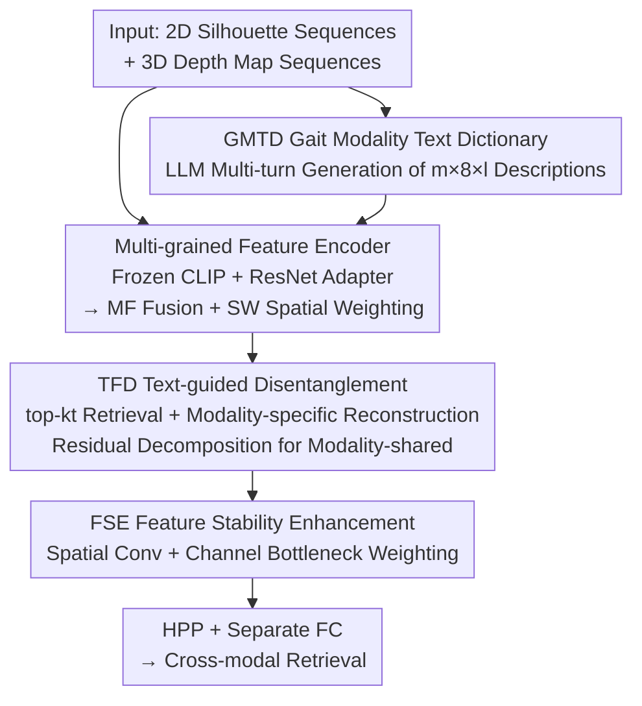

# Text-guided Feature Disentanglement for Cross-modal Gait Recognition

**Conference**: CVPR 2026  
**Paper**: [CVF Open Access](https://openaccess.thecvf.com/content/CVPR2026/html/Lu_Text-guided_Feature_Disentanglement_for_Cross-modal_Gait_Recognition_CVPR_2026_paper.html)  
**Code**: None  
**Area**: Human Understanding / Cross-modal Gait Recognition  
**Keywords**: Gait Recognition, LiDAR-Camera Cross-modal, Feature Disentanglement, CLIP, Text Prior

## TL;DR
This work generates a "modality+view"-aware gait text dictionary using LLMs and leverages CLIP to use text as semantic anchors for guiding visual feature disentanglement. It decomposes gait features from LiDAR and camera modalities into "modality-specific" and "modality-shared" components, performing retrieval using only the shared features. This approach achieves new SOTA results on the SUSTech1K and FreeGait benchmarks (e.g., FreeGait 3D→2D Rank-1 increases from 43.3 to 57.9).

## Background & Motivation
**Background**: Gait recognition identifies individuals via walking posture, offering advantages like being non-contact, long-distance, and difficult to disguise compared to face or iris recognition. However, real-world deployments involve heterogeneous sensors—both RGB cameras (outputting 2D silhouette videos) and LiDAR (outputting 3D point cloud sequences). Consequently, "LiDAR-Camera Cross-modal Gait Recognition (LCCGR)" has become a key scenario for multi-device collaborative retrieval, where a query from one modality is used to search a gallery of another.

**Limitations of Prior Work**: The **modality gap between 2D videos and 3D point clouds is massive, often exceeding intra-class variance**, making direct alignment difficult. Existing methods have significant flaws: CL-Gait uses synthetic 2D-3D data for contrastive pre-training, but the domain gap between synthetic and real data introduces bias; CrossGait learns a set of "shared prototypes" with attention weighting, but these prototypes lack generalization, and forcing different modality features together can lead to **class collapse**. Furthermore, current feature disentanglement networks are essentially uninterpretable black boxes, making it impossible to verify what is being disentangled.

**Key Challenge**: Cross-modal gait recognition requires "modality-shared" discriminative features, but there is a lack of semantic and interpretable supervisory signals for reliably stripping modality-specific information from visual features. Relying solely on contrastive or orthogonality constraints in the feature space is akin to "the blind men and the elephant."

**Key Insight**: Vision-Language Models (CLIP) provide a new perspective. Since **modality characteristics can be described in language** (e.g., "a binary silhouette from a front view" vs. "a LiDAR depth map from a left view"), modality-specific information can be written as text and projected into the visual space. Using text as "semantic anchors" allows for **explicit and interpretable** guided disentanglement: the part that aligns with the text is modality-specific information, and the residual is modality-shared information.

**Core Idea**: Construct a "modality+view"-aware gait text dictionary using an LLM, embed the text into the visual space as anchors using CLIP, and perform text-guided feature disentanglement (TCFDNet) via "reconstructing modality-specific features → residual decomposition of modality-shared features."

## Method

### Overall Architecture
TCFDNet addresses LCCGR by taking a gait sequence ($s$ frames of 2D silhouettes for camera, $s$ frames of depth maps for LiDAR, resized to $64\times64$) and outputting a discriminative feature containing **only modality-shared information** for cross-modal retrieval. The pipeline consists of four steps: first, an offline Gait Modality Text Dictionary (GMTD) is created using an LLM (containing $m\times8\times l$ descriptions for each modality across 8 views over $l$ rounds). Online, a Multi-grained Feature Encoder uses frozen CLIP vision/text encoders and a ResNet bypass adapter to extract fine-grained details, followed by Multi-grained Fusion (MF) and Spatial Weighting (SW). Next, the TFD module retrieves the top-$k_t$ matching texts from the GMTD to **reconstruct modality-specific features**, obtaining shared features via "original - modality-specific." Finally, the FSE module enhances these shared features across spatial and channel dimensions before HPP and separate FC layers produce part-based discriminative features. A Cross-modal Patch Exchange data augmentation is used during training to improve generalization.

### Key Designs

**1. GMTD Gait Modality Text Dictionary: Encoding Modality-specific Info as Retrieval Anchors**

Disentanglement lacks interpretable supervisory signals. The authors construct an offline dictionary, GMTD, describing what each modality "looks like" under different views using natural language. This involves three steps: discretizing views into 8 directions, using LLMs (ChatGPT) with specific instructions (CoT, in-context) to generate "modality-aware + view-aware" descriptions, and using $l$ rounds of multi-turn interaction to expand descriptions for semantic diversity. The final dictionary size is $m\times8\times l$ ($m\in\{2d,3d\}$):

$$\text{GMTD}=\{t^m_j \mid m\in\{2d,3d\},\, j=1,2,\dots,8l\}$$

These are passed through a frozen CLIP text encoder and MLP adapters to become modality-specific embeddings $v^m_j\in\mathbb{R}^{1\times d}$. This is effective because text naturally resides in CLIP's shared vision-language space, allowing for direct similarity calculations with visual features.

**2. Multi-grained Feature Encoder (MF + SW): Supplementing Missing Fine-grained Cues**

CLIP encoders excel at global coarse-grained semantics but lack the fine-grained spatio-temporal dynamics needed for gait. The encoder uses a dual-path design: one path with frozen CLIP + a lightweight adapter for global tokens $\tilde g^m_i\in\mathbb{R}^{(1+o)\times d}$, and a trainable ResNet-9 bypass path for fine-grained local features $\tilde f^m_i\in\mathbb{R}^{h'\times w'\times d}$. The MF module uses multi-head cross-attention for **bidirectional fusion** between global and local tokens. The SW module then uses $1\times1$ convolution + BN + LeakyReLU to compute a spatial attention map $w^m_i\in\mathbb{R}^{h'\times w'\times1}$ to recalibrate features $\tilde u^m_i=w^m_i\odot u^m_i$, **adaptively highlighting identity-discriminative regions**.

**3. TFD Text-guided Feature Disentanglement: Reconstruction and Residual Decomposition**

This is the core contribution. TFD follows three steps: ① **Retrieval**: Calculate cosine similarity between CLIP [CLS] features $\tilde g^{*m}_i$ and GMTD embeddings $v^m_j$ to select the top-$k_t$ semantic prototypes. ② **Modality-specific Reconstruction**: Map the $k_t$ prototypes to a shared latent space as $\hat V^m_i$, compute affinity with visual features $\hat u^m_i$ to get weights $\Omega$, and perform weighted fusion to get $F^m_{(mod),i}$. A **gating mechanism** using a factor $\alpha$ is added to prevent early-stage training divergence: $\tilde F^m_{(mod),i}=\alpha\odot F^m_{(mod),i}$. ③ **Residual Decomposition**:

$$F^m_{(shared),i}=\tilde u^m_i-\tilde F^m_{(mod),i}$$

This subtracts the modality-specific component to obtain the modality-shared feature. This is effective because the disentanglement is explicitly driven by interpretable text semantics.

**4. FSE Feature Stability Enhancement: Robustness for "Fragile" Shared Features**

Residual-shared features can be sensitive to noise. FSE strengthens them using $3\times3$ convolutions for **local spatial receptive fields** and a **bottleneck layer** to model **inter-channel dependencies**. A 1D convolution + Softmax calculates channel weights $\beta$ to perform adaptive weighting $\tilde F^m_{(shared),i}=\beta\odot F^m_{(shared),i}$.

### Loss & Training
The total loss combines semantic alignment, feature disentanglement, and statistical decorrelation:

$$\mathcal{L}_{all}=\gamma_1(\mathcal{L}_{tri}+\mathcal{L}_{ce})+\gamma_2\mathcal{L}^m_{align}+\gamma_3(\mathcal{L}^m_{ortho}+\mathcal{L}^m_{HSIC})$$

- **MA Loss (Modality Alignment)** $\mathcal{L}^m_{align}$: Aligns reconstructed modality-specific features with text embeddings.
- **MO Loss (Modality Orthogonality)** $\mathcal{L}^m_{ortho}$: Forces independence between shared and specific components via cosine orthogonality.
- **HSIC Loss (Statistical Independence)** $\mathcal{L}^m_{HSIC}$: Further decorrelates feature distributions using the Hilbert-Schmidt Independence Criterion.
- Standard triplet and cross-entropy losses are used. Training employs the OpenGait framework with Patch Exchange augmentation.

## Key Experimental Results

### Main Results
TCFDNet was evaluated on SUSTech1K and FreeGait. It achieved new SOTA results on SUSTech1K:

| Dataset / Direction | Metric | TCFDNet | Prev. SOTA | Gain |
|--------------|------|---------|---------|------|
| SUSTech1K 2D→3D | Rank-1 | **55.9** | 54.9 (SCR) | +1.0 |
| SUSTech1K 3D→2D | Rank-1 | **61.7** | 57.7 (SCR) | +4.0 |
| FreeGait 2D→3D | Rank-1 | **52.1** | 40.1 (SCR) | +12.0 |
| FreeGait 3D→2D | Rank-1 | **57.9** | 43.3 (SCR) | +14.6 |

Improvements on the more challenging FreeGait dataset are particularly significant (up to +14.6 Rank-1), demonstrating the strong generalization of text-guided disentanglement under real-world distribution shifts.

### Ablation Study
Ablation on SUSTech1K (LiDAR→Camera):

| Configuration | Rank-1 | Rank-5 | Description |
|------|--------|--------|------|
| Full Model | **61.7** | **82.5** | All modules |
| w/o GMTD | 56.2 | 77.3 | Significant drop without text prior |
| w/o ResNet bypass | 54.9 | 74.6 | Fine-grained cues are critical |
| w/o TFD | 58.9 | 79.3 | Disentanglement core contribution |

### Key Findings
- **GMTD and Fine-grained Bypass are Pillars**: Removing GMTD drops performance by 5.5%, while removing the ResNet bypass drops it by 6.8%. Both "text-anchor guidance" and "fine-grained supplementation" are essential.
- **Optimal $k_t=16$**: Selecting the top 16 text prototypes provides the best balance between semantic richness and noise reduction.
- **Night Condition Degradation**: Performance degrades in nighttime scenarios due to the dual challenge of day-night domain shift and modality gap.

## Highlights & Insights
- **Translating "modality difference" into language** for disentanglement is a brilliant perspective shift. It turns abstract modality-specific noise into a searchable, interpretable alignment problem.
- **Generalizable Decomposition Paradigm**: The "reconstruct specific → residual shared" template can be transferred to other tasks involving nuisance factors (e.g., cross-domain ReID, cross-weather recognition) as long as those factors are describable in text.
- **Multi-level Constraints**: Combining MA, MO, and HSIC losses constrains features from semantic, geometric, and statistical perspectives, ensuring more thorough disentanglement than simple orthogonality.

## Limitations & Future Work
- **Degradation in Night Conditions**: The model struggles with simultaneous cross-modality and day-night cross-domain shifts.
- **Dependency on GMTD Quality**: The disentanglement ceiling is determined by the precision and granularity of the LLM-generated descriptions.
- **Computational Cost**: The dual-path encoder and cross-attention mechanisms involve significant training and inference overhead.
- **Modal Generalization**: Validated only on LiDAR and Camera; performance on other modalities (e.g., thermal, millimeter-wave radar) remains unexplored.

## Related Work & Insights
- **vs. CL-Gait (ECCV'24)**: TCFDNet avoids the domain gap issues of synthetic-to-real pre-training by using text anchors directly on real data.
- **vs. CrossGait (IJCB'24)**: Unlike CrossGait's learned prototypes which may cause class collapse, TCFDNet ensures independence through explicit residual decomposition and statistical constraints, resulting in tighter intra-class and more separated inter-class features.
- **vs. SCR (IF'25)**: TCFDNet outperforms the previous strongest baseline by introducing a new dimension of interpretable supervisory signals via text.

## Rating
- Novelty: ⭐⭐⭐⭐⭐ 
- Experimental Thoroughness: ⭐⭐⭐⭐ 
- Writing Quality: ⭐⭐⭐⭐ 
- Value: ⭐⭐⭐⭐ 

<!-- RELATED:START -->

## Related Papers

- [\[CVPR 2026\] MMGait: Towards Multi-Modal Gait Recognition](mmgait_multi_modal_gait_recognition.md)
- [\[CVPR 2026\] EventGait: Towards Robust Gait Recognition with Event Streams](eventgait_towards_robust_gait_recognition_with_event_streams.md)
- [\[CVPR 2026\] HyperGait: Unleashing the Power of Parsing for Gait Recognition in the Wild via Hypergraph](hypergait_unleashing_the_power_of_parsing_for_gait_recognition_in_the_wild_via_h.md)
- [\[CVPR 2026\] Composite-Attribute Person Re-Identification via Pose-Guided Disentanglement](composite-attribute_person_re-identification_via_pose-guided_disentanglement.md)
- [\[CVPR 2026\] Unlocking Motion from Large Vision Models with a Semantic and Kinematic Duality for Gait Recognition](unlocking_motion_from_large_vision_models_with_a_semantic_and_kinematic_duality_.md)

<!-- RELATED:END -->
