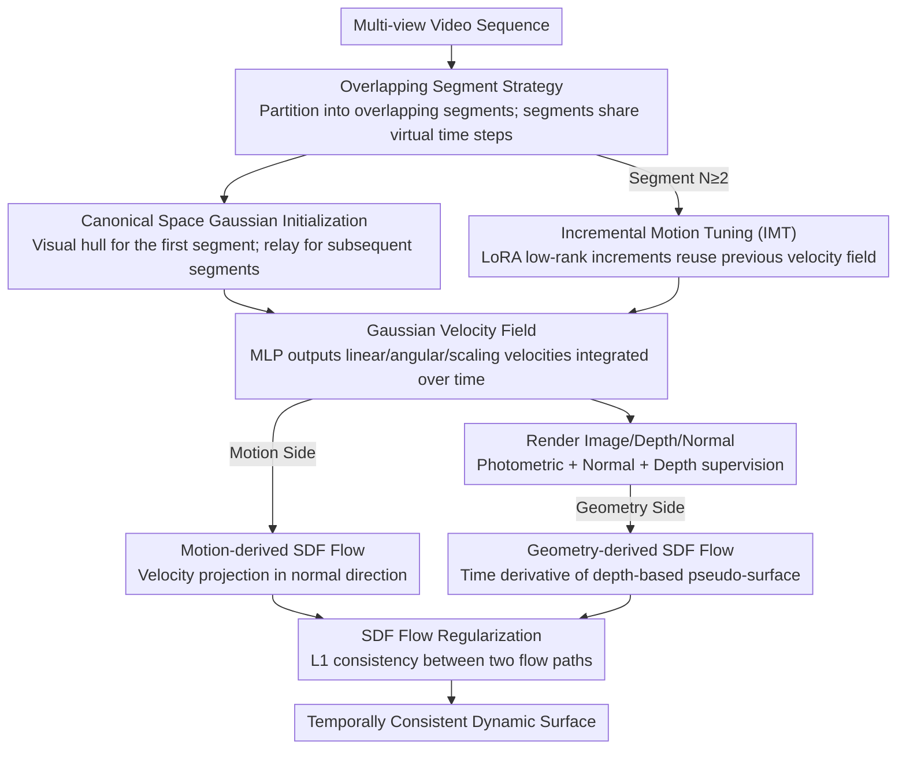

# 4DSurf: High-Fidelity Dynamic Scene Surface Reconstruction

**Conference**: CVPR 2026  
**arXiv**: [2603.28064](https://arxiv.org/abs/2603.28064)  
**Code**: None  
**Area**: Human Understanding  
**Keywords**: Dynamic Surface Reconstruction, Gaussian Splatting, SDF Flow Regularization, Temporal Consistency, Large Deformation Handling

## TL;DR

This paper proposes 4DSurf, a general dynamic scene surface reconstruction framework based on 2D Gaussian Splatting. By introducing Gaussian motion-induced SDF flow regularization to constrain the temporally consistent evolution of the surface and employing an overlapping segment strategy to handle large deformations, it surpasses existing SOTA methods with Chamfer distance improvements of 49% and 19% on the Hi4D and CMU Panoptic datasets, respectively.

## Background & Motivation

**Background**: Dynamic surface reconstruction aims to recover temporally consistent 3D geometry from video sequences, serving as a foundation for applications such as digital humans and virtual reality. Recently, methods based on Gaussian Splatting (GS) have become the mainstream direction due to their real-time rendering and efficient optimization.

**Limitations of Prior Work**: Existing GS-based dynamic surface reconstruction methods (e.g., D-2DGS, DG-Mesh, DGNS) typically perform well only on single objects or scenes with small deformations. They exhibit surface jitter and temporally inconsistent geometric deformations when faced with large-deformation scenes. Many methods also rely on human priors such as SMPL-X or pre-trained depth/normal estimation models, which limits their generality.

**Key Challenge**: How to simultaneously achieve the following without relying on any object priors: (1) general surface reconstruction for arbitrary dynamic scenes (multi-object, non-rigid); (2) temporal consistency under large deformations; (3) high-fidelity geometry under sparse views.

**Goal**: (1) Align Gaussian motion with surface evolution to eliminate temporal inconsistency; (2) handle large deformations in long sequences without error accumulation; (3) construct a general framework independent of priors.

**Key Insight**: Starting from the SDF flow (the time derivative of the SDF field), the authors establish a connection between Gaussian motion and SDF changes—if the Gaussian motion correctly reflects the temporal evolution of the surface, the SDF flows derived from both should be consistent. Leveraging this constraint enables temporally consistent surface reconstruction.

**Core Idea**: Realize prior-free, temporally consistent dynamic surface reconstruction through consistency regularization between the SDF flow defined by the Gaussian velocity field and the SDF flow estimated from depth map changes.

## Method

### Overall Architecture

4DSurf aims to recover a dynamic surface that evolves consistently over time from multi-view video sequences without relying on object priors like SMPL-X. The approach partitions the entire video into several **overlapping segments**. Within each segment, a canonical space and a Gaussian velocity field are established, and SDF flow regularization is used to couple "Gaussian motion" with "surface evolution."

Specifically, each segment covers $K+1$ time steps, where the final time step is a "virtual time step" shared with the subsequent segment to transfer geometry between segments. The first segment initializes Gaussians from the visual hull, and each subsequent segment inherits initialized Gaussians from the preceding segment's virtual time step. Within a segment, Gaussians in the canonical space are propagated to each time step via the velocity field to render images, depth, and normals for supervision. Meanwhile, SDF flow regularization constrains the alignment of motion and geometry throughout training to prevent surface jitter.

### Key Designs

**1. Gaussian Velocity Field: Parameterizing motion with velocity instead of displacement to facilitate SDF flow derivation**

The most common approach in dynamic surface reconstruction is to directly predict the displacement (deformation field) of each Gaussian. However, there is no ready-made analytical bridge between displacement fields and geometric evolution, making temporal constraints difficult to apply. 4DSurf instead predicts **velocity**: given the canonical center $\mu_i$ of the $i$-th Gaussian and time step $t$, an MLP $\mathcal{F}_\theta$ outputs three types of motion: linear velocity $\mathbf{v}(\mu_i, t)$, angular velocity $\omega(\mu_i, t)$, and scaling velocity $\mathbf{e}(\mu_i, t)$. These are then integrated to obtain position $\mu_i^t = \mu_i + \mathbf{v} \cdot t$, rotation $q_i^t = \phi(\omega \cdot t) \otimes q_i$, and scale $\xi_i^t = \xi_i + \mathbf{e} \cdot t$.

Using velocity is essential because the rate of change of a surface over time (SDF flow) is inherently a velocity-related quantity. Only by representing motion as a velocity field can the "Gaussian motion" be mathematically derived as "surface evolution," providing a differentiable analytical form for SDF flow regularization.

**2. SDF Flow Regularization: Calculating SDF flow from motion and geometry paths and enforcing consistency**

A velocity field alone does not guarantee consistent surface evolution; jittering still occurs under large deformations. The idea behind SDF flow regularization is that surface evolution can be characterized by the time derivative of the SDF field (SDF flow), which can be calculated from two independent paths. Requiring these two to align produces a strong constraint.

The first path stems from Gaussian motion: according to the paper's theorem, the SDF flow equals the negative projection of the scene flow onto the surface normal direction, $\mathbf{f} = -(\omega \times R^t \mathbf{x} + \mathbf{v})^\top \mathbf{n}(R^t \mathbf{x})$. Intuitively, only motion along the normal direction changes the distance to the surface, while tangential sliding does not. The second path stems from geometric change: the rendered depth map is used as a pseudo-surface to approximate the SDF value $\tilde{s}(\mu_i^t, t) = \hat{D}(\mathbf{p}^*, t) - d(\mu_i^t, t)$, which is then differentiated with respect to time to obtain another version of the SDF flow. Finally, an L1 constraint is applied to the difference between the two flows:

$$\mathcal{L}_{flow} = \sum_i |\mathbf{f}_i^t - \tilde{\mathbf{f}}_i^t|$$

This term is effective because it fuses the motion field and geometric evolution at the physical level: the motion-side flow is given analytically by the velocity field, and the geometry-side flow is supervised by the rendered depth. They validate each other, forcing Gaussian motion to truly reflect the temporal changes of the surface.

**3. Overlapping Segment Strategy + Incremental Motion Tuning: Decomposing large deformations and using LoRA to save storage**

A single canonical space with a global deformation field struggles with large deformations in long sequences, leading to error accumulation. 4DSurf partitions the sequence into **overlapping segments**, where each segment only needs to model small within-segment deformations. Two adjacent segments share a virtual time step, allowing geometric information to pass between them, while the overlap ensures continuity at boundaries.

To prevent storage from expanding linearly with the number of segments if a full velocity field were trained for each, Incremental Motion Tuning (IMT) exploits the high correlation between motions in adjacent segments. For segment $N$ ($N \geq 2$), instead of re-learning the velocity field, a LoRA-style low-rank fine-tuning is applied to the parameters of the previous segment: $\theta^N = \theta^{N-1} + \Delta\theta^N$, where $\Delta\theta^N = A^N B^N$ with rank $r \ll d$. Consequently, each additional segment only requires storing a set of low-rank increments rather than a full network. Experiments show that when the LoRA rank is 64, there is almost no loss in accuracy while storage is significantly reduced.

### Loss & Training

The total loss is a weighted combination of five terms: $\mathcal{L}_{total} = \mathcal{L}_{img} + \lambda_1 \mathcal{L}_n + \lambda_2 \mathcal{L}_d + \lambda_3 \mathcal{L}_{flow} + \lambda_4 \mathcal{L}_m$, where $\mathcal{L}_{img}$ is the L1+D-SSIM photometric loss, $\mathcal{L}_n$ is the normal alignment loss (from 2DGS), $\mathcal{L}_d$ is the depth distillation loss, $\mathcal{L}_{flow}$ is the SDF flow regularization, and $\mathcal{L}_m$ is the alpha mask loss.

## Key Experimental Results

### Main Results

Chamfer Distance (mm) on the CMU Panoptic dataset:

| Method | Band1 | Ian3 | Haggling_b2 | Pizza1 |
|------|-------|------|------------|--------|
| Neural SDF-Flow | 17.2 | 15.8 | 13.5 | 16.1 |
| Dynamic-2DGS | 16.0 | 12.5 | 13.7 | 16.2 |
| Space-Time-2DGS | 16.4 | 12.6 | 13.7 | 15.8 |
| GauSTAR | 17.6 | 13.7 | 14.8 | 14.7 |
| **Ours w/ IMT-64** | **12.8** | **10.4** | **11.0** | **12.1** |
| **Ours wo/ IMT** | **12.7** | **10.5** | **10.8** | **12.2** |

### Ablation Study

| Configuration | Effect (Overall Chamfer Distance) |
|------|------|
| Full 4DSurf | Best |
| Remove SDF Flow Regularization | Temporal consistency significantly declines; surface jitter |
| Remove Overlapping Segments | Severe error accumulation in large-deformation scenes |
| IMT-64 vs. Full Velocity Field | Almost no performance loss; storage significantly reduced |

### Key Findings

- **Significantly outperforms existing SOTA**: Improvements of approximately 19% in overall Chamfer distance on CMU Panoptic and approximately 49% on Hi4D.
- **Prior-free performance**: Does not rely on priors like SMPL-X, showing far superior generality in common scenarios such as multi-person interaction.
- **SDF flow regularization is core**: Ablation experiments show that temporal consistency significantly degrades after removing this regularization.
- **IMT reduces storage with negligible loss**: With a LoRA rank of 64, performance is nearly identical to a full velocity field, but storage is significantly reduced.
- **Robust to sparse views**: Maintains superior performance even in sparse settings with fewer than 10 views.

## Highlights & Insights

- **Elegant Theoretical Derivation**: The theoretical derivation from Gaussian motion to SDF flow is the primary highlight, elegantly unifying motion and geometric constraints mathematically.
- **High Generality**: A truly prior-free method that is not limited by the number or type of objects or the degree of deformation.
- **New Application of LoRA in 3D Reconstruction**: The idea of incremental motion fine-tuning can be extended to other dynamic scene modeling tasks.
- **Simple and Effective Segmentation**: The strategy of decomposing long-sequence large deformations into short-sequence small deformations is intuitive and effective.

## Limitations & Future Work

- Hyperparameters for the segmentation strategy (segment length $K$, number of overlapping frames) impact results and require manual adjustment based on the scene.
- Merging canonical spaces remains a non-trivial problem, leading to storage growth that is linear with the number of segments.
- Topology changes (e.g., objects appearing/disappearing) are not considered; initialization transfer between segments may fail in extreme scenarios.
- The potential to combine SDF flow regularization with other 3DGS variants (e.g., 3DGS, Mip-Splatting) could be explored.

## Related Work & Insights

- Neural SDF-Flow first proposed the SDF flow concept but was based on NeRF and thus inefficient; this work elegantly migrates the concept to the Gaussian Splatting framework.
- 2DGS provides a better foundation for geometric modeling (compared to 3DGS), and 4DSurf builds its dynamic extension upon it.
- The application of LoRA in dynamic 3D reconstruction is a direction worth more exploration.

## Rating

- **Novelty**: ⭐⭐⭐⭐⭐ — The combination of SDF flow regularization and Gaussian velocity fields is a highly original contribution.
- **Experimental Thoroughness**: ⭐⭐⭐⭐ — Comparisons across two datasets and multiple baselines are complete, though ablation details could be further enriched.
- **Writing Quality**: ⭐⭐⭐⭐ — Mathematical derivations are rigorous and clear; methodology is well-structured.
- **Value**: ⭐⭐⭐⭐ — Addresses core pain points (temporal consistency + large deformation) in dynamic surface reconstruction, providing a strong push for the field.

<!-- RELATED:START -->

## Related Papers

- [\[CVPR 2026\] Mobile-VTON: High-Fidelity On-Device Virtual Try-On](mobile_vton_ondevice_virtual_tryon.md)
- [\[CVPR 2026\] InterPhys: Physics-aware Human Motion Synthesis in a Dynamic Scene](interphys_physics-aware_human_motion_synthesis_in_a_dynamic_scene.md)
- [\[ICCV 2025\] Avat3r: Large Animatable Gaussian Reconstruction Model for High-fidelity 3D Head Avatars](../../ICCV2025/human_understanding/avat3r_large_animatable_gaussian_reconstruction_model_for_hi.md)
- [\[ICLR 2026\] Text2Interact: High-Fidelity and Diverse Text-to-Two-Person Interaction Generation](../../ICLR2026/human_understanding/text2interact_high-fidelity_and_diverse_text-to-two-person_interaction_generatio.md)
- [\[CVPR 2025\] VTON 360: High-Fidelity Virtual Try-On from Any Viewing Direction](../../CVPR2025/human_understanding/vton_360_high-fidelity_virtual_try-on_from_any_viewing_direction.md)

<!-- RELATED:END -->
