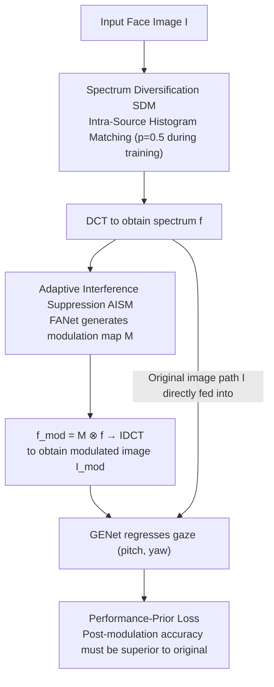

# Through the Frequency Lens: Cross-Domain Generalisable Gaze Estimation with Adaptive Modulation

**Conference**: CVPR 2026  
**Paper**: [CVF Open Access](https://openaccess.thecvf.com/content/CVPR2026/html/Xu_Through_the_Frequency_Lens_Cross-Domain_Generalisable_Gaze_Estimation_with_Adaptive_CVPR_2026_paper.html)  
**Code**: None  
**Area**: Gaze Estimation / Domain Generalization  
**Keywords**: Gaze Estimation, Domain Generalization, Frequency Domain Analysis, Adaptive Modulation, Histogram Matching

## TL;DR
This paper dissects cross-domain degradation in gaze estimation from a frequency-domain perspective. It discovers that facial images contain both generalisation-assisting "gaze-related frequency bands" and generalisation-harming "interference bands," and their distribution shifts across datasets. Based on this, the FGAL framework is proposed: a lightweight attention network generates a learnable frequency modulation map for each image to adaptively suppress interference bands (AISM), and intra-source histogram matching expands the spectrum distributions seen during training (SDM). Across four cross-domain settings, FGAL reduces error by up to 28.2% compared to the baseline and up to 19.5% compared to the state-of-the-art (SOTA).

## Background & Motivation
**Background**: Appearance-based gaze estimation has become mainstream, directly regressing pitch and yaw angles from a whole face image using CNNs/Transformers. Combined with large datasets such as ETH-XGaze, Gaze360, and MPIIFaceGaze, these models achieve high accuracy *within the same dataset*.

**Limitations of Prior Work**: Once transitioned to target domains unseen during training (featuring different lighting, acquisition equipment, ethnicities, or compression protocols), the accuracy of these models drops precipitously. Two existing routes both have severe drawbacks: UDA (Unsupervised Domain Adaptation) requires access to unlabeled data from the target domain during training, which is often unavailable during actual deployment; DG (Domain Generalization) does not touch the target domain, but existing approaches (i.e., adversarial feature purification in PureGaze, adversarial perturbations, or CLIP language regularization) focus strictly on the **spatial domain**, yielding unstable performance.

**Key Challenge**: The authors attribute the root cause of cross-domain degradation to the **frequency domain**. Different frequency bands of a facial image contribute differently to "cross-domain generalization". Low frequencies carry gaze-related, cross-dataset stable information like eye structures (beneficial), while high frequencies are mostly dataset-specific appearance interferences such as illumination, sensor noise, and compression artifacts (harmful). More troublesome is that which frequency bands act as interference and how their energy is distributed **varies across datasets**, which serves as a major source of the domain gap.

**Goal**: Without accessing any target domain data, make the model (1) adaptively identify and suppress the interference bands of each individual image, and (2) possess robustness against diverse spectrum distributions.

**Key Insight**: The authors conducted a systematic set of frequency-band ablation experiments. Using DCT, they transformed the test images to the frequency domain, evenly divided them into 10 frequency bands, set the coefficients of a specific band to zero one by one, reconstructed them using IDCT, and observed how the cross-domain accuracy changed (Fig. 2). The results are clean: suppressing the high-frequency bands 7-10 actually **improves performance** (indicating they are interference), while suppressing the low-frequency bands 1-3 causes accuracy to **plummet** (indicating they carry gaze structural information). Moreover, the optimal suppressed band is inconsistent across different source/target domain combinations (e.g., band 7 for DE→DM, band 8 for DG→DM).

**Core Idea**: Rather than purifying features in the spatial domain, it is better to "per-sample" adaptively suppress interference bands in the frequency domain, and actively "expand" the spectrum distributions observed during training. These two complementary operations can eliminate the cross-domain gap at the frequency-domain level.

## Method

### Overall Architecture
FGAL (Frequency-Guided Adaptive Learning) consists of two complementary modules: **AISM** (Adaptive Interference Suppression Module) is responsible for suppressing interference bands and retaining gaze-related bands per sample in the frequency domain; **SDM** (Spectrum Diversification Module) matches the spectrum histogram of each training image with another image from the same source during training, creating richer spectrum distributions to familiarize the model. During the training phase, the two modules are connected in a "dual-path forward" pipeline: one path processes the original image, and the other processes the modulated image, utilizing a "performance-prior" loss to force the modulation network to learn that "post-modulation accuracy must be superior". During inference, only the AISM modulation path is retained.

### Key Designs

**1. Frequency Domain Generalization Analysis: Decomposing the Domain Gap into "Beneficial Bands" and "Interference Bands"**

This is the foundation of the paper and the rationale behind the subsequent two modules. The authors used DCT to transform images to the frequency domain, divided the spectrum evenly into 10 bands following prior work, and then performed band-by-band ablation (setting a specific band's DCT coefficients to zero and reconstructing via IDCT) to observe changes in cross-domain accuracy. Two key observations emerged: **Observation 1**—The contribution of various frequency bands of a facial image falls into two categories: low frequencies (band 1-3) encode gaze-related, cross-domain stable information like eye structures, and suppressing them causes accuracy to spiral downwards; high frequencies (band 7-10) are mostly dataset-specific interferences such as illumination/noise/compression artifacts, and suppressing them actually improves performance. **Observation 2**—The energy distribution of these two categories of frequency bands **shifts across datasets**: the optimal suppressed band differs even when using different source domains to evaluate the same target domain (DE→DM uses band 7, whereas DG→DM uses band 8). These two observations directly suggest two design principles: the model must find interference bands **adaptively per-sample** (corresponding to AISM) and must be robust to **diverse spectrum distributions** (corresponding to SDM).

**2. AISM: Using a 0.5K Parameter Attention Network to Generate Frequency Modulation Maps Per Sample**

Observation 2 demonstrates that "statically suppressing a certain band" is suboptimal—interference bands vary across samples and domains. AISM therefore employs a lightweight network, FANet, to calculate a customized frequency modulation map for each image. Specifically, for the input image $I\in\mathbb{R}^{3\times H\times W}$, pixel-wise DCT is performed channel-by-channel to obtain spectrum $f=\mathrm{DCT}(I)$. This is fed into FANet (consisting of three depthwise separable convolution blocks with dilation rates of 1/2/4 to progressively enlarge the receptive field and capture multi-scale frequency dependency, followed by a 1×1 convolution + Sigmoid) to output the modulation map:

$$M=\sigma(F(f))\in[0,1]^{H\times W}$$

Smaller values in $M$ represent stronger suppression. Subsequently, element-wise multiplication is performed: $f_{mod}=M\otimes f$ (channel broadcasting, sharing modulation across channels to preserve color correlation and avoid artifacts), followed by IDCT reconstruction to obtain the modulated image $I_{mod}=\mathrm{IDCT}(f_{mod})$, which is fed into the gaze network GENet. FANet requires only 0.5K parameters (10KB, less than 0.01% of ResNet-18), resulting in negligible overhead. It is trained jointly with GENet (standard backbone + MLP regression head) to teach the network to "suppress interference, retain gaze". Compared to "statically suppressing fixed bands for all images", per-sample modulation is superior and more stable across all cross-domain configurations.

**3. Performance-Prior Loss: Forcing FANet to Learn Correctly via the Physical Prior "Post-Modulation Must Be More Accurate"**

Having a modulation network alone is insufficient—how to ensure that FANet suppresses interference instead of accidentally damaging gaze information? The authors translated Observation 1 into a trainable constraint: since suppressing interference improves performance and suppressing gaze information degrades performance, "correct modulation" must yield gaze errors on the modulated image that are **no higher than** those on the original image. Defining the performance difference as $\Delta=L_{mod\text{-}gaze}-L_{ori\text{-}gaze}$, the loss is:

$$L_{prior}=\exp(\max(0,\Delta))-1$$

Where $\max(0,\Delta)$ only penalizes when post-modulation performance worsens ($\Delta>0$, meaning gaze-related bands were mistakenly destroyed or interference was not successfully suppressed); the exponential form provides steeper gradients than linear/quadratic forms, imposing heavier penalties on wrong modulations. Since gaze angles are physically bounded, the range of $\Delta$ is restricted, ensuring training stability. The total training objective is the sum of four terms:

$$L_{total}=L_{ori\text{-}gaze}+L_{mod\text{-}gaze}+\lambda_1 L_{prior}+\lambda_2 L_{sparse}$$

The two gaze losses (original path + modulated path, both L1) ensure the estimation capability of GENet, and $L_{mod\text{-}gaze}$ also prevents FANet from suppressing gaze-related frequencies; the sparsity regularization $L_{sparse}=\frac{1}{HW}\sum_{h,w}M(h,w)$ prevents the modulation map from degenerating into an identity transform of all ones (i.e., performing no suppression).

**4. SDM: Intra-Source Histogram Matching to Actively Spread the Training Spectrum**

The modulation strategy learned by AISM could still overfit the single spectrum distribution of the source domain, failing when encountering target domains with different distributions. The core concept of SDM is to actively generate a wider variety of spectrum distributions during training. For each training image $I_s$, another image $I_t$ is randomly chosen from the **same source domain**. DCT is performed on both to obtain $f_s, f_t$. Drawing inspiration from FSDR, histogram matching (inverse cumulative distribution mapping) is applied over the entire spectrum:

$$f_d=\mathrm{HistMatch}(f_s,f_t)$$

The resulting $f_d$ style-blends the spatial structure of $I_s$ (thus keeping the gaze labels unchanged) with the spectral distribution of $I_t$. After IDCT reconstruction back to $I_d$, it is fed into AISM. Using an intra-source image as a reference has three benefits: it preserves natural image statistics, utilizes the inherent variations within the source domain (skin color/illumination/compression artifacts) to simulate real cross-domain spectral changes, avoids accessing the target domain (retaining the DG setting), and avoids unnatural artifacts from synthesized spectrums. SDM is applied with a probability of 0.5 during training.

### Loss & Training
The total loss is the sum of the four terms shown above. Key hyperparameters employ **staged weighting**: the prior loss weight $\lambda_1$ is set to 1.0 for the first 5 epochs (letting the model first stabilize and learn gaze semantics) and then increased to 10.0 for the remaining 5 epochs (providing sufficient prior guidance); the sparsity weight is $\lambda_2=0.01$ (too large excessively suppresses gaze features, while too small is insufficient to remove interference). Optimization via Adam, learning rate $10^{-4}$, 10 epochs, batch size 256, pixels normalized to [0,1], no extra spatial-domain augmentations. During inference, DCT/IDCT introduces slight overhead (ResNet-18 achieving 244.2 FPS vs. baseline of 342.0 FPS), but remains real-time.

## Key Experimental Results

Four datasets: ETH-XGaze (DE), Gaze360 (DG), MPIIFaceGaze (DM), EyeDiap (DD); using DE and DG as source domains (large gaze distribution range), forming four cross-domain settings: DE→DM / DE→DD / DG→DM / DG→DD. The metric is angular error (degrees, lower is better).

### Main Results

| Method | DE→DM | DE→DD | DG→DM | DG→DD | Avg |
|------|------|------|------|------|------|
| ResNet-18 (baseline) | 7.29 | 9.77 | 8.05 | 9.03 | 8.54 |
| ResNet-50 (baseline) | 6.84 | 9.06 | 7.31 | 9.09 | 8.08 |
| PureGaze | 7.08 | 7.48 | 9.28 | 9.32 | 8.29 |
| CDG | 6.73 | 7.95 | 7.03 | 7.27 | 7.25 |
| Xu et al. | 6.50 | 7.44 | 7.55 | 9.03 | 7.63 |
| FSCI | 5.79 | 6.96 | 7.06 | 7.99 | 6.95 |
| GFAL | 5.72 | 6.97 | 7.18 | 7.38 | 6.81 |
| CLIP-Gaze | 6.41 | 7.51 | 6.89 | 7.06 | 6.97 |
| **ResNet18 + FGAL** | **5.47** | 7.28 | **5.78** | 7.67 | **6.55** |
| **ResNet50 + FGAL** | **5.29** | 7.18 | 5.85 | **6.94** | **6.32** |

ResNet-18 + FGAL achieves an average error of 6.55°, improving by approximately 23% compared to the ResNet-18 baseline (8.54°), with a maximum error reduction of 28.2% on DG→DM, outperforming all SOTA methods on DE→DM, DG→DM, and average error (DG→DM is 19.5% lower than the best SOTA). Switching to ResNet-50 further reduces the average error to 6.32°.

### Ablation Study

| Configuration | DE→DM | DE→DD | DG→DM | DG→DD | Avg | Description |
|------|------|------|------|------|------|------|
| Rs18 | 7.29 | 9.77 | 8.05 | 9.03 | 8.54 | baseline |
| Rs18 + SDM | 6.28 | 7.55 | 6.21 | 7.81 | 6.96 | Spectrum diversification only |
| Rs18 + AISM | 5.73 | 7.31 | 5.80 | 7.91 | 6.69 | Adaptive suppression only |
| **Rs18 + FGAL** | 5.47 | 7.28 | 5.78 | 7.67 | **6.55** | Full model |
| Rs50 + FGAL | 5.29 | 7.18 | 5.85 | 6.94 | **6.32** | Larger backbone |

### Key Findings
- **AISM is the main contributor**: Adding only AISM reduces the average error from 8.54° to 6.69°, whereas adding SDM alone reduces it to 6.96°. The reduction from AISM is larger, showing that "per-sample adaptive suppression of interference bands" is the primary source of generalization improvement. Combining both yields further gains (6.55°), proving that Spectrum Diversification in SDM provides orthogonal robustness.
- **Adaptive vs. Static Suppression** (Table 3): Statically suppressing a specific band for all images can improve performance (e.g., band 8 achieves 6.83° on DE→DM), but the optimal band varies depending on the setup; there is no universally applicable fixed band. AISM's per-sample suppression is superior and more stable across all settings, directly validating Observation 2 that "interference bands shift with samples/domains".
- **Learned suppression patterns are interpretable**: Tracking the average suppression ratio for each band, the highest frequency band is suppressed the most, matching the frequency domain analysis conclusions. FANet indeed learns to suppress high-frequency interference while retaining low-frequency gaze structures.

## Highlights & Insights
- **Grounding the abstract "domain gap" into quantifiable frequency-band ablations**: Using a simple DCT zero-out + IDCT reconstruction technique, the paper directly quantifies the claim that "high frequencies are noise, low frequencies are signals, and distributions shift across domains" via performance curves. This solid foundational analysis serves as the soul of the proposed method.
- **Performance-prior loss translates physical intuition into trainable constraints**: The form $\exp(\max(0,\Delta))-1$ is elegant—only penalizing when "modulation worsens performance," leveraging the exponential function to amplify gradients of erroneous modulation, and utilizing physically bounded gaze angles to ensure stability. This avoids letting the network modulate randomly. This design of "using validated priors as one-way constraints to assist networks" can be transferred to other tasks with explicit physical/statistical priors.
- **Extremely lightweight**: The FANet with only 0.5K parameters (10KB) drives the main generalization gains, incurring almost zero overhead and being highly deployment-friendly.
- **SDM uses intra-source references for frequency domain augmentation**: Without accessing the target domain or creating synthetic artifacts, it simulates cross-domain spectrum variations solely using the skin color/illumination/compression variations inherent in the source domain. This represents a very clean data augmentation pipeline under the DG setting.

## Limitations & Future Work
- Experiments only cover four cross-domain gaze datasets, with source domains fixed to DE/DG. Although the method claims generic domain generalization potential, it lacks validation on tasks besides gaze estimation (e.g., face or medical images).
- DCT/IDCT introduces approximately a 30% reduction in inference throughput (342 → 244 FPS), which remains a cost for ultra-real-time or edge scenarios.
- The frequency-band ablation analysis relies on ResNet-18 + a uniform 10-band partition; conclusions might be affected by partition granularity and backbone choice. The rule "high-frequency = interference, low-frequency = signal" is a statistical trend and might not strictly hold for some individual samples/domains.
- Future directions: Replace the fixed 10-band partition with a learnable band division; investigate the correspondence between AISM modulation maps and specific interference types (illumination vs. compression) to improve interpretability.

## Related Work & Insights
- **vs. PureGaze / Xu et al. (Spatial Domain DG)**: These works focus on adversarial feature purification or adversarial perturbations in the spatial domain to remove gaze-unrelated factors. This work shifts to the frequency domain to suppress interference bands per sample, achieving lower errors on most cross-domain settings (e.g., DG→DM 5.78 vs. PureGaze 9.28).
- **vs. CLIP-Gaze (Language-Regularized DG)**: CLIP-Gaze leverages text features to regularize gaze learning. In contrast, this work does not rely on extra modalities, outperforming it in average error solely through frequency-domain operations (6.55 vs. 6.97).
- **vs. Liu et al. (High-Frequency Domain Generalization)**: Prior works identified high frequencies as detrimental to cross-domain generalization and applied static high-frequency processing. This work further demonstrates that interference bands **shift across samples/domains** and must be processed adaptively. AISM consistently outperforms static band suppression in all setups.
- **vs. FSDR (Frequency Domain Histogram Matching)**: SDM draws inspiration from FSDR's spectrum histogram matching, but constrains it to **intra-source** images to expand the training spectrum distribution for DG rather than cross-domain style transfer.

## Rating
- Novelty: ⭐⭐⭐⭐ The combination of per-sample frequency-domain modulation and performance-prior loss is rare in gaze DG, with solid analytical justification.
- Experimental Thoroughness: ⭐⭐⭐⭐ Four cross-domain settings + dual backbones + static/adaptive comparison + visualization of suppression patterns, making it highly comprehensive.
- Writing Quality: ⭐⭐⭐⭐ Closed-loop logic from analysis to methodology to validation. The mapping from observations to principles to modules is clear.
- Value: ⭐⭐⭐⭐ Achieves SOTA with almost zero parameter overhead without accessing target domains. The methodology is transferable to other frequency-sensitive DG tasks.

<!-- RELATED:START -->

## Related Papers

- [\[CVPR 2026\] See Through the Noise: Improving Domain Generalization in Gaze Estimation](see_through_the_noise_improving_domain_generalization_in_gaze_estimation.md)
- [\[CVPR 2026\] HamiPose: Hamiltonian Optimization for Unsupervised Domain Adaptive Pose Estimation](hamipose_hamiltonian_optimization_for_unsupervised_domain_adaptive_pose_estimati.md)
- [\[CVPR 2026\] Occluded Human Body Capture with Frequency Domain Denoising Prior](occluded_human_body_capture_with_frequency_domain_denoising_prior.md)
- [\[CVPR 2026\] Render-to-Adapt: Unsupervised Personal Adaptation for Gaze Estimation](render-to-adapt_unsupervised_personal_adaptation_for_gaze_estimation.md)
- [\[NeurIPS 2025\] A Generalized Label Shift Perspective for Cross-Domain Gaze Estimation](../../NeurIPS2025/human_understanding/a_generalized_label_shift_perspective_for_crossdomain_gaze_e.md)

<!-- RELATED:END -->
