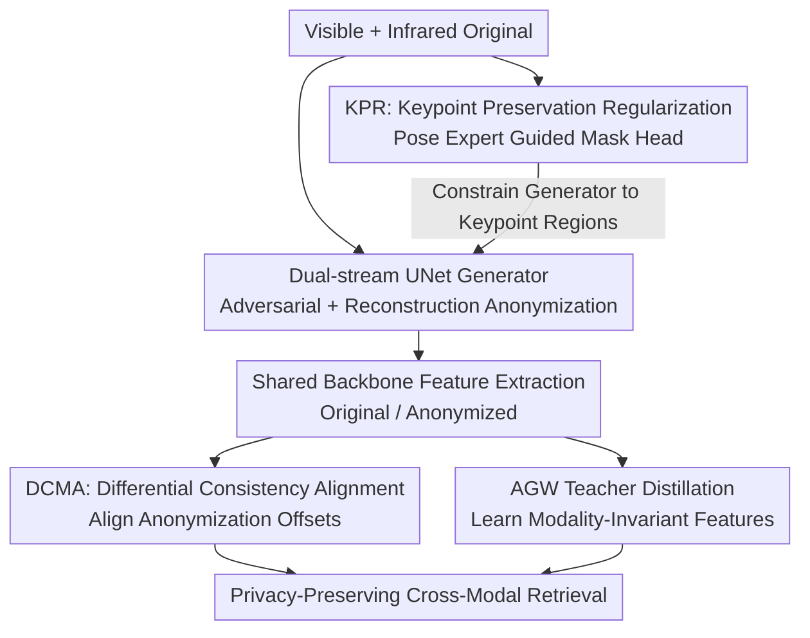

# Towards Cross-Modal Preservation, Consistency and Alignment for Privacy-Preserving Visible-Infrared Person Re-Identification

**Conference**: CVPR 2026  
**Paper**: [CVF Open Access](https://openaccess.thecvf.com/content/CVPR2026/html/Xie_Towards_Cross-Modal_Preservation_Consistency_and_Alignment_for_Privacy-Preserving_Visible-Infrared_Person_CVPR_2026_paper.html)  
**Code**: https://github.com/Dige945/PPA_CVPR26  
**Area**: Human Understanding / Person Re-identification / Privacy Protection  
**Keywords**: Privacy-preserving ReID, Visible-Infrared, Cross-modal Alignment, Keypoint Regularization, Anonymization Offset

## TL;DR
This paper introduces a new task, PP-VI-ReID (Privacy-Preserving Visible-Infrared Person Re-Identification), and proposes a PPA framework to address two major challenges: "anonymization destroying identity information" and "inconsistent anonymization distortion across modalities." The KPR module utilizes human pose priors for structure-aware precise anonymization, while the DCMA module treats anonymization perturbations as learnable stable offsets to align cross-modal features. The method significantly outperforms a modified version of SecureReID on SYSU-MM01 and RegDB, establishing a strong baseline.

## Background & Motivation

**Background**: Person Re-identification (ReID) aims to retrieve the same individual across multiple non-overlapping cameras. However, surveillance images contain sensitive appearance and body shape information, raising serious privacy concerns. Privacy-preserving ReID (PP-ReID) works like SecureReID have pioneered anonymizing images using GANs while training robust models to perform retrieval between "original" and "anonymized" domains. Concurrently, Visible-Infrared ReID (VI-ReID) focuses on 24-hour all-weather cross-modal retrieval, given the prevalence of infrared cameras in low-light scenarios.

**Limitations of Prior Work**: These two research lines have remained separate. VI-ReID focuses solely on retrieval accuracy, neglecting privacy, while PP-ReID frameworks are restricted to single-modal visible light scenarios. Real-world 24-hour surveillance systems require cross-modal capabilities, yet directly applying PP-ReID to VI scenarios leads to failure.

**Key Challenge**: Applying existing anonymization methods to VI scenarios reveals two fundamental issues. First, current anonymization is "one-size-fits-all," indiscriminately masking appearance details and destroying fine-grained structural information (e.g., body contours) essential for identity matching, which causes ReID accuracy to collapse. Second, anonymization effects are **asymmetric** across the two modalities—distorting color and texture in visible images while blurring thermal contours in infrared images. This inconsistency compounds with the existing "modality gap" to form what the authors define as the **Mixed Gap**. Standard shared-space alignment methods assume a stable modality gap to learn invariant representations; they fail when anonymization distorts the feature space asymmetrically.

**Goal**: The objective is split into two sub-problems. I) How to shift from crude anonymization to **precise, structure-aware** anonymization that preserves critical matching features? II) How to bridge the Mixed Gap, specifically performing alignment when asymmetrical anonymization distortion is layered atop the modality gap?

**Key Insight**: The authors make two key observations: (1) Identity information is highly concentrated in human keypoint regions, meaning pose can serve as a prior for "what to preserve and what to blur." (2) Feature displacement caused by anonymization is better modeled as a **predictable, stable offset** rather than random noise.

**Core Idea**: Utilize pose guidance to ensure anonymization is "targeted" rather than "indiscriminate" (KPR), while forcing the "original-to-anonymized feature difference vectors" to be consistent across modalities. This transforms inconsistent distortions into learnable consistent offsets (DCMA), achieving robust alignment under the Mixed Gap.

## Method

### Overall Architecture

The PPA (Precise Privacy-Preserving and Alignment Network) framework integrates two modules onto a standard baseline. The baseline consists of a UNet-based **dual-stream generator** (processing visible and infrared separately to adversarially transform original images into anonymized ones) and a **ReID backbone** (dual shallow feature extractors + ResNet50 shared backbone, configured like AGW). To narrow the modality gap, the backbone performs knowledge distillation from a frozen pre-trained cross-modal teacher (AGW). Building on this: **KPR** employs a frozen pose expert to generate keypoint guidance maps that supervise a learnable mask head, forcing the generator to only target identity-sensitive keypoint regions. **DCMA** minimizes the distance between the "visible original-anonymized difference vector" and the "infrared original-anonymized difference vector" in the feature space, aligning the anonymization displacements of the two modalities. These modules collaborate to produce privacy-preserving yet discriminative cross-modal representations.

### Key Designs

**1. Dual-stream Adversarial Generation + Distillation Baseline**

PP-VI-ReID must bridge both the "original ↔ anonymized" domain gap and the "modality gap." The generator trains a discriminator for each modality. Original images $x^v$ are processed with traditional methods (mosaic/blur/noise) to obtain target anonymized images $\hat{y}^v$. The adversarial loss forces the generator to produce $y^v$ that appears realistic and matches the anonymized style:

$$\mathcal{L}_{adv} = \frac{1}{N}\sum_j \big(\log(1-D^{rgb}_Y(x^v_j, y^v_j)) + \log D^{rgb}_Y(x^v_j, \hat{y}^v_j)\big) + \text{(IR equivalent)}$$

An L1 reconstruction loss $\mathcal{L}_{rec}=\frac{1}{N}\sum_j\|\hat{y}^v_j-y^v_j\|_1$ provides pixel-level constraints. To suppress the modality gap, the backbone distills from a frozen AGW teacher: $\mathcal{L}_{cross}=\sum_j\|f^{tv}_j-f^v_j\|_2^2+\sum_k\|f^{ti}_k-f^i_k\|_2^2$. An alignment loss $\mathcal{L}_{anno}=\frac{1}{B}\sum_j(\|f^v_j-f^{va}_j\|_2^2+\|f^i_j-f^{ia}_j\|_2^2)$ brings original features closer to their anonymized versions.

**2. KPR (Keypoint Preservation Regularization): Targeted Anonymization via Pose Priors**

To address sub-problem I, KPR provides a structural constraint to the generator. Instead of uniform anonymization, it acts as a structural regularizer. A frozen YOLOv8n-pose expert detects keypoints $K=\{k_1,\dots\}$ in original images to construct binary guidance maps. Pixels within radius $R$ of a keypoint are set to 1, otherwise 0:

$$C_{pose}(u,v)=\begin{cases}1 & \text{if } \min_j\sqrt{(u-u_j)^2+(v-v_j)^2}\le R\\ 0 & \text{otherwise}\end{cases}$$

A lightweight mask head $m_\phi$ predicts a soft mask $M_{pred}\in[0,1]^{H\times W}$ from **anonymized images** $Y$. The pose guidance loss $\mathcal{L}_{KPR}=\frac{1}{B}\sum_j(\|M^v_{pred,j}-C^v_{pose,j}\|_2^2+\|M^i_{pred,j}-C^i_{pose,j}\|_2^2)$ forces the mask head to recognize keypoints even in anonymized images, which in turn compels the generator to **preserve structural integrity at keypoints**. Empirical results show the pose model trained on RGB has a 95.46% detection rate on IR, proving thermal contours provide sufficient structural cues.

**3. DCMA (Differential Consistency guided Modal Alignment): Modeling Inconsistent Distortion as Consistent Offsets**

To solve sub-problem II, DCMA aligns the "displacement caused by anonymization" rather than the final features. The core intuition is that anonymization-induced shifts in feature space should be similar across modalities. **Anonymization difference vectors** are defined as: $\Delta f^v=f^v-f^{va}$ and $\Delta f^i=f^i-f^{ia}$. DCMA forces these vectors to be parallel and of equal length:

$$\mathcal{L}_{DCMA}=\frac{1}{B}\sum_j\|\Delta f^v_j-\Delta f^i_j\|_2^2=\frac{1}{B}\sum_j\|(f^v_j-f^{va}_j)-(f^i_j-f^{ia}_j)\|_2^2$$

Why is this effective? The authors use the triangle inequality to bound cross-modal alignment error in anonymized space:

$$\|f^{va}-f^{ia}\|=\|(f^v-f^i)-(\Delta f^v-\Delta f^i)\|\le\|f^v-f^i\|+\|\Delta f^v-\Delta f^i\|$$

Even if original features are perfectly aligned ($f^v\approx f^i$), inconsistent anonymization shifts ($\Delta f^v\ne\Delta f^i$) introduce an irreducible error. DCMA specifically minimizes this $\|\Delta f^v-\Delta f^i\|$ term.

### Loss & Training

The total loss is $\mathcal{L}_{PPA}=\mathcal{L}_b+\delta\mathcal{L}_{KPR}+\eta\mathcal{L}_{DCMA}$, where $\mathcal{L}_b=\mathcal{L}_{gen}+\mathcal{L}_{reid}$. Hyperparameters include $\lambda=100$, $\beta=0.5$, $\gamma=1.0$, $\delta=1.0$, $\eta=0.1$, and $R=5$. Supervised anonymization is initialized using mosaic (r=24), blur (r=12), and Gaussian noise ($\sigma=0.5$). Training spans 120 epochs; each batch contains 8 identities with 4 instances per modality per identity, resized to $256\times128$. SGD optimizer is used with a learning rate warmup to $3.5\times10^{-4}$ followed by decay.

## Key Experimental Results

Evaluated on SYSU-MM01 and RegDB. Metric includes SSIM/PSNR for privacy (SSIM<0.5, PSNR<15 considered thresholds for unrecognizable identity) and Rank-k/mAP/mINP for ReID. Compared against a modified version of SecureReID (adapted with AGW and dual-stream adversarial networks for cross-modal scenarios).

### Main Results (ReID Performance, Mosaic Initialization)

| Dataset / Scenario | Retrieval Setting | Metric | SecureReID | PPA(ours) |
|--------|------|------|----------|------|
| SYSU all-search | Raw→Raw | Rank1 | 35.6 | **60.7** (+25.1) |
| SYSU all-search | Anon→Anon | Rank1 | 32.2 | **46.2** (+14.0) |
| RegDB IR→Visible | Raw→Raw | Rank1 | 45.9 | **80.5** (+34.6) |
| RegDB IR→Visible | Anon→Anon | Rank1 | 28.3 | **39.7** (+11.4) |

PPA outperforms SecureReID in all four retrieval scenarios (Raw→Raw, Raw→Anon, Anon→Raw, Anon→Anon). Even in the challenging Anon→Anon scenario, PPA maintains double-digit improvements.

### Anonymization Quality (SSIM / PSNR, Blur Initialization on SYSU all-search)

| Metric | Modality | SecureReID | PPA(ours) | Change |
|------|------|----------|------|------|
| SSIM | RGB | 0.16 | 0.11 | -0.05 |
| SSIM | IR | 0.33 | 0.25 | -0.08 |
| PSNR | RGB | 9.5 | 8.2 | -1.3 |
| PSNR | IR | 11.5 | 10.5 | -1.0 |

PPA achieves lower SSIM/PSNR, indicating stronger anonymization, while remaining below the 0.5/15 thresholds where identity is unrecognizable to the human eye.

### Ablation Study (SYSU-MM01, Mosaic, Anon→Raw all-search)

| Configuration | Rank1 | mAP | mINP | Description |
|------|---------|------|------|------|
| Baseline | 47.9 | 47.3 | 33.5 | Anonymization causes severe degradation |
| + KPR | 51.6 | 51.3 | 37.6 | Preserves structure, +3.7 |
| + DCMA | 49.9 | 48.9 | 35.0 | Alignment via consistent offsets, +2.0 |
| Full (KPR+DCMA) | **53.3** | 51.9 | 37.9 | Complementary effects, +5.4 |

### Key Findings
- **KPR provides the larger individual contribution (+3.7 vs +2.0)**, particularly in "anonymized query" scenarios, by reclaiming discriminative structural information.
- **The theoretical necessity of DCMA is validated by the triangle inequality**; inconsistent anonymization shifts create an irreducible alignment error which DCMA successfully minimizes.
- **Cross-modal pose detection is viable zero-shot**, with RGB-trained models achieving 95%+ detection on IR, supporting the feasibility of KPR.
- t-SNE visualization confirms that PPA makes "original IR" and "anonymized Visible" positive samples significantly more convergent.

## Highlights & Insights
- **Reframing inconsistent transformation as learnable consistent offsets**: This is the most elegant perspective in the paper—treating anonymization shifts as vectors that should be parallel across modalities, supported by a clean triangle inequality proof.
- **Pose priors as structural regularizers via mask heads**: By forcing a mask head to detect keypoints from already anonymized images, the generator is pressured to preserve bone structures, balancing privacy and utility.
- **Formulating the PP-VI-ReID mission**: Successfully bridges two independent research fields to address the real-world demand for 24-hour privacy-preserving surveillance.

## Limitations & Future Work
- **Limited baseline comparisons**: While it outstrips SecureReID, additional comparisons against diverse single-modal PP-ReID or VI-ReID methods would strengthen the claim.
- **Dependence on pose experts**: KPR's effectiveness is tied to YOLOv8n-pose quality; performance may degrade under heavy occlusion or extremely low-resolution infrared where pose detection fails.
- **DCMA Assumption**: The assumption that anonymization shifts "should be similar" might overlook instances where modal-specific information (like texture in Visible) requires asymmetric anonymization.
- **Static privacy-utility trade-off**: The weight $\delta$ is manually tuned; future work could explore adaptive mechanisms to balance anonymization intensity per region or identity.

## Related Work & Insights
- **vs. SecureReID**: While SecureReID pioneers GAN-based anonymization for ReID, it is limited to single-modal visible light and uses "one-size-fits-all" anonymization. Pival PPA extends this to cross-modal scenarios with structural preservation and consistency alignment.
- **vs. VI-ReID methods (AGW/CAJ)**: Traditional VI-ReID focuses on modality-invariant features under stable conditions. PPA builds on these (using AGW as a teacher) but accounts for the "Mixed Gap" introduced by anonymization.
- **vs. Single-modal Anonymization (PixelFade/PIS)**: These methods often fail in cross-modal settings as they cannot handle the asymmetric feature space distortion identified in this paper.

## Rating
- Novelty: ⭐⭐⭐⭐⭐ 
- Experimental Thoroughness: ⭐⭐⭐⭐ 
- Writing Quality: ⭐⭐⭐⭐ 
- Value: ⭐⭐⭐⭐⭐ 

<!-- RELATED:START -->

## Related Papers

- [\[CVPR 2026\] MFEN: Multi-Frequency Expert Network for Visible-Infrared Person Re-ID](mfen_multi-frequency_expert_network_for_visible-infrared_person_re-id.md)
- [\[CVPR 2026\] Spatial-Frequency Collaborative Learning for Occluded Visible-Infrared Person Re-Identification](spatial-frequency_collaborative_learning_for_occluded_visible-infrared_person_re.md)
- [\[CVPR 2026\] BIT: Matching-based Bi-directional Interaction Transformation Network for Visible-Infrared Person Re-Identification](bit_matching-based_bi-directional_interaction_transformation_network_for_visible.md)
- [\[CVPR 2026\] View-Aware Semantic Alignment for Aerial-Ground Person Re-Identification](view-aware_semantic_alignment_for_aerial-ground_person_re-identification.md)
- [\[CVPR 2026\] Vision-Language Attribute Disentanglement and Reinforcement for Lifelong Person Re-Identification](vision-language_attribute_disentanglement_and_reinforcement_for_lifelong_person_.md)

<!-- RELATED:END -->
