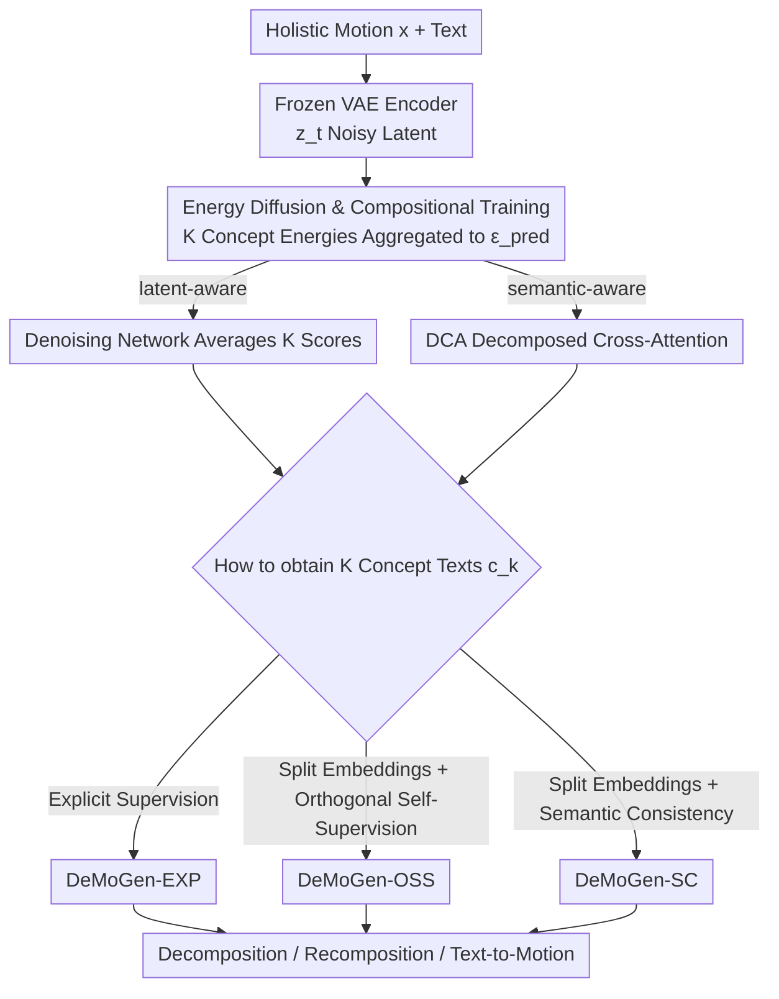

# Towards Decompositional Human Motion Generation with Energy-Based Diffusion Models

**Conference**: CVPR 2026  
**Paper**: [CVF Open Access](https://openaccess.thecvf.com/content/CVPR2026/html/Zhang_Towards_Decompositional_Human_Motion_Generation_with_Energy_Based_Diffusion_Models_CVPR_2026_paper.html)  
**Project Page**: https://jiro-zhang.github.io/DeMoGen/  
**Area**: Human Motion Generation / Diffusion Models  
**Keywords**: Text-to-Motion, Energy Diffusion, Motion Decomposition, Concept Recomposition, Compositional Training

## TL;DR
DeMoGen reverses "text-to-motion" generation: it utilizes energy-based diffusion models to decompose a holistic motion into several semantically interpretable motion concepts (e.g., "walking in a Z-shape" + "waving left hand") without decomposition-level ground truth. These concepts can be freely recombined to generate unseen motions. It achieves improvements across text-to-motion, composition, and multi-concept tasks on HumanML3D and MTT.

## Background & Motivation
**Background**: Text-to-motion has progressed rapidly due to large-scale datasets and diffusion models. Mainstream approaches learn a holistic mapping from a single text to a complete motion (e.g., MDM, MLD, MotionDiffuse, MoMask, SALAD), aiming for alignment, smoothness, and physical plausibility. Another branch focuses on compositional generation, using spatial editing, temporal splicing, or energy aggregation (like EnergyMoGen) to concatenate motion concepts.

**Limitations of Prior Work**: Whether holistic or compositional, existing methods treat motion as a **holistic sequence**, failing to capture the internal structure composed of multiple primitives. Consequently, models struggle to understand "curved walking + raising arms" as two independent, reusable concepts, making it difficult to recombine known concepts into novel, untrained motions.

**Key Challenge**: Humans naturally perform **inverse decomposition**—observing "waving a left hand while walking in a Z-shape" and automatically splitting it into two concepts to perform rare actions via recombination. However, current generative models only perform **forward modeling** (text → motion) and lack the inverse capability to decompose motions. The major obstacle is the **lack of concept-level ground truth** for motion decomposition; one cannot directly supervise which segment corresponds to "walking" versus "waving."

**Goal**: To equip generative models with human-like decompositional understanding—automatically discovering motion concepts behind holistic motions with only holistic ground truth, while supporting flexible recombination.

**Key Insight**: The authors leverage the intrinsic link between the denoising network $\epsilon_\theta(z,t)$ of a diffusion model and Energy-Based Models (EBM). The denoising network can be interpreted as a score function $\nabla_z \log p(z)$, which corresponds to an energy function $\epsilon_\theta(z,t)\propto\nabla_z E_\theta(z)$, where $p(z)\sim e^{-E(z)}$. Since a single energy function represents a distribution, a holistic motion can be represented by a **set of energy functions**, each responsible for a distinct motion concept.

**Core Idea**: Use energy diffusion to directly model the **compositional energy distribution** of multiple motion concepts, rather than learning a one-to-one mapping from single text to single motion. This energy aggregation naturally enforces concept-level factorization, allowing the model to learn motion decomposition without decomposed ground truth.

## Method

### Overall Architecture
DeMoGen is a **compositional training paradigm**. The backbone is a skeleton-aware latent diffusion model (following the VAE from SALAD). Given a motion $x\in\mathbb{R}^{L\times d_m}$ ($L$ frames, $d_m$ dimensions), a frozen motion encoder $E$ encodes it into a latent representation $z$, which can be decoded back to motion space via $D$.

The key mechanism is: at noise step $t$, the noisy latent $z_t$ is associated with a set of text embeddings $C=\{c_k\}_{k=1}^{K}$ rather than just one, where each $c_k$ corresponds to a target motion concept (the paper sets $K=2$). The model **aggregates** the energy (denoising scores) of these $K$ concepts into a predicted noise $\epsilon_{\text{pred}}$, then uses the standard MSE denoising objective for training. Since the loss only supervises the holistic motion (only one ground truth $\epsilon$), and the prediction is an average of $K$ concept energies, the model is forced to "distribute" the holistic reconstruction across the $K$ concept energies. This is how it learns decomposition **without decomposed ground truth**.

Energy aggregation has two implementations: **latent-aware** uses the denoising network itself to run $\epsilon_\theta(z_t,c_k,t)$ for $K$ concepts and averages them; **semantic-aware** treats cross-attention as the energy function, proposing Decompositional Cross-Attention (DCA) to split attention into $K$ parallel branches for aggregation. Once trained, concepts can be extracted and manipulated for decomposition and recombination. Three variants (EXP / OSS / SC) define the source and learning method for the concept group $\{c_k\}$.

### Key Designs

**1. Compositional Training of Energy Diffusion: Reconstructing Holistic Motion with Energy Functions**

This design directly addresses the core pain point: decomposition cannot be supervised without decomposed ground truth. Instead of creating manual labels, the authors exploit the fact that denoising networks are equivalent to energy gradients, writing the holistic denoising score as the average of $K$ concept scores. The latent-aware objective is:

$$L_{\text{MSE}}=\Big\|\epsilon-\frac{1}{K}\sum_{k=1}^{K}\epsilon_\theta(z_t,c_k,t)\Big\|^2,$$

where the average of $K$ concept-conditioned denoising results approximates the same noise $\epsilon$. Since the supervision signal is only the holistic $\epsilon$, the optimization forcedly factorizes the holistic semantics into individual concept energies. This is an implicit emergence driven by the compositional reconstruction objective. This differs from EnergyMoGen's forward composition; DeMoGen enforces the decomposition structure during training, enabling direct concept extraction during inference.

**2. Decompositional Cross-Attention (DCA): Aggregating Energy via Concept-Specific Attention Branches**

While latent-aware averaging happens at the network output, the semantic-aware path places "energy" within the cross-attention layers. Standard cross-attention mixes all text tokens, failing to map them to independent concepts. DCA splits the attention calculation into $K$ parallel branches, each performing standard cross-attention with different Key-Value pairs (corresponding to different concept texts), and then averages them:

$$\text{DCA}(z_t,C)=\frac{1}{K}\sum_{k=1}^{K}\text{CA}(z_t,c_k),$$

optimized via $L_{\text{MSE}}=\|\epsilon-\epsilon_\theta(z_t,C,t)\|^2$. Energy aggregation occurs at the semantic level (association between text and motion). Experimentally, semantic-aware models often show higher text-motion consistency (R-Precision), while latent-aware models produce smoother motions (lower FID) due to latent space aggregation.

**3. Three Supervision Variants (EXP / OSS / SC): From Explicit Text to Self-Supervision**

These variants define the source of the concept texts $\{c_k\}$, spanning a spectrum of supervision levels.

- **DeMoGen-EXP (Explicit Supervision)**: Uses pre-decomposed texts $C=C^P$ from DeCompML. It has the clearest semantic boundaries and the strongest compositionality. To prevent the text-motion mapping from becoming biased, a **text mixing strategy** is used: $\tau\times100\%$ ($\tau=0.7$) of samples in a batch are trained with the original holistic text. During standard text-to-motion inference, the single text is simply duplicated as the decomposition conditions.
- **DeMoGen-OSS (Orthogonal Self-Supervision)**: Does not rely on pre-defined decomposed text. The original text embedding $c\in\mathbb{R}^{L_c\times d_c}$ is sliced into $K$ segments along the dimension axis, passed through an FC layer to obtain $C$, and subjected to an orthogonalization loss to ensure decoupling:

$$L_{\text{Ortho}}=\mathbb{E}_{l\sim L_c}\Big[\tfrac{1}{K^2}\big\|\hat Z_l\hat Z_l^{\top}-I_K\big\|_F^2\Big],$$

with the total objective $L=L_{\text{MSE}}+\alpha_o L_{\text{Ortho}}$. This enables "unguided" concept discovery and improves holistic motion diversity.
- **DeMoGen-SC (Semantic Consistency Supervision)**: Similar slicing as OSS, but uses a two-layer transformer for $C$ and aligns the sliced embeddings to DeCompML's decomposed embeddings using $L_{\text{SC}}=L_1^{\text{smooth}}(C^P,C)$. Total objective $L=L_{\text{MSE}}+\alpha_{sc}L_{\text{SC}}+\alpha_o L_{\text{Ortho}}$. No pre-defined decomposed text is needed during inference.

**4. DeCompML Dataset: Providing Decomposed Texts for Holistic Descriptions**

EXP and SC require "decomposed texts." Since HumanML3D only provides holistic descriptions, the authors used GPT-4 with specific prompts to split each description into two sentences describing different concepts (e.g., "someone runs forward, turns around, and then walks backward" becomes "someone runs forward and turns around" and "someone walks backward"). DeCompML contains 87,384 decomposed text pairs. It provides supervision for training and a new benchmark for motion composition.

### Loss & Training
The shared denoising objective is $L_{\text{MSE}}$. OSS adds $L_{\text{Ortho}}$, and SC adds $L_{\text{SC}}+L_{\text{Ortho}}$. VAE weights are frozen from SALAD; AdamW optimizer, batch size 64, 500 epochs; learning rate 2e-4, decaying to 2e-5 after 50K iterations; $K=2$; text mixing $\tau=0.7$, $\alpha_{sc}=1.0$, $\alpha_o$ is 2.0/1.0 for latent/semantic. Word-level tokens are used with $L_c=77$. Models pre-trained on HumanML3D are transferred to MTT and DeCompML for evaluation.

## Key Experimental Results

### Main Results
HumanML3D Text-to-Motion (Selection):

| Method | R-Prec Top-1 ↑ | R-Prec Top-3 ↑ | FID ↓ | MM-Dist ↓ |
|------|------|------|------|------|
| Real motion | 0.511 | 0.797 | 0.002 | 2.974 |
| EnergyMoGen | 0.523 | 0.815 | 0.188 | 2.915 |
| SALAD | 0.581 | 0.857 | 0.076 | 2.649 |
| DeMoGen-OSS (latent) | **0.588** | **0.861** | 0.092 | **2.625** |
| DeMoGen-EXP (semantic) | 0.586 | 0.863 | 0.116 | 2.623 |

DeMoGen-OSS out-performs SALAD in text-motion consistency while maintaining comparable FID, indicating that reinforced decompositional understanding benefits standard text-to-motion generation.

MTT Multi-concept / Compositional Generation (latent-aware, † denotes specific task variants):

| Method | R@1 ↑ | R@3 ↑ | TMR-M2T ↑ | FID ↓ |
|------|------|------|------|------|
| EMG | 12.7 | 25.4 | 0.570 | 0.592 |
| EMG+AGD | 14.0 | 26.3 | 0.570 | 0.587 |
| DeMoGen-OSS† (Multi-concept) | 14.9 | 29.5 | 0.584 | 0.580 |
| EMG+SEF (Composition) | 15.9 | 28.0 | 0.591 | 0.604 |
| DeMoGen-EXP† (Composition) | **16.2** | **31.9** | **0.597** | 0.621 |

Both OSS/SC for multi-concept and EXP for composition tasks outperform EnergyMoGen (EMG) configurations, with significant gains in R@3.

### Ablation Study
Evaluation of motion composition on DeCompML and data augmentation for text-to-motion:

| Configuration | Top-1 ↑ | FID ↓ | Description |
|------|---------|------|------|
| EnergyMoGen (Comp) | 0.326 | 2.502 | Baseline on DeCompML |
| SALAD (Comp) | 0.342 | 1.267 | SALAD with EMG strategy |
| DeMoGen latent | 0.559 | 0.089 | Ours, significantly better quality |
| DeMoGen semantic | 0.567 | 0.102 | Ours |
| SALAD | 0.581 | 0.076 | Original HumanML3D |
| SALAD* +DeCompML | 0.580 | **0.060** | Fine-tuned, FID reduced by ~21% |

### Key Findings
- For motion composition on DeCompML, DeMoGen's FID (0.089/0.102) is an order of magnitude lower than EnergyMoGen (2.502) and compositional SALAD (1.267). This suggests that enforcing decomposition during training is far more effective than temporary aggregation of pre-trained models.
- Using decomposed motions generated by DeMoGen as augmentation to fine-tune SALAD reduces FID by 21% without sacrificing other metrics, proving these pairs are effective data augmentations.
- For simple motions in HumanML3D, OSS and SC generate different concept variants (e.g., different radius/displacement for a circle), improving diversity.

## Highlights & Insights
- **Reverse Problem for Representation Learning**: While most work focuses on "text → motion," DeMoGen addresses "how to split motion back into concepts," proving that this inverse capability enhances forward generation.
- **Decomposition without Ground Truth**: The compositional reconstruction objective forces concept factorization implicitly, bypassing the need for difficult-to-obtain segment-level labels.
- **Unified Paradigm**: A single model supports text-to-motion, multi-concept, composition, and decomposition/recomposition. It is plug-and-play with mainstream diffusion backbones like MLD or MotionDiffuse.
- **Supervision Spectrum**: The EXP/OSS/SC variants provide a clear hierarchy from full to self-supervision, allowing users to choose variants based on data availability.

## Limitations & Future Work
- **Small $K=2$**: The implementation fixes the decomposition into two concepts, which may be insufficient for complex motions with multiple primitives (e.g., "walk + turn + squat + wave").
- **LLM Dependency**: DeCompML depends on GPT-4's automatic splitting, which may introduce semantic boundary errors and is currently limited to the daily motion domain of HumanML3D.
- **"Nameless" Concepts in OSS/SC**: Concepts discovered without guidance lack explicit naming, making them less convenient for downstream precise editing without manual labeling.
- **Proxy Metrics**: Evaluation still relies on pre-trained models (R-Precision/FID). There is a lack of direct quantitative metrics for decomposition accuracy.

## Related Work & Insights
- **vs EnergyMoGen**: Both interpret denoising and attention as energy models. EnergyMoGen focuses on **forward composition** during inference. DeMoGen enforces the structure during **training**, emphasizing inverse decomposition and achieving significantly better composition quality.
- **vs Holistic Diffusion (SALAD/MLD)**: These learn holistic mappings. DeMoGen replaces the holistic condition with a set of concept energies, retaining performance while gaining decomposition and composition capabilities.
- **vs Image Domain Decomposition**: Similar energy-driven concepts have been explored in images for visual concept discovery. DeMoGen adapts these "energy-driven factorization" ideas to spatio-temporally coupled human motions.

## Rating
- Novelty: ⭐⭐⭐⭐⭐ Innovative perspective of reversing motion generation to decomposition using energy-based compositional reconstruction.
- Experimental Thoroughness: ⭐⭐⭐⭐ Covers various tasks and variants, though extensive system ablations on $K$ and hyperparameters are largely in the supplementary material.
- Writing Quality: ⭐⭐⭐⭐ Clear explanation of the Diffusion-EBM bridge and variant hierarchy.
- Value: ⭐⭐⭐⭐ A versatile paradigm for four tasks with a useful accompanying dataset for the motion generation community.

<!-- RELATED:START -->

## Related Papers

- [\[CVPR 2026\] Causal Motion Diffusion Models for Autoregressive Motion Generation](causal_motion_diffusion_models_for_autoregressive_motion_generation.md)
- [\[CVPR 2026\] Interact2Ar: Full-Body Human-Human Interaction Generation via Autoregressive Diffusion Models](interact2ar_full-body_human-human_interaction_generation_via_autoregressive_diff.md)
- [\[CVPR 2026\] FloodDiffusion: Tailored Diffusion Forcing for Streaming Motion Generation](flooddiffusion_tailored_diffusion_forcing_for_streaming_motion_generation.md)
- [\[CVPR 2026\] Towards Highly-Constrained Human Motion Generation with Retrieval-Guided Diffusion Noise Optimization](towards_highly-constrained_human_motion_generation_with_retrieval-guided_diffusi.md)
- [\[CVPR 2026\] Next-Scale Autoregressive Models for Text-to-Motion Generation](next-scale_autoregressive_models_for_text-to-motion_generation.md)

<!-- RELATED:END -->
