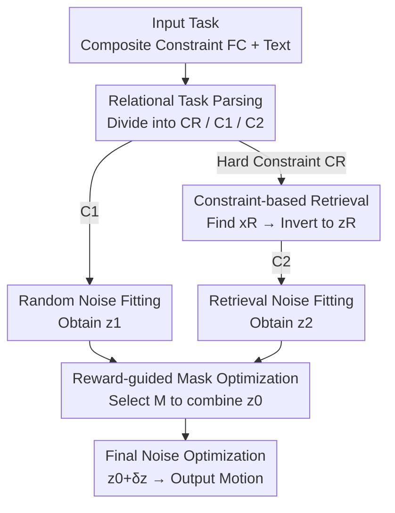

# Towards Highly-Constrained Human Motion Generation with Retrieval-Guided Diffusion Noise Optimization

**Conference**: CVPR 2026  
**Paper**: [CVF Open Access](https://openaccess.thecvf.com/content/CVPR2026/html/Liu_Towards_Highly-Constrained_Human_Motion_Generation_with_Retrieval_Guided_Diffusion_Noise_Optimization_CVPR_2026_paper.html)  
**Code**: Project Page https://hanchaoliu.github.io/RetrievalGuidedDNO/  
**Area**: Human Motion Generation / Diffusion Models  
**Keywords**: Human motion generation, diffusion noise optimization, retrieval-augmented, constrained generation, training-free

## TL;DR
Addressing extremely difficult spatial-temporal/numerical constraints (e.g., "passing through a 0.4m narrow gap," "walking 4 meters in exactly 6 steps"), this paper introduces a retrieval channel into the training-free Diffusion Noise Optimization (DNO) framework. It first parses the most difficult constraints via relational task analysis, retrieves reference motions from a dataset to invert them into reference noise, and finally blends random and retrieved noise using a reward-guided mask as a superior initialization. This significantly reduces constraint errors compared to vanilla DNO.

## Background & Motivation
**Background**: Making human motion generation adhere to custom zero-shot goal functions is a core capability for controllable character animation and virtual agent behavior synthesis. Current mainstream approaches utilize "constraint functions + training-free diffusion noise optimization": ProgMoGen proposes a programmable framework to express arbitrary tasks as differentiable composite constraint functions $F_C$, while DNO adds gradient normalization and learning rate decay to noise optimization. Both freeze a pre-trained motion diffusion model $G$ and perform gradient descent only on the noise $z$ to solve $\min_z F(G(z, C))$, thereby handling various unseen spatial/temporal constraints.

**Limitations of Prior Work**: The authors observe that once constraints become **extremely difficult**, these methods fail. For instance, requiring a character to walk a precise number of steps over a specific distance or sidle through a 0.4m narrow gap—vanilla DNO produces motions with either massive constraint errors or physical artifacts like scene penetration and foot skating (Fig. 1). Such "highly-constrained" tasks share two traits: (1) demanding spatial-temporal constraints (e.g., harsh obstacles) and (2) behavior constraints based on numerical control (e.g., specified step counts). Real-world environments are full of such rigid requirements, yet few prior works have addressed them specifically.

**Key Challenge**: Random noise can only capture general constraints and text semantics; **it does not inherently carry specific skill knowledge** such as "how to walk sideways" or "how to control step counts." Hard constraints require specific priors beyond the expressive capacity of random noise, and simply increasing optimization steps on random noise cannot bridge this gap.

**Goal**: To inject the "missing skill priors" into the **starting point** of optimization—the initial noise of the diffusion process—without retraining the generator.

**Key Insight**: The authors hold a critical insight: **early diffusion noise determines the quality of generation**, and the choice of initial noise has a decisive impact on the structure of the final motion. Since random noise cannot satisfy hard constraints, an existing large-scale motion dataset can serve as a knowledge base to retrieve a reference motion (e.g., sidestepping, walking with specific steps) that "potentially satisfies the hard constraints" and guide the initial random noise toward this reference noise.

**Core Idea**: Use "noise inverted from a retrieved reference motion" to replace/blend the random noise initialization, ensuring that the motion skills required for hard constraints are injected at the very beginning of optimization, thereby solving highly-constrained tasks that DNO alone cannot handle.

## Method

### Overall Architecture
Given a generation task described by a composite constraint function $F_C$ (defined on constraint set $C$, obtainable via ProgMoGen's motion programming), the goal is to produce a motion sequence $x \in \mathbb{R}^{T \times d}$ by solving $\min_z \sum_i F_{C_i}(G(z, C_0))$, where $G$ is a frozen pre-trained generator and $C_0$ is an optional text condition. The RG-DNO pipeline follows four steps: **parsing, retrieval, noise blending, and final refinement**.

1.  **Relational Task Parsing**: Splits the full constraint set $C$ into three groups—hard constraints $C_R$ for retrieval, $C_1$ for random noise fitting, and $C_2$ for retrieval noise fitting;
2.  **Constraint-based Retrieval**: Searches the motion dataset $D$ for a reference motion $x_R$ that minimizes the error of $C_R$ and inverts it into reference noise $z_R$;
3.  **Masked Noise Optimization**: Optimizes $z_1$ and $z_2$ starting from random noise and $z_R$ respectively, then uses a binary mask $M$ to linearly combine them into an improved initialization $z_0$;
4.  **Final Noise Optimization**: Starts from $z_0$ to run a standard DNO round to obtain the final motion.

Notably, the first step of relational parsing can be manually specified for precise control or delegated to a Large Language Model (DeepSeek R1) to automatically reason "what to retrieve," enhancing agent autonomy within a training-free framework.

### Key Designs

**1. Relational Task Parsing: Divide and Conquer to Identify "Hard Constraints for Retrieval"**

Retrieving for the entire task at once yields poor results—it is rare for a single dataset sample to satisfy all constraints, and forced retrieval can skew even simple constraints. This paper first answers "which constraints should be retrieved and which should be left for noise optimization." Formally, it identifies a retrieval set $C_R$ and splits the remaining constraints into $C_1$ and $C_2$, such that $C = C_1 \oplus C_2, C_R \subseteq C_2$. The intuition is: hard constraints are handled by retrieval, while $C_1$ and $C_2$ each aim to generate "visually plausible" motions to facilitate later merging.

The authors propose four reasoning rules: Rule 1, $C_1$ and $C_2$ encourage satisfying their respective constraints to reduce merging difficulty; Rule 2, identified hard constraints $c_D$ and their closely related constraints are put into $C_R$; Rule 3, constraints conflicting with $C_R$ are removed from $C_2$; Rule 4, if retrieval confidence is low, hard constraints can stay in $C_1$ for random noise processing. This is implemented via a greedy algorithm (Algorithm 1). This step advances ProgMoGen's constraint programming toward "studying relationships between constraints."

**2. Constraint-based Retrieval: Inverting "Reference Motions" into Guidable Diffusion Noise**

After identifying $C_R$, a motion satisfying it must be found in dataset $D$. This is formalized as a retrieval problem: find $x = \arg\min_{x \in D} F_{C_R}(x)$. Since raw samples might not be correctly positioned, the authors allow rigid transformation on the horizontal plane: $x, H = \arg\min_{x, H} F_{C_R}(Hx)$, where $H$ is the horizontal transform. Retrieval also includes two filters: **semantic consistency checks** and **temporal resampling**. 

The crucial step is **inverting the reference motion back to diffusion noise**: $z_R = G^{-1}(Hx_R, C_0)$. Thus, $z_R$ is no longer a fixed motion but a "noise guidance signal carrying required skills," which can be seamlessly integrated into subsequent optimization—differentiating this work from standard retrieval-augmented generation.

**3. Masked Noise Optimization: Blending Random and Retrieval Noise by "Taking the Best of Both"**

With $z_R$, it must be fused with random noise. Starting from random noise $z_0 \sim \mathcal{N}(0, I)$, $z_1$ is optimized for $C_1$: $\min_{z_1} F_{C_1}(G(z_1, z_0))$; starting from $z_R$, $z_2$ is optimized for $C_2$: $\min_{z_2} F_{C_2}(G(z_2, z_R))$. They are combined via a mask $M \in \mathbb{R}^{T \times d}$:

$$z_0 = M z_1 + (1 - M) z_2$$

The combined $z_0$ serves as the initialization for the final DNO round: $\min_{\delta z} F_C(G(z_0 + \delta z))$. This "segmented splicing + refinement" prevents local unnaturalness from using retrieval noise alone while retaining the global coordination of random noise.

**4. Reward-guided Mask Selection: Using Heuristics and Motion Rewards to Avoid Artifacts**

Optimizing $M$ in continuous space is difficult. Instead, the authors use heuristic mask selection from a set of **downsampled binary candidates** $\mathcal{M}$. Temporal masks divide the sequence into $N_T$ segments, while spatial masks divide pose features into $N_S$ parts (root, limbs, head, spine). The optimal mask is chosen by $M = \arg\min_{M \in \mathcal{M}} F_C(G(z_0)) + R(G(z_0))$.

The reward function $R$ filters combinations that cause severe inconsistencies:
$$R(G(z_0), z_0) = \lambda_1 L_\text{jitter} + \lambda_2 L_\text{foot skate} + \lambda_3 L_\text{decorr} + \lambda_4 L_\text{semantic}$$
This "coarse selection of discrete masks followed by final refinement" is key to maintaining solvability in a large combinatorial space.

### Loss & Training
The entire process is **training-free**, only optimizing noise. The base model is MDM-RoHM trained on HumanML3D (284-dim RoHM representation, excluding body traits), with 50 DDIM steps. Learning rates: $lr=0.05$ for $N_1=100$ steps in the first stage, and $lr=0.02$ for $N_2=400$ steps in the final stage. Numerical constraints are implemented via differentiable counting functions.

## Key Experimental Results

### Main Results
Three high-constraint tasks: Task-1 (0.4m gap), Task-2 (0.5m low barrier), Task-3 (4m distance in exactly 6 steps with hand-raising). 

| Task | Metric (↓ unless noted) | Unconstrained MDM | ProgMoGen+DNO | Ours |
|--------|------|------|------|------|
| Task-1 Gap | C.Err | 14.101 | 0.0162 | **0.0050** |
| Task-1 Gap | Max SP. | 0.506 | 0.073 | **0.027** |
| Task-2 Barrier | C.Err | 11.755 | 0.000115 | **0.000049** |
| Task-2 Barrier | Max Acc. | 0.098 | 0.261 | **0.194** |

| Task | Method | C.Err↓ | Succ.↑ | Sem. Succ.↑ |
|------|------|------|------|------|
| Task-3 Steps | ProgMoGen+DNO | 0.282 | 0.469 | 0.375 |
| Task-3 Steps | Ours | **0.0003** | **0.594** | **0.438** |

Constraint errors are generally reduced by more than an order of magnitude compared to ProgMoGen+DNO, while jitter (Max Acc.) is significantly lowered.

### Ablation Study (Task-2)

| Config | C.Err↓ | Local FS↓ | Max Acc.↓ |
|------|------|------|------|
| Random noise only (z1) | 0.000115 | 0.096 | 0.261 |
| Retrieval noise only (z2) | 0.000014 | 0.180 | 0.109 |
| w/o Task Parsing CR | 0.000132 | 0.065 | 0.289 |
| w/o Mask Opt M | 0.000020 | 0.306 | 0.123 |
| Ours (full) | 0.000049 | 0.134 | 0.194 |

### Key Findings
- **Neither random nor retrieval noise alone suffices**: Random noise fails hard constraints and jitters; retrieval noise alone has the lowest constraint error but reconstructs poor local quality (highest foot skate). Fusion is essential.
- **Masking M is the quality bottleneck**: Removing it (using simple $M=0.5$ linear blending) causes Local FS to spike to 0.306 (worst in table), indicating that fusion must be adaptive.
- **Reward functions are vital for text alignment**: In Task-3, removing the semantic term sharply drops the semantic success rate.
- **Difficulty Threshold**: DNO collapses when barriers are lower than 0.5m or step counts deviate significantly from natural ranges, whereas Ours maintains high success rates.

## Highlights & Insights
- **"Retrieval -> Inversion to Noise"**: Converting retrieval results into $z_R$ as initialization leverages dataset skills (sidestepping/bracing) while allowing continued differentiable refinement, avoiding the discontinuity of direct motion splicing.
- **LLM as a "Task Parser"**: Using DeepSeek R1 to reason "which constraint is hardest" grants the agent autonomy in a training-free framework without relying on the LLM to generate the motion itself.
- **Discrete Mask Candidates + Parallel Scoring**: Approximating a large continuous search space with binary candidates evaluated in parallel is a practical trade-off for solvability.

## Limitations & Future Work
- **Efficiency Overhead**: Multiple optimization stages make it slower than DNO (approx. 300 additional steps).
- **Reduced Diversity**: Stricter constraints narrow the solution space; while the blended noise helps, diversity remains lower than in weak-constraint settings.
- **Data Dependency**: If the task requires a skill entirely absent from the dataset (e.g., HumanML3D), the retrieval channel fails.

## Related Work & Insights
- **vs. ProgMoGen**: Extends it with relational parsing and retrieval-guided initialization to fix its collapse on hard constraints; C.Err drops by an order of magnitude.
- **vs. DNO**: Adopts its optimization tactics but generalizes it from "editing available motions" to "constrained generation starting from retrieved noise."
- **vs. Retrieval-Augmented Generation (RMD, etc.)**: While prior works use retrieval for general performance, this work specifically uses it to provide "potential motion skills" for hard constraints via noise initialization.

## Rating
- Novelty: ⭐⭐⭐⭐ 
- Experimental Thoroughness: ⭐⭐⭐⭐ 
- Writing Quality: ⭐⭐⭐⭐ 
- Value: ⭐⭐⭐⭐ 

<!-- RELATED:START -->

## Related Papers

- [\[CVPR 2026\] Towards Decompositional Human Motion Generation with Energy-Based Diffusion Models](towards_decompositional_human_motion_generation_with_energy-based_diffusion_mode.md)
- [\[CVPR 2026\] Causal Motion Diffusion Models for Autoregressive Motion Generation](causal_motion_diffusion_models_for_autoregressive_motion_generation.md)
- [\[CVPR 2026\] FloodDiffusion: Tailored Diffusion Forcing for Streaming Motion Generation](flooddiffusion_tailored_diffusion_forcing_for_streaming_motion_generation.md)
- [\[CVPR 2026\] LaMoGen: Language to Motion Generation Through LLM-Guided Symbolic Inference](lamogen_language_to_motion_generation_through_llm-guided_symbolic_inference.md)
- [\[CVPR 2026\] FrankenMotion: Part-level Human Motion Generation and Composition](frankenmotion_part-level_human_motion_generation_and_composition.md)

<!-- RELATED:END -->
