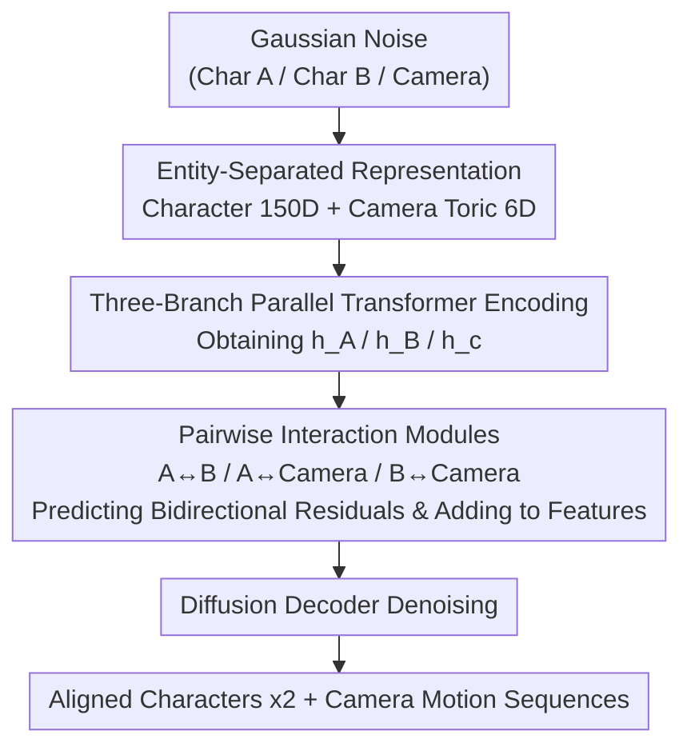

# Towards Storytelling Animations: Joint Synthesis of Human and Camera Motions

**Conference**: CVPR 2026  
**Paper**: [CVF Open Access](https://openaccess.thecvf.com/content/CVPR2026/html/Cheng_Towards_Storytelling_Animations_Joint_Synthesis_of_Human_and_Camera_Motions_CVPR_2026_paper.html)  
**Code**: None  
**Area**: Human Understanding / Motion Generation  
**Keywords**: Character Motion Generation, Virtual Cinematography, Joint Diffusion Model, Interaction Modeling, Toric Space  

## TL;DR
This paper proposes the first framework to jointly generate "3D motions of two interacting characters" and "camera motion" in a unified diffusion model. Applying a three-branch parallel backbone and three pairwise interaction modules, the framework explicitly models character-character and character-camera mutual influences. A combined dataset of 7,228 character-camera sequences, comprising real movie clips and synthetic data, is constructed. The proposed approach outperforms specialized methods across all three dimensions: character motion, camera motion, and their coordination.

## Background & Motivation
**Background**: To tell a compelling story, 3D animation requires high-fidelity character movements aligned with the script as well as carefully designed camera cinematography. Techniques such as dolly, pan, tilt, and zoom determine the scale of characters on screen, composition, and audience attention (e.g., a "push in" shot to elevate tension). Recent years have witnessed significant progress in character motion synthesis (single-person, text-driven, two-person interaction) and virtual cinematography (generating camera trajectories from given 3D human motions) in isolation.

**Limitations of Prior Work**: Existing methods address either "character motion generation" *or* "camera motion generation." None can handle both simultaneously in a single framework. Even with approaches that infer camera trajectories from existing character motions (e.g., AutoVisNarr, DanceCamera3D), the camera is attached "post-hoc" to fixed human motion, meaning the two do not exist in an equal, bidirectional coupled relationship.

**Key Challenge**: The essence of narrative storytelling lies in the *strong correlation and bidirectional coordination* between characters and the camera—how characters move dictates how the camera should shoot, and how the camera shoots, in turn, constrains how characters should be presented. Treating these two tasks independently or running them in a serial pipeline inevitably loses this coupling, resulting in generated shots that are either compositionally broken or rigidly static.

**Goal**: To model the "motions of two characters + camera motion" as a *joint distribution*, directly sampling mutually aligned and harmonious character-camera motion pairs.

**Key Insight**: The authors treat each character and the camera as an *independent and equally important* entity in the 3D scene. They explicitly learn two types of pairwise interactions, "character-character" and "character-camera", during the generation process, rather than implicitly tangling them inside a single large sequence using self-attention.

**Core Idea**: Utilizing a diffusion model with a "three-entity parallel backbone + pairwise interaction residuals" to jointly denoise characters and the camera as equal entities, allowing the mutual influences between any two entities to be explicitly injected into features as residuals.

## Method

### Overall Architecture
The input to the proposed method is a segment of pure Gaussian noise, and the output is three aligned motion sequences: the 6-second (120 frames @ 20fps) motion of Character A, Character B, and the camera. The overall framework extends MDM (Motion Diffusion Model) into a "three-instance motion space". The denoising network consists of three **parallel motion generation backbones** (one for Character A, one for Character B, and one for the camera). Each branch first uses its respective Transformer encoder to encode the noisy motion tokens into high-level features $h_t^A, h_t^B, h_t^c$. Three **pairwise interaction modules** then model the relationships of A↔B, A↔Camera, and B↔Camera, predicting residual corrections to add back to each feature. Finally, the refined features are sent to a diffusion decoder to predict the denoised motion sequences $(\hat{x}_0^{A}, \hat{x}_0^{B}, \hat{x}_0^{c})$. The entire training is **unconditional**—the model directly samples multi-entity motions from the data distribution without requiring paired text/input conditions.

### Key Designs

**1. Denoising Architecture with Entity Separation & Pairwise Interaction: Treating Characters and Camera as Equal Entities Rather Than a Joint Mass**

This represents the core design of the work, directly targeting the tension between "decoupling leading to lost coordination" and "monolithic modeling leading to feature entanglement." Instead of concatenating the three entities into a single long sequence for a unified encoder (w/o Separation in the ablation study), the authors use independent backbones and encoders for each entity to maintain "entity independence", and then employ three interaction modules to explicitly pass information between entities. Each interaction module takes a pair of features and outputs **bidirectional residuals**: the character-character module predicts $\Delta h_t^{B\to A}$ and $\Delta h_t^{A\to B}$ from $(h_t^A, h_t^B)$, encoding mutual dependence and spatial constraints between the two individuals; the two character-camera modules respectively output residuals in two directions: "character affecting camera" and "camera affecting character". Finally, the state of each entity is updated by summing the corresponding residuals:

$$\hat{h}_t^A = h_t^A + \Delta h_t^{B\to A} + \Delta h_t^{c\to A}$$
$$\hat{h}_t^B = h_t^B + \Delta h_t^{A\to B} + \Delta h_t^{c\to B}$$
$$\hat{h}_t^c = h_t^c + \Delta h_t^{A\to c} + \Delta h_t^{B\to c}$$

Why this is effective: the residual formulation preserves the strong priors learned by each entity's backbone (e.g., the realism of single-person motion from pre-training on HumanML3D), while allowing "how characters move" and "how the camera shoots" to mutually correct each other through explicit channels. The camera can perceive that the two people are interacting and adjust the composition, while the character representation is also reshaped by the camera's perspective. The ablation study shows that removing the interaction (w/o Interaction) degrades coordination, while mixing the entities into a single sequence (w/o Separation) leads to complete collapse, proving that "separation and interaction" are both indispensable.

**2. Two-Person Aligned Representation for Character Motion: Embedding Global Positioning into Screen-Space Poses**

The pose of a single character in each frame is represented by the relative rotation of 22 SMPL joints (excluding hands) + global root translation. The rotation uses a continuous 6D representation to ensure numerical stability, and the root translation is padded with zeros to be 6D, resulting in a 138-dimensional vector (23×6). The main challenge lies in the two-person interaction: both sequences are originally defined in their own local coordinate systems (first frame's root at the origin). If placed directly into a shared 3D space, they would collide. The authors compute an offset vector $D \in \mathbb{R}^9$ for each character, where the first 6 dimensions represent the orientation (determined by the line connecting the two shoulders on the xz-plane relative to the x-axis for the initial orientation) and the last 3 dimensions represent the initial frame's global position. Although $D$ is computed only once from the first frame, it is **appended to every frame's** pose, and zero-padded to 12 dimensions (corresponding to two virtual joints). Consequently, each frame becomes a 25×6 matrix flattened into a 150D vector. The entire two-person motion is represented as $(x^{1:N}_A, x^{1:N}_B)$, where each frame simultaneously carries local motion features and global positioning. Explicitly encoding the positioning information into each frame is the prerequisite for the camera to correctly target the head positions of both subjects.

**3. Camera Representation in Toric Space: Naturally Anchoring Camera Parameters to Characters**

Instead of raw 3D extrinsic parameters, the camera pose is represented using Toric space coordinates, consisting of 4 parameters: the normalized screen coordinates of the two main characters' heads $p_A=(p_{Ax}, p_{Ay})$, $p_B=(p_{Bx}, p_{By})$, and the yaw angle $\theta$ and pitch angle $\phi$ of the camera relative to these two reference points. The $N$-frame camera features are written as:

$$x^{1:N}_c = \{p^i_A, p^i_B, \theta^i, \phi^i\}_{i=1}^{N} \in \mathbb{R}^{6N}$$

The benefit of this representation lies in the fact that Toric space itself is defined **relative to character positions**. Consequently, "screentime composition of both characters' heads" and "camera orientation" are directly encoded into the features. The spatial relationship between the camera and characters is naturally built-in, requiring no effort for the model to learn it from absolute coordinates. This makes it easier for the camera-character interaction module to learn the semantic correspondence of "how characters move $\to$ how composition changes".

### Loss & Training
Following the simplified diffusion target of MDM, the method directly predicts clean samples instead of noise:

$$\mathcal{L}_{simple} = \mathbb{E}_{x_0 \sim q(x_0),\, t\sim[1,T]}\left[\|x_0 - f_\theta(x_t, t)\|_2^2\right]$$

Training consists of two steps: first **pre-train the single-person motion backbone** using HumanML3D (17,684 motion segments), then train the entire three-entity model on the self-built character-camera dataset. It is trained for 180,000 steps with a diffusion step $T=1000$, batch size 64, and a learning rate of 1e-3. The process is completely unconditional; the model learns the data distribution itself.

## Key Experimental Results

Dataset creation: The authors integrate real movie/TV/stage clips (3,008 segments with rich character interaction but mostly static cameras) with synthetic data from Cine Tracer software (4,220 segments with diverse camera movements but simple motion variations), complementing each other to form 7,228 segments of 6 seconds each. Crucially, the human motion from real clips is recovered by estimating 2D keypoints using MeTRAbs + perspective geometry optimization for absolute 3D root positions. 85% train / 15% test split.

### Main Results

Character motion (vs two-person motion generation methods):

| Metric | ComMDM | InterGen | RIG | Ours |
|------|--------|----------|-----|------|
| FID ↓ | 0.156 | 0.354 | 0.495 | **0.113** |
| InterFID ↓ | 0.746 | 0.897 | 1.790 | **0.651** |
| Coverage ↑ | 0.160 | 0.018 | 0.011 | **0.264** |
| Density ↑ | 0.627 | 0.226 | 0.176 | **0.990** |

Camera motion (vs camera generation methods):

| Metric | CDM | DC3D | Ours |
|------|-----|------|------|
| SeqFID ↓ | 0.629 | 0.417 | **0.256** |
| FrameFID ↓ | 0.638 | 0.605 | **0.268** |
| Density ↑ | 0.538 | 0.227 | **1.937** |

Character-Camera Alignment (CLIP-like alignment loss ↓): M2C-T 6.136 / AutoVisNarr 6.019 / **Ours 5.885**, achieving lower alignment loss even compared to specialized coordination methods.

### Ablation Study

| Configuration | Character FID ↓ | Character InterFID ↓ | Camera FrameFID ↓ | Alignment ↓ |
|------|-----------|----------------|----------------|-----------------|
| w/o Interaction | 0.168 | 0.147 | 0.335 | 2.298 |
| w/o Separation | 0.214 | 0.628 | 0.430 | 2.310 |
| **Ours (Full)** | **0.143** | **0.083** | **0.268** | **2.284** |

> ⚠️ The values of InterFID and Alignment in the ablation study table are of different scales from the main tables (Table 1/3), likely due to different evaluation subsets or encoder settings, and should not be directly compared with the main table figures.

### Key Findings
- **"Separation" is more critical than "Interaction"**: w/o Separation (tangling three entities into a single sequence) is the worst across all dimensions, indicating that maintaining entity independence is the foundation; w/o Interaction (retaining separation but removing interaction modules) is second best. Neither matches the full model, proving that both "separation" and "explicit interaction" are indispensable.
- **Coordination is the true killer feature of this work**: Compared to specialized camera coordination methods like AutoVisNarr/M2C-T, this method still achieves lower Alignment. Qualitatively, this manifests as stable composition and a narrative flow, whereas M2C-T (deterministic regression) often shows excessive zoom-ins or loses the protagonists, and AutoVisNarr tends to have static perspectives.
- **Density is substantially ahead**: Character 0.990 vs the next best 0.627, Camera 1.937 vs the next best 0.538. This indicates that joint modeling significantly improves the generation of samples that fit the high-density regions of the real distribution.

## Highlights & Insights
- **"Entity Equality + Pairwise Residuals" is a transferable multi-agent generation paradigm**: Giving each entity an independent backbone and using pairwise modules to output bidirectional residuals for summation preserves strong single-entity priors while explicitly modeling their coupling. This approach can be extended to any scenario where "multiple mutually influencing entities need to be jointly generated" (multi-person interaction, human-object interaction, multi-robot coordination).
- **Toric space embeds camera-character relations directly into the representation rather than relying on brute-force learning**: Representing the camera using screen coordinates and relative angles naturally builds "composition" (the most critical cinematic element) into the features. This is a beautiful example of encoding domain-specific priors (cinematographic composition rules) into the representation itself.
- **Real and synthetic data complement each other**: Real clips have rich interactions but static cameras, while synthetic data features fancy camera motions but simpler agent movements. Putting them together perfectly covers the joint space of "agent diversity $\times$ camera diversity," representing an ingenious design on the data front.
- **Unconditional generation can also tell stories**: Without relying on text conditions, pure sampling from the distribution yields coordinated character-camera pairs, showing that the coupling relationship itself is already sufficiently encoded in the distribution.

## Limitations & Future Work
- **Unconditional and Uncontrollable**: The model operates on unconditional sampling, meaning it cannot precisely control the generation of specific cinematic language according to a given script/text/emotion, which is a major bottleneck for practical animation production.
- **Only supports two characters**: The framework is fixed to two characters + one camera. The interaction modules are designed specifically for pairwise relationships, and extending to an arbitrary number of people or multiple cameras would require redesigning the interaction topology.
- **6-second short clips**: Each clip is fixed at 120 frames/6 seconds. Narrative continuity across long shots or multiple camera cuts has not been addressed.
- **Camera annotation quality of real data**: Camera movements in real clips are mostly static and estimated from video. The camera diversity in the synthetic data might dominate the learned camera prior, leaving the coverage of complex real-world moves doubtful.
- **Future Directions**: Injecting text/script conditions for controllable generation; converting the interaction modules into graph structures to support a variable number of entities; introducing shot transitions (cuts) to model long-form narratives.

## Related Work & Insights
- **vs DanceCamera3D [45]**: Both perform joint "motion + camera" diffusion, but DC3D is music-conditioned dance-camera joint generation, struggles to balance smooth long-takes with sudden transitions, and relies on post-processing for smoothing. This work focuses on two-person interactive storytelling + camera, and treats characters as generation targets as well (whereas DC3D treats dance as a given input).
- **vs AutoVisNarr [6] / Cheng et al.**: They **infer** camera trajectories from existing 3D human interactions post-hoc; this work generates characters and camera **simultaneously** as equal entities, explicitly modeling bidirectional influences, which yields better coordination.
- **vs InterGen / ComMDM [1,30]**: Both perform two-person interactive motion generation without involving the camera. This work proves that jointly modeling the camera on top of them further improves the quality of character motion (overall superior FID/InterFID), indicating that camera information provides positive feedback for character generation.

## Rating
- Novelty: ⭐⭐⭐⭐⭐ The first work to jointly generate two-person character motion and camera motion in a single unified diffusion model, creating a new problem definition.
- Experimental Thoroughness: ⭐⭐⭐⭐ Comprehensive comparisons and ablations across character, camera, and coordination dimensions, but solely uses unconditional distribution metrics, lacking controllability and user studies.
- Writing Quality: ⭐⭐⭐⭐ Representations, architecture, and dataset are clearly presented, though some equation formatting is cluttered, and the scale inconsistency between the ablation and main tables is left unexplained.
- Value: ⭐⭐⭐⭐ Opens a new direction for automated storytelling in 3D animation, and both the paradigm and dataset hold strong value for subsequent controllable shot generation.

<!-- RELATED:START -->

## Related Papers

- [\[CVPR 2026\] Decoupled Generative Modeling for Human-Object Interaction Synthesis](decoupled_generative_modeling_for_human-object_interaction_synthesis.md)
- [\[CVPR 2026\] InterPhys: Physics-aware Human Motion Synthesis in a Dynamic Scene](interphys_physics-aware_human_motion_synthesis_in_a_dynamic_scene.md)
- [\[CVPR 2025\] Shape My Moves: Text-Driven Shape-Aware Synthesis of Human Motions](../../CVPR2025/human_understanding/shape_my_moves_text-driven_shape-aware_synthesis_of_human_motions.md)
- [\[CVPR 2026\] Seeing without Pixels: Perception from Camera Trajectories](seeing_without_pixels_perception_from_camera_trajectories.md)
- [\[CVPR 2026\] SceMoS: Scene-Aware 3D Human Motion Synthesis by Planning with Geometry-Grounded Tokens](scemos_scene-aware_3d_human_motion_synthesis_by_planning_with_geometry-grounded_.md)

<!-- RELATED:END -->
