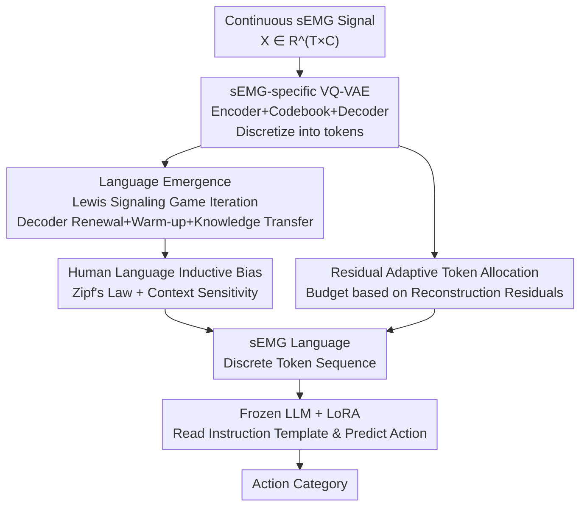

# Translating Signals to Languages for sEMG-Based Activity Recognition

**Conference**: CVPR 2026  
**Paper**: [CVF Open Access](https://openaccess.thecvf.com/content/CVPR2026/html/Wang_Translating_Signals_to_Languages_for_sEMG-Based_Activity_Recognition_CVPR_2026_paper.html)  
**Area**: Human Understanding / Time-series Signals / LLM Application  
**Keywords**: surface Electromyography (sEMG), Activity Recognition, Language Emergence, VQ-VAE, Lewis Signaling Games  

## TL;DR
This paper proposes LLM-sEMG, which uses an sEMG-specific VQ-VAE to discretize continuous electromyography signals into tokens. Through a combination of "Lewis signaling games + human language inductive bias," these tokens evolve into a natural-language-like "sEMG language." Finally, a frozen pre-trained LLM with LoRA fine-tuning directly interprets this language for activity recognition, achieving accuracies of 95.14% on GRABMyo and 93.17% on NinaPro DB2, outperforming the strongest baseline STET by approximately 4 percentage points.

## Background & Motivation
**Background**: Surface electromyography (sEMG) directly reflects neuromuscular activity with high temporal resolution, capturing subtle dynamics of muscle activation. It is a critical modality for decoding movement intentions in human-computer interaction and embodied perception. Prevailing approaches follow two main paths: increasing the depth and strength of network architectures (TCN, GRU, Transformer, ViT, Spiking Networks) to enhance signal representation, or relying on large-scale pre-training to inject priors.

**Limitations of Prior Work**: sEMG signals are noisy, exhibit significant cross-subject variability, and are temporally non-stationary—composed of alternating short bursts and sustained contractions—making classification difficult. Furthermore, both mainstream paths remain at the "signal-level modeling" stage, failing to convert sEMG into a language-like form and thus unable to leverage the semantic reasoning capabilities learned by LLMs from massive textual descriptions of actions.

**Key Challenge**: LLM pre-training corpora contain vast amounts of linguistic descriptions concerning "actions and their semantic intentions," which serve as natural priors for activity recognition. However, LLMs only process structured natural language sentences, while sEMG consists of continuous, non-linguistic time series, creating a representation gap. The most direct idea—fine-tuning an LLM to process non-linguistic inputs—risks washing away its original knowledge when modifying weights on limited sEMG data, which contradicts the goal of utilizing LLM knowledge.

**Key Insight**: The authors observe that since LLMs have learned cross-linguistic semantic structures from massive corpora, they can quickly adapt to new languages not seen during training. Thus, rather than modifying the LLM to accommodate the signal, it is better to "translate" the sEMG signal into an "sEMG language" that the LLM can read like a new language. By freezing the LLM's pre-trained weights, its priors are maximally preserved.

**Core Idea**: Use "language emergence" to transform continuous electromyography into discrete token sequences that increasingly resemble human language. Then, let the frozen LLM (with only LoRA adaptation) treat activity recognition as a language understanding task: "read sEMG language → output action label."

## Method

### Overall Architecture
LLM-sEMG is a two-stage pipeline: **Stage 1** trains an sEMG-specific VQ-VAE to discretize continuous signals into tokens and evolves these tokens into a natural-language-like "sEMG language" under an "iterated learning" framework, while using residual adaptive allocation to preserve discriminative information. **Stage 2** freezes all weights of a pre-trained LLM (LLaMA-13B) and uses LoRA adaptation to read the sEMG language and output action categories based on instruction templates.

The generation of the "sEMG language" relies on three components: ① VQ-VAE for discretization; ② iterated learning via Lewis signaling games for "cross-generational evolution" into language; ③ residual adaptive token allocation for higher precision at information-dense signal regions. Once the sEMG language is trained, it is passed to the frozen LLM for inference.

### Key Designs

**1. sEMG-specific VQ-VAE: Discretizing Continuous EMG into "Words"**

To enable an LLM to read signals, the first step is to create "discrete symbols"—natural language itself is a sequence of discrete tokens. The authors utilize the VQ-VAE's encoder $E$, codebook $C$, and decoder $D$, customized for sEMG. Given a signal $X \in \mathbb{R}^{T\times C}$ ($T$ time steps, $C$ channels), it is sliced into overlapping segments $x \in \mathbb{R}^{t\times C}$ via a sliding window. An encoder (1D-CNN) maps each segment to a continuous latent vector sequence $z_e(x) = [z_{e,1}, \dots, z_{e,S}] \in \mathbb{R}^{D\times S}$. The codebook consists of $K$ learnable vectors $C=\{e_j\}_{j=1}^{K}$. For each position $s$, the nearest codebook vector is selected via Euclidean distance:

$$k_s = \arg\min_{j\in\{1,\dots,K\}} \lVert z_{e,s} - e_j \rVert_2,\quad z_{q,s}(x)=e_{k_s}$$

The segment $x$ is mapped to a discrete sequence $z_q(x)=[z_{q,1},\dots,z_{q,S}]$, which the decoder uses to reconstruct $\hat{x}$. Crucially, the codebook vector dimension $D$ is aligned with the LLM's embedding dimension (e.g., $D=5120$ for LLaMA-13B), allowing sEMG tokens to naturally reside in the LLM's "vocabulary space." However, simple tokenization is insufficient to evoke semantic priors, which leads to the next design.

**2. Iterated Learning via Lewis Signaling Games: Evolving sEMG into Language**

Token sequences from standard VQ-VAEs lack linguistic properties. The authors leverage "cultural transmission theory" from language evolution and Lewis signaling games: in these games, participants who initially use unintelligible symbols eventually develop a shared, interpretable language through repeated interaction. The authors treat the VQ-VAE **encoder as the "speaker," the decoder as the "new generation learner," and the codebook as the "shared symbol set,"** simulating generations by periodically replacing the decoder. Each generation consists of:

- **Decoder Renewal**: At the start of each generation, a new decoder $D^{(t+1)}\sim P_{\text{init}}$ is initialized, while the encoder and codebook are inherited and frozen $E^{(t+1)}=E^{(t)},\ C^{(t+1)}=C^{(t)}$ to act as "knowledge carriers."
- **Warm-up**: Since the new decoder is randomly initialized, it must first be trained to align with the inherited codebook $C^{(t)}$ before joint training to prevent gradient instability.
- **Knowledge Transmission**: The codebook is unfrozen, and training continues. The authors intentionally keep the "old encoder → new decoder" instruction **incomplete and biased**, creating a "learning bottleneck" that stimulates the spontaneous evolution of language.

This mechanism is critical: removing iterated learning collapses accuracy from 95.14% to 79.59%. Its effectiveness lies in forcing the system to compress and regularize representations for fast acquisition by new learners, which is the core of "language-like" structures.

**3. Human Language Inductive Bias: Accelerating Evolution via Zipf's Law and Context Sensitivity**

Since real language evolution takes generations, the authors inject two proven human language biases into the process:

- **Zipf's Law Prior**: Word frequencies in natural language follow a power law. To induce this, **Zipf-weighted sampling** is used during the first 25% of training to make a small set of "core tokens" more likely to be activated. Subsequently, a Zipf regularization term aligns the empirical batch frequency $D_{\text{freq}}$ with the theoretical Zipf distribution $D_{\text{Zipf}}$ via JS divergence: $L_{\text{zipf}} = \mathrm{JS}(D_{\text{freq}} \parallel D_{\text{Zipf}})$.
- **Context Sensitivity Prior**: Words are not independent. A context loss $L_{\text{context}} = 1 - \frac{1}{N}\sum_{n=1}^{N}\mathrm{Corr}(t_n)$ encourages co-occurrence of semantically related tokens. An intergenerational preservation loss $L_{\text{preserving}} = \lVert M^{(t+1)} - M^{(t)} \rVert_F^2$ based on token co-occurrence matrices $M^{(t)}$ stabilizes this bias across generations.

The composite term is $L_{\text{human}} = L_{\text{zipf}} + L_{\text{context}} + L_{\text{preserving}}$. This accelerates convergence from 87.35% to 95.14%.

**4. Residual Adaptive Token Allocation: Focusing Tokens on Information-Dense Regions**

sEMG is highly non-stationary: high-amplitude bursts signal the start or termination of movements, while steady-state phases contain less information. Uniform tokenization wastes tokens on steady states and loses data during transients. Based on the observation that "reconstruction residuals reflect local information density," each sEMG segment is divided into $S$ slices $x_1,\dots,x_S$. The residual energy is $R_s = \lVert x_s - \hat{x}_s \rVert_2^2$. Within a budget $T_{\max}$, tokens are allocated as $T_s = T_{\max}\times P_s$ (where $P_s$ is the normalized residual), with at least one token per slice. This ensures sEMG language captures the explosive dynamics of signals.

### Loss & Training
**Stage 1 (VQ-VAE Language Emergence)**: Under the iterated learning framework, the encoder/decoder/codebook act as parties in a Lewis signaling game. The total loss combines the standard VQ-VAE reconstruction loss $L_{\text{rec}}$, embedding loss $L_{\text{emb}}$, and commitment loss $L_{\text{com}}$ with the human bias loss:

$$L_{\text{total}} = L_{\text{rec}} + L_{\text{emb}} + \lambda_1 L_{\text{com}} + \lambda_2 L_{\text{human}}$$

**Stage 2 (LLM Adaptation)**: LLaMA-13B is frozen, and only LoRA is fine-tuned. Samples use the template: *"Given a sequence of sEMG tokens [tokens], please predict the corresponding activity."* The model minimizes cross-entropy: $L_{\text{LLM}} = L_{ce}(t_p, t_g)$. Implementation uses $K=512$, $D=5120$, and AdamW optimizer.

## Key Experimental Results

### Main Results
Evaluated on GRABMyo (17 activities) and NinaPro DB2 (50 movements) using user-specific protocols.

| Dataset | Metric | LLM-sEMG (Ours) | STET (Prev. SOTA) | Gain |
|--------|------|------|----------|------|
| GRABMyo | Overall ACC | **95.14%** | 90.76% | +4.38% |
| GRABMyo | Single-finger | 92.25% | 88.27% | +3.98% |
| GRABMyo | Multi-finger | 94.50% | 89.93% | +4.57% |
| NinaPro DB2 | Overall ACC | **93.17%** | 89.13% | +4.04% |
| NinaPro DB2 | Exercise B | 92.53% | 87.22% | +5.31% |

### Ablation Study (GRABMyo Overall ACC)
| Configuration | Overall ACC | Description |
|------|---------|------|
| Full Model | 95.14% | Complete model |
| w/o Iteration | 79.59% | Removing iterated learning causes a 15.55% drop |
| w/o Warm-up | 91.65% | Instability in early reconstruction |
| w/o Human Bias | 87.35% | Removing all linguistic priors |
| w/o Zipf Bias | 90.65% | Removing Zipf prior specifically |
| w/o Context Bias | 92.13% | Removing context sensitivity constraint |
| w/o Residual-based | 92.60% | Removing adaptive allocation (affects dynamic gestures most) |

### Key Findings
- **Iterated learning is the pivot**: Removing it leads to a catastrophic drop (−15.55%), proving that "evolving tokens into language" is the foundation for LLM understanding.
- **Language biases are second most significant**: Total removal leads to −7.79%; Zipf's law contributes more than context sensitivity.
- **Residual adaptive allocation targets dynamic discrimination**: Removing it impacts dynamic gestures (−2.50% to −3.30%) significantly more than steady-state ones (−0.95% to −1.45%).

## Highlights & Insights
- **"Modifying signal to accommodate the LLM" over "Modifying LLM to accommodate the signal"**: By freezing the LLM and delegating cross-modal alignment to a trainable VQ-VAE translator, the paper avoids the loss of pre-trained knowledge common in small-data fine-tuning.
- **Integrating linguistics into representation learning**: The use of Lewis signaling games and cultural transmission provides a coherent theoretical narrative for "why discrete tokens should resemble language," rather than just stacking heuristics.
- **Learning bottleneck as regularization**: Intentionally incomplete "teaching" from old encoder to new decoder forces emergent complexity, a concept related to findings in knowledge distillation where overly strong teachers can suppress student exploration.
- **Residual energy as information density**: This provides a lightweight, interpretable method for dynamic sparsification in non-stationary time series.

## Limitations & Future Work
- **Computational Overhead**: Relying on LLaMA-13B with H100s makes training and inference far more expensive than dedicated architectures like STET, hindering real-time deployment on wearable devices.
- **Documentation of Core Mechanisms**: Several definitions (e.g., specific $\mathrm{Corr}(\cdot)$ metrics and co-occurrence matrices) are relegated to the supplementary material, making standalone replication difficult.
- **Quantification of Explainability**: While the paper claims improved explainability, it primarily reports accuracy without qualitatively visualizing how "sEMG language" tokens map to readable semantic units.
- **Evaluation Scope**: Experiments were limited to user-specific protocols on two datasets; cross-subject and cross-dataset generalization remains to be verified.

## Related Work & Insights
- **vs. Dedicated sEMG Networks (STET, JASNN)**: While dedicated networks focus on signal-layer modeling, this work leverages external language knowledge. The gain is high (~4 points), but the model is significantly heavier.
- **vs. Direct LLM Fine-tuning**: Direct fine-tuning often damages LLM priors on limited sEMG data; this approach treats sEMG as a new language to be learned by a frozen LLM, which is a more robust paradigm.
- **vs. General VQ-VAE Tokenization**: Standard VQ-VAEs only ensure reconstructability. By adding signaling games and linguistic priors, this method ensures the resulting "sEMG language" is interpretable by LLMs.

## Rating
- Novelty: ⭐⭐⭐⭐⭐ 
- Experimental Thoroughness: ⭐⭐⭐⭐ 
- Writing Quality: ⭐⭐⭐⭐ 
- Value: ⭐⭐⭐⭐ 

<!-- RELATED:START -->

## Related Papers

- [\[CVPR 2026\] Sign Language Recognition in the Age of LLMs](sign_language_recognition_llms.md)
- [\[CVPR 2026\] MMGait: Towards Multi-Modal Gait Recognition](mmgait_multi_modal_gait_recognition.md)
- [\[AAAI 2026\] KineST: A Kinematics-guided Spatiotemporal State Space Model for Human Motion Tracking from Sparse Signals](../../AAAI2026/human_understanding/kinest_a_kinematics-guided_spatiotemporal_state_space_model_for_human_motion_tra.md)
- [\[CVPR 2026\] EventGait: Towards Robust Gait Recognition with Event Streams](eventgait_towards_robust_gait_recognition_with_event_streams.md)
- [\[CVPR 2026\] Region-Aware Instance Consistency Learning for Micro-Expression Recognition](region-aware_instance_consistency_learning_for_micro-expression_recognition.md)

<!-- RELATED:END -->
