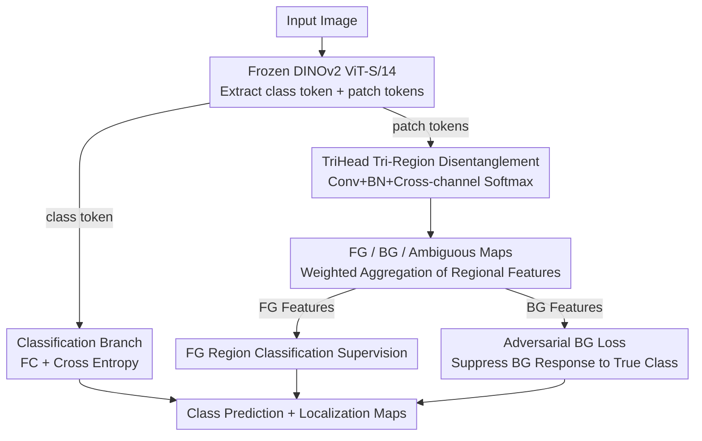

# TriLite: Efficient WSOL with Universal Visual Features and Tri-Region Disentanglement

**Conference**: CVPR 2026  
**arXiv**: [2602.23120](https://arxiv.org/abs/2602.23120)  
**Code**: Coming Soon  
**Area**: Human Understanding  
**Keywords**: Weakly Supervised Object Localization (WSOL), ViT, DINOv2, Tri-region Disentanglement, Parameter-efficient

## TL;DR

Using only a frozen DINOv2 ViT and a TriHead module with fewer than 800K trainable parameters, this method achieves new SOTA results in WSOL. It achieves this by disentangling patch features into foreground, background, and ambiguous regions and introducing an adversarial background loss.

## Background & Motivation

WSOL aims to localize objects using only image-level labels. Methods starting from CAM face the issue of partial activation. Existing approaches include: (1) Multi-stage methods (e.g., GenPromp) which perform well but have massive parameter counts (1017M); (2) Binary classification (foreground vs. background) which ignores salient non-target regions.

Key Insight: Introduce a third "ambiguous region" class to account for non-target but salient areas, thereby reducing noise in foreground/background determination.

## Method

### Overall Architecture

TriLite aims to achieve accurate object localization in WSOL using only image-level labels while minimizing trainable parameters. It employs a frozen DINOv2 ViT-S/14 as a universal visual feature extractor, with two lightweight branches attached: a classification branch that takes the class token through a fully connected layer for image classification, and a localization branch (TriHead) that takes patch tokens to output attribution maps for foreground, background, and ambiguous regions. Only these two heads are trained while the backbone remains frozen, resulting in fewer than 800K trainable parameters in a single-stage end-to-end pipeline.

### Key Designs

**1. TriHead Tri-Region Disentanglement: Using the "Ambiguous Region" to absorb non-target salient noise**

Traditional WSOL dichotomizes each patch into foreground or background. Salient but non-target regions (strong textures in the background, other objects) are forced into one of these classes, polluting the determination. TriHead modifies this to three classes: patch tokens are reshaped into feature maps, passed through Conv+BN, and a cross-channel Softmax outputs $\mathbf{M} = [\mathbf{M}^{am}, \mathbf{M}^{fg}, \mathbf{M}^{bg}]$, corresponding to ambiguous, foreground, and background. Softmax forces normalization and competition at each patch, making the ambiguous channel a natural buffer; uncertain salient regions are assigned here, resulting in cleaner foreground and background maps. Regional features are obtained via weighted average: $\mathbf{f}^c = \frac{\sum_i \mathbf{M}_i^c \mathbf{F}_i}{\sum_i \mathbf{M}_i^c + \epsilon}$. Due to the Softmax constraint, only foreground and background channels require explicit supervision; the ambiguous channel is optimized via competition.

**2. Adversarial Background Loss: Forcing the background map to "recognize nothing"**

The three-channel design alone is insufficient as the background channel might still activate on the target. This method introduces an adversarial approach previously unused in WSOL: background regional features are fed into the classifier to penalize their response to the true class $y$:

$$\mathcal{L}_{bg} = -\log\Big(1 - \frac{\exp(z_y^{bg})}{\sum_j \exp(z_j^{bg})} + \epsilon\Big)$$

Where $z^{bg}$ represents logits from the background feature. Minimizing this loss suppresses the predicted probability of the target class in the background, ensuring the background map only activates in truly irrelevant areas and further separating foreground from background.

**3. Classification Branch: Independent supervision for category signals**

The localization head only produces regional attribution maps. Category decisions are handled by a separate classification branch where the class token passes through an FC layer and cross-entropy loss. While sharing the frozen backbone, the classification and localization branches are optimized independently, reusing DINOv2's universal features without conflicting objectives.

### Loss & Training

The total loss is a weighted sum: $\mathcal{L} = \mathcal{L}_{fg} + \alpha \mathcal{L}_{bg} + \mathcal{L}_{cls}$, where $\mathcal{L}_{fg}$ supervises foreground classification, $\mathcal{L}_{cls}$ supervises global image classification, and $\mathcal{L}_{bg}$ is the adversarial background term. The backbone is frozen throughout the single-stage end-to-end training, requiring only 20 epochs on ImageNet-1K.

## Key Experimental Results

### Main Results

| Dataset | Metric | TriLite | GenPromp | Gain |
|--------|------|---------|----------|------|
| ImageNet-1K | Top-1 Loc | **65.5%** | 65.2% | +0.3% |
| ImageNet-1K | Top-5 Loc | **75.6%** | 73.4% | +2.2% |
| ImageNet-1K | GT Loc | **77.9%** | 75.0% | +2.9% |
| CUB-200-2011 | Top-1 Loc | **87.3%** | 87.0% | +0.3% |
| OpenImages | PxAP | **73.3%** | 72.1% | +1.2% |

### Parameter Efficiency

| Method | Trainable Params | Total Params |
|------|-----------|--------|
| GenPromp | 898M | 1017M |
| BAS | 25.6M | 25.6M |
| **TriLite** | **<0.8M** | 22.1M (Frozen)+0.8M |

### Ablation Study

| Configuration | CUB Top-1 | ImageNet GT | Description |
|------|-----------|-------------|------|
| Binary w/o Adv | 86.7 | 76.5 | Baseline |
| Binary + Adv | 86.5 | 77.2 | Adv loss alone has limited gain |
| 3-ch w/o Adv | 85.0 | 77.4 | 3-channel alone has limited gain |
| **3-ch + Adv** | **87.3** | **77.9** | Significant gain when combined |

### Key Findings

- The 3-channel design and adversarial loss must be used together; the ambiguous region provides a buffer for the adversarial loss.
- Self-supervised pre-training (DINOv2) significantly outperforms supervised pre-training (DeiT).
- TriLite activation maps achieve a precision level comparable to segmentation masks.

## Highlights & Insights

1. Outperforming 1000M+ parameter methods with <800K parameters—demonstrating that a frozen high-quality ViT with lightweight heads is a viable path.
2. Adversarial background loss is an unexplored yet effective strategy in WSOL.
3. The "ambiguous region" is modeled explicitly rather than through soft assignment.

## Limitations & Future Work

1. Precise activations on occluded objects can lead to fragmented bounding boxes.
2. Performance heavily depends on the quality of DINOv2 features.
3. Extension to weakly supervised semantic segmentation (WSSS) remains to be validated.

## Related Work & Insights

- Comparison with LOST/TokenCut: Learnable localization heads are superior to post-processing methods.
- The paradigm of "frozen backbone + ultra-lightweight task heads" can be extended to other weakly supervised tasks.

## Rating

- Novelty: ⭐⭐⭐⭐ Innovative combination of tri-region disentanglement and adversarial background loss.
- Experimental Thoroughness: ⭐⭐⭐⭐⭐ Evaluated across three datasets and multiple backbones with detailed ablation.
- Writing Quality: ⭐⭐⭐⭐ Clear and intuitive visualizations.
- Value: ⭐⭐⭐⭐⭐ High practical utility—low parameter count, simple training, and SOTA performance.

<!-- RELATED:START -->

## Related Papers

- [\[ECCV 2024\] EDTalk: Efficient Disentanglement for Emotional Talking Head Synthesis](../../ECCV2024/human_understanding/edtalk_efficient_disentanglement_for_emotional_talking_head_synthesis.md)
- [\[CVPR 2026\] Region-Aware Instance Consistency Learning for Micro-Expression Recognition](region-aware_instance_consistency_learning_for_micro-expression_recognition.md)
- [\[CVPR 2026\] Text-guided Feature Disentanglement for Cross-modal Gait Recognition](text-guided_feature_disentanglement_for_cross-modal_gait_recognition.md)
- [\[CVPR 2026\] Composite-Attribute Person Re-Identification via Pose-Guided Disentanglement](composite-attribute_person_re-identification_via_pose-guided_disentanglement.md)
- [\[CVPR 2026\] UniDex: A Robot Foundation Suite for Universal Dexterous Hand Control from Egocentric Human Videos](unidex_a_robot_foundation_suite_for_universal_dexterous_hand_control_from_egocen.md)

<!-- RELATED:END -->
