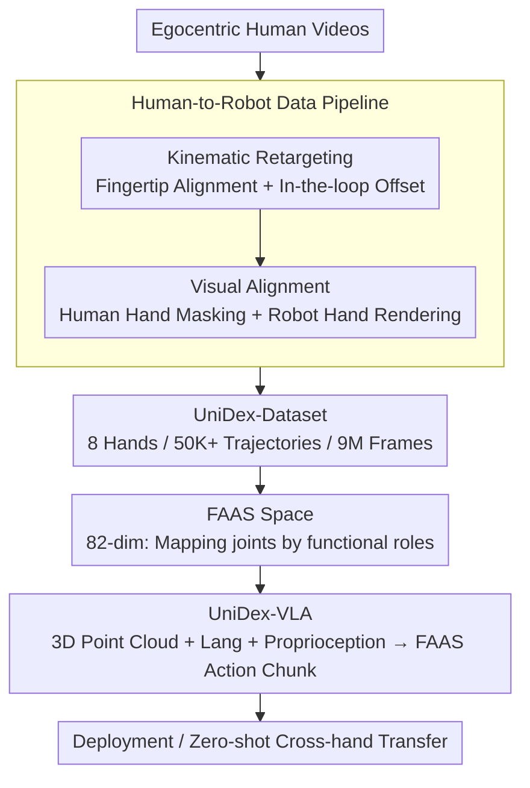

# UniDex: A Robot Foundation Suite for Universal Dexterous Hand Control from Egocentric Human Videos

**Conference**: CVPR 2026  
**arXiv**: [2603.22264](https://arxiv.org/abs/2603.22264)  
**Code**: [https://unidex-ai.github.io/](https://unidex-ai.github.io/)  
**Area**: Human Understanding  
**Keywords**: Dexterous manipulation, VLA foundation model, unified action space, learning from human videos, cross-hand transfer

## TL;DR
The authors propose the UniDex robot foundation suite—comprising a large-scale dataset across 8 dexterous hands (50K+ trajectories/9M frames), a Function-Actuator Aligned Space (FAAS), and a 3D VLA policy (UniDex-VLA). It achieves an 81% average task progress (vs. 38% for π₀) on real-world tool-use tasks and demonstrates spatial, object, and zero-shot cross-hand generalization capabilities.

## Background & Motivation

1.  **Background**: Learning from Demonstrations (LfD) is the dominant paradigm in current visuo-motor control. Vision-Language-Action (VLA) models perform excellently in tasks like grasping but are mostly designed for parallel grippers; foundation models for dexterous hands remain extremely scarce.

2.  **Limitations of Prior Work**: Developing foundation models for dexterous hands is significantly more difficult than for grippers due to three challenges: (a) **Data scarcity**: Teleoperation data for dexterous hands is extremely expensive and hard to collect at scale; (b) **Embodiment heterogeneity**: There is high variability in dexterous hands (6-24 DoF, different kinematics), making cross-hand transfer difficult; (c) **High-dimensional control**: The action space dimension is much higher than that of grippers, requiring more expressive action representations.

3.  **Key Challenge**: Dexterous hands require large-scale diverse data for pre-training, but teleoperation data is expensive and hand-specific. Conversely, humans naturally generate vast amounts of manipulation data (egocentric videos), but a massive kinematic and visual domain gap exists between human and robot hands.

4.  **Goal**: (a) Convert egocentric human videos into robot-executable dexterous hand trajectories; (b) Design a unified action space to enable cross-hand transfer; (c) Construct a dexterous hand VLA foundation model.

5.  **Key Insight**: Dexterous hands were originally designed to simulate human hands, implying functional correspondences. By utilizing these correspondences, the domain gap can be narrowed through kinematic retargeting and visual alignment (masking human hands and replacing them with robot hand point clouds).

6.  **Core Idea**: Build a large-scale multi-embodiment pre-training dataset via a human-to-robot data conversion pipeline, design a functional-aligned space (FAAS) for cross-hand transfer, and train a 3D VLA foundation model for universal dexterous manipulation.

## Method

### Overall Architecture
UniDex consists of three parts: (1) **UniDex-Dataset**—a robot-centric dataset converted from egocentric human videos across 8 hand types (50K+ trajectories, 9M frames); (2) **FAAS + UniDex-VLA**—a Function-Actuator Aligned Space and a 3D VLA policy; (3) **UniDex-Cap**—a portable human data collection device that supports human-robot data co-training to reduce teleoperation costs.

### Key Designs

**1. Human-to-Robot Data Pipeline: "Translating" human videos into robot trajectories**

Dexterous teleoperation data is costly, but humans produce massive manipulation videos daily. The gap is two-fold: kinematic structure and visual appearance. The pipeline bridges both. First, **Kinematic Retargeting**: Fingertips are treated as primary contact points. Human fingertip positions $X^* = [x_1^*, ..., x_m^*]$ are extracted. A 6-DoF alignment offset $T_{\text{offset}}$ (dummy base) is assigned to the robot hand, and joint angles $q$ are solved via IK to match robot fingertips to human counterparts while ensuring physical plausibility. Instead of pure automation, a human-in-the-loop approach uses a GUI slider to fine-tune $T_{\text{offset}}$, ensuring clean contact at low cost. Second, **Visual Alignment**: Point clouds are computed from RGB-D frames. Human hands are segmented and removed using WiLoR+SAM2. The retargeted robot hand mesh is rendered into the scene point cloud and projected back to RGB-D. This ensures the pre-training data resembles the downstream robot setup, eliminating the domain gap where the model might otherwise see a human hand but execute a robot action.

**2. Function-Actuator Aligned Space (FAAS): Aligning actions by "what fingers do"**

To share data across 8 hand types, a common action language is required. Direct concatenation of joint vectors fails as hands range from 6 to 24 DoF. FAAS provides an 82-dimensional vector: the first 18 dims represent dual wrist poses (9 per hand: 6D rotation + 3D translation), and the remaining 64 dims are actuator slots (32 per hand). The core logic is mapping actuators by **functional roles** (e.g., thumb flex, index abduct) rather than URDF indices. For example, the flex and abduction joints of the thumb and ring finger for Oymotion (11 actuators), Allegro (16), Inspire (12), and Wuji (20) are mapped to the same index set $\{0, 1, 3, 5, 6\}$. Extra slots accommodate hand-specific DoFs. Unlike unified spaces in RDT-1B or π₀ which primarily serve grippers, FAAS aligns at the functional level for high-DoF hands without requiring post-processing IK, making it more stable.

**3. UniDex-VLA: A foundation model for 3D dexterous manipulation**

Dexterous tool use requires reasoning about 3D geometry and affordances. 2D encoders often discard depth information. UniDex-VLA adopts the π₀ architecture but replaces the SigLIP 2D encoder with a Uni3D point cloud encoder. It uses a ViT structure initialized from pre-trained 2D ViTs and aligns point cloud features to a Vision-Language space. The input consists of a colored point cloud $P_t$, language instruction $\ell_t$, and proprioception $q_t$, outputting an $H$-step action chunk $A_t = [a_t, ..., a_{t+H-1}]$. Wrist actions are represented relatively to the first frame of the chunk. The model is trained using conditional flow-matching for generative modeling of high-dimensional actions. It is pre-trained on UniDex-Dataset to obtain motion priors and fine-tuned on specific tasks.

### Loss & Training
The model is trained using a conditional flow-matching objective. During inference, denoised action chunks are generated via forward-Euler integration. Pre-training occurs on UniDex-Dataset across 8 hand types. Fine-tuning requires only 50 teleoperation demonstrations per task. UniDex-Cap supports human-robot data co-training, where experiments show a 2:1 exchange ratio (two human demos $\approx$ one robot demo).

## Key Experimental Results

### Main Results
5 real-world tool-use tasks (20 trials per task):

| Model | Avg. Task Progress | Success Rate |
| :--- | :--- | :--- |
| Diffusion Policy | 29.0% | 22.0% |
| DP3 | 35.0% | 30.0% |
| π₀ | 38.0% | 35.0% |
| UniDex-VLA (No Pretrain) | 32.5% | 23.0% |
| **UniDex-VLA** | **81.0%** | **76.0%** |

On the "cutting bags with scissors" task, it shows an 84.6% improvement over the best baseline.

### Ablation Study

| Generalization Type | Experiment | Result |
| :--- | :--- | :--- |
| Spatial Generalization | OOD positions for kettle/dropper | UniDex-VLA maintains high success; near perfect with DemoGen |
| Object Generalization | Different colors/sizes of kettles | UniDex-VLA remains robust |
| Zero-shot Cross-hand | Training on Inspire → Deploy on Oymotion | 60% success vs. $\approx$ 0% baseline |
| Zero-shot Cross-hand | Training on Inspire → Deploy on Wuji | 40% success vs. $\approx$ 0% baseline |
| Human-Robot Co-training | 50 robot + human demos | 2:1 exchange ratio; human collection 5.2x faster |

### Key Findings
- Pre-training is highly effective: UniDex-VLA vs. No Pretrain (81% vs. 32.5%), indicating that large-scale pre-training provides a strong motion prior.
- FAAS enables zero-shot cross-hand transfer: 60% success for Inspire → Oymotion and 40% for Wuji, where baselines fail ($\approx 0\%$), proving the functional alignment retains transferable semantics.
- Human-robot co-training is efficient: 1 robot demo $\approx$ 2 human demos. Given human data is collected 5.2x faster, this results in an exchange efficiency of approximately 1:2.6 in actual cost.
- 3D point cloud input facilitates natural spatial generalization via geometric data augmentation.

## Highlights & Insights
- **FAAS Functional Alignment**: Mapping by functional roles rather than URDF indices is simple yet highly effective. This approach could extend to other heterogeneous robot embodiments (e.g., bimanual systems).
- **Lightweight Human-in-the-loop Retargeting**: Instead of fully automated IK, a short human adjustment period ensures physically plausible contacts, resulting in high-quality data at minimal cost.
- **Fine-tuning with 50 Demos**: Large-scale pre-training allows downstream tasks to be deployed with very few real-world demonstrations.

## Limitations & Future Work
- Large-scale action-free egocentric datasets (like Ego4D) have not yet been utilized; their visual diversity could further scale pre-training.
- Evaluation focuses on tool-use tasks; fine-grained in-hand manipulation and re-orientation are not yet covered.
- The 32-slot actuator reservation in FAAS might be inflexible for future hand types with significantly higher DoFs.
- Co-training depends on retargeting quality; performance on non-contact operations (e.g., button pressing, sliding) remains to be verified.

## Related Work & Insights
- **vs. π₀**: π₀ achieves only 38% progress on dexterous hands because its gripper-based pre-training data provides little help. UniDex-VLA reaches 81% through specialized dexterous pre-training.
- **vs. EgoVLA**: EgoVLA uses human hand parameters as robot representations, requiring post-processing IK which introduces errors. FAAS outputs joint angles directly, making it post-processing free.
- **vs. RDT-1B**: RDT-1B's semantic action space is primarily focused on grippers and does not address functional alignment for high-DoF dexterous hands.

## Rating
- Novelty: ⭐⭐⭐⭐⭐ (First large-scale foundation suite for cross-hand control; clever FAAS design.)
- Experimental Thoroughness: ⭐⭐⭐⭐⭐ (Extensive real-world tasks, generalization tests, and co-training analysis.)
- Writing Quality: ⭐⭐⭐⭐ (Well-organized and clearly structured system-level work.)
- Value: ⭐⭐⭐⭐⭐ (A milestone in dexterous hand foundation model research with high open-source potential.)

<!-- RELATED:START -->

## Related Papers

- [\[CVPR 2026\] InterPrior: Scaling Generative Control for Physics-Based Human-Object Interactions](interprior_scaling_generative_control_for_physics-based_human-object_interaction.md)
- [\[CVPR 2026\] E-3DPSM: A State Machine for Event-Based Egocentric 3D Human Pose Estimation](e-3dpsm_a_state_machine_for_event-based_egocentric_3d_human_pose_estimation.md)
- [\[CVPR 2026\] TriLite: Efficient WSOL with Universal Visual Features and Tri-Region Disentanglement](trilite_efficient_weakly_supervised_object_localization_with_universal_visual_fe.md)
- [\[CVPR 2026\] Forecasting 3D Scanpaths in Egocentric Video](forecasting_3d_scanpaths_in_egocentric_video.md)
- [\[ECCV 2024\] 3D Hand Pose Estimation in Everyday Egocentric Images](../../ECCV2024/human_understanding/3d_hand_pose_estimation_in_everyday_egocentric_images.md)

<!-- RELATED:END -->
