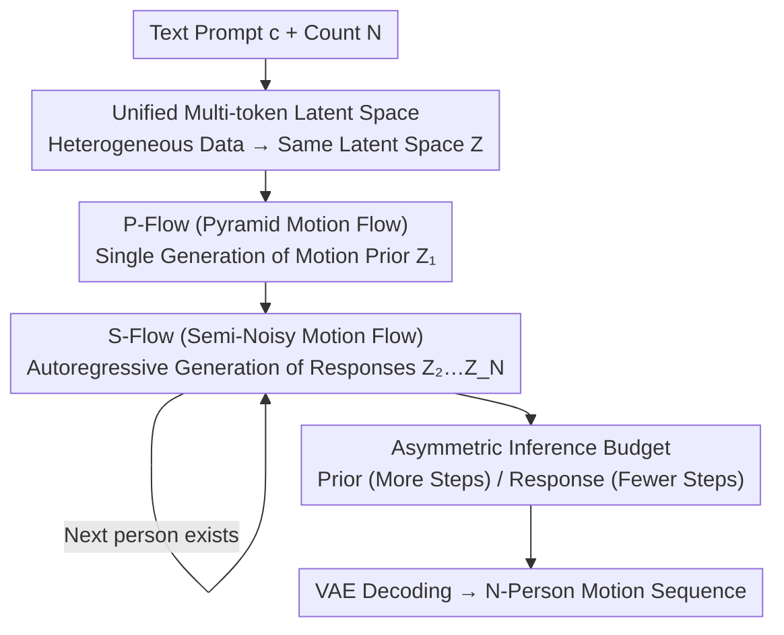

# Unified Number-Free Text-to-Motion Generation Via Flow Matching

**Conference**: CVPR 2026  
**Paper**: [CVF Open Access](https://openaccess.thecvf.com/content/CVPR2026/html/Huang_Unified_Number-Free_Text-to-Motion_Generation_Via_Flow_Matching_CVPR_2026_paper.html)  
**Code**: https://githubhgh.github.io/umf/ (Project Page)  
**Area**: Text-to-Motion Generation / Human Understanding  
**Keywords**: Multi-person Motion Generation, Flow Matching, Pyramid Flow, Error Accumulation, Heterogeneous Data Unification

## TL;DR
UMF bridges single-person and multi-person motion datasets using a unified multi-token latent space. It establishes a "1+N" paradigm consisting of a "Pyramid Motion Flow (P-Flow)" for single-pass generation of motion priors and a "Semi-Noisy Motion Flow (S-Flow)" for iterative autoregressive generation of responses. This reaches SOTA on text-driven "number-free" multi-person generation (InterHuman FID 4.772) while performing inference approximately 5x faster than FreeMotion.

## Background & Motivation
**Background**: Text-to-motion generation has advanced rapidly through diffusion models. However, most existing works are limited to a **fixed number of people**—either single-person (HumanML3D style) or strict two-person interactions (InterHuman style). When the number of people becomes "arbitrary" (number-free, i.e., 1, 2, 3, ..., N), existing models fail to generalize.

**Limitations of Prior Work**: To generate "number-free" multi-person motions, mainstream approaches (e.g., FreeMotion) rely on **autoregression**—first generating a motion prior for one person, then recursively generating subsequent responses conditioned on prior motions. This path has two major flaws: ① **Low efficiency**, as each person requires a full diffusion/sampling pass, leading to explosive costs as N increases; ② **Error accumulation**, as autoregression treats previously generated (potentially flawed) motions as static conditions, causing errors to snowball and results to collapse with more agents.

**Key Challenge**: Multi-person interaction data is scarce and lacks diversity (InterHuman contains only 7,779 sequences), whereas single-person data is relatively abundant (HumanML3D has 14,616). However, the **representation formats are incompatible**—single-person data uses canonical skeletons, while interaction data uses non-canonical representations, preventing joint training within a single generative framework. This creates a deadlock between "data scarcity" and the "desire for a generalist model."

**Goal**: To build a true generalist model that can handle joint training on heterogeneous (single + multi-person) data, generate motions for an arbitrary number of individuals during inference, and avoid the inefficiency and error accumulation of standard autoregression.

**Key Insight**: The authors decompose the problem into two segments: "single-pass generation of a high-quality motion prior" + "iterative generation of responses to it." Two key observations drive the design: (1) Diffusion/flow models contain high noise and low information in **early timesteps**, making full-resolution computation unnecessary; (2) Autoregression accumulates error because it treats generated motions as **static conditions**; the model merely follows passively without capturing the causal dynamics of interaction.

**Core Idea**: Flow Matching is used to unify the two generation stages. For the motion prior, "Pyramid Flow" hierarchically reduces resolution based on noise levels to save computation. For the response stage, context is no longer treated as a static condition but as an **adaptive starting point** for the reaction generation path, supplemented by a "context reconstruction" path for regularization, achieving both efficiency and robustness against error accumulation.

## Method

### Overall Architecture
UMF (Unified Motion Flow) takes a text prompt $c$ and the target number of people $N$ as input, and outputs a synchronized SMPL skeleton motion sequence for $N$ individuals. The pipeline consists of three serial stages: First, a **unified multi-token VAE** encodes heterogeneous datasets into a shared latent space $Z$. Second, **P-Flow** generates the motion prior $\hat{Z}_1$ for the first person in the latent space in a single pass. Finally, **S-Flow** uses the generated motions as context to autoregressively generate subsequent responses $\hat{Z}_2, \dots, \hat{Z}_N$ one by one. The VAE then decodes these back to the original motion space. This is the "1+N" paradigm (1 prior + N responses).

### Key Designs

**1. Unified Multi-token Latent Space: Training single and multi-person data in one space**

This directly addresses the incompatibility and data scarcity. Data normalization is performed: single-person motions are converted to 22-joint **non-canonical SMPL skeletons**, and multi-person interactions are decomposed into multiple single-person sequences. This ensures all data follows the "one-person motion sequence" format. The VAE uses a transformer encoder-decoder with skip connections and layer normalization (similar to TEMOS), compressing a motion sequence $x^{1:N}_I\in\mathbb{R}^{N\times D}$ into a latent representation $z\in\mathbb{R}^{p\times r}$.

The innovation lies in the "multi-token + latent adapter." Previous latent motion diffusion used **single tokens** (e.g., $1\times256$), which limited reconstruction. However, simply increasing tokens (e.g., $16\times256$) improves reconstruction at the cost of **degrading generation quality**. UMF borrows from latent adapters to decouple "internal token representation" from the "final latent dimension." The VAE encoder uses large tokens ($16\times256$) to capture details, then projects to a compact, semantically dense space ($16\times32$) for generation. The training loss includes geometric loss alongside MSE and KL:

$$\mathcal{L}_\text{VAE} = \mathcal{L}_\text{geometric} + \mathcal{L}_\text{reconstruction} + \lambda_\text{KL}\,\mathcal{L}_\text{KL}.$$

Ablations (w/o LA, w/o MT) show significant performance drops, proving this decoupling is critical for multi-token Flow Matching.

**2. P-Flow (Pyramid Motion Flow): Hierarchical resolution reduction within a single transformer**

Multi-token latents increase expressiveness but also computational cost. P-Flow exploits the fact that early timesteps are noisy and low in information. Rather than full resolution, P-Flow uses low resolution early and returns to full resolution later. Unlike cascaded models that train multiple networks for different resolutions, P-Flow interprets the Gaussian Flow Matching trajectory as **hierarchical stages inside a single transformer**, where each stage's resolution corresponds to a time window.

Specifically, $[0,1]$ is split into $K$ windows. Each window defines a piecewise flow between two adjacent resolutions. For the $k$-th window $[s_k, e_k]$, endpoints are sampled by coupling noise $\epsilon\sim\mathcal{N}(0,I)$ and data $z_1$:

$$\hat{z}_{s_k} = s_k\,\mathrm{Up}(\mathrm{Down}(z_1, 2^k)) + (1-s_k)\epsilon,\qquad \hat{z}_{e_k} = e_k\,\mathrm{Down}(z_1, 2^{k-1}) + (1-e_k)\epsilon.$$

Here, $\mathrm{Up}(\mathrm{Down}(z,2))$ is a lossy approximation of $z$, forcing the model to learn correlations across scales. The flow evolves as $\hat{z}_t = t'\hat{z}_{e_k} + (1-t')\hat{z}_{s_k}$ (where $t'$ is the rescaled timestep). The model regresses the velocity field on $\hat{z}_{e_k}-\hat{z}_{s_k}$:

$$\mathcal{L}_\text{P-Flow} = \mathbb{E}\big\|G^P_\theta(\hat{z}_t; t, c) - (\hat{z}_{e_k}-\hat{z}_{s_k})\big\|^2.$$

Sampling requires ensuring probability path continuity across "jump points." The authors use a "rescaling + re-noising" scheme $\hat{z}_{s_{k-1}} = \frac{s_{k-1}}{e_k}\mathrm{Up}(\hat{z}_{e_k}) + \alpha n'$ (where $n'\sim\mathcal{N}(0,\Sigma')$ is block-diagonal noise), deriving $e_k = 2s_{k-1}/(1+s_{k-1})$ and $\alpha = \sqrt{3}(1-s_{k-1})/2$ to match mean and covariance at transition points.

**3. S-Flow (Semi-Noisy Motion Flow): Context as an adaptive starting point with reconstruction regularization**

Response generation is prone to error accumulation. Prior works used deterministic conditioning (like ControlNet), treating generated motions as **static inputs**, failing to capture the causal interaction. S-Flow integrates context into the distribution, treating it as the **starting point of the reaction generation flow**, learning the dynamic transformation from "context → response."

It optimizes two probability paths simultaneously: (1) **Reaction transformation path**, interpolating between context $w_0=C$ and target response $w_1=W$: $w^\text{react}_t = tw_1 + (1-t)w_0$, aiming for $\mathcal{L}_\text{trans} = \mathbb{E}\|G^S_\theta(w^\text{react}_t, t, c) - (W-C)\|_2^2$; (2) **Context reconstruction path**, interpolating between noise $\epsilon$ and context $C$: $w^\text{cont}_t = tw'_1 + (1-t)w'_0$, aiming for $\mathcal{L}_\text{recon} = \mathbb{E}\|G^S_\theta(w^\text{cont}_t, t, c) - (C-\epsilon)\|_2^2$. The total loss is $\mathcal{L}_\text{S-Flow} = \mathcal{L}_\text{trans} + \lambda_\text{recon}\mathcal{L}_\text{recon}$.

The auxiliary "reconstruction from noise" path is critical—it forces S-Flow to understand context globally, preventing it from ignoring interaction dependencies during response prediction, thus balancing reaction accuracy with context awareness. Context is aggregated via a transformer **Context Adapter** $C_i = \mathrm{TranEnc}(\mathcal{Z}_\text{gen})$. Removing this adapter causes FID to spike from 4.772 to 7.038.

**4. Asymmetric Inference Budget + Independent Backbones**

This engineering design realizes efficiency gains. Generating $N$ people requires 1 P-Flow pass + $N-1$ S-Flow passes. Since the **prior's quality determines the ceiling for all responses**, the budget is asymmetric: P-Flow gets more steps (e.g., 50, mostly at low resolution), while S-Flow gets very few (e.g., 10). This keeps total costs manageable as $N$ grows.

Furthermore, P-Flow and S-Flow **do not share** transformer backbones. This is because: ① P-Flow learns noise-to-motion, while S-Flow must learn motion-to-motion and noise-to-motion simultaneously, which are conflicting tasks; ② P-Flow relies on analytic Gaussian continuity at jump points, while S-Flow operates on complex motion distributions. Sharing backbones degrades FID from 4.772 to 6.206.

### Loss & Training
The three stages are trained separately: VAE for 6K epochs with $\mathcal{L}_\text{VAE}$, P-Flow for 2K epochs, and S-Flow for 2K epochs. AdamW optimizer is used with a $10^{-4}$ learning rate and cosine decay. Batch size is 128 for VAE and 64 for Flow Matching.

## Key Experimental Results

### Main Results
On the InterHuman test set (Table 1), UMF significantly outperforms the generalist baseline FreeMotion and remains competitive with specialists:

| Dataset | Method | R Top3↑ | FID↓ | MM Dist↓ | Diversity→ |
|--------|------|---------|------|----------|------------|
| InterHuman | Ground Truth | 0.701 | 0.273 | 3.755 | 7.948 |
| InterHuman | FreeMotion (Generalist Baseline) | 0.544 | 6.740 | 3.848 | 7.828 |
| InterHuman | InterMask (Specialist) | 0.683 | 5.154 | 3.790 | 7.944 |
| InterHuman | TIMotion (Specialist) | **0.724** | 5.433 | 3.775 | 8.032 |
| InterHuman | **UMF (Ours)** | 0.694 | **4.772** | 3.784 | **8.039** |

Against FreeMotion, UMF improves Top3 R-Precision by 28% and reduces FID by 29%. Compared to the strongest specialist (InterMask), FID is 7% better. In InterHuman-AS (Action-Reaction synthesis, Table 2), UMF's Top3 R-Precision (0.530) is over 30% higher than ReGenNet's (0.407).

### Ablation Study

| Configuration | InterHuman FID↓ | InterHuman RTop3↑ | Description |
|------|------|------|------|
| UMF (Full, HP+LA+MT) | **4.772** | 0.694 | Full Model |
| w/o LA | 5.473 | 0.627 | No decoupling in latent space |
| w/o MT | 5.231 | 0.655 | Single token lacks capacity |
| w/o HP | 4.933 | 0.651 | No single-person data |
| UMF w. Shared Transformer | 6.206 | 0.644 | Shared P/S backbone |
| UMF w. ControlNet | 6.868 | 0.637 | Replaced Context Adapter |
| UMF w/o Context Adapter | 7.038 | 0.642 | No context adapter (Worst) |
| UMF w. Noise-Free path | 5.617 | 0.646 | No error accumulation handling |
| UMF w/o $\mathcal{L}_\text{recon}$ | 5.765 | 0.649 | No reconstruction path |

Regarding efficiency (Table 4), under the same 60-step inference, UMF shows 140.3G vs 217.8G FLOPs and 0.623s vs 3.059s AITS (~5x speedup) against FreeMotion.

### Key Findings
- **Context Adapter is critical**: Its removal causes the most severe performance drop, proving that treating context as an adaptive starting point with reconstruction regularization is key to stopping error accumulation.
- **Single-person heterogeneous priors provide gains**: Adding HumanML3D data improves text alignment and fidelity.
- **P-Flow is sensitive to total steps but not resolution ratio**: Most steps can be pushed to low resolution without quality loss, enabling the 5x speedup.
- **Pyramid must be in the temporal/latent dimension**: A spatial pyramid variant (UMF-PFS) performed much worse (FID 7.238).

## Highlights & Insights
- **Context as a "flow starting point" is a transferable paradigm**: Instead of treating preceding steps as static conditions (which encourages error accumulation), UMF shows that using context as an adaptive starting point for the flow is more robust for autoregressive generation.
- **Single-transformer pyramid**: Collapsing a cascaded multi-resolution model into a single transformer via timestepping is elegant and efficient.
- **Asymmetric budget reflects architecture insight**: Allocating more compute to the motion prior (the ceiling) and less to reactions (the followers) is a smart way to maximize quality under a fixed budget.

## Limitations & Future Work
- **Crowd Scaling**: While number-free, UMF is tested on moderate groups (~10 people). It does not yet scale to dense crowds (e.g., 100+), possibly requiring visual priors from large-scale video diffusion models.
- **Evaluation for N > 2**: Due to a lack of annotated data for large groups, UMF relies on user studies for N > 2 scenarios. Objective metrics for group interactions are still missing.
- **Training Complexity**: The three-stage training (VAE, P-Flow, S-Flow) with separate backbones is computationally intensive and complex to implement.

## Related Work & Insights
- **Comparison with FreeMotion**: Both tackle number-free generation, but FreeMotion's autoregression in the original space using ControlNet-style conditioning is slow and prone to error. UMF is significantly more accurate and 5x faster.
- **Comparison with ReGenNet**: S-Flow outperforms ReGenNet by modeling responses as context-driven probability paths rather than deterministic regression.

## Rating
- Novelty: ⭐⭐⭐⭐ (Internal pyramid flow and dual-path S-Flow are significant architectural improvements).
- Experimental Thoroughness: ⭐⭐⭐⭐ (Comprehensive ablations; however, group scenarios lack objective data).
- Writing Quality: ⭐⭐⭐⭐ (Clear argumentation and rigorous mathematical derivations for jump points).
- Value: ⭐⭐⭐⭐ (A SOTA generalist framework for multi-person motion with practical efficiency).

<!-- RELATED:START -->

## Related Papers

- [\[CVPR 2026\] MotionHiFlow: Text-to-Motion via Hierarchical Flow Matching](motionhiflow_text-to-motion_via_hierarchical_flow_matching.md)
- [\[ECCV 2024\] FreeMotion: A Unified Framework for Number-free Text-to-Motion Synthesis](../../ECCV2024/human_understanding/freemotion_a_unified_framework_for_number-free_text-to-motion_synthesis.md)
- [\[CVPR 2026\] FMPose3D: monocular 3D pose estimation via flow matching](fmpose3d_monocular_3d_pose_estimation_via_flow_matching.md)
- [\[CVPR 2026\] ProjFlow: Projection Sampling with Flow Matching for Zero-Shot Exact Spatial Motion Control](projflow_projection_sampling_with_flow_matching_for_zero-shot_exact_spatial_moti.md)
- [\[CVPR 2026\] Gaussian-Mixture Latent Flow for Stochastic 3D Human Motion Prediction](gaussian-mixture_latent_flow_for_stochastic_3d_human_motion_prediction.md)

<!-- RELATED:END -->
