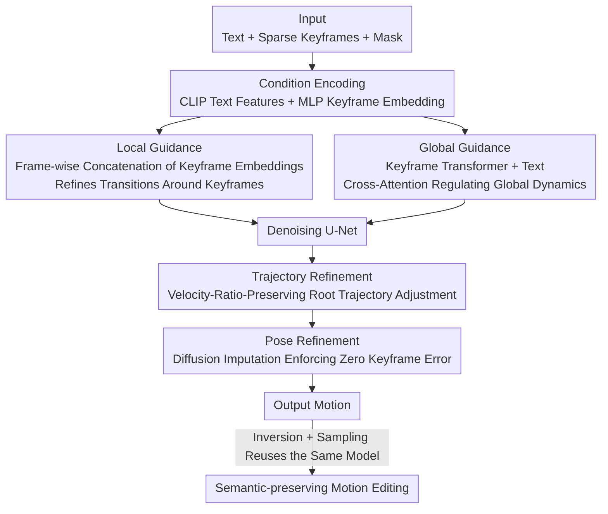

# Unifying Precise Keyframes and Semantic Control via Multi-level Diffusion

**Conference**: CVPR 2026  
**Paper**: [CVF Open Access](https://openaccess.thecvf.com/content/CVPR2026/html/Wu_Unifying_Precise_Keyframes_and_Semantic_Control_via_Multi-level_Diffusion_CVPR_2026_paper.html)  
**Code**: None  
**Area**: Human Motion Generation / Diffusion Models  
**Keywords**: Text-guided Motion In-betweening, Keyframe Constraints, Multi-level Diffusion Guidance, Trajectory Refinement, Semantic-preserving Editing

## TL;DR
Addressing the pain point that "text only provides high-level semantics, while keyframes provide precise spatial-temporal constraints but are difficult to coordinate with text," this paper proposes a multi-level diffusion framework: local guidance uses individual keyframes to refine local transitions around them, while global guidance merges text with the implicit temporal cues of the entire keyframe sequence into a unified representation to control global dynamics; during inference, a velocity-ratio-preserving trajectory refinement combined with diffusion imputation-based pose refinement is proposed to convert keyframe constraints from "soft approximations" to "strictly satisfied zero-error constraints," which also naturally supports training-free, semantic-preserving motion editing, reducing Keyframe Error to 0 cm on HumanML3D.

## Background & Motivation
**Background**: Text-to-motion generation leverages natural language to provide intuitive semantic control, but text cannot specify spatial-temporal details such as "which frame to pose in what precise way." Conversely, motion in-betweening from keyframes provides precise spatial-temporal constraints but requires manually creating numerous keyframes to convey complete semantics, which is a tedious and time-consuming manual task. Consequently, recent controllable motion generation methods (e.g., CondMDI, OmniControl, MaskControl) have attempted to inject spatial constraints into text-conditioned generation to achieve the "best of both worlds."

**Limitations of Prior Work**: These methods suffer from two critical limitations. First, they only capture the **high-level semantics** of the text (action categories, sequential order of actions) but fail to align with the **low-level semantics** implicit within the keyframes (precise timing, subtle pose characteristics). As a result, the generated transitions are often "under-constrained"—for instance, even when keyframes specify "walking while holding an object," the model might redundantly perform a "pick up" action after the keyframe timing, or fail to maintain the "holding" pose while walking. Second, they treat keyframes as **soft constraints** rather than hard constraints, leaving noticeable offsets at the constrained frames in the generated motion; yet keyframes often define critical spatial relationships like foot-ground contact or hand-object grasping, where even a few centimeters of deviation can lead to physically implausible visual artifacts.

**Key Challenge**: There is an inherent tension between strictly satisfying keyframe hard constraints and maintaining text semantic diversity—overemphasizing keyframes can degrade transitions into deterministic interpolations, losing text semantics, while overemphasizing text can lead to deviation from keyframes. Meanwhile, text (explicit, high-level) and keyframes (sparse poses, implicit low-level timing) represent two complementary but heterogeneous guidance signals; poor coordination between them leads to control ambiguity.

**Goal / Key Insight**: The authors decouple the problem into two layers: (1) how to generate diverse text-guided transitions while strictly adhering to keyframes; (2) how to fuse text and keyframe guidances into precise "multi-level semantic control." The key observation is that text controls the global aspect, whereas keyframes affect both local dynamics and the global temporal structure; thus, guidance should also be decoupled into "global" and "local" levels. Furthermore, keyframe hard constraints should not be learned during training, but rather strictly enforced during the inference stage using a refinement strategy.

**Core Idea**: A multi-level diffusion framework—**local guidance** refines frames surrounding individual keyframes, and **global guidance** merges text with the implicit cues of the entire keyframe sequence into a unified representation to regulate the global dynamics; additionally, **inference-time trajectory refinement + pose refinement** are employed to reduce keyframe errors to zero, while the same diffusion model is reused for training-free, semantic-preserving editing.

## Method

### Overall Architecture
Given a text prompt and a set of sparse keyframes (with masks indicating which joints of which frames are constrained), the goal is to generate a motion sequence that strictly satisfies the spatial-temporal constraints while aligning with the joint semantics of "text + keyframes." The entire pipeline consists of two stages: during training, a **multi-level diffusion model** is learned (where local guidance and global guidance jointly modulate global dynamics and local patterns); during inference, a two-step refinement (**trajectory refinement $\rightarrow$ pose refinement**) is inserted at the late stages of denoising to enforce zero error on keyframes. The diffusion backbone is a Conv1D U-Net that predicts the clean motion $\hat{\mathbf{x}}_0 = p_\theta(\mathbf{x}_t, t, c)$, where $c$ represents the text and keyframe conditions. In addition, the trained model naturally supports **semantic-preserving editing**: utilizing a training-free invert-and-sample process, new keyframe constraints are satisfied while preserving the semantics of the original motion.

### Key Designs

**1. Multi-level Guidance Mechanism: Local for surrounding keyframes, Global for overall dynamics**

This is designed to address the pain point that "text only provides high-level semantics, while low-level timing cues in keyframes are neglected." The authors inject conditions through two pathways. **Local Guidance**: First, the spatial-temporal constraints of each frame are formulated as a feature matrix $\mathbf{K}\in\mathbb{R}^{N\times D}$ (unconstrained entries set to zero) and a binary mask $\mathbf{m_K}\in\{0,1\}^{N\times D}$. These are concatenated and passed through an MLP to obtain frame-wise keyframe embeddings $\mathbf{e}_k\in\mathbb{R}^{N\times D_k}$. During inference, the noise features $\mathbf{x}_t$ are passed through an MLP and concatenated frame-by-frame with the corresponding $\mathbf{e}_k$, then fed into the U-Net. This allows convolutions to adaptively adjust local variations in the vicinity of each keyframe, achieving precise spatial alignment. **Global Guidance**: Since keyframes form a sparse sequence with long-range temporal dependencies, frame-by-frame concatenation fails to capture the overall structure. Thus, a **Keyframe Transformer Encoder** is introduced. It concatenates $\mathbf{e}_k$ with a learnable token, adds positional encodings to mark temporal order, and uses the keyframe mask $\mathbf{m_K}$ to filter out masked embeddings. After passing through the Transformer, the **output corresponding to the learnable token** is extracted as a fixed-length, compact keyframe feature. This feature is concatenated with text features into a unified global feature, which is injected into the U-Net via cross-attention (where noise motion acts as query, and global feature acts as key/value). This allows the backbone to selectively fuse "textual intent + keyframe sequence cues" to drive global dynamics. The two pathways complement each other: global guidance shapes the overall dynamics based on text semantics and keyframe spatial-temporal distribution, while local guidance anchors transitions near each keyframe. Ablations show that using only LocG yields good FID but inaccurate spatial alignment, while using only GloG gives reasonable semantics but the worst spatial accuracy. Combining both outperforms all baselines.

**2. Trajectory Refinement: Distributing errors proportionally to root velocity, aligning keyframes without inducing foot sliding**

Due to the stochastic nature of diffusion, generated motions still exhibit spatial offset at the keyframes. Since all joints are defined relative to the root joint, the authors choose to adjust only the root trajectory to eliminate these offsets. A direct approach (such as using gradient iteration to minimize root position error as in OmniControl) has a pitfall: in a velocity representation, the gradient of a single-frame error will be **uniformly** backpropagated to all prior root velocities. This leads to a mismatch between root velocities and non-uniform motion dynamics (e.g., in a "walk-to-sit" sequence, the root still drifts even after the body has settled), and causes foot sliding due to physical misalignment between the adjusted trajectory and the original foot-ground contact patterns. The authors leverage a key finding—**the root velocity trend (its relative proportion) is the primary determinant of contact patterns**—and distribute the correction proportionally to velocity rather than uniformly. For the $i$-th segment between adjacent keyframes $K_{i-1}$ (frame $n_{i-1}$) and $K_i$ (frame $n_i$), the end-point root position error is first calculated as $\Delta \mathbf{r} = \mathrm{R}(\mathbf{K}_i) - \mathrm{R}(\hat{\mathbf{x}}_0^{n_i})$ (where $\mathrm{R}(\cdot)$ extracts the 3D root position). Then, correction weights are computed for each frame and dimension $d\in\{x,y,z\}$ proportional to the magnitude of the predicted root velocity $\hat{\mathbf{v}}_n$:

$$w_{n,d} = \frac{|\hat{\mathbf{v}}_{n,d}|}{\sum_{s=n_{i-1}}^{n_i-1}|\hat{\mathbf{v}}_{s,d}|}, \quad n_{i-1}\le n < n_i$$

The adjusted velocity is computed as $\tilde{\mathbf{v}}_{n,d} = \hat{\mathbf{v}}_{n,d} + w_{n,d}\cdot\Delta\mathbf{r}_d$, and integrated from $K_{i-1}$ back to the root position $\tilde{\mathbf{r}}_n$, replacing the original values using $\mathrm{ReplaceRoot}$. Consequently, stationary frames (with near-zero root displacement) undergo almost no adjustment, avoiding foot sliding, while high-speed frames absorb most of the correction. This strategy is applied auto-regressively segment-by-segment only during the final denoising steps when $\hat{\mathbf{x}}_0$ is close to the target.

**3. Pose Refinement: Diffusion imputation pinning keyframe poses for zero-error hard constraints**

Trajectory refinement only corrects the global root position and does not guarantee that the generated pose matches the user-specified keyframe joint-for-joint. To address this, the authors superimpose a layer of diffusion imputation: after trajectory refinement, the constrained entries are overwritten using the keyframe matrix $\mathbf{K}$ and mask $\mathbf{m_K}$—

$$\bar{\mathbf{x}}_0 = \mathbf{K}\odot\mathbf{m_K} + \tilde{\mathbf{x}}_0\odot(1-\mathbf{m_K})$$

(where $\odot$ denotes the Hadamard product), and the next step $\mathbf{x}_{t-1}$ is derived from $\bar{\mathbf{x}}_0$. Repeatedly applying this throughout the denoising process ensures that the final $\mathbf{x}_0$ strictly equals the keyframes at constrained positions (reducing Keyframe Error / KPE / KRE entirely to zero), while the unconstrained parts are naturally synthesized by the model to maintain realism. Trajectory refinement is responsible for "shifting the global root to the correct position first to preserve contact patterns and avoid foot sliding," while pose refinement is responsible for "pinning down local poses precisely." The two steps are sequential and complementary.

**4. Semantic-preserving Motion Editing: Training-free invert-and-sample reusing the same model**

Having unified semantic and spatial-temporal control, the trained diffusion model naturally supports interactive editing: given an original motion $\mathbf{x}_0$ and keyframe constraints $\mathbf{K}$ specifying modifications to certain frames, the goal is to strictly satisfy the new constraints while preserving the original semantics. The challenge is the lack of paired data for supervised learning. The authors bypass this with a training-free workflow: first, DDIM inversion is used to invert the original motion into a latent noise sequence $\mathbf{x}_T$. Denoising is then performed starting from $\mathbf{x}_T$ under the guidance of the keyframe targets. Because DDIM is approximately reversible with small step sizes, the denoising path closely follows the inversion trajectory, thereby preserving key semantics such as motion characteristics, timing, and pose features; fixed-point iteration is further employed to enhance semantic preservation. Combined with the aforementioned keyframe satisfaction capability, if an artist wants to lock a specific segment in place, they only need to set all frames in that segment as keyframes. The model will strictly preserve it while plausibly re-synthesizing the modified segments.

## Key Experimental Results

The dataset used is HumanML3D (resampled to SMPL-X format at 30 FPS following [25], 2–10 seconds / 60–300 frames, 22 joints). Evaluation metrics are categorized into four types: spatial accuracy (Keyframe Error, joint-wise Euclidean distance in cm between generated keyframes and inputs), semantic alignment, motion quality (FID / Skating Ratio / Jitter), and diversity. The authors additionally propose **SS Similarity (Segment-level Semantic Similarity)** to measure low-level semantics: a pre-trained TMR model is used to embed the "generated transition segments between adjacent keyframes" and their corresponding ground-truth (GT) segments into a semantic space to compute cosine similarity. A higher score indicates that the generated motion is more aligned with the low-level timing specified by the keyframes (whereas R-Precision / MM Dist can only reflect high-level semantics such as action categories).

### Main Results

Keyframe In-betweening (HumanML3D, first/last frames + 5 random middle frames as constraints):

| Method | Keyframe Error ↓ | SS Similarity ↑ | R-Precision(Top3) ↑ | FID ↓ | Skating ↓ | Jitter ↓ |
|------|------|------|------|------|------|------|
| Real (Ref) | 0.000 | 1.000 | 0.800 | 0.041 | — | 6.885 |
| OmniControl | 12.883 | 0.449 | 0.566 | 7.115 | 0.080 | 61.715 |
| CondMDI | 10.128 | 0.726 | 0.723 | 0.667 | 0.072 | 67.203 |
| MaskControl | 3.255 | 0.567 | 0.801 | 0.155 | 0.046 | 18.037 |
| **Ours** | **0.000** | **0.804** | **0.803** | **0.023** | **0.043** | **16.172** |

Ours achieves a strict satisfaction of 0 cm in spatial accuracy, while simultaneously achieving the best low-level semantics (SS Similarity of 0.804, far exceeding the runner-up CondMDI's 0.726) and motion quality (FID 0.023, Jitter 16.172). Optimization-based guidance methods (OmniControl/MaskControl) treat keyframes solely as spatial targets and ignore their semantic cues, leading to a very low SS Similarity.

Partial Joint Control (constraining root joint + random subset of end-effector joints, 5 frames): Ours leads across the board with Keyframe Error of 0.000, R-Precision of 0.813, and MM Dist of 2.426, while Skating of 0.043 is on par with SOTA.

### Ablation Study

| Configuration | Keyframe Error ↓ | KPE ↓ | KRE ↓ | FID ↓ | SS Sim ↑ |
|------|------|------|------|------|------|
| LocG (Local Guidance Only) | 3.709 | 0.861 | 3.482 | 0.037 | 0.751 |
| GloG (Global Guidance Only) | 9.464 | 2.005 | 9.016 | 0.083 | 0.765 |
| LocG + GloG | 2.933 | 0.668 | 2.759 | 0.037 | 0.806 |
| LocG + GloG + TraR | 0.667 | 0.699 | 0.000 | 0.032 | 0.807 |
| Full (+ Pose Refinement) | **0.000** | **0.000** | **0.000** | **0.023** | 0.804 |

(KPE = Joint error after root coordinates alignment; KRE = Root position error in the world coordinate system.)

### Key Findings
- **Complementary nature of dual-path guidance is indispensable**: Using GloG alone yields the worst spatial accuracy (KRE 9.016), and using LocG alone also falls short in spatial constraint satisfaction (Keyframe Error 3.709). Combining both improves all metrics comprehensively (KRE drops to 2.759, SS Similarity rises to 0.806).
- **Trajectory refinement aligns the root first**: Adding TraR directly reduces KRE to zero (world coordinate system root alignment) and reduces FID to 0.032. Figure 6 shows it outperforms "pure imputation (jittering at transitions)" and "uniform error distribution (drifting)."
- **Pose refinement fills the last mile**: The full model reduces KPE to 0 as well, ensuring strict satisfaction of keyframe constraints while further dropping FID to 0.023 (aligning the generated distribution closest to GT).
- **Robustness to keyframe sparsity**: R-Precision remains stable at around 0.80 when the number of intermediate keyframes $K\in\{0,5,10,20\}$. Even with $K=0$ (maximum gap up to 298 frames $\approx$ 9.93 seconds), the model remains functional. Denser keyframes yield higher SS Similarity and lower FID.
- **Equally precise and semantic-preserving editing**: Across 122 semantically similar motion pairs under pose editing/trajectory editing setups, the proposed method achieves 0 Keyframe Error. Both Source Similarity (0.756 / 0.886) and FID (0.284 / 0.418) outperform DNO.

## Highlights & Insights
- **Shifting "hard constraints" from training objectives to inference-time refinement**: Many methods attempt to force the network to learn constraint satisfaction during training (resulting in soft constraints and inaccurate alignment). This paper instead employs deterministic refinement in the late denoising stages to force satisfaction, cleanly driving the error to 0—a great example of "don't train what should be computed, and don't brute-force compute what should be learned."
- **Velocity-ratio-proportional error distribution is highly clever**: Leveraging the prior that "the root velocity trend determines contact patterns," the root position correction is distributed weighted by velocity magnitudes. This keeps stationary frames virtually untouched to prevent foot sliding, which is much cleaner than uniform distribution (causes drifting) or pure imputation (causes jitter). This concept is transferrable to any motion editing scenario requiring root trajectory adjustment without destroying contacts.
- **Global/local dual-level guidance** aligns with the physical intuition that "text controls global semantics, while keyframes govern local timing," and compressing sparse, long-range keyframe sequences into fixed-length global features using a Transformer's learnable token presents a highly practical paradigm for handling sparse temporal conditions.
- **Training-free reuse of a trained generative model for editing**: The combination of DDIM inversion + fixed-point iteration + "locking segments via keyframe settings" achieves semantic-preserving editing without requiring paired editing data, offering valuable reference for editing tasks that lack supervision.

## Limitations & Future Work
- The authors acknowledge: When text semantics conflict with spatial-temporal constraints (e.g., the motion requested by the text contradicts the post/pose of keyframes), the generated motion might slightly deviate from the text description—inherently, keyframe hard constraints take higher priority, and semantics back down.
- Personal observation: Trajectory refinement relies on the empirical prior that "the root velocity trend determines contact patterns." Whether this still holds true for fast, complex motions where contact patterns are weakly correlated with root velocity (e.g., rolling, aerial acrobatics) remains questionable. Furthermore, since the refinement is applied only during the final denoising steps, major prediction deviations in earlier steps may not be recoverable.
- The method is bound to HumanML3D / SMPL-X 22-joint representation and the Conv1D U-Net backbone. It has not been validated under more complex constraints, such as fine-grained hand motions, multi-person interactions, or contacts with scene objects. Additionally, SS Similarity relies on a pre-trained TMR, whose semantic space coverage affects the reliability of the metric.
- Future directions: Explicitly model text-keyframe conflicts with adjustable priority levels, introduce physics/contact-aware refinements, and extend to joint constraints spanning full-body, hands, and objects.

## Related Work & Insights
- **vs CondMDI [9]**: Both are keyframe + text in-betweening methods, but CondMDI treats keyframes as soft constraints, leading to a high Keyframe Error of 10.128 and redundant repetitive actions after keyframe timings. This work achieves 0 cm strict satisfaction via inference refinement and aligns low-level timing via global/local dual guidance (SS Similarity 0.726 $\rightarrow$ 0.804).
- **vs OmniControl / MaskControl [52, 35]**: Optimization-based guidance methods treat keyframes purely as spatial targets, neglecting their semantic cues, resulting in low SS Similarity (0.449 / 0.567). This work explicitly integrates the implicit semantic cues of keyframes, achieving a win-win in both spatial accuracy and semantics.
- **vs DNO [21] (Editing)**: DNO optimizes in the diffusion latent space for editing, yet Keyframe Error still ranges from 3–7 cm with weaker semantic preservation. This work utilizes training-free invert-and-sample, achieving 0 Keyframe Error and higher Source Similarity in editing scenarios.
- **Insights**: In dual-control tasks requiring "precise spatial constraints + high-level semantics," instead of forcing a network to learn hard constraints end-to-end, a better division of labor is "rely on conditions for soft semantics, and rely on inference-time deterministic refinement for hard constraints"—a paradigm that can serve as a reference for any generation tasks involving precise control points in image, video, or 3D domains.

## Rating
- Novelty: ⭐⭐⭐⭐ The combination of multi-level guidance, velocity-ratio-proportional trajectory refinement, and training-free semantic-preserving editing is novel, though individual components are largely assembled from prior techniques.
- Experimental Thoroughness: ⭐⭐⭐⭐ Evaluations cover in-betweening, partial joints, sparsity robustness, editing, along with a comprehensive component-by-component ablation study; the customized SS Similarity fills a gap in evaluating low-level semantics.
- Writing Quality: ⭐⭐⭐⭐ The progression from pain points to challenges and methodology is highly coherent, with figures (Fig 3/4/6) complementing the text well; some mathematical details require referring to the supplementary materials.
- Value: ⭐⭐⭐⭐ The zero-error keyframe satisfaction combined with semantic alignment is highly practical for animation pipelines, and the refinement concept is transferrable.

<!-- RELATED:START -->

## Related Papers

- [\[CVPR 2026\] ActAvatar: Temporally-Aware Precise Action Control for Talking Avatars](actavatar_temporally-aware_precise_action_control_for_talking_avatars.md)
- [\[CVPR 2026\] PC-Talk: Precise Facial Animation Control for Audio-Driven Talking Face Generation](pc-talk_precise_facial_animation_control_for_audio-driven_talking_face_generatio.md)
- [\[CVPR 2026\] BoostSLT: Boosting Sign Language Translation via a Plug-and-Play Diffusion-Based Semantic Enhancer](boostslt_boosting_sign_language_translation_via_a_plug-and-play_diffusion-based_.md)
- [\[CVPR 2026\] Focal–General Diffusion Model with Semantic Consistent Guidance for Sign Language Production](focal-general_diffusion_model_with_semantic_consistent_guidance_for_sign_languag.md)
- [\[CVPR 2026\] Multi-level Causal LLM-based Text-to-Motion Generation with Human Alignment (MoTiGA)](multi-level_causal_llm-based_text-to-motion_generation_with_human_alignment.md)

<!-- RELATED:END -->
