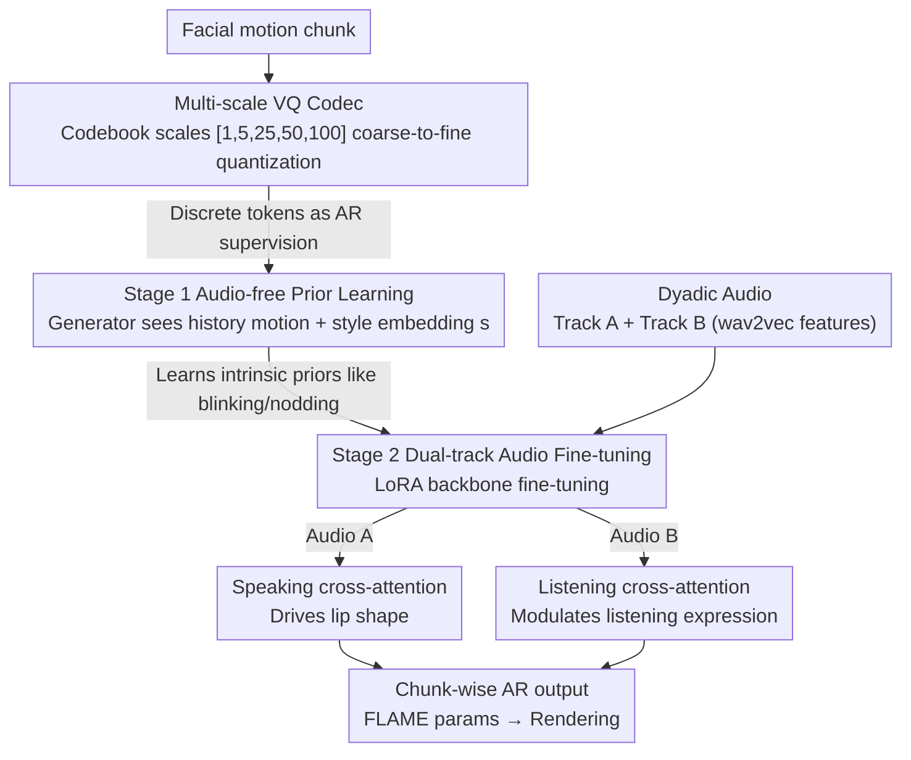

# UniLS: End-to-End Audio-Driven Avatars for Unified Listening and Speaking

**Conference**: CVPR 2026  
**arXiv**: [2512.09327](https://arxiv.org/abs/2512.09327)  
**Code**: None  
**Area**: Human Understanding  
**Keywords**: Dyadic avatars, Unified speaking-listening generation, Audio-driven, Facial animation, Two-stage training

## TL;DR
The first end-to-end unified speaking-listening facial expression generation framework, UniLS, is proposed. Through a two-stage training paradigm (learning intrinsic motion priors first, followed by dual-track audio fine-tuning), it simultaneously generates natural speaking and listening facial movements from dyadic audio inputs, achieving up to a 44.1% improvement in listening metrics.

## Background & Motivation

1. **Background**: Most existing systems in the dyadic avatar field are unidirectional—focusing either on speech-driven generation or listener generation. Authentic interaction requires avatars to possess both speaking and listening modes simultaneously.

2. **Limitations of Prior Work**:
    - **Speech-only methods** (e.g., FaceFormer, CodeTalker, ARTalk): While generating high-quality speaking movements, these neglect listening behavior, making them unsuitable for conversational scenarios.
    - **The only speaking-listening method DualTalk**: Relies on pre-computed facial sequences from speaker A to generate speaker B's actions. It is not end-to-end, requires additional motion acquisition/generation pipelines, and cannot be deployed in real-time.
    - **Direct end-to-end joint training failure**: Leads to stiff, unnatural listening expressions (the "poker face" phenomenon).

3. **Key Challenge**: Speaking movements are strongly correlated with audio (phoneme-viseme alignment), whereas listening movements have a weak correlation with the interlocutor's audio. Listening behaviors like blinking, nodding, and micro-expressions primarily stem from intrinsic motion priors rather than external speech signals. This imbalance in audio-motion correlation causes the listening branch to collapse into a low-variance, static prior during joint training.

4. **Goal**: Design an end-to-end framework to simultaneously generate speaking + listening facial movements for both speakers A and B using only dyadic audio, addressing the stiffness of listening expressions.

5. **Key Insight**: Listening behavior is reinterpreted as a combination of "intrinsic motion priors" and "external audio modulation." A person's listening expressions first follow their own motion patterns (e.g., blink frequency, subtle nods) and are then modulated by external speech.

6. **Core Idea**: Decouple the learning of intrinsic listening dynamics and external audio modulation via two-stage training—learning motion priors without audio first, followed by dual-track audio fine-tuning—to resolve the listening stiffness in end-to-end systems.

## Method

### Overall Architecture
UniLS aims to generate speaker A's speaking movements and speaker B's listening movements simultaneously from two audio tracks (one for each speaker) without producing a "poker face." The system is a chunk-level autoregressive model that segments facial motion into temporal blocks to predict the next block. The output consists of 3D facial representations described by FLAME parameters (expression $\psi$ and pose $\theta$), which are finally rendered into avatars.

The key is the sequential two-stage training. Initially, a multi-scale VQ codec is trained to compress continuous facial motion into discrete tokens as supervision targets for the autoregressive generator. In Stage 1, the generator is trained **without audio** to force it to learn the intrinsic rhythms of natural faces. Stage 2 introduces dual-track audio for fine-tuning. This "prior-before-modulation" sequence prevents the dominant speaking audio signals from suppressing the weaker listening branch during training.

### Key Designs

**1. Multi-scale VQ Codec: Discretizing facial motion into fine and coherent tokens**

The autoregressive generator requires discrete supervision targets. However, facial motion contains both fast-changing (lips, blinks) and slow-changing (head pose drift) components across different timescales. A single-resolution quantization either loses detail or coherence. The approach uses layer-wise, coarse-to-fine quantization: a Transformer encoder encodes motion chunk $M$ into temporal features $\mathbf{f}$, which is then approximated layer-by-layer using codebooks with scales $[1, 5, 25, 50, 100]$. Each layer performs quantization, interpolates back to the original length, and subtracts the represented portion from the residual:

$$\mathbf{c}^{(l+1)} = \text{Interp}(\text{Quant}(\mathbf{f}^{(l)}), k_l), \qquad \mathbf{f}^{(l+1)} = \mathbf{f}^{(l)} - \mathbf{c}^{(l+1)}$$

Coarse scales capture the overall trajectory, while fine scales capture local jitters (256 entries per codebook, 64 dimensions). This results in tokens that are both high-fidelity and temporally coherent.

**2. Stage 1 Audio-free Prior Learning: Learning "natural facial behavior" first**

This step addresses the key challenge: listening behaviors like blinking and micro-nodding stem from individual habits rather than the interlocutor's speech. If audio is included from the start, the listening branch converges to a static "safe" solution. Thus, Stage 1 **deliberately excludes audio**. The generator $\mathcal{G}$ only observes historical motion chunks and a style embedding $\mathbf{s}$ representing individual habits to predict the next chunk:

$$\hat{M}_{t:2t} = \mathcal{G}(M_{1:t}, \mathbf{s}), \qquad \mathcal{L} = \sum_{t=1}^{T} \lVert \hat{M}_{t:2t} - M_{t:2t} \rVert$$

Training utilizes 546.5 hours of unpaired video data (news, interviews, daily vlogs) to build a foundation for intrinsic dynamics like blink frequency and subtle head movements.

**3. Stage 2 Dual-track Audio Fine-tuning: Distinguishing "Self" vs. "Other" via independent cross-attention**

Stage 2 introduces audio using paired conversational data. Speaking is driven by self-audio, while listening is modulated by the interlocutor's audio. To handle two audio tracks with opposing functions, **two** independent cross-attention modules are added to each Transformer block: one for speaker A's audio features $\mathbf{a}^A$ (speaking) and one for speaker B's audio features $\mathbf{a}^B$ (listening):

$$\hat{M}_{t:2t} = \mathcal{G}(M_{1:t}, \mathbf{a}^A_{1:t}, \mathbf{a}^B_{1:t}, \mathbf{s})$$

Audio features are extracted using a frozen wav2vec encoder. Splitting into two paths is critical; mixing them into a single cross-attention prevents the model from distinguishing which audio drives the lips, causing speaking quality to collapse (LVE degrades from 5.83 to 11.48). LoRA is used for lightweight backbone fine-tuning to preserve the Stage 1 motion priors while training the new cross-attention modules from scratch.

### Loss & Training
Both stages utilize chunk-wise autoregressive reconstruction loss. Stage 1 training takes ~10 GPU hours on 4x H200 cards, and Stage 2 takes ~30 GPU hours. Optimizer: AdamW, Learning Rate: 1e-4, Batch size: 128, total 200K iterations.

## Key Experimental Results

### Main Results
Evaluated on the Seamless Interaction test set for speaking and listening performance.

| Method | LVE↓ | MHD↓ | Speak FDD↓ | Speak PDD↓ | Speak JDD↓ | Listen FDD↓ | Listen PDD↓ | Listen JDD↓ | F-FID↓ | P-FID↓ |
|------|------|------|---------|---------|---------|---------|---------|---------|--------|--------|
| DiffPoseTalk | 9.48 | 2.96 | 32.66 | 7.89 | 1.40 | - | - | - | - | - |
| ARTalk | 7.46 | 2.12 | 31.64 | 7.66 | 1.19 | - | - | - | - | - |
| ARTalk* | 6.79 | 2.02 | 27.41 | 8.55 | 0.81 | 30.62 | 9.52 | 1.53 | 10.78 | 0.072 |
| DualTalk | 6.35 | 1.95 | 37.46 | 9.70 | 1.02 | 43.58 | 10.71 | 2.02 | 13.14 | 0.079 |
| **Ours** | **5.83** | **1.89** | **18.41** | **4.67** | **0.71** | **17.12** | **4.75** | **0.98** | **4.30** | **0.038** |

### Ablation Study

| Configuration | LVE↓ | MHD↓ | Listen FDD↓ | F-FID↓ | Description |
|------|------|------|---------|--------|------|
| Single cross-attention | 11.48 | 3.00 | 27.46 | 5.97 | Mixed audio causes speaking degradation |
| w/o Stage 1 | 6.32 | 2.02 | 25.64 | 5.97 | Lack of motion prior causes listening stiffness |
| w/o Multi-scene data | 6.26 | 1.99 | 17.81 | 4.62 | Data diversity benefits listening |
| Full UniLS | **5.83** | **1.89** | **17.12** | **4.30** | Optimal synergy of all components |

### Key Findings
- **Massive improvement in listening metrics**: UniLS's F-FID (4.30) is 67.3% lower than DualTalk (13.14), and P-FID is 51.9% lower, indicating the distribution of generated listening movements is much closer to real data.
- **SOTA speaking accuracy**: achieving the lowest LVE (5.83), indicating superior lip-sync precision.
- **Dual cross-attention is vital**: A single cross-attention nearly doubles LVE (11.48), as the model cannot distinguish signals within the mixed audio stream.
- **Stage 1 is indispensable**: Removing Stage 1 increases listening FDD by 50% (17.12 to 25.64), validating the core role of motion prior learning.
- In a user study with 25 participants, the preference for UniLS over DualTalk in listening quality reached 91.35%.

## Highlights & Insights
- **Precise analysis of "audio-motion correlation imbalance"**: t-SNE visualizations clearly demonstrate strong alignment for speaking vs. weak alignment for listening, accurately locating the problem's nature.
- **Elegant two-stage decoupled design**: Learning the motion prior first and fine-tuning with LoRA preserves diversity while introducing control. This "prior-then-modulate" approach is transferable to other tasks with multimodal imbalances.
- **First end-to-end speaking-listening framework**: Driven directly by dyadic audio without requiring pre-generated sequences for the interlocutor, offering significant practical value for real-time dialogue systems.

## Limitations & Future Work
- Currently handles only facial movements (FLAME parameters); full-body avatars require body poses and gestures.
- Evaluation relies on distributional metrics (FID); there is a lack of assessment regarding the "timing" and "semantic relevance" of listening reactions.
- Requires large-scale paired conversational data (657.5 hours), which is costly to obtain.
- Extension to multi-party dialogue (>2 people) has not yet been explored.

## Related Work & Insights
- **vs. DualTalk**: DualTalk requires pre-computing speaker A's facial sequence and is not end-to-end. Ours uses only dyadic audio, reducing listening F-FID from 13.14 to 4.30.
- **vs. ARTalk***: An adapted baseline (adding extra audio input), but listening remains stiff; its F-FID (10.78) is significantly higher than UniLS (4.30).
- **vs. FaceFormer/CodeTalker**: These speech-only methods do not handle listening at all; UniLS also surpasses them in speaking precision.

## Rating
- Novelty: ⭐⭐⭐⭐⭐ First end-to-end speaking-listening framework; two-stage training solves the root cause of listening stiffness.
- Experimental Thoroughness: ⭐⭐⭐⭐ Quantitative + User Study + Ablation are solid, though temporal semantic alignment evaluation is missing.
- Writing Quality: ⭐⭐⭐⭐⭐ Motivation analysis is deep, and visualizations are intuitive.
- Value: ⭐⭐⭐⭐⭐ Significant push for interactive avatar systems.

<!-- RELATED:START -->

## Related Papers

- [\[CVPR 2026\] MatchED: Crisp Edge Detection Using End-to-End, Matching-based Supervision](matched_crisp_edge_detection_using_end-to-end_matching-based_supervision.md)
- [\[CVPR 2026\] AudioAvatar: Personalized Audio-driven Whole-body Talking Avatars](audioavatar_personalized_audio-driven_whole-body_talking_avatars.md)
- [\[CVPR 2026\] PolySLGen: Online Multimodal Speaking-Listening Reaction Generation in Polyadic Interaction](polyslgen_online_multimodal_speaking-listening_reaction_generation_in_polyadic_i.md)
- [\[CVPR 2025\] CryptoFace: End-to-End Encrypted Face Recognition](../../CVPR2025/human_understanding/cryptoface_end-to-end_encrypted_face_recognition.md)
- [\[CVPR 2025\] WiLoR: End-to-end 3D Hand Localization and Reconstruction in-the-wild](../../CVPR2025/human_understanding/wilor_end-to-end_3d_hand_localization_and_reconstruction_in-the-wild.md)

<!-- RELATED:END -->
