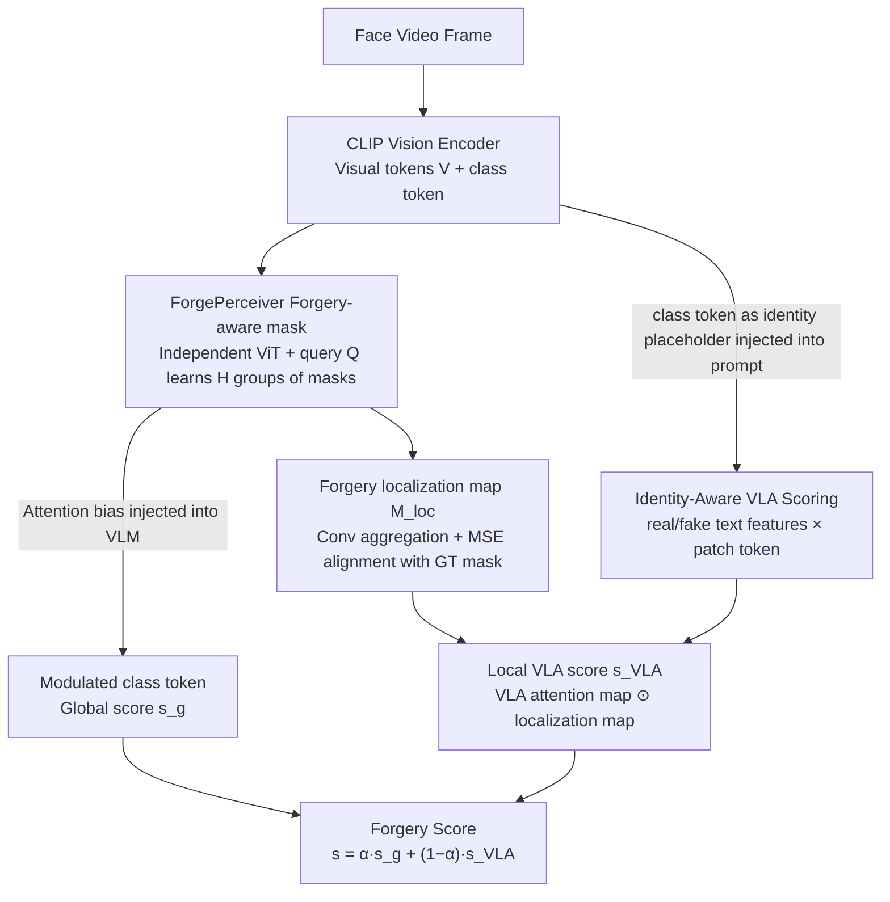

# Unleashing Vision-Language Semantics for Deepfake Video Detection

**Conference**: CVPR 2026  
**arXiv**: [2603.24454](https://arxiv.org/abs/2603.24454)  
**Code**: [https://github.com/mala-lab/VLAForge](https://github.com/mala-lab/VLAForge)  
**Area**: Face Understanding / Deepfake Detection  
**Keywords**: Deepfake Detection, Vision-Language Alignment, CLIP, Attention Module, Identity-Aware

## TL;DR

This paper proposes VLAForge, which independently learns diverse forgery cues and localization maps through ForgePerceiver and integrates an identity-aware Vision-Language Alignment (VLA) scoring mechanism. By unleashing the potential of cross-modal semantics from Vision-Language Models (VLMs) to enhance discriminative capabilities, the method consistently outperforms existing SOTA methods across nine datasets.

## Background & Motivation

1. **Background**: Deepfake Video Detection (DFD) aims to identify the authenticity of facial videos. Traditional methods primarily focus on detecting spatial artifacts or temporal inconsistencies. Recently, methods based on pre-trained Vision-Language Models (VLMs) like CLIP have gained attention due to their powerful generalization capabilities.

2. **Limitations of Prior Work**: Existing VLM-based methods mainly enhance the vision encoder itself through adapter tuning, bias correction, or spatio-temporal modeling. However, they neglect the most unique advantage of VLMs—the rich vision-language semantics in the latent space. These methods only utilize single-modality visual features and fail to exploit the discriminative potential of cross-modal semantics.

3. **Key Challenge**: The vision encoders of VLMs are pre-trained to understand semantic objects in images rather than detecting forgery artifacts. When directly applied to DFD, attention often shifts to objects unrelated to the forgery. Simultaneously, manipulated facial regions often exhibit diverse and heterogeneous low-level artifacts (boundary inconsistencies, texture distortions), which are difficult for semantic-oriented VLM vision encoders to capture effectively.

4. **Goal**: (1) How to enhance visual perception of forgery artifacts without damaging the pre-trained knowledge of the VLM? (2) How to utilize the inherent vision-language alignment of the VLM to provide complementary fine-grained discriminative cues?

5. **Key Insight**: By injecting identity priors into text prompts, vision-text alignment can be adapted into a more fine-grained form, allowing the model to capture authenticity cues customized for each individual.

6. **Core Idea**: Use an independent ForgePerceiver to learn diverse forgery cues to modulate VLM visual tokens, while releasing VLM cross-modal semantics for patch-level authenticity judgment via identity-prior-enhanced text prompts. The fusion of both achieves global and local discrimination.

## Method

### Overall Architecture

Built upon CLIP, VLAForge consists of two core components: ForgePerceiver and Identity-Aware VLA Scoring. ForgePerceiver serves as an independent visual forgery learner for the VLM, generating forgery-aware masks to modulate the VLM's class token (global discrimination) and outputting forgery localization maps (local cues). Identity-Aware VLA Scoring enhances text prompts with identity priors to calculate patch-level VLA attention maps, which are fused with forgery localization maps to produce local authenticity scores. The final authenticity score is a weighted combination of the global and local branches.

### Key Designs

**1. ForgePerceiver's forgery-aware mask: Letting the VLM class token "see" artifacts it is naturally insensitive to**

The CLIP vision encoder is pre-trained for object recognition; the class token is naturally insensitive to low-level artifacts like boundary inconsistencies or texture distortions. Direct application for detection leads to attention drifting toward forgery-irrelevant objects. Instead of modifying the VLM, VLAForge introduces a lightweight ViT as an independent "forgery learner": it receives visual tokens $\mathbf{V}$ from the VLM and a set of learnable query tokens $\mathbf{Q}$, calculating $H$ groups of head-wise forgery-aware masks $\mathcal{M}_i = \hat{\mathbf{Q}} \hat{\mathbf{V}}_i^\top$ based on the similarity between queries and visual features. These masks are not used to cover the image but serve as attention biases injected into the VLM self-attention:

$$\mathbf{z}_j^{(l)} = \text{softmax}\Big(\frac{\mathbb{Q}_j^{(l)} \mathbb{K}_P^{\top(l)}}{\sqrt{d}} + \mathcal{M}_{i,j}\Big) \mathbb{V}_P^{(l)}$$

The bias directs VLM attention toward forgery regions, allowing the class token to accumulate forgery-related semantics from multiple complementary perspectives. Since the perception masks are learned by an external ViT and applied via additive bias, pre-trained knowledge remains intact. Multiple queries focus on different types of artifacts, preventing the class token from focusing on a single cue. Orthogonal constraints $\mathcal{L}_{orth}$ are applied to query-level masks to ensure functional diversity.

**2. Forgery localization map: Providing spatial supervision and a foundation for local discrimination**

Learning masks via queries without spatial label constraints can lead to unstable priors. Here, a projection $g_3(\cdot)$ maps visual tokens into a task-adaptive space to calculate localization maps for each query. These are then aggregated by a convolutional head into a coarse region-aware forgery localization map $\mathbf{M}_{loc} = h([\tilde{\mathcal{M}}_1, \ldots, \tilde{\mathcal{M}}_q])$, aligned with GT forgery masks using MSE loss. Crucially, this supervision is applied to the aggregated map rather than individual queries, preserving mask diversity while calibrating the forgery prior to correct spatial positions and providing a local cue map for subsequent VLA scoring.

**3. Identity-Aware VLA Scoring: Utilizing VLM vision-language alignment as a discriminative signal**

While the previous steps enhance the vision encoder, they do not touch the VLM's cross-modal semantics. Existing VLM detection methods often perform only image-level global alignment, failing to provide patch-level real/fake correspondences. VLAForge constructs a prompt template: `"This is a real/fake photo of <id> person."`, replacing the `<id>` placeholder directly with the class token embedding $\mathbf{z}^{(L)}$ from the VLM's final layer. This step injects the identity prior of the current face into the text side. Since the embedding is already in the VLM's text encoding space, no additional alignment is required. The text encoder yields two identity-aware features, $\mathbf{F}_r$ and $\mathbf{F}_f$, which are used with each patch token to generate a VLA attention map:

$$\mathbf{M}_{VLA}(i,j) = \frac{\exp(\phi(\mathbf{P}(i,j))\mathbf{F}_f^\top)}{\sum_{c}\exp(\phi(\mathbf{P}(i,j))\mathbf{F}_c^\top)}$$

Element-wise fusion with the localization map from step 2 produces the local VLA score. This identity-aware approach works because it refines alignment from "does this image look real?" to "does this specific person's region look real?", precisely highlighting manipulated areas for fake samples while remaining inactive for real samples.

### Loss & Training

- Total Loss: $\mathcal{L}_{final} = \mathcal{L}_{loc} + \mathcal{L}_{VLA} + \mathcal{L}_G + \mathcal{L}_L$
- $\mathcal{L}_G$: Global-level binary cross-entropy loss (based on modulated class tokens).
- $\mathcal{L}_L$: Local-level binary cross-entropy loss (based on VLA fusion scores).
- $\mathcal{L}_{loc}$: MSE loss supervising the forgery localization map.
- $\mathcal{L}_{VLA}$: Dice loss supervising the VLA attention map.
- Inference final score: $s(x') = \alpha s_g' + (1-\alpha)s_{VLA}'$, where $\alpha$ balances global and local contributions.

## Key Experimental Results

### Main Results

| Dataset | Metric (AUROC) | VLAForge | Prev. SOTA (ForAda) | Gain |
|--------|------|------|----------|------|
| CDF-v1 (Frame) | AUROC | 93.9% | 91.4% | +2.5% |
| CDF-v2 (Frame) | AUROC | 91.2% | 90.0% | +1.2% |
| DFDC (Frame) | AUROC | 87.0% | 84.3% | +2.7% |
| DFD (Frame) | AUROC | 93.6% | 93.3% | +0.3% |
| CDF-v2 (Video) | AUROC | 96.8% | 95.7% | +1.1% |
| DFDC (Video) | AUROC | 89.6% | 87.2% | +2.4% |
| DFD (Video) | AUROC | 97.2% | 96.5% | +0.7% |
| VQGAN (Frame) | AUROC | 98.4% | 93.9% | +4.5% |
| SiT (Frame) | AUROC | 77.4% | 69.0% | +8.4% |

### Ablation Study

| Configuration | CDF-v2 (Frame) | DFDC (Frame) | DFD (Frame) | Description |
|------|---------|------|------|------|
| Base (CLIP) | 58.3% | 64.0% | 77.5% | Basic CLIP Encoder |
| +T1 (Forgery Mask) | 76.3% | 76.0% | 74.6% | Multi-mask modulation |
| +T2 (Localization) | 82.3% | 80.9% | 87.4% | Forgery localization supervision |
| +T3 (VLA Score) | 90.8% | 86.5% | 92.8% | Identity-aware VLA |
| +T4 (Orthogonal) | 91.2% | 87.0% | 93.6% | Full Model |

### Key Findings

- Every component contributes significantly: From Base to Full, CDF-v2 frame-level AUROC improved from 58.3% to 91.2%.
- Forgery-aware masks (+T1) provided the largest single-step improvement (58.3% $\rightarrow$ 76.3% on CDF-v2), indicating that enhancing VLM visual perception is crucial.
- VLA scoring provides a vital complementary gain (+T3 improved CDF-v2 from 82.3% $\rightarrow$ 90.8%), proving the discriminative value of cross-modal semantics.
- Improvements are more pronounced in full-face generation scenarios (GAN/Diffusion)—SiT frame-level improved from 69.0% to 77.4%, suggesting VLA semantics are more robust against novel forgeries.
- The orthogonal constraint provides a smaller but steady gain, ensuring queries learn complementary forgery priors.

## Highlights & Insights

- The approach to unleashing VLM cross-modal semantics is unique—not only enhancing the vision encoder but using the vision-language alignment itself as a discriminative signal, a direction previously neglected.
- Identity-prior injection into text prompts is cleverly designed: using the VLM class token as the embedding for the `<id>` placeholder naturally encodes identity and fits the VLM text encoding space.
- The ForgePerceiver as an independent learner protects pre-trained VLM knowledge while achieving information injection through mask modulation rather than direct modification.
- Visualizations of the VLA attention map demonstrate significant differences between fake and real samples—precisely highlighting forgery regions on fake samples while remaining inactive on real ones.

## Limitations & Future Work

- The identity prior originates from the VLM's own class token; if the extracted visual features lack discriminative power, the identity prior quality may be compromised.
- While cross-dataset evaluation is comprehensive, training is mainly performed on FF++, whereas real-world data distributions are more complex.
- Weights for multiple loss functions are set to 1, lacking an exploration of the relative importance of different losses.
- Currently, only CLIP is used as the backbone; stronger VLMs (e.g., SigLIP, EVA-CLIP) may yield further improvements.

## Related Work & Insights

- **vs ForAda**: ForAda tunes the CLIP vision encoder via adapters (pure vision enhancement). VLAForge additionally utilizes cross-modal alignment semantics, outperforming it by 2.7% on DFDC frame-level.
- **vs RepDFD**: RepDFD uses external face embeddings to generate sample-specific text prompts to reprogram the VLM, but only performs image-level global alignment. VLAForge achieves patch-level fine-grained alignment.
- **vs FFTG**: FFTG uses synthetic image-text pairs and masks to enhance interpretability, but text descriptions are additional rather than adapted from inherent VLM alignment. VLAForge directly releases the VLM's internal cross-modal discriminative power.

## Rating

- Novelty: ⭐⭐⭐⭐⭐ Systematically releases VLM cross-modal semantics for DFD; identity prior design is clever.
- Experimental Thoroughness: ⭐⭐⭐⭐⭐ 9 datasets, frame+video levels, classic face-swapping + full-face generation categories.
- Writing Quality: ⭐⭐⭐⭐ Method descriptions are clear; visualizations are persuasive.
- Value: ⭐⭐⭐⭐⭐ Opens a new direction for VLM applications in DFD; achieves comprehensive SOTA.

<!-- RELATED:START -->

## Related Papers

- [\[CVPR 2026\] All in One: Unifying Deepfake Detection, Tampering Localization, and Source Tracing with a Robust Landmark-Identity Watermark](all_in_one_unifying_deepfake_detection_tampering_localization_and_source_tracing.md)
- [\[CVPR 2026\] Vision-Language Attribute Disentanglement and Reinforcement for Lifelong Person Re-Identification](vision-language_attribute_disentanglement_and_reinforcement_for_lifelong_person_.md)
- [\[ICLR 2026\] LINK: Learning Instance-level Knowledge from Vision-Language Models for Human-Object Interaction Detection](../../ICLR2026/human_understanding/link_learning_instance-level_knowledge_from_vision-language_models_for_human-obj.md)
- [\[CVPR 2026\] DecoVLN: Decoupling Observation, Reasoning, and Correction for Vision-and-Language Navigation](decovln_decoupling_observation_reasoning_and_correction_for_vision-and-language_.md)
- [\[CVPR 2026\] Real-Time Multimodal Fingertip Contact Detection via Depth and Motion Fusion for Vision-Based Human-Computer Interaction](real-time_multimodal_fingertip_contact_detection_via_depth_and_motion_fusion_for.md)

<!-- RELATED:END -->
