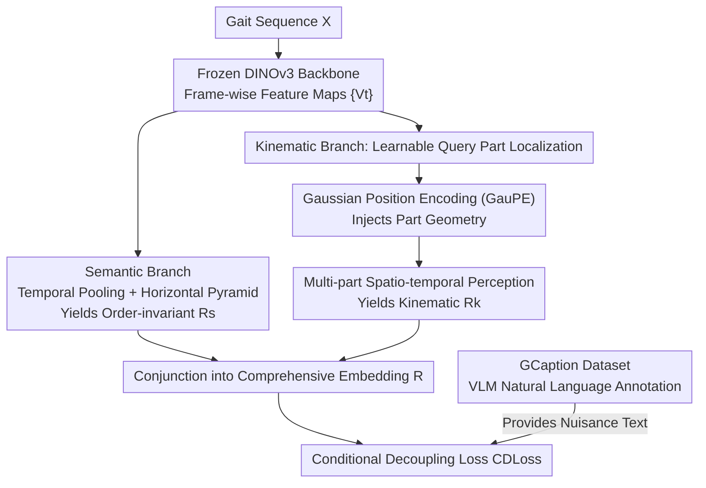

# Unlocking Motion from Large Vision Models with a Semantic and Kinematic Duality for Gait Recognition

**Conference**: CVPR 2026  
**Paper**: [CVF Open Access](https://openaccess.thecvf.com/content/CVPR2026/html/Huang_Unlocking_Motion_from_Large_Vision_Models_with_a_Semantic_and_CVPR_2026_paper.html)  
**Code**: https://zbhuang.com/gait-max  
**Area**: Human Understanding / Gait Recognition  
**Keywords**: Gait Recognition, Motion Modeling, Large Vision Models, Decoupled Learning, Vision-Language Supervision

## TL;DR
GaitMax utilizes a frozen DINOv3 Large Vision Model (LVM) to concurrently deploy a "Semantic Branch" (capturing global, order-invariant silhouettes) and a "Kinematic Branch" (tracking spatio-temporal trajectories of body parts via learnable queries). It incorporates a Conditional Decoupling Loss (CDLoss) to suppress shortcuts by de-correlating gait embeddings from textual descriptions of distractors (e.g., clothing, viewpoint) using second-order statistics. Supported by the self-constructed GCaption dataset with natural language labels, GaitMax achieves new SOTA performance across multiple cross-domain gait benchmarks.

## Background & Motivation
**Background**: Gait recognition identifies individuals from a distance based on walking posture. The mainstream "Semantic Paradigm" (represented by GEI, GaitSet, and GaitBase) pools silhouette or feature maps across a gait cycle along the temporal dimension to obtain a global, **order-invariant** embedding. This approach is robust to single-frame noise, requires no complex temporal modeling, and is simple yet effective.

**Limitations of Prior Work**: Order-invariance is a double-edged sword. By pooling away the temporal sequence, the model **cannot represent the dynamic process of motion**. Fine-grained part coordination, such as whether ipsilateral limbs swing synchronously, is lost. To recover dynamics, the "Kinematic Paradigm" (e.g., GFI, AttenGait) introduces optical flow to model spatio-temporal information. However, optical flow has two major weaknesses: 1) It estimates motion indiscriminately at the **pixel level**, ignoring the fact that the human body is an "articulated rigid body." This is computationally expensive and sensitive to noise in low-resolution or low-light conditions common in gait. 2) It only performs **short-term** frame-to-frame modeling, failing to cover long-range dependencies within a complete gait cycle.

**Key Challenge**: There is a disconnection between global semantics (robust but lacking dynamics) and fine-grained kinematics (dynamic but dependent on fragile optical flow), with no unified framework to bridge them. Furthermore, when using powerful LVMs like DINOv3 as encoders, they tend to encode **all** appearance information (clothing color, baggage, viewpoint). Higher representation capacity leads to a higher risk of learning "shortcuts" (e.g., identifying people by their clothes), causing performance collapse in out-of-distribution (OOD) cross-domain scenarios.

**Goal**: 1) Design a "human-centric" kinematic branch that models long-range sparse motion without relying on optical flow; 2) Integrate it with the semantic branch into a unified framework; 3) Explicitly decouple gait embeddings from nuisance factors.

**Key Insight**: It is observed that LVMs (DINOv3) possess significant potential for part localization. By using DETR-style learnable queries to "ask" where individual body parts are, the model can obtain part-level attention. By encoding the geometry of these attention regions, part trajectories can be reconstructed without computing optical flow.

**Core Idea**: A dual-branch framework unifying "Semantics + Kinematics" is proposed to capture global and process-level motion. A "Vision-Language Supervised Conditional Decoupling Loss" is used to statistically independent the embeddings from textual descriptions of nuisance factors.

## Method

### Overall Architecture
GaitMax maps a gait sequence $X$ to an identity embedding $R \in \mathbb{R}^{n\times d}$. The overall optimization objective combines an identity discrimination loss with a decoupling regularizer:

$$\theta^* = \arg\min_\theta \left[ \mathcal{L}_{id}(R, y) + \lambda \mathcal{L}_{cd}(R, N) \right]$$

where $N$ represents nuisance factors. Specifically, a frozen DINOv3 backbone $\phi$ encodes each frame $X_t$ into a feature map $V_t$. These maps $\{V_t\}$ are fed into two branches: the **Semantic Branch** performs spatial enhancement, temporal mean pooling, and Horizontal Pyramid Pooling (HPP) to extract the order-invariant $R_s$; the **Kinematic Branch** uses learnable queries for part localization, injects geometry via Gaussian Position Encoding (GauPE), and performs multi-part spatio-temporal perception to obtain $R_k$. These are concatenated to form the comprehensive embedding $R$. During training, in addition to the identity loss, CDLoss is applied to decouple $R$ from textual embeddings of distractors provided by the self-constructed GCaption dataset.

### Key Designs

**1. Complementary Dual-branch Motion Representation: Global Silhouettes + Part Trajectories**

To address the "semantics lack dynamics, kinematics rely on flow" challenge, GaitMax integrates both paradigms rather than choosing one. The semantic branch follows established practices: feature maps $\{V_t\}$ are enhanced by a frame-level encoder $\psi_p$, then temporal mean pooling $P_t$ flattens the time dimension (achieving order-invariance and suppressing noise), followed by Horizontal Pyramid Pooling $P_s$ into $n_1$ strips to extract spatial embeddings $R_s = P_s(P_t(\{\psi_p(V_t)\}))$. This excels in global matching when appearance changes are minimal. Conversely, the kinematic branch explicitly models part-level temporal trajectories over long ranges. Ablations (Table 5) confirm their complementarity: the semantic branch outperforms the kinematic branch by +2.7% under the BG (backpack) protocol, while the kinematic branch surpasses the semantic branch by +6.7% for CL (clothing change)—where global silhouettes fail but part motion rhythms remain identifiable.

**2. Learnable Query Part Localization: "Pointing Out" Body Parts via LVM**

To avoid optical flow for part motion, $n_2$ learnable queries $q$ are introduced, each responsible for **consistently tracking a specific body part** across all time steps. For each frame, using $q$ as the query and vectorized features $v_t=\text{vec}(V_t)$ as key/values, cross-attention with temperature enhancement yields an attention map $a$ and part latent features $m$:

$$a = \text{Softmax}\!\left(\frac{(qW_q)(v_tW_v)^\top/\tau}{\sqrt{d}}\right),\quad m = a(v_tW'_v)$$

To prevent multiple queries from focusing on the same region, a diversity loss $\mathcal{L}_{div}$ is added to penalize off-diagonal elements of the similarity matrix $A=[a_1,\dots,a_{n_2}]^\top$: $\mathcal{L}_{div}=\mathbf{1}^\top(AA^\top)\mathbf{1}-\text{tr}(AA^\top)$. This forces queries to attend to spatially non-overlapping parts. This transforms part localization into a "soft probe" of the LVM without requiring keypoint or parsing annotations.

**3. Gaussian Position Encoding (GauPE): Encoding Shape and Orientation**

The human body is an articulated rigid body; a part consists not just of a position, but also size and orientation. Standard RoPE only encodes position. GauPE parameterizes the salient region of each attention map $a$ using **moment matching** into a Gaussian covariance ellipse, yielding geometric attributes: centroid $(\mu_x,\mu_y)$ for position, variances $(\sigma_x^2,\sigma_y^2)$ for scale, and covariance $\sigma_{xy}$ for orientation. Different geometric components are injected via specialized mechanisms: centroids capture **inter-frame** motion and are injected via rotation (similar to RoPE); shape parameters $\sigma=\{\sigma_x^2,\sigma_y^2,\sigma_{xy}\}$ describe **intra-frame** attributes and are directly concatenated:

$$\bar{m} = \left[\sigma,\ R(\omega_i\mu_x)m^{(x)},\ R(\omega_i\mu_y)m^{(y)}\right]$$

where $m^{(x)}, m^{(y)}$ are halves of the feature $m$, $R(\cdot)$ is the rotation matrix, and $\omega_i$ is the frequency. Ablations (Table 6) show that relying solely on latent features leads to significant degradation; adding RoPE recovers centroid awareness (+1.7%); GauPE adds area, axis length, and orientation, gaining another +3.1%. This proves that modeling both part shape and position is critical for robust kinematics. Enhanced features are grouped into $n_2$ temporal sequences $M_p$, processed by a temporal module $\psi_t$, and finally integrated by a joint perception module $\psi_u$ to yield $R_k$.

**4. Conditional Decoupling Loss (CDLoss): Statistical Independence via Text**

Powerful LVMs tend to encode irrelevant attributes like clothing. Standard losses like CE + Triplet only seek "inter-class separability," which encourages the model to use clothing as a shortcut. CDLoss takes a **decoupling** approach opposite to "alignment": instead of pulling representations toward a semantic target, it forces the gait embedding $R$ to be statistically **independent** of textual descriptions of nuisance factors. Using OpenCLIP to encode these descriptions into a space $N$ (representing "full information leakage"), the correlation between $R$ and $N$ reflect the amount of leakage. CDLoss suppresses second-order statistical correlations:

$$\mathcal{L}_{cd} = \sum_{i,j}\left(\frac{D(R_i,R_j)-\mu_r}{\sigma_r}\cdot\frac{S(N_i,N_j)-\mu_N}{\sigma_N}\right)^2$$

where $D$ is Euclidean distance and $S$ is cosine similarity. Intuitively, if two samples are similar in text space (e.g., "both wearing blue hoodies"), CDLoss penalizes them for being close in gait space, forcing the model to ignore clothing for recognition. Ablations (Table 7) show that constraining specific attributes improves corresponding protocols (attire → CL +5.0%, carrying → BG +4.3%, viewpoint → all +3.2%). OOD performance improves by +11.0% when all are active. The total loss is $\mathcal{L}_{tot}=\gamma_{id}\mathcal{L}_{id}+\gamma_{cd}\mathcal{L}_{cd}+\mathcal{L}_{div}$.

**5. GCaption Dataset: Natural Language Annotation for RGB Gait Data**

CDLoss requires descriptive annotations (e.g., "a red shirt"), which are absent in existing datasets featuring only coarse labels (e.g., "U0"). GCaption provides 7 attributes across two categories: subject-related (age, clothing, action, carrying) and environment-related (scene, viewpoint, lighting). To ensure reliability, a two-stage process was used: 1) Gemini-2-Flash-Lite was selected based on its 93.7% consistency with human labels; 2) Embedding space aggregation ensured sequence-level consistency by labeling 8 frames and selecting the annotation closest to the mean embedding for the entire sequence.

## Key Experimental Results

### Main Results
The model was trained on CCPG and CCGR, and evaluated on CCPG/CCGR (in-domain) and CASIA-B/SUSTech1K (cross-domain). Inputs were 30 continuous frames for training and up to 120 for testing, resized to 448×224.

In-domain evaluation (Rank-1 for CCPG protocols; R1/mAP/mINP for CCGR MINI):

| Method | Input | CCPG CL | CCPG UP | CCPG DN | CCPG BG | CCPG Mean | CCGR R1 | CCGR mAP | CCGR mINP |
|------|------|---------|---------|---------|---------|-----------|---------|----------|-----------|
| GaitBase | Silh. | 71.6 | 75.0 | 76.8 | 78.6 | 75.5 | 27.0 | 24.9 | 9.7 |
| DeepGaitv2 | Silh. | 78.6 | 84.8 | 80.7 | 89.2 | 83.3 | 39.4 | 36.0 | 16.8 |
| MultiGait++ | Silh.+Parsing+Flow | 83.9 | 89.0 | 86.0 | 91.5 | 87.6 | – | – | – |
| BigGait | RGB | 82.6 | 85.9 | 87.1 | 93.1 | 87.2 | 80.7 | 65.8 | 59.8 |
| **GaitMax** | RGB | **86.6** | **88.2** | **90.2** | **93.2** | **89.6** | **83.6** | **74.2** | **62.2** |

Cross-domain evaluation (Rank-1, CCPG→CASIA-B / SUSTech1K, direct transfer):

| Method | CASIA-B NM | BG | CL | Mean | SUSTech1K NM | BG | CL | UM | Mean |
|------|-----------|----|----|------|-------------|----|----|----|------|
| DenoisingGait | 83.9 | 76.1 | 34.8 | 64.9 | 66.9 | 59.7 | 37.3 | 45.7 | 52.4 |
| BigGait | 77.4 | 71.5 | 33.6 | 60.8 | 60.7 | 57.2 | 43.7 | 57.1 | 54.7 |
| **GaitMax** | **85.6** | **86.9** | **46.2** | **72.9** | **67.1** | **62.8** | **55.0** | **61.3** | **59.7** |

The advantage is most pronounced in cross-domain tests: compared to the RGB-based BigGait, GaitMax shows +12.6% for CL and +15.4% for BG on CASIA-B, and leads across all protocols on SUSTech1K.

### Ablation Study

| Configuration | Key Metric | Description |
|------|---------|------|
| Semantic Only | CCPG Mean 85.7 | Strong on BG (94.8); good global matching but lacks dynamics |
| Kinematic Only | CCPG Mean 88.5 | Strong on CL (87.6); robust to clothing changes |
| Dual-branch (Full) | CCPG Mean **89.8** | Best overall; note that CL is 2.2% lower than Kinematic Only |
| GauPE: None | Mean 85.0 | Kinematic branch nearly fails without geometric info |
| GauPE: RoPE | Mean 86.7 | Only encodes centroid displacement (+1.7%) |
| GauPE: Full | Mean **89.8** | Shape/orientation add another +3.1% |
| CDLoss Off | CASIA-B Mean 64.5 | Obvious OOD degradation; overfits training domain |
| CDLoss All On | CASIA-B Mean **75.5** | OOD Mean +11.0% |

In terms of efficiency, GaitMax's total parameters and GFLOPs are comparable to BigGait. The kinematic branch alone requires only 12.7 GFLOPs, compared to 211 GFLOPs for "Flow + GaitBase," proving part-level perception is both more accurate and efficient than pixel-level vectors.

### Key Findings
- **Semantic and Kinematic Complementarity**: Global semantic matching handles scenarios with small spatial changes (BG), while part motion rhythm handles clothing changes (CL). 
- **Flaws in Simple Parallel Fusion**: The fusion model performed 2.2% worse than the pure kinematic branch under CL—incorrect semantic matches (misled by clothes) interfered with correct kinematic analysis. "Adaptive fusion" is identified as a future direction.
- **Value of GauPE Geometry**: The jump from RoPE to GauPE (+3.1%) indicates that treating parts as "ellipses with shape" rather than "points" is vital for articulated motion modeling.
- **Decoupling via De-correlation Over Alignment**: CDLoss enforces statistical independence rather than alignment. Single-attribute constraints yield precise improvements, and combined constraints significantly boost OOD performance.

## Highlights & Insights
- **LVM as a Probable Part Locator**: Using DETR-style queries + diversity loss to extract part-level attention from frozen DINOv3 avoids the need for keypoint annotations and optical flow. This approach for "motion without flow" is highly reusable.
- **GauPE via Moment Matching**: Parametrizing soft attention maps as ellipses to inject centroids, scale, and orientation as geometric priors is a lightweight but information-rich design.
- **The "Anti-Alignment" Perspective of CDLoss**: Most vision-language tasks align representations with text; this work uses text as a reference for "full leakage" and suppresses correlations to achieve decoupling.
- **Honest Appraisal of Fusion Failure**: The acknowledgment that fusion degraded performance on the CL protocol adds credibility to the ablation study and points to a meaningful research gap.

## Limitations & Future Work
- **Simple Parallel Fusion Weakness**: The authors admit that incorrect semantic matching can "pollute" kinematic results under clothing changes. Adaptive fusion mechanisms that select the most robust representation per scenario are needed.
- **Dependency on GCaption Quality**: The effectiveness of CDLoss relies on VLM-generated descriptions. While similarities range from 84%–97%, annotation noise may limit decoupling. Furthermore, GCaption only covers RGB data, leaving silhouette datasets unsupported.
- **Frozen LVM Backbone**: DINOv3 remained frozen throughout. Investigation into whether fine-tuning could release more part-localization potential or improve robustness to extreme lighting remains to be done.
- **Hyperparameter Sensitivity**: Sensitivity to the number of parts $n_2$, temperature $\tau$, and loss weights is not fully explored, potentially increasing tuning costs for new datasets.

## Related Work & Insights
- **vs. Semantic Paradigms (GaitSet / GaitBase / BigGait)**: These use order-invariant global pooling, which is robust but lacks dynamics. GaitMax retains this as a semantic branch and adds a kinematic branch to recover "process-level" motion, significantly outperforming BigGait cross-domain.
- **vs. Flow-based Kinematic Paradigms (GFI / AttenGait / MultiGait++)**: These rely on pixel-level optical flow, which is expensive, noisy, and short-term. GaitMax uses part-level queries + GauPE for long-range sparse kinematics, reducing computation by an order of magnitude.
- **vs. Standard Metric Losses (Triplet / ArcFace)**: These focus solely on class separability, allowing clothing shortcuts. CDLoss introduces a second objective—explicitly penalizing statistical correlation with nuisance text—to prevent OOD leakage.

## Rating
- Novelty: ⭐⭐⭐⭐⭐ Unified dual-branch, query+GauPE replacing flow, and anti-alignment CDLoss are all innovative, alongside the valuable GCaption resource.
- Experimental Thoroughness: ⭐⭐⭐⭐⭐ Comprehensive coverage across 4 datasets, in-domain and cross-domain tests, efficiency comparisons, and generalization tests on Diving48.
- Writing Quality: ⭐⭐⭐⭐ Clear logic and complete formulas. Some modules ($\psi$ notation) are dense, but the self-critical analysis of failure cases makes it highly readable.
- Value: ⭐⭐⭐⭐⭐ Significant cross-domain gains and open-sourced resources (model/code/GCaption) provide strong forward momentum for the gait recognition community.

<!-- RELATED:START -->

## Related Papers

- [\[CVPR 2026\] MMGait: Towards Multi-Modal Gait Recognition](mmgait_multi_modal_gait_recognition.md)
- [\[CVPR 2026\] EventGait: Towards Robust Gait Recognition with Event Streams](eventgait_towards_robust_gait_recognition_with_event_streams.md)
- [\[CVPR 2026\] HyperGait: Unleashing the Power of Parsing for Gait Recognition in the Wild via Hypergraph](hypergait_unleashing_the_power_of_parsing_for_gait_recognition_in_the_wild_via_h.md)
- [\[CVPR 2026\] Text-guided Feature Disentanglement for Cross-modal Gait Recognition](text-guided_feature_disentanglement_for_cross-modal_gait_recognition.md)
- [\[CVPR 2026\] RoMo: A Large-Scale, Richly Organized Dataset and Semantic Taxonomy for Human Motion Generation](romo_a_large-scale_richly_organized_dataset_and_semantic_taxonomy_for_human_moti.md)

<!-- RELATED:END -->
